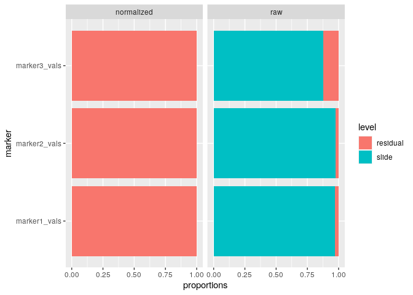

<!-- README.md is generated from README.Rmd. Please edit that file -->

# mxnorm: An R package to normalize multiplexed imaging data.

<!-- badges: start -->

<!-- badges: end -->

A package designed to handle multiplexed imaging data in R, implementing
normalization methods and quality metrics detailed in our paper
[here](https://doi.org/10.1101/2021.07.16.452359).

# Installation

You can install the development version from
[GitHub](https://github.com/) with:

``` r
# install.packages("devtools")
devtools::install_github("ColemanRHarris/mxnorm")
```

# Analysis Example

This is a basic example using the `mx_sample` dataset, which is
simulated data to demonstrate the package’s functionality.

``` r
library(mxnorm)
head(mx_sample)
#>   slide_id image_id marker1_vals marker2_vals marker3_vals metadata1_vals
#> 1   slide1   image1           91          274         2465            yes
#> 2   slide1   image1           94          944         5303            yes
#> 3   slide1   image1           29          446         2140            yes
#> 4   slide1   image1           83          542          258            yes
#> 5   slide1   image1           64          162         3420            yes
#> 6   slide1   image1           52          693         3941            yes
```

## `mx_dataset` objects

How to build the `mx_dataset` object with `mx_sample` data in the
`mxnorm` package:

``` r
mx_dataset = mx_dataset(data=mx_sample,
                        slide_id="slide_id",
                        image_id="image_id",
                        marker_cols=c("marker1_vals","marker2_vals","marker3_vals"),
                        metadata_cols=c("metadata1_vals"))
```

The structure of the now built `mx_dataset` object:

``` r
str(mx_dataset)
#> List of 5
#>  $ data         :'data.frame':   3000 obs. of  6 variables:
#>   ..$ slide_id      : chr [1:3000] "slide1" "slide1" "slide1" "slide1" ...
#>   ..$ image_id      : chr [1:3000] "image1" "image1" "image1" "image1" ...
#>   ..$ marker1_vals  : num [1:3000] 91 94 29 83 64 52 74 13 66 71 ...
#>   ..$ marker2_vals  : num [1:3000] 274 944 446 542 162 693 797 774 213 204 ...
#>   ..$ marker3_vals  : num [1:3000] 2465 5303 2140 258 3420 ...
#>   ..$ metadata1_vals: chr [1:3000] "yes" "yes" "yes" "yes" ...
#>  $ slide_id     : chr "slide_id"
#>  $ image_id     : chr "image_id"
#>  $ marker_cols  : chr [1:3] "marker1_vals" "marker2_vals" "marker3_vals"
#>  $ metadata_cols: chr "metadata1_vals"
#>  - attr(*, "class")= chr "mx_dataset"
```

## Normalization with `mx_normalize()`

And now we can normalize this data using the `mx_normalize()` function:

``` r
mx_norm = mx_normalize(mx_data = mx_dataset,
                       scale = "log10",
                       method="None")
```

The `mx_dataset` object has normalized data in the following form:

``` r
head(mx_norm$norm_data)
#>   slide_id image_id marker1_vals marker2_vals marker3_vals metadata1_vals
#> 1   slide1   image1     1.963788     2.439333     3.391993            yes
#> 2   slide1   image1     1.977724     2.975432     3.724604            yes
#> 3   slide1   image1     1.477121     2.650308     3.330617            yes
#> 4   slide1   image1     1.924279     2.734800     2.413300            yes
#> 5   slide1   image1     1.812913     2.212188     3.534153            yes
#> 6   slide1   image1     1.724276     2.841359     3.595717            yes
```

And the `mx_dataset` object now includes the following attributes:

``` r
str(mx_norm)
#> List of 8
#>  $ data         :'data.frame':   3000 obs. of  6 variables:
#>   ..$ slide_id      : chr [1:3000] "slide1" "slide1" "slide1" "slide1" ...
#>   ..$ image_id      : chr [1:3000] "image1" "image1" "image1" "image1" ...
#>   ..$ marker1_vals  : num [1:3000] 91 94 29 83 64 52 74 13 66 71 ...
#>   ..$ marker2_vals  : num [1:3000] 274 944 446 542 162 693 797 774 213 204 ...
#>   ..$ marker3_vals  : num [1:3000] 2465 5303 2140 258 3420 ...
#>   ..$ metadata1_vals: chr [1:3000] "yes" "yes" "yes" "yes" ...
#>  $ slide_id     : chr "slide_id"
#>  $ image_id     : chr "image_id"
#>  $ marker_cols  : chr [1:3] "marker1_vals" "marker2_vals" "marker3_vals"
#>  $ metadata_cols: chr "metadata1_vals"
#>  $ norm_data    :'data.frame':   3000 obs. of  6 variables:
#>   ..$ slide_id      : chr [1:3000] "slide1" "slide1" "slide1" "slide1" ...
#>   ..$ image_id      : chr [1:3000] "image1" "image1" "image1" "image1" ...
#>   ..$ marker1_vals  : num [1:3000] 1.96 1.98 1.48 1.92 1.81 ...
#>   ..$ marker2_vals  : num [1:3000] 2.44 2.98 2.65 2.73 2.21 ...
#>   ..$ marker3_vals  : num [1:3000] 3.39 3.72 3.33 2.41 3.53 ...
#>   ..$ metadata1_vals: chr [1:3000] "yes" "yes" "yes" "yes" ...
#>  $ scale        : chr "log10"
#>  $ method       : chr "None"
#>  - attr(*, "class")= chr "mx_dataset"
```

## Otsu misclassification metrics with `run_otsu_misclass()`

Using the above normalized data, we can run misclassification metrics to
determine how well our normalization method performs:

``` r
mx_otsu = run_otsu_misclass(mx_norm,
                        table="both",
                        threshold_override = NULL,
                        plot_out = FALSE)
```

This adds an Otsu misclassification table to the `mx_dataset` object in
the following form:

``` r
head(mx_otsu$otsu_data)
#>   slide_id       marker table slide_threshold marker_threshold misclass_error
#> 1   slide1 marker1_vals   raw        50.19531         49.02344    0.008000000
#> 2   slide2 marker1_vals   raw        47.85156         49.02344    0.013333333
#> 3   slide3 marker1_vals   raw        47.85156         49.02344    0.018666667
#> 4   slide4 marker1_vals   raw        50.97656         49.02344    0.008000000
#> 5   slide1 marker2_vals   raw       515.61719        498.04688    0.018666667
#> 6   slide2 marker2_vals   raw       493.64648        498.04688    0.001333333
```

And the `mx_dataset` object now includes the following attributes:

``` r
str(mx_otsu)
#> List of 10
#>  $ data         :'data.frame':   3000 obs. of  6 variables:
#>   ..$ slide_id      : chr [1:3000] "slide1" "slide1" "slide1" "slide1" ...
#>   ..$ image_id      : chr [1:3000] "image1" "image1" "image1" "image1" ...
#>   ..$ marker1_vals  : num [1:3000] 91 94 29 83 64 52 74 13 66 71 ...
#>   ..$ marker2_vals  : num [1:3000] 274 944 446 542 162 693 797 774 213 204 ...
#>   ..$ marker3_vals  : num [1:3000] 2465 5303 2140 258 3420 ...
#>   ..$ metadata1_vals: chr [1:3000] "yes" "yes" "yes" "yes" ...
#>  $ slide_id     : chr "slide_id"
#>  $ image_id     : chr "image_id"
#>  $ marker_cols  : chr [1:3] "marker1_vals" "marker2_vals" "marker3_vals"
#>  $ metadata_cols: chr "metadata1_vals"
#>  $ norm_data    :'data.frame':   3000 obs. of  6 variables:
#>   ..$ slide_id      : chr [1:3000] "slide1" "slide1" "slide1" "slide1" ...
#>   ..$ image_id      : chr [1:3000] "image1" "image1" "image1" "image1" ...
#>   ..$ marker1_vals  : num [1:3000] 1.96 1.98 1.48 1.92 1.81 ...
#>   ..$ marker2_vals  : num [1:3000] 2.44 2.98 2.65 2.73 2.21 ...
#>   ..$ marker3_vals  : num [1:3000] 3.39 3.72 3.33 2.41 3.53 ...
#>   ..$ metadata1_vals: chr [1:3000] "yes" "yes" "yes" "yes" ...
#>  $ scale        : chr "log10"
#>  $ method       : chr "None"
#>  $ otsu_data    :'data.frame':   24 obs. of  6 variables:
#>   ..$ slide_id        : chr [1:24] "slide1" "slide2" "slide3" "slide4" ...
#>   ..$ marker          : chr [1:24] "marker1_vals" "marker1_vals" "marker1_vals" "marker1_vals" ...
#>   ..$ table           : chr [1:24] "raw" "raw" "raw" "raw" ...
#>   ..$ slide_threshold : num [1:24] 50.2 47.9 47.9 51 515.6 ...
#>   ..$ marker_threshold: num [1:24] 49 49 49 49 498 ...
#>   ..$ misclass_error  : num [1:24] 0.008 0.0133 0.0187 0.008 0.0187 ...
#>  $ otsu_table   : chr "both"
#>  - attr(*, "class")= chr "mx_dataset"
```

## UMAP dimension reduction with `run_reduce_umap()`

We can also use the UMAP algorithm to reduce the dimensions of our
markers in the dataset as follows, using the `metadata_col` parameter
for later (e.g., similar to a tissue type in practice with multiplexed
data):

``` r
mx_umap = run_reduce_umap(mx_otsu,
                        table="both",
                        marker_list = c("marker1_vals","marker2_vals","marker3_vals"),
                        downsample_pct = 0.8,
                        metadata_col = "metadata1_vals")
```

This adds UMAP dimensions to our `mx_dataset` object in the following
form:

``` r
head(mx_umap$umap_data)
#>      marker1_vals marker2_vals marker3_vals metadata1_vals table         U1
#> 636            71          217            6            yes   raw -12.443951
#> 206            44          156         7975            yes   raw   7.161827
#> 852            76          764         4284            yes   raw  -3.965278
#> 1598            2          780         1866             no   raw  -7.380946
#> 292            73          399         8088            yes   raw   8.084841
#> 1773           59          922         9416             no   raw  11.449562
#>              U2
#> 636   11.838082
#> 206    3.375274
#> 852  -11.447896
#> 1598   2.933889
#> 292    4.034436
#> 1773  11.172929
```

And the `mx_dataset` object now includes the following attributes:

``` r
str(mx_umap)
#> List of 12
#>  $ data         :'data.frame':   3000 obs. of  6 variables:
#>   ..$ slide_id      : chr [1:3000] "slide1" "slide1" "slide1" "slide1" ...
#>   ..$ image_id      : chr [1:3000] "image1" "image1" "image1" "image1" ...
#>   ..$ marker1_vals  : num [1:3000] 91 94 29 83 64 52 74 13 66 71 ...
#>   ..$ marker2_vals  : num [1:3000] 274 944 446 542 162 693 797 774 213 204 ...
#>   ..$ marker3_vals  : num [1:3000] 2465 5303 2140 258 3420 ...
#>   ..$ metadata1_vals: chr [1:3000] "yes" "yes" "yes" "yes" ...
#>  $ slide_id     : chr "slide_id"
#>  $ image_id     : chr "image_id"
#>  $ marker_cols  : chr [1:3] "marker1_vals" "marker2_vals" "marker3_vals"
#>  $ metadata_cols: chr "metadata1_vals"
#>  $ norm_data    :'data.frame':   3000 obs. of  6 variables:
#>   ..$ slide_id      : chr [1:3000] "slide1" "slide1" "slide1" "slide1" ...
#>   ..$ image_id      : chr [1:3000] "image1" "image1" "image1" "image1" ...
#>   ..$ marker1_vals  : num [1:3000] 1.96 1.98 1.48 1.92 1.81 ...
#>   ..$ marker2_vals  : num [1:3000] 2.44 2.98 2.65 2.73 2.21 ...
#>   ..$ marker3_vals  : num [1:3000] 3.39 3.72 3.33 2.41 3.53 ...
#>   ..$ metadata1_vals: chr [1:3000] "yes" "yes" "yes" "yes" ...
#>  $ scale        : chr "log10"
#>  $ method       : chr "None"
#>  $ otsu_data    :'data.frame':   24 obs. of  6 variables:
#>   ..$ slide_id        : chr [1:24] "slide1" "slide2" "slide3" "slide4" ...
#>   ..$ marker          : chr [1:24] "marker1_vals" "marker1_vals" "marker1_vals" "marker1_vals" ...
#>   ..$ table           : chr [1:24] "raw" "raw" "raw" "raw" ...
#>   ..$ slide_threshold : num [1:24] 50.2 47.9 47.9 51 515.6 ...
#>   ..$ marker_threshold: num [1:24] 49 49 49 49 498 ...
#>   ..$ misclass_error  : num [1:24] 0.008 0.0133 0.0187 0.008 0.0187 ...
#>  $ otsu_table   : chr "both"
#>  $ umap_data    :'data.frame':   4800 obs. of  7 variables:
#>   ..$ marker1_vals  : num [1:4800] 71 44 76 2 73 59 9 50 76 87 ...
#>   ..$ marker2_vals  : num [1:4800] 217 156 764 780 399 922 865 689 589 905 ...
#>   ..$ marker3_vals  : num [1:4800] 6 7975 4284 1866 8088 ...
#>   ..$ metadata1_vals: chr [1:4800] "yes" "yes" "yes" "no" ...
#>   ..$ table         : chr [1:4800] "raw" "raw" "raw" "raw" ...
#>   ..$ U1            : num [1:4800] -12.44 7.16 -3.97 -7.38 8.08 ...
#>   ..$ U2            : num [1:4800] 11.84 3.38 -11.45 2.93 4.03 ...
#>  $ umap_table   : chr "both"
#>  - attr(*, "class")= chr "mx_dataset"
```

## Variance components analysis with `run_var_proportions()`

We can also leverage `lmer()` from the `lme4` package to perform random
effect modeling on the data to determine how much variance is present at
the slide level, as follows:

``` r
mx_var = run_var_proportions(mx_umap,
                             table="both",
                             metadata_cols = "metadata1_vals")
```

This adds UMAP dimensions to our `mx_dataset` object in the following
form:

``` r
head(mx_var$var_data)
#>     proportions    level       marker table
#> 1: 0.0000000000    slide marker1_vals   raw
#> 2: 1.0000000000 residual marker1_vals   raw
#> 3: 0.0000000000    slide marker2_vals   raw
#> 4: 1.0000000000 residual marker2_vals   raw
#> 5: 0.0004371019    slide marker3_vals   raw
#> 6: 0.9995628981 residual marker3_vals   raw
```

And the `mx_dataset` object now includes the following attributes:

``` r
str(mx_var)
#> List of 13
#>  $ data         :'data.frame':   3000 obs. of  6 variables:
#>   ..$ slide_id      : chr [1:3000] "slide1" "slide1" "slide1" "slide1" ...
#>   ..$ image_id      : chr [1:3000] "image1" "image1" "image1" "image1" ...
#>   ..$ marker1_vals  : num [1:3000] 91 94 29 83 64 52 74 13 66 71 ...
#>   ..$ marker2_vals  : num [1:3000] 274 944 446 542 162 693 797 774 213 204 ...
#>   ..$ marker3_vals  : num [1:3000] 2465 5303 2140 258 3420 ...
#>   ..$ metadata1_vals: chr [1:3000] "yes" "yes" "yes" "yes" ...
#>  $ slide_id     : chr "slide_id"
#>  $ image_id     : chr "image_id"
#>  $ marker_cols  : chr [1:3] "marker1_vals" "marker2_vals" "marker3_vals"
#>  $ metadata_cols: chr "metadata1_vals"
#>  $ norm_data    :'data.frame':   3000 obs. of  6 variables:
#>   ..$ slide_id      : chr [1:3000] "slide1" "slide1" "slide1" "slide1" ...
#>   ..$ image_id      : chr [1:3000] "image1" "image1" "image1" "image1" ...
#>   ..$ marker1_vals  : num [1:3000] 1.96 1.98 1.48 1.92 1.81 ...
#>   ..$ marker2_vals  : num [1:3000] 2.44 2.98 2.65 2.73 2.21 ...
#>   ..$ marker3_vals  : num [1:3000] 3.39 3.72 3.33 2.41 3.53 ...
#>   ..$ metadata1_vals: chr [1:3000] "yes" "yes" "yes" "yes" ...
#>  $ scale        : chr "log10"
#>  $ method       : chr "None"
#>  $ otsu_data    :'data.frame':   24 obs. of  6 variables:
#>   ..$ slide_id        : chr [1:24] "slide1" "slide2" "slide3" "slide4" ...
#>   ..$ marker          : chr [1:24] "marker1_vals" "marker1_vals" "marker1_vals" "marker1_vals" ...
#>   ..$ table           : chr [1:24] "raw" "raw" "raw" "raw" ...
#>   ..$ slide_threshold : num [1:24] 50.2 47.9 47.9 51 515.6 ...
#>   ..$ marker_threshold: num [1:24] 49 49 49 49 498 ...
#>   ..$ misclass_error  : num [1:24] 0.008 0.0133 0.0187 0.008 0.0187 ...
#>  $ otsu_table   : chr "both"
#>  $ umap_data    :'data.frame':   4800 obs. of  7 variables:
#>   ..$ marker1_vals  : num [1:4800] 71 44 76 2 73 59 9 50 76 87 ...
#>   ..$ marker2_vals  : num [1:4800] 217 156 764 780 399 922 865 689 589 905 ...
#>   ..$ marker3_vals  : num [1:4800] 6 7975 4284 1866 8088 ...
#>   ..$ metadata1_vals: chr [1:4800] "yes" "yes" "yes" "no" ...
#>   ..$ table         : chr [1:4800] "raw" "raw" "raw" "raw" ...
#>   ..$ U1            : num [1:4800] -12.44 7.16 -3.97 -7.38 8.08 ...
#>   ..$ U2            : num [1:4800] 11.84 3.38 -11.45 2.93 4.03 ...
#>  $ umap_table   : chr "both"
#>  $ var_data     :Classes 'data.table' and 'data.frame':  12 obs. of  4 variables:
#>   ..$ proportions: num [1:12] 0 1 0 1 0.000437 ...
#>   ..$ level      : chr [1:12] "slide" "residual" "slide" "residual" ...
#>   ..$ marker     : chr [1:12] "marker1_vals" "marker1_vals" "marker2_vals" "marker2_vals" ...
#>   ..$ table      : chr [1:12] "raw" "raw" "raw" "raw" ...
#>   ..- attr(*, ".internal.selfref")=<externalptr> 
#>  - attr(*, "class")= chr "mx_dataset"
```

# Visualizations

We can also begin to visualize these results using some of `mxnorm`’s
plotting features built using `ggplot2`.

First, we can visualize the densities of the marker values as follows:

``` r
plot_mx_density(mx_otsu)
```


We can also visualize the results of the Otsu misclassification analysis
stratified by slide and marker:

``` r
plot_mx_misclass(mx_otsu)
```


We can further visualize the results of the UMAP dimension reduction as
follows:

``` r
plot_mx_umap(mx_umap,metadata_col = "metadata1_vals")
```


And we can also visualize the results of the variance proportions (note
that this is sample data, hence the proportions of variance at the slide
level are \(\approx 0\)):

``` r
plot_mx_proportions(mx_var)
```


