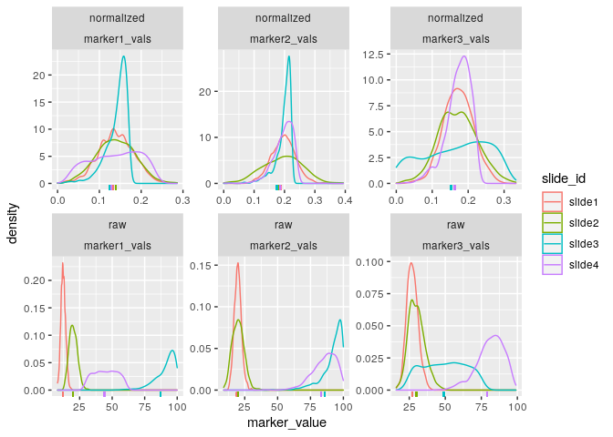

<!-- README.md is generated from README.Rmd. Please edit that file -->

# mxnorm: An R package to normalize multiplexed imaging data.

<!-- badges: start -->

<!-- badges: end -->

A package designed to handle multiplexed imaging data in R, implementing
normalization methods and quality metrics detailed in our paper
[here](https://doi.org/10.1101/2021.07.16.452359).

# Installation

You can install the development version from
[GitHub](https://github.com/) with:

``` r
# install.packages("devtools")
devtools::install_github("ColemanRHarris/mxnorm")
```

# Analysis Example

This is a basic example using the `mx_sample` dataset, which is
simulated data to demonstrate the package’s functionality.

``` r
library(mxnorm)
head(mx_sample)
#>   slide_id image_id marker1_vals marker2_vals marker3_vals metadata1_vals
#> 1   slide1   image1           91          274         2465            yes
#> 2   slide1   image1           94          944         5303            yes
#> 3   slide1   image1           29          446         2140            yes
#> 4   slide1   image1           83          542          258            yes
#> 5   slide1   image1           64          162         3420            yes
#> 6   slide1   image1           52          693         3941            yes
```

## `mx_dataset` objects

How to build the `mx_dataset` object with `mx_sample` data in the
`mxnorm` package:

``` r
mx_dataset = mx_dataset(data=mx_sample,
                        slide_id="slide_id",
                        image_id="image_id",
                        marker_cols=c("marker1_vals","marker2_vals","marker3_vals"),
                        metadata_cols=c("metadata1_vals"))
```

The structure of the now built `mx_dataset` object:

``` r
str(mx_dataset)
#> List of 5
#>  $ data         :'data.frame':   3000 obs. of  6 variables:
#>   ..$ slide_id      : chr [1:3000] "slide1" "slide1" "slide1" "slide1" ...
#>   ..$ image_id      : chr [1:3000] "image1" "image1" "image1" "image1" ...
#>   ..$ marker1_vals  : num [1:3000] 91 94 29 83 64 52 74 13 66 71 ...
#>   ..$ marker2_vals  : num [1:3000] 274 944 446 542 162 693 797 774 213 204 ...
#>   ..$ marker3_vals  : num [1:3000] 2465 5303 2140 258 3420 ...
#>   ..$ metadata1_vals: chr [1:3000] "yes" "yes" "yes" "yes" ...
#>  $ slide_id     : chr "slide_id"
#>  $ image_id     : chr "image_id"
#>  $ marker_cols  : chr [1:3] "marker1_vals" "marker2_vals" "marker3_vals"
#>  $ metadata_cols: chr "metadata1_vals"
#>  - attr(*, "class")= chr "mx_dataset"
```

## Normalization with `mx_normalize()`

And now we can normalize this data using the `mx_normalize()` function:

``` r
mx_norm = mx_normalize(mx_data = mx_dataset,
                       scale = "log10",
                       method="None")
```

The `mx_dataset` object has normalized data in the following form:

``` r
head(mx_norm$norm_data)
#>   slide_id image_id marker1_vals marker2_vals marker3_vals metadata1_vals
#> 1   slide1   image1     1.963788     2.439333     3.391993            yes
#> 2   slide1   image1     1.977724     2.975432     3.724604            yes
#> 3   slide1   image1     1.477121     2.650308     3.330617            yes
#> 4   slide1   image1     1.924279     2.734800     2.413300            yes
#> 5   slide1   image1     1.812913     2.212188     3.534153            yes
#> 6   slide1   image1     1.724276     2.841359     3.595717            yes
```

And the `mx_dataset` object now includes the following attributes:

``` r
str(mx_norm)
#> List of 8
#>  $ data         :'data.frame':   3000 obs. of  6 variables:
#>   ..$ slide_id      : chr [1:3000] "slide1" "slide1" "slide1" "slide1" ...
#>   ..$ image_id      : chr [1:3000] "image1" "image1" "image1" "image1" ...
#>   ..$ marker1_vals  : num [1:3000] 91 94 29 83 64 52 74 13 66 71 ...
#>   ..$ marker2_vals  : num [1:3000] 274 944 446 542 162 693 797 774 213 204 ...
#>   ..$ marker3_vals  : num [1:3000] 2465 5303 2140 258 3420 ...
#>   ..$ metadata1_vals: chr [1:3000] "yes" "yes" "yes" "yes" ...
#>  $ slide_id     : chr "slide_id"
#>  $ image_id     : chr "image_id"
#>  $ marker_cols  : chr [1:3] "marker1_vals" "marker2_vals" "marker3_vals"
#>  $ metadata_cols: chr "metadata1_vals"
#>  $ norm_data    :'data.frame':   3000 obs. of  6 variables:
#>   ..$ slide_id      : chr [1:3000] "slide1" "slide1" "slide1" "slide1" ...
#>   ..$ image_id      : chr [1:3000] "image1" "image1" "image1" "image1" ...
#>   ..$ marker1_vals  : num [1:3000] 1.96 1.98 1.48 1.92 1.81 ...
#>   ..$ marker2_vals  : num [1:3000] 2.44 2.98 2.65 2.73 2.21 ...
#>   ..$ marker3_vals  : num [1:3000] 3.39 3.72 3.33 2.41 3.53 ...
#>   ..$ metadata1_vals: chr [1:3000] "yes" "yes" "yes" "yes" ...
#>  $ scale        : chr "log10"
#>  $ method       : chr "None"
#>  - attr(*, "class")= chr "mx_dataset"
```

## Otsu misclassification metrics with `run_otsu_misclass()`

Using the above normalized data, we can run misclassification metrics to
determine how well our normalization method performs:

``` r
mx_otsu = run_otsu_misclass(mx_norm,
                        table="both",
                        threshold_override = NULL,
                        plot_out = FALSE)
```

This adds an Otsu misclassification table to the `mx_dataset` object in
the following form:

``` r
head(mx_otsu$otsu_data)
#>   slide_id       marker table slide_threshold marker_threshold misclass_error
#> 1   slide1 marker1_vals   raw        50.19531         49.02344    0.008000000
#> 2   slide2 marker1_vals   raw        47.85156         49.02344    0.013333333
#> 3   slide3 marker1_vals   raw        47.85156         49.02344    0.018666667
#> 4   slide4 marker1_vals   raw        50.97656         49.02344    0.008000000
#> 5   slide1 marker2_vals   raw       515.61719        498.04688    0.018666667
#> 6   slide2 marker2_vals   raw       493.64648        498.04688    0.001333333
```

And the `mx_dataset` object now includes the following attributes:

``` r
str(mx_otsu)
#> List of 10
#>  $ data         :'data.frame':   3000 obs. of  6 variables:
#>   ..$ slide_id      : chr [1:3000] "slide1" "slide1" "slide1" "slide1" ...
#>   ..$ image_id      : chr [1:3000] "image1" "image1" "image1" "image1" ...
#>   ..$ marker1_vals  : num [1:3000] 91 94 29 83 64 52 74 13 66 71 ...
#>   ..$ marker2_vals  : num [1:3000] 274 944 446 542 162 693 797 774 213 204 ...
#>   ..$ marker3_vals  : num [1:3000] 2465 5303 2140 258 3420 ...
#>   ..$ metadata1_vals: chr [1:3000] "yes" "yes" "yes" "yes" ...
#>  $ slide_id     : chr "slide_id"
#>  $ image_id     : chr "image_id"
#>  $ marker_cols  : chr [1:3] "marker1_vals" "marker2_vals" "marker3_vals"
#>  $ metadata_cols: chr "metadata1_vals"
#>  $ norm_data    :'data.frame':   3000 obs. of  6 variables:
#>   ..$ slide_id      : chr [1:3000] "slide1" "slide1" "slide1" "slide1" ...
#>   ..$ image_id      : chr [1:3000] "image1" "image1" "image1" "image1" ...
#>   ..$ marker1_vals  : num [1:3000] 1.96 1.98 1.48 1.92 1.81 ...
#>   ..$ marker2_vals  : num [1:3000] 2.44 2.98 2.65 2.73 2.21 ...
#>   ..$ marker3_vals  : num [1:3000] 3.39 3.72 3.33 2.41 3.53 ...
#>   ..$ metadata1_vals: chr [1:3000] "yes" "yes" "yes" "yes" ...
#>  $ scale        : chr "log10"
#>  $ method       : chr "None"
#>  $ otsu_data    :'data.frame':   24 obs. of  6 variables:
#>   ..$ slide_id        : chr [1:24] "slide1" "slide2" "slide3" "slide4" ...
#>   ..$ marker          : chr [1:24] "marker1_vals" "marker1_vals" "marker1_vals" "marker1_vals" ...
#>   ..$ table           : chr [1:24] "raw" "raw" "raw" "raw" ...
#>   ..$ slide_threshold : num [1:24] 50.2 47.9 47.9 51 515.6 ...
#>   ..$ marker_threshold: num [1:24] 49 49 49 49 498 ...
#>   ..$ misclass_error  : num [1:24] 0.008 0.0133 0.0187 0.008 0.0187 ...
#>  $ otsu_table   : chr "both"
#>  - attr(*, "class")= chr "mx_dataset"
```

## UMAP dimension reduction with `run_reduce_umap()`

We can also use the UMAP algorithm to reduce the dimensions of our
markers in the dataset as follows, using the `metadata_col` parameter
for later (e.g., similar to a tissue type in practice with multiplexed
data):

``` r
mx_umap = run_reduce_umap(mx_otsu,
                        table="both",
                        marker_list = c("marker1_vals","marker2_vals","marker3_vals"),
                        downsample_pct = 0.8,
                        metadata_col = "metadata1_vals")
```

This adds UMAP dimensions to our `mx_dataset` object in the following
form:

``` r
head(mx_umap)
#> $data
#>      slide_id image_id marker1_vals marker2_vals marker3_vals metadata1_vals
#> 1      slide1   image1           91          274         2465            yes
#> 2      slide1   image1           94          944         5303            yes
#> 3      slide1   image1           29          446         2140            yes
#> 4      slide1   image1           83          542          258            yes
#> 5      slide1   image1           64          162         3420            yes
#> 6      slide1   image1           52          693         3941            yes
#> 7      slide1   image1           74          797         1253            yes
#> 8      slide1   image1           13          774         8244            yes
#> 9      slide1   image1           66          213         8677            yes
#> 10     slide1   image1           71          204         1840            yes
#> 11     slide1   image1           46          633         1896            yes
#> 12     slide1   image1           72          761         2922            yes
#> 13     slide1   image1           93          808         8996            yes
#> 14     slide1   image1           26          829         9014            yes
#> 15     slide1   image1           46          119          729            yes
#> 16     slide1   image1           94          281         3390            yes
#> 17     slide1   image1           98          847         8002            yes
#> 18     slide1   image1           12          108         2324            yes
#> 19     slide1   image1           47           17         2732            yes
#> 20     slide1   image1           56          413         1091            yes
#> 21     slide1   image1           90          591         5523            yes
#> 22     slide1   image1           14          516         7443            yes
#> 23     slide1   image1           99          935         7777            yes
#> 24     slide1   image1           95          261         3626            yes
#> 25     slide1   image1            8          711         1795            yes
#> 26     slide1   image1           51          168         6160            yes
#> 27     slide1   image1           39          820         5938            yes
#> 28     slide1   image1           91          750         3726            yes
#> 29     slide1   image1           45          290         4822            yes
#> 30     slide1   image1           84          180         5132            yes
#> 31     slide1   image1           74          617         1317            yes
#> 32     slide1   image1           81          612         7124            yes
#> 33     slide1   image1           39          866         7179            yes
#> 34     slide1   image1           69          640         1021            yes
#> 35     slide1   image1            0           92          107            yes
#> 36     slide1   image1           83          867          725            yes
#> 37     slide1   image1            1          842         9387            yes
#> 38     slide1   image1           21          495         3354            yes
#> 39     slide1   image1           91           79         8842            yes
#> 40     slide1   image1           61           22         2485            yes
#> 41     slide1   image1           38          309         4201            yes
#> 42     slide1   image1           44          732         8669            yes
#> 43     slide1   image1            4          996         3328            yes
#> 44     slide1   image1           97          455         4928            yes
#> 45     slide1   image1           43          695         6357            yes
#> 46     slide1   image1           96          945          540            yes
#> 47     slide1   image1           89          464         3137            yes
#> 48     slide1   image1           64          707          778            yes
#> 49     slide1   image1           97          836         4226            yes
#> 50     slide1   image1           62           49         3781            yes
#> 51     slide1   image1           33          404         5909            yes
#> 52     slide1   image1           35          541         9834            yes
#> 53     slide1   image1           40          733         4623            yes
#> 54     slide1   image1           78          146         4146            yes
#> 55     slide1   image1            4          365         9564            yes
#> 56     slide1   image1           75           20         1999            yes
#> 57     slide1   image1           68            9         3685            yes
#> 58     slide1   image1           17          796         4429            yes
#> 59     slide1   image1           26          682         1907            yes
#> 60     slide1   image1           51           26         1976            yes
#> 61     slide1   image1           68          305         1287            yes
#> 62     slide1   image1           98          948         7878            yes
#> 63     slide1   image1           76          283         2857            yes
#> 64     slide1   image1           57          359         2469            yes
#> 65     slide1   image1           85          502         1649            yes
#> 66     slide1   image1           19          265         1177            yes
#> 67     slide1   image1           27          910         8277            yes
#> 68     slide1   image1           83          181         3454            yes
#> 69     slide1   image1           69          616         5978            yes
#> 70     slide1   image1           24           48         2883            yes
#> 71     slide1   image1            4          800         4583            yes
#> 72     slide1   image1           14          662         5288            yes
#> 73     slide1   image1           22          735         5111            yes
#> 74     slide1   image1           48           44         7398            yes
#> 75     slide1   image1           20          540         1821            yes
#> 76     slide1   image1           72          626         5653            yes
#> 77     slide1   image1            1          749         9906            yes
#> 78     slide1   image1           38          150         7447            yes
#> 79     slide1   image1           51          445         7907            yes
#> 80     slide1   image1            0          699         2193            yes
#> 81     slide1   image1           58          106         7835            yes
#> 82     slide1   image1           16          772         1818            yes
#> 83     slide1   image1           36          636         5676            yes
#> 84     slide1   image1           65          592         3958            yes
#> 85     slide1   image1           78           11         5632            yes
#> 86     slide1   image1           56           20         5410            yes
#> 87     slide1   image1           23          162         7511            yes
#> 88     slide1   image1            9           68         3070            yes
#> 89     slide1   image1            9          476         6680            yes
#> 90     slide1   image1           31          983         3700            yes
#> 91     slide1   image1           67          436         7825            yes
#> 92     slide1   image1            0          948         7575            yes
#> 93     slide1   image1           21          337         3283            yes
#> 94     slide1   image1           93          492         7707            yes
#> 95     slide1   image1           93          839         8982            yes
#> 96     slide1   image1           73          826         7731            yes
#> 97     slide1   image1           33          142          703            yes
#> 98     slide1   image1           52          115         6367            yes
#> 99     slide1   image1           74            4         9661            yes
#> 100    slide1   image1           62          741         8735            yes
#> 101    slide1   image1           63          782         4673            yes
#> 102    slide1   image1           22          213         7298            yes
#> 103    slide1   image1           22          518         5820            yes
#> 104    slide1   image1           39          192         3869            yes
#> 105    slide1   image1           94          457         4768            yes
#> 106    slide1   image1           96          527         9018            yes
#> 107    slide1   image1           74          348         1996            yes
#> 108    slide1   image1           73          742         3510            yes
#> 109    slide1   image1           54           46         3204            yes
#> 110    slide1   image1            0          285         6120            yes
#> 111    slide1   image1           61          170         9353            yes
#> 112    slide1   image1           84          275         4414            yes
#> 113    slide1   image1           75          694         9810            yes
#> 114    slide1   image1           45          848          865            yes
#> 115    slide1   image1           54          508         1453            yes
#> 116    slide1   image1           54          954         6221            yes
#> 117    slide1   image1            0           78         6388            yes
#> 118    slide1   image1           36          523          593            yes
#> 119    slide1   image1           61          725         2954            yes
#> 120    slide1   image1           83          100         8848            yes
#> 121    slide1   image1           36          784         5360            yes
#> 122    slide1   image1           41          450         6888            yes
#> 123    slide1   image1           57          446         6363            yes
#> 124    slide1   image1           59          730         6151            yes
#> 125    slide1   image1           72          493         3024            yes
#> 126    slide1   image1           39          107         4231            yes
#> 127    slide1   image1           92          921         6131            yes
#> 128    slide1   image1           96          240         2425            yes
#> 129    slide1   image1           23          654         9523            yes
#> 130    slide1   image1           72          884         8957            yes
#> 131    slide1   image1           90          889         1399            yes
#> 132    slide1   image1           60          976         5080            yes
#> 133    slide1   image1           63          482         3454            yes
#> 134    slide1   image1           94           96         9607            yes
#> 135    slide1   image1           85          930         6168            yes
#> 136    slide1   image1           58          316         6286            yes
#> 137    slide1   image1           82          470         6456            yes
#> 138    slide1   image1           11          556         9800            yes
#> 139    slide1   image1           76          821         5269            yes
#> 140    slide1   image1           62          636         5745            yes
#> 141    slide1   image1           15          365         6356            yes
#> 142    slide1   image1            8          480         1714            yes
#> 143    slide1   image1           46          141         4346            yes
#> 144    slide1   image1           78          238         9107            yes
#> 145    slide1   image1           73          842         5753            yes
#> 146    slide1   image1           82          813         9084            yes
#> 147    slide1   image1           17          989         4726            yes
#> 148    slide1   image1           94          729         2757            yes
#> 149    slide1   image1           29          372         8203            yes
#> 150    slide1   image1           15          510         5265            yes
#> 151    slide1   image1           72          929         7613            yes
#> 152    slide1   image1           32          578         1705            yes
#> 153    slide1   image1           78          406         4924            yes
#> 154    slide1   image1           39          212         4205            yes
#> 155    slide1   image1           68          822         9054            yes
#> 156    slide1   image1           78          492          458            yes
#> 157    slide1   image1           19          161         5676            yes
#> 158    slide1   image1            3          710         8420            yes
#> 159    slide1   image1           14          609         7186            yes
#> 160    slide1   image1           68          110         8246            yes
#> 161    slide1   image1           93          223         5901            yes
#> 162    slide1   image1           55          547          666            yes
#> 163    slide1   image1           60           88         2701            yes
#> 164    slide1   image1           20          129         4285            yes
#> 165    slide1   image1           54          744         7685            yes
#> 166    slide1   image1           18          883         5449            yes
#> 167    slide1   image1           45          946          321            yes
#> 168    slide1   image1           32          257         2988            yes
#> 169    slide1   image1           12          215         1664            yes
#> 170    slide1   image1           19          208         4633            yes
#> 171    slide1   image1           73          188         7349            yes
#> 172    slide1   image1           41          198         4609            yes
#> 173    slide1   image1           41          142         8926            yes
#> 174    slide1   image1           48          695         6026            yes
#> 175    slide1   image1           43          323          659            yes
#> 176    slide1   image1           14          381         1587            yes
#> 177    slide1   image1           82          747         8815            yes
#> 178    slide1   image1           59          281         3523            yes
#> 179    slide1   image1           79          762          911            yes
#> 180    slide1   image1           77           73         2701            yes
#> 181    slide1   image1           92          671         2755            yes
#> 182    slide1   image1           86          919         3568            yes
#> 183    slide1   image1           32          776          918            yes
#> 184    slide1   image1           26          740         2366            yes
#> 185    slide1   image1           74          320         4277            yes
#> 186    slide1   image1           75          634         5936            yes
#> 187    slide1   image1           92          431         5196            yes
#> 188    slide1   image1           79          333         1182            yes
#> 189    slide1   image1           13          752         6599            yes
#> 190    slide1   image1           29           21         6433            yes
#> 191    slide1   image1           19          389         3364            yes
#> 192    slide1   image1           78          303         7299            yes
#> 193    slide1   image1           13          168         4922            yes
#> 194    slide1   image1           13          615          482            yes
#> 195    slide1   image1            7           84         6191            yes
#> 196    slide1   image1            5          216         9293            yes
#> 197    slide1   image1           53          997         1654            yes
#> 198    slide1   image1           11          126         8305            yes
#> 199    slide1   image1           74           45         2416            yes
#> 200    slide1   image1           73          899         9228            yes
#> 201    slide1   image1           89          512         9160            yes
#> 202    slide1   image1           52           51         5807            yes
#> 203    slide1   image1           85          973           16            yes
#> 204    slide1   image1           44          158         9885            yes
#> 205    slide1   image1           16          799         8304            yes
#> 206    slide1   image1           44          156         7975            yes
#> 207    slide1   image1           97          426         8554            yes
#> 208    slide1   image1           48          192         5962            yes
#> 209    slide1   image1           25          703         9116            yes
#> 210    slide1   image1           26          801         4934            yes
#> 211    slide1   image1           54          963         3440            yes
#> 212    slide1   image1           65           48         1434            yes
#> 213    slide1   image1           34          575         7995            yes
#> 214    slide1   image1            6          421         7119            yes
#> 215    slide1   image1           45          285         5853            yes
#> 216    slide1   image1           84          345         5172            yes
#> 217    slide1   image1           57          927         2617            yes
#> 218    slide1   image1           35          907         9424            yes
#> 219    slide1   image1           55          969         7098            yes
#> 220    slide1   image1           89          799         7404            yes
#> 221    slide1   image1           49          162         6444            yes
#> 222    slide1   image1           17          273         2188            yes
#> 223    slide1   image1           54          764         3486            yes
#> 224    slide1   image1           96          823         1840            yes
#> 225    slide1   image1           31          551         3227            yes
#> 226    slide1   image1           82          145         8804            yes
#> 227    slide1   image1           31          759         3952            yes
#> 228    slide1   image1           19           87         6671            yes
#> 229    slide1   image1            5          701         6920            yes
#> 230    slide1   image1           25          829         3187            yes
#> 231    slide1   image1           35          492         4791            yes
#> 232    slide1   image1           16          548         2591            yes
#> 233    slide1   image1           30          669          882            yes
#> 234    slide1   image1            2           35          364            yes
#> 235    slide1   image1          100          113         6212            yes
#> 236    slide1   image1           80          688         6712            yes
#> 237    slide1   image1            9           80         3568            yes
#> 238    slide1   image1           87          316         6447            yes
#> 239    slide1   image1           55          764         7766            yes
#> 240    slide1   image1           42          350         9376            yes
#> 241    slide1   image1            7          534         1134            yes
#> 242    slide1   image1           56          893         9636            yes
#> 243    slide1   image1            7          448          282            yes
#> 244    slide1   image1           21          328         1144            yes
#> 245    slide1   image1           55           47         3093            yes
#> 246    slide1   image1           48          389         4019            yes
#> 247    slide1   image1           16          285         2620            yes
#> 248    slide1   image1           15          270         1927            yes
#> 249    slide1   image1           50          576         7506            yes
#> 250    slide1   image1           94          629         5538            yes
#> 251    slide1   image2           33          313          308            yes
#> 252    slide1   image2           19          689         9101            yes
#> 253    slide1   image2           27          532         1426            yes
#> 254    slide1   image2           53          760         4396            yes
#> 255    slide1   image2            2          650         4499            yes
#> 256    slide1   image2           80          497         6589            yes
#> 257    slide1   image2           11          445         2308            yes
#> 258    slide1   image2           54          321         9980            yes
#> 259    slide1   image2           57          666         4242            yes
#> 260    slide1   image2           62            8         2537            yes
#> 261    slide1   image2           71          404         1154            yes
#> 262    slide1   image2           12          847         4821            yes
#> 263    slide1   image2           31          375         2049            yes
#> 264    slide1   image2           95          842         1145            yes
#> 265    slide1   image2           50          400         1789            yes
#> 266    slide1   image2           14          735          654            yes
#> 267    slide1   image2           87          739          406            yes
#> 268    slide1   image2           21          326         1363            yes
#> 269    slide1   image2           93          794         6492            yes
#> 270    slide1   image2           89          811         9463            yes
#> 271    slide1   image2           14          990         2942            yes
#> 272    slide1   image2           79          867         1712            yes
#> 273    slide1   image2           45          163         2891            yes
#> 274    slide1   image2           14          591         8959            yes
#> 275    slide1   image2           89          240         8663            yes
#> 276    slide1   image2           34          482         7237            yes
#> 277    slide1   image2           32          740         7479            yes
#> 278    slide1   image2           40           28         6191            yes
#> 279    slide1   image2           48          949         2439            yes
#> 280    slide1   image2           37          936         5007            yes
#> 281    slide1   image2           47          890         8106            yes
#> 282    slide1   image2            5          600         5363            yes
#> 283    slide1   image2           19          320         3524            yes
#> 284    slide1   image2           98          654         7507            yes
#> 285    slide1   image2           33          249         3331            yes
#> 286    slide1   image2           17          842         6581            yes
#> 287    slide1   image2           49          955         5661            yes
#> 288    slide1   image2            2          455         1083            yes
#> 289    slide1   image2           34          939         5559            yes
#> 290    slide1   image2            3          182         5302            yes
#> 291    slide1   image2           87          585         4572            yes
#> 292    slide1   image2           73          399         8088            yes
#> 293    slide1   image2           32          955         4005            yes
#> 294    slide1   image2           39          154         5358            yes
#> 295    slide1   image2           33          497         6554            yes
#> 296    slide1   image2            9          743         6069            yes
#> 297    slide1   image2           76          207         8399            yes
#> 298    slide1   image2           60          406         3673            yes
#> 299    slide1   image2           15          480         3468            yes
#> 300    slide1   image2            3          450         9359            yes
#> 301    slide1   image2           48          532         9267            yes
#> 302    slide1   image2           44          373          328            yes
#> 303    slide1   image2            6           59         2019            yes
#> 304    slide1   image2           33          866         2454            yes
#> 305    slide1   image2           88          432         9773            yes
#> 306    slide1   image2           93          106         9300            yes
#> 307    slide1   image2           39          338         7940            yes
#> 308    slide1   image2           16          431         1785            yes
#> 309    slide1   image2           32          688         3589            yes
#> 310    slide1   image2           31           63         8080            yes
#> 311    slide1   image2           11          298          168            yes
#> 312    slide1   image2           98          489         9709            yes
#> 313    slide1   image2           50          685         3453            yes
#> 314    slide1   image2            9          496         2032            yes
#> 315    slide1   image2           21          704         3641            yes
#> 316    slide1   image2           93          643         6036            yes
#> 317    slide1   image2           30          390         9258            yes
#> 318    slide1   image2           65          507         9341            yes
#> 319    slide1   image2           90          483         6466            yes
#> 320    slide1   image2           99          744         5606            yes
#> 321    slide1   image2           43          991          343            yes
#> 322    slide1   image2           39          495         7864            yes
#> 323    slide1   image2           14          939         6075            yes
#> 324    slide1   image2           28          540          147            yes
#> 325    slide1   image2           56          940         1729            yes
#> 326    slide1   image2           94          916         9871            yes
#> 327    slide1   image2           36          523          445            yes
#> 328    slide1   image2           84          800          369            yes
#> 329    slide1   image2           72          201         8210            yes
#> 330    slide1   image2           75          930         3694            yes
#> 331    slide1   image2           92          716         7263            yes
#> 332    slide1   image2            0          764         1160            yes
#> 333    slide1   image2           16          526         3446            yes
#> 334    slide1   image2           40          308         7428            yes
#> 335    slide1   image2           68         1000         9247            yes
#> 336    slide1   image2           48          533         8838            yes
#> 337    slide1   image2           53           27         3774            yes
#> 338    slide1   image2           32           46         9627            yes
#> 339    slide1   image2           81          420          460            yes
#> 340    slide1   image2           29          583         1478            yes
#> 341    slide1   image2           41          931         8188            yes
#> 342    slide1   image2            9          449         9726            yes
#> 343    slide1   image2           80           18         2498            yes
#> 344    slide1   image2           36          845         6260            yes
#> 345    slide1   image2            4          398         5546            yes
#> 346    slide1   image2            4          704         2455            yes
#> 347    slide1   image2           95          631         1779            yes
#> 348    slide1   image2           37          868         8147            yes
#> 349    slide1   image2           81          413          960            yes
#> 350    slide1   image2           91          990         8736            yes
#> 351    slide1   image2           44          176         6706            yes
#> 352    slide1   image2           58          200          889            yes
#> 353    slide1   image2            7          451         1844            yes
#> 354    slide1   image2           16          459          864            yes
#> 355    slide1   image2           74          910         2941            yes
#> 356    slide1   image2           48          477         5639            yes
#> 357    slide1   image2           69           89         7655            yes
#> 358    slide1   image2           95          280         6791            yes
#> 359    slide1   image2           50          921           52            yes
#> 360    slide1   image2           47          960         3672            yes
#> 361    slide1   image2           56          820         1743            yes
#> 362    slide1   image2           65          174         2633            yes
#> 363    slide1   image2           28          108         9369            yes
#> 364    slide1   image2           98          421         8808            yes
#> 365    slide1   image2           64           67         4979            yes
#> 366    slide1   image2           58          635         9492            yes
#> 367    slide1   image2           62          514          462            yes
#> 368    slide1   image2           93          570         4387            yes
#> 369    slide1   image2           39          613         4803            yes
#> 370    slide1   image2           29          462         8507            yes
#> 371    slide1   image2            9          882         5181            yes
#> 372    slide1   image2           32          405         2890            yes
#> 373    slide1   image2           76          485         2189            yes
#> 374    slide1   image2           10          508         3408            yes
#> 375    slide1   image2           71          663         2466            yes
#> 376    slide1   image2           97          289         7604            yes
#> 377    slide1   image2           20          901         4844            yes
#> 378    slide1   image2           11          313         5734            yes
#> 379    slide1   image2            6          879         7995            yes
#> 380    slide1   image2           83          816         5219            yes
#> 381    slide1   image2           58          796         2001            yes
#> 382    slide1   image2           47          931         1118            yes
#> 383    slide1   image2           37          627         7631            yes
#> 384    slide1   image2           28          167         5484            yes
#> 385    slide1   image2           60          648          309            yes
#> 386    slide1   image2           82          471         2393            yes
#> 387    slide1   image2           10          885         9768            yes
#> 388    slide1   image2           96          764         2056            yes
#> 389    slide1   image2           17          865         7797            yes
#> 390    slide1   image2            9          623         9480            yes
#> 391    slide1   image2           86          475         2668            yes
#> 392    slide1   image2           52          934         1135            yes
#> 393    slide1   image2           66          642         4587            yes
#> 394    slide1   image2           23          281         2952            yes
#> 395    slide1   image2           72          955         1089            yes
#> 396    slide1   image2           49          332          208            yes
#> 397    slide1   image2           97          929         1754            yes
#> 398    slide1   image2           91          690         1810            yes
#> 399    slide1   image2           55          164         6170            yes
#> 400    slide1   image2            8          356         2536            yes
#> 401    slide1   image2            2          926          195            yes
#> 402    slide1   image2           51          977         8300            yes
#> 403    slide1   image2           63          466         7509            yes
#> 404    slide1   image2           42          306         3314            yes
#> 405    slide1   image2           88           58         7985            yes
#> 406    slide1   image2           11          639         8809            yes
#> 407    slide1   image2           98          902         5486            yes
#> 408    slide1   image2           26          828         9618            yes
#> 409    slide1   image2            8          534         2153            yes
#> 410    slide1   image2           39          149         3716            yes
#> 411    slide1   image2           12          833         7368            yes
#> 412    slide1   image2           58          867         4954            yes
#> 413    slide1   image2           24          974         4195            yes
#> 414    slide1   image2           72           80         3107            yes
#> 415    slide1   image2           15          860         9621            yes
#> 416    slide1   image2           15          181         8516            yes
#> 417    slide1   image2           26          362         6926            yes
#> 418    slide1   image2           78          984         4271            yes
#> 419    slide1   image2           43          446         9686            yes
#> 420    slide1   image2            6          858         1472            yes
#> 421    slide1   image2           11          162         2711            yes
#> 422    slide1   image2           48          188         4340            yes
#> 423    slide1   image2           98          206         8756            yes
#> 424    slide1   image2           81           23         6665            yes
#> 425    slide1   image2           54          688         8338            yes
#> 426    slide1   image2            7            5          556            yes
#> 427    slide1   image2           47          382         7380            yes
#> 428    slide1   image2           34          974         7078            yes
#> 429    slide1   image2           69          745         9618            yes
#> 430    slide1   image2           51          908         8483            yes
#> 431    slide1   image2           51          797         8807            yes
#> 432    slide1   image2           55          214         3449            yes
#> 433    slide1   image2           45          642         8645            yes
#> 434    slide1   image2            8           87         4112            yes
#> 435    slide1   image2           93          345         9157            yes
#> 436    slide1   image2            2          977         1055            yes
#> 437    slide1   image2           41           67         2366            yes
#> 438    slide1   image2           23          812         2675            yes
#> 439    slide1   image2           10          546         7544            yes
#> 440    slide1   image2           48          245         8554            yes
#> 441    slide1   image2           65          150         8976            yes
#> 442    slide1   image2           92          439         4882            yes
#> 443    slide1   image2           36          741          306            yes
#> 444    slide1   image2           86          939         4472            yes
#> 445    slide1   image2           30          780         8940            yes
#> 446    slide1   image2           47          837          516            yes
#> 447    slide1   image2           14          624         1407            yes
#> 448    slide1   image2           81          130         7826            yes
#> 449    slide1   image2           67          150          702            yes
#> 450    slide1   image2            6          621         5127            yes
#> 451    slide1   image2           43          225         4591            yes
#> 452    slide1   image2           40          851         4459            yes
#> 453    slide1   image2           70          312          432            yes
#> 454    slide1   image2           66          787         1837            yes
#> 455    slide1   image2           41          559         2193            yes
#> 456    slide1   image2           31          809          655            yes
#> 457    slide1   image2           26          991         8017            yes
#> 458    slide1   image2           67          282          227            yes
#> 459    slide1   image2           89          179         5332            yes
#> 460    slide1   image2           85          721         3742            yes
#> 461    slide1   image2           39           16         9006            yes
#> 462    slide1   image2            8          975         1345            yes
#> 463    slide1   image2           83          452         6087            yes
#> 464    slide1   image2            7           49         4886            yes
#> 465    slide1   image2           11          201          435            yes
#> 466    slide1   image2           64          105         3796            yes
#> 467    slide1   image2           32           15         1252            yes
#> 468    slide1   image2           19          932         7946            yes
#> 469    slide1   image2           39          191         5635            yes
#> 470    slide1   image2           86          970         4858            yes
#> 471    slide1   image2           35          354         3346            yes
#> 472    slide1   image2            0          932         6858            yes
#> 473    slide1   image2           91          135         8178            yes
#> 474    slide1   image2           95          854          167            yes
#> 475    slide1   image2           49          763         5600            yes
#> 476    slide1   image2           46          640         5967            yes
#> 477    slide1   image2           60          818         1336            yes
#> 478    slide1   image2           91          502         6820            yes
#> 479    slide1   image2           17          373         2916            yes
#> 480    slide1   image2           79          891         6873            yes
#> 481    slide1   image2           23           69         8458            yes
#> 482    slide1   image2           58           74         5321            yes
#> 483    slide1   image2           84          724         1722            yes
#> 484    slide1   image2           13          953          375            yes
#> 485    slide1   image2           90          196          668            yes
#> 486    slide1   image2           45          436         4188            yes
#> 487    slide1   image2           89          203         7140            yes
#> 488    slide1   image2           25          926           93            yes
#> 489    slide1   image2            8          559         5725            yes
#> 490    slide1   image2            5          375         2551            yes
#> 491    slide1   image2           98          164         2128            yes
#> 492    slide1   image2           48          970         5541            yes
#> 493    slide1   image2           85          384         4816            yes
#> 494    slide1   image2           42          486         7873            yes
#> 495    slide1   image2           49          220         5610            yes
#> 496    slide1   image2           18          335         6417            yes
#> 497    slide1   image2           76          653         2217            yes
#> 498    slide1   image2           31          753         2508            yes
#> 499    slide1   image2           17          199         6424            yes
#> 500    slide1   image2            3          286         6309            yes
#> 501    slide1   image3           14          199         2440            yes
#> 502    slide1   image3           18          566         8861            yes
#> 503    slide1   image3           52          168         3657            yes
#> 504    slide1   image3           81          944         2502            yes
#> 505    slide1   image3           12          504         7712            yes
#> 506    slide1   image3           89           47         4224            yes
#> 507    slide1   image3           58          888         3876            yes
#> 508    slide1   image3           15          197         5862            yes
#> 509    slide1   image3           90          187          475            yes
#> 510    slide1   image3           25          566         3154            yes
#> 511    slide1   image3           15          586         3957            yes
#> 512    slide1   image3           77          970         3644            yes
#> 513    slide1   image3           23          256          446            yes
#> 514    slide1   image3           31          799         8393            yes
#> 515    slide1   image3           52          138         2992            yes
#> 516    slide1   image3           33          245         8668            yes
#> 517    slide1   image3           15          862         2621            yes
#> 518    slide1   image3           27          618         3277            yes
#> 519    slide1   image3           35          285         9992            yes
#> 520    slide1   image3           58          653         8904            yes
#> 521    slide1   image3           81          947         6884            yes
#> 522    slide1   image3           93          459          669            yes
#> 523    slide1   image3           83          246         6708            yes
#> 524    slide1   image3           13          532         1326            yes
#> 525    slide1   image3           65          744         5793            yes
#> 526    slide1   image3           69          154         5368            yes
#> 527    slide1   image3            3          867         2983            yes
#> 528    slide1   image3           92          645         4229            yes
#> 529    slide1   image3           48          984           37            yes
#> 530    slide1   image3           27          160         5655            yes
#> 531    slide1   image3           86          203         9651            yes
#> 532    slide1   image3           23          840         3501            yes
#> 533    slide1   image3           79          530         3028            yes
#> 534    slide1   image3           65          116          640            yes
#> 535    slide1   image3           42          825         1943            yes
#> 536    slide1   image3           10          845         6524            yes
#> 537    slide1   image3            0          308         2644            yes
#> 538    slide1   image3           53          903         3955            yes
#> 539    slide1   image3           52          724         8588            yes
#> 540    slide1   image3           21          883         8854            yes
#> 541    slide1   image3           72          333         7721            yes
#> 542    slide1   image3           96          996         9229            yes
#> 543    slide1   image3           52          129         9068            yes
#> 544    slide1   image3           17           28         3827            yes
#> 545    slide1   image3           56           13         6101            yes
#> 546    slide1   image3           76          221         9065            yes
#> 547    slide1   image3           67          697         4542            yes
#> 548    slide1   image3           22           32         9322            yes
#> 549    slide1   image3           35          366         4012            yes
#> 550    slide1   image3           32          513          255            yes
#> 551    slide1   image3           90          957          597            yes
#> 552    slide1   image3           20          104         7951            yes
#> 553    slide1   image3           68          132         6024            yes
#> 554    slide1   image3           14          618          612            yes
#> 555    slide1   image3           11          313         3679            yes
#> 556    slide1   image3            9          489         6309            yes
#> 557    slide1   image3           92          790         3509            yes
#> 558    slide1   image3           28           15         3094            yes
#> 559    slide1   image3           89          397         8538            yes
#> 560    slide1   image3           77          674         4244            yes
#> 561    slide1   image3           80          687         8871            yes
#> 562    slide1   image3           21          904         8122            yes
#> 563    slide1   image3            5          912         9929            yes
#> 564    slide1   image3            4          265         4442            yes
#> 565    slide1   image3           28          985         6790            yes
#> 566    slide1   image3           35           68          600            yes
#> 567    slide1   image3           74          520         4622            yes
#> 568    slide1   image3           25          884         8983            yes
#> 569    slide1   image3           52          201         1819            yes
#> 570    slide1   image3           76          589         1073            yes
#> 571    slide1   image3           64          139         4867            yes
#> 572    slide1   image3           20          933         9279            yes
#> 573    slide1   image3           99          292         9573            yes
#> 574    slide1   image3            0          268         7516            yes
#> 575    slide1   image3           21          335         4066            yes
#> 576    slide1   image3           63          216         6304            yes
#> 577    slide1   image3            2          113         9562            yes
#> 578    slide1   image3            3          867           42            yes
#> 579    slide1   image3           61          725         4119            yes
#> 580    slide1   image3           57          936          503            yes
#> 581    slide1   image3           25          923         5833            yes
#> 582    slide1   image3           92          110          355            yes
#> 583    slide1   image3           67          329         9934            yes
#> 584    slide1   image3           65          733          242            yes
#> 585    slide1   image3           21          149         5108            yes
#> 586    slide1   image3           48          704          495            yes
#> 587    slide1   image3           99          101          732            yes
#> 588    slide1   image3           99          617         6244            yes
#> 589    slide1   image3           45          779         2503            yes
#> 590    slide1   image3           71          579         4833            yes
#> 591    slide1   image3           32          513         1453            yes
#> 592    slide1   image3           83          288         1879            yes
#> 593    slide1   image3           43           28         5358            yes
#> 594    slide1   image3          100          310         8571            yes
#> 595    slide1   image3           81          451         2836            yes
#> 596    slide1   image3           49           87         2169            yes
#> 597    slide1   image3           54          500         6473            yes
#> 598    slide1   image3           34          999         3362            yes
#> 599    slide1   image3            5          199         9478            yes
#> 600    slide1   image3           46          904         2938            yes
#> 601    slide1   image3           50          111         1645            yes
#> 602    slide1   image3           28          606          691            yes
#> 603    slide1   image3           78          325         1566            yes
#> 604    slide1   image3           30          861         9774            yes
#> 605    slide1   image3           52          241         3988            yes
#> 606    slide1   image3           48          300         9496            yes
#> 607    slide1   image3           77          250         8113            yes
#> 608    slide1   image3           16          714          429            yes
#> 609    slide1   image3           44           11         6466            yes
#> 610    slide1   image3           52          426         3724            yes
#> 611    slide1   image3           48          441         5416            yes
#> 612    slide1   image3           52          649          249            yes
#> 613    slide1   image3           69          829         9420            yes
#> 614    slide1   image3           35          582         6614            yes
#> 615    slide1   image3           84          876         3941            yes
#> 616    slide1   image3           92          284         5487            yes
#> 617    slide1   image3           11          981         9677            yes
#> 618    slide1   image3           21          792         3021            yes
#> 619    slide1   image3           49          605          654            yes
#> 620    slide1   image3           32          812          367            yes
#> 621    slide1   image3           47          146         6107            yes
#> 622    slide1   image3           59          258         2384            yes
#> 623    slide1   image3           22          692         8171            yes
#> 624    slide1   image3           73          309         8843            yes
#> 625    slide1   image3           15          864         8726            yes
#> 626    slide1   image3           70          681          303            yes
#> 627    slide1   image3           26          970          732            yes
#> 628    slide1   image3           43          124         1488            yes
#> 629    slide1   image3           72          791         2655            yes
#> 630    slide1   image3           47          559         5356            yes
#> 631    slide1   image3           34          922          267            yes
#> 632    slide1   image3           24          283         8682            yes
#> 633    slide1   image3           22          670         4055            yes
#> 634    slide1   image3           24          189         2606            yes
#> 635    slide1   image3           56          101         3084            yes
#> 636    slide1   image3           71          217            6            yes
#> 637    slide1   image3           11          195         8383            yes
#> 638    slide1   image3           52           61         9955            yes
#> 639    slide1   image3           85          970         6611            yes
#> 640    slide1   image3           71          254         1446            yes
#> 641    slide1   image3           31          759         3836            yes
#> 642    slide1   image3           12          394         9283            yes
#> 643    slide1   image3           58          252         9134            yes
#> 644    slide1   image3           83          797         1545            yes
#> 645    slide1   image3           52          240         4426            yes
#> 646    slide1   image3           69          150         5763            yes
#> 647    slide1   image3           50          179         9059            yes
#> 648    slide1   image3           35          938         2391            yes
#> 649    slide1   image3           96          559         7475            yes
#> 650    slide1   image3           92          729         4741            yes
#> 651    slide1   image3           20          401         7458            yes
#> 652    slide1   image3           95          226         4289            yes
#> 653    slide1   image3           87          173         8177            yes
#> 654    slide1   image3           70          991          715            yes
#> 655    slide1   image3           51          888         2674            yes
#> 656    slide1   image3           48           79         4470            yes
#> 657    slide1   image3           20          507          790            yes
#> 658    slide1   image3           10          891         4831            yes
#> 659    slide1   image3           47          776         7911            yes
#> 660    slide1   image3           31           98         7992            yes
#> 661    slide1   image3           77          352          966            yes
#> 662    slide1   image3           90          739         2223            yes
#> 663    slide1   image3           34          569         1831            yes
#> 664    slide1   image3           82          544         9712            yes
#> 665    slide1   image3           22          849         4134            yes
#> 666    slide1   image3           77          277         7424            yes
#> 667    slide1   image3           56          750         7138            yes
#> 668    slide1   image3           42          182         1620            yes
#> 669    slide1   image3           84          827         7288            yes
#> 670    slide1   image3           29          599         1379            yes
#> 671    slide1   image3           47           34          332            yes
#> 672    slide1   image3           78          505         8328            yes
#> 673    slide1   image3            8          570         5964            yes
#> 674    slide1   image3           39          714         5446            yes
#> 675    slide1   image3           10          424          383            yes
#> 676    slide1   image3           13          721          757            yes
#> 677    slide1   image3           22          258         9878            yes
#> 678    slide1   image3           27          918          325            yes
#> 679    slide1   image3           30          288         1728            yes
#> 680    slide1   image3           37          939         7885            yes
#> 681    slide1   image3           49          953         9542            yes
#> 682    slide1   image3           88          144         5171            yes
#> 683    slide1   image3           75          667         3674            yes
#> 684    slide1   image3           96          943         8599            yes
#> 685    slide1   image3           33          443         7326            yes
#> 686    slide1   image3           82          460         1267            yes
#> 687    slide1   image3           13          826         2111            yes
#> 688    slide1   image3           12          680         8690            yes
#> 689    slide1   image3           73          293         5464            yes
#> 690    slide1   image3           55          621         2447            yes
#> 691    slide1   image3           61          555         7284            yes
#> 692    slide1   image3           12          540         1850            yes
#> 693    slide1   image3           88          926         9367            yes
#> 694    slide1   image3           84          316         1132            yes
#> 695    slide1   image3            5          370         2653            yes
#> 696    slide1   image3           71          346         5566            yes
#> 697    slide1   image3           53          212          589            yes
#> 698    slide1   image3           95          937         1289            yes
#> 699    slide1   image3           91          292         1102            yes
#> 700    slide1   image3           46          996         8659            yes
#> 701    slide1   image3           77          147         5501            yes
#> 702    slide1   image3           51          851         3864            yes
#> 703    slide1   image3           20          600         6023            yes
#> 704    slide1   image3           72          836         6955            yes
#> 705    slide1   image3           77          628         3915            yes
#> 706    slide1   image3           71          454         5930            yes
#> 707    slide1   image3           19          804         5198            yes
#> 708    slide1   image3           30          121         2422            yes
#> 709    slide1   image3           33          964         3780            yes
#> 710    slide1   image3           57          537         1019            yes
#> 711    slide1   image3           88          920         3367            yes
#> 712    slide1   image3           88          541         3763            yes
#> 713    slide1   image3           39          106         9877            yes
#> 714    slide1   image3           74          558          926            yes
#> 715    slide1   image3           80          977         5345            yes
#> 716    slide1   image3           72          495          860            yes
#> 717    slide1   image3           39          555         8894            yes
#> 718    slide1   image3           30          920         6199            yes
#> 719    slide1   image3            6          350         9956            yes
#> 720    slide1   image3           67          944         3911            yes
#> 721    slide1   image3           20          968          925            yes
#> 722    slide1   image3           63          842         8672            yes
#> 723    slide1   image3           14          666         4452            yes
#> 724    slide1   image3           37          231         8359            yes
#> 725    slide1   image3           31          958         4989            yes
#> 726    slide1   image3           82          551          568            yes
#> 727    slide1   image3           37          483         8861            yes
#> 728    slide1   image3           44          930         8443            yes
#> 729    slide1   image3           44          232         3713            yes
#> 730    slide1   image3           60          742         8936            yes
#> 731    slide1   image3           40           25         6233            yes
#> 732    slide1   image3           96          245         6494            yes
#> 733    slide1   image3           97          870         5720            yes
#> 734    slide1   image3           91          381          948            yes
#> 735    slide1   image3            8          187         6461            yes
#> 736    slide1   image3           48          156         6806            yes
#> 737    slide1   image3           34          808         2603            yes
#> 738    slide1   image3           67          811         9027            yes
#> 739    slide1   image3           64          548         9950            yes
#> 740    slide1   image3           86          294         3124            yes
#> 741    slide1   image3           95          682         1270            yes
#> 742    slide1   image3           57          844         6436            yes
#> 743    slide1   image3           54          897         3784            yes
#> 744    slide1   image3           94          916         9349            yes
#> 745    slide1   image3           89          314         6614            yes
#> 746    slide1   image3           41          827         8796            yes
#> 747    slide1   image3            5          322         6670            yes
#> 748    slide1   image3           78          344         4264            yes
#> 749    slide1   image3           93          408         1212            yes
#> 750    slide1   image3           38          140         9580            yes
#> 751    slide2   image1           24          856         4403            yes
#> 752    slide2   image1            9          217         4453            yes
#> 753    slide2   image1           39          317          809            yes
#> 754    slide2   image1           18          541         1529            yes
#> 755    slide2   image1           13          430         8205            yes
#> 756    slide2   image1           26          365         3474            yes
#> 757    slide2   image1           55          787         1789            yes
#> 758    slide2   image1           15          870         7648            yes
#> 759    slide2   image1           96          782         1300            yes
#> 760    slide2   image1           94          506         8159            yes
#> 761    slide2   image1           99          787         4977            yes
#> 762    slide2   image1           71           16         8791            yes
#> 763    slide2   image1           14          520         1045            yes
#> 764    slide2   image1            1          811         8742            yes
#> 765    slide2   image1           69          777         5843            yes
#> 766    slide2   image1           68          971         5635            yes
#> 767    slide2   image1           92          613         2892            yes
#> 768    slide2   image1           41          307         5958            yes
#> 769    slide2   image1           42          263         2649            yes
#> 770    slide2   image1           54          643         4234            yes
#> 771    slide2   image1           41          964          554            yes
#> 772    slide2   image1           10          401         5633            yes
#> 773    slide2   image1           38           31           66            yes
#> 774    slide2   image1           20          126         9574            yes
#> 775    slide2   image1           73          801         8666            yes
#> 776    slide2   image1            1          309          498            yes
#> 777    slide2   image1           92          634         9608            yes
#> 778    slide2   image1           90          438         9350            yes
#> 779    slide2   image1           75          509         8955            yes
#> 780    slide2   image1           95          349         3868            yes
#> 781    slide2   image1           63          270         4675            yes
#> 782    slide2   image1           66          617         3792            yes
#> 783    slide2   image1           38          397         5585            yes
#> 784    slide2   image1            7           85         8284            yes
#> 785    slide2   image1           69          965         6386            yes
#> 786    slide2   image1           13          841         1674            yes
#> 787    slide2   image1           29          461         3680            yes
#> 788    slide2   image1           63          179         7852            yes
#> 789    slide2   image1           39          350         6889            yes
#> 790    slide2   image1            7          422         5766            yes
#> 791    slide2   image1           86          190         7967            yes
#> 792    slide2   image1           39          679         5783            yes
#> 793    slide2   image1           67          310         8283            yes
#> 794    slide2   image1            2          792         3147            yes
#> 795    slide2   image1           60          466         8781            yes
#> 796    slide2   image1           28           61         7755            yes
#> 797    slide2   image1           40           87         3368            yes
#> 798    slide2   image1           15          177         8106            yes
#> 799    slide2   image1           82          873         6310            yes
#> 800    slide2   image1           14          415         2815            yes
#> 801    slide2   image1           91          539         4577            yes
#> 802    slide2   image1           90           93         3955            yes
#> 803    slide2   image1           19          929          990            yes
#> 804    slide2   image1           53          582         7777            yes
#> 805    slide2   image1           52          839         1819            yes
#> 806    slide2   image1           16          409         7487            yes
#> 807    slide2   image1           52          921         3882            yes
#> 808    slide2   image1           22          979          361            yes
#> 809    slide2   image1           28           91         6051            yes
#> 810    slide2   image1           50           60         5546            yes
#> 811    slide2   image1           16          719         8896            yes
#> 812    slide2   image1           92          396          595            yes
#> 813    slide2   image1           50          359         7943            yes
#> 814    slide2   image1           62          103         7911            yes
#> 815    slide2   image1           74          481         1061            yes
#> 816    slide2   image1           62          193         5424            yes
#> 817    slide2   image1           93          274         7262            yes
#> 818    slide2   image1            8          932         3641            yes
#> 819    slide2   image1            3          585         1817            yes
#> 820    slide2   image1           54           75         6153            yes
#> 821    slide2   image1           24          537         8160            yes
#> 822    slide2   image1           64          903         3484            yes
#> 823    slide2   image1           38           17         1701            yes
#> 824    slide2   image1            5          351         7959            yes
#> 825    slide2   image1            5          803         1073            yes
#> 826    slide2   image1           96          746         7130            yes
#> 827    slide2   image1           23          561         5325            yes
#> 828    slide2   image1            1          134          545            yes
#> 829    slide2   image1           22          166         2081            yes
#> 830    slide2   image1            6          813         8908            yes
#> 831    slide2   image1           23          135         8565            yes
#> 832    slide2   image1           40          864         8644            yes
#> 833    slide2   image1            1          245         1471            yes
#> 834    slide2   image1           36           76         7515            yes
#> 835    slide2   image1           58           57         6971            yes
#> 836    slide2   image1           61          845         9258            yes
#> 837    slide2   image1           26          555         8379            yes
#> 838    slide2   image1           68          400         8132            yes
#> 839    slide2   image1           94          933         3625            yes
#> 840    slide2   image1            0          923         2259            yes
#> 841    slide2   image1           79          576         6743            yes
#> 842    slide2   image1           81          289          724            yes
#> 843    slide2   image1            7          701         2764            yes
#> 844    slide2   image1           57          591         5051            yes
#> 845    slide2   image1           54           69         1279            yes
#> 846    slide2   image1           14          253         9953            yes
#> 847    slide2   image1           28           62           98            yes
#> 848    slide2   image1           35          671         6962            yes
#> 849    slide2   image1           81          185         1771            yes
#> 850    slide2   image1           17          865          700            yes
#> 851    slide2   image1           52          765         6536            yes
#> 852    slide2   image1           76          764         4284            yes
#> 853    slide2   image1           29          188         5296            yes
#> 854    slide2   image1           44          145         5448            yes
#> 855    slide2   image1           67          712         1454            yes
#> 856    slide2   image1            4          889         7227            yes
#> 857    slide2   image1           56          413         4691            yes
#> 858    slide2   image1           93          317         3875            yes
#> 859    slide2   image1           43          649           78            yes
#> 860    slide2   image1           94          597         9495            yes
#> 861    slide2   image1           98          149         7909            yes
#> 862    slide2   image1           68          905         6982            yes
#> 863    slide2   image1           30          171         1922            yes
#> 864    slide2   image1           21          629         5013            yes
#> 865    slide2   image1           32          459         4502            yes
#> 866    slide2   image1           85          331         1245            yes
#> 867    slide2   image1            6          417         6595            yes
#> 868    slide2   image1           18          669         5794            yes
#> 869    slide2   image1           48           37         1975            yes
#> 870    slide2   image1           34          334           46            yes
#> 871    slide2   image1           81          704         9288            yes
#> 872    slide2   image1           87          395         4325            yes
#> 873    slide2   image1            2           26         6205            yes
#> 874    slide2   image1           82          967         1629            yes
#> 875    slide2   image1           40          339         6663            yes
#> 876    slide2   image1           67          877         6594            yes
#> 877    slide2   image1           12          522         7911            yes
#> 878    slide2   image1           48          578         7524            yes
#> 879    slide2   image1           93          241         8215            yes
#> 880    slide2   image1           57           92         2542            yes
#> 881    slide2   image1           91           80         7071            yes
#> 882    slide2   image1           76          960         1718            yes
#> 883    slide2   image1           63          345         9911            yes
#> 884    slide2   image1           79          814         6366            yes
#> 885    slide2   image1           92          456         2732            yes
#> 886    slide2   image1           16           93         2131            yes
#> 887    slide2   image1           19          178         9407            yes
#> 888    slide2   image1           10          820          422            yes
#> 889    slide2   image1           83           87          879            yes
#> 890    slide2   image1           81          770         1633            yes
#> 891    slide2   image1           28          116         3057            yes
#> 892    slide2   image1           45          748         7106            yes
#> 893    slide2   image1           63          299         3162            yes
#> 894    slide2   image1           37          717         5889            yes
#> 895    slide2   image1           38          325         1845            yes
#> 896    slide2   image1           91          724           12            yes
#> 897    slide2   image1           39          922         5431            yes
#> 898    slide2   image1            7          689         1093            yes
#> 899    slide2   image1           71           99         7421            yes
#> 900    slide2   image1           69          837         8354            yes
#> 901    slide2   image1           10          648         2060            yes
#> 902    slide2   image1            4          275         6360            yes
#> 903    slide2   image1           40          338         6405            yes
#> 904    slide2   image1            1          582         1709            yes
#> 905    slide2   image1           57          537         7367            yes
#> 906    slide2   image1           94          563         7691            yes
#> 907    slide2   image1           34          253         5390            yes
#> 908    slide2   image1           24          543         5892            yes
#> 909    slide2   image1           54          789         2115            yes
#> 910    slide2   image1           12          184         5664            yes
#> 911    slide2   image1           37           44         1352            yes
#> 912    slide2   image1           33          605          787            yes
#> 913    slide2   image1           95          561         1972            yes
#> 914    slide2   image1           91          418          275            yes
#> 915    slide2   image1           76          510         6983            yes
#> 916    slide2   image1           76          736         1398            yes
#> 917    slide2   image1          100          854         9627            yes
#> 918    slide2   image1           58          550         9755            yes
#> 919    slide2   image1           21          411         2742            yes
#> 920    slide2   image1           13          235         3487            yes
#> 921    slide2   image1           79          690         9295            yes
#> 922    slide2   image1           98          728         3506            yes
#> 923    slide2   image1           98          655         1497            yes
#> 924    slide2   image1           13          687         4343            yes
#> 925    slide2   image1           62          259         2838            yes
#> 926    slide2   image1           86          306         5170            yes
#> 927    slide2   image1           14          467         4694            yes
#> 928    slide2   image1           37          363         6004            yes
#> 929    slide2   image1           16          447         3336            yes
#> 930    slide2   image1           45          983         8513            yes
#> 931    slide2   image1           49          869         5708            yes
#> 932    slide2   image1           95          551         7617            yes
#> 933    slide2   image1           90          595         7981            yes
#> 934    slide2   image1           94          311         9919            yes
#> 935    slide2   image1           77          614         8524            yes
#> 936    slide2   image1            9          281         9773            yes
#> 937    slide2   image1            2          990         7771            yes
#> 938    slide2   image1           33          727         8743            yes
#> 939    slide2   image1           24          661          661            yes
#> 940    slide2   image1           79          649          222            yes
#> 941    slide2   image1           50          642         2774            yes
#> 942    slide2   image1           51          723         9445            yes
#> 943    slide2   image1            7          703         3619            yes
#> 944    slide2   image1           35          375         6010            yes
#> 945    slide2   image1           76          939         7559            yes
#> 946    slide2   image1           39          280         7955            yes
#> 947    slide2   image1            1          832          587            yes
#> 948    slide2   image1           72           58         2350            yes
#> 949    slide2   image1           56          632         2489            yes
#> 950    slide2   image1            7          743         7704            yes
#> 951    slide2   image1           35          271         7470            yes
#> 952    slide2   image1           41          977         9584            yes
#> 953    slide2   image1           31          639         8303            yes
#> 954    slide2   image1           74           36         5814            yes
#> 955    slide2   image1           39          556         6145            yes
#> 956    slide2   image1           62          738         3208            yes
#> 957    slide2   image1           62           33         9540            yes
#> 958    slide2   image1           80           84         7248            yes
#> 959    slide2   image1           65           62           79            yes
#> 960    slide2   image1           68          353         6673            yes
#> 961    slide2   image1           41           36         5909            yes
#> 962    slide2   image1           66          446         4808            yes
#> 963    slide2   image1            3          921         4729            yes
#> 964    slide2   image1           82          603          250            yes
#> 965    slide2   image1            8          732         1582            yes
#> 966    slide2   image1           90          351         6692            yes
#> 967    slide2   image1            7            9         2877            yes
#> 968    slide2   image1           19          751         5088            yes
#> 969    slide2   image1           78          680         5951            yes
#> 970    slide2   image1           20          335         6250            yes
#> 971    slide2   image1           40          525         8876            yes
#> 972    slide2   image1           45          578         7142            yes
#> 973    slide2   image1           61          399         5996            yes
#> 974    slide2   image1           58          837         5748            yes
#> 975    slide2   image1            6          228         7429            yes
#> 976    slide2   image1           18          835         7682            yes
#> 977    slide2   image1           30          102         1765            yes
#> 978    slide2   image1           38          578         5534            yes
#> 979    slide2   image1           71          806         3283            yes
#> 980    slide2   image1           13          785         7470            yes
#> 981    slide2   image1           43          282         4843            yes
#> 982    slide2   image1            3          874          101            yes
#> 983    slide2   image1           45          447         5569            yes
#> 984    slide2   image1           79          342         8065            yes
#> 985    slide2   image1           47          721         7017            yes
#> 986    slide2   image1           24          147         4730            yes
#> 987    slide2   image1           89          704         4264            yes
#> 988    slide2   image1           13          182         8858            yes
#> 989    slide2   image1           27          347         7784            yes
#> 990    slide2   image1           88          449           57            yes
#> 991    slide2   image1           75          294         6042            yes
#> 992    slide2   image1           10          913         9861            yes
#> 993    slide2   image1           82          602          876            yes
#> 994    slide2   image1           86          419         5115            yes
#> 995    slide2   image1           12          119         6402            yes
#> 996    slide2   image1           14          233         9472            yes
#> 997    slide2   image1           55          620          438            yes
#> 998    slide2   image1            6          687         6754            yes
#> 999    slide2   image1           50          569         2624            yes
#> 1000   slide2   image1            1          354         7997            yes
#> 1001   slide2   image2           85          599         6143            yes
#> 1002   slide2   image2            6          969         8762            yes
#> 1003   slide2   image2           82          391          962            yes
#> 1004   slide2   image2           54          853         1754            yes
#> 1005   slide2   image2           50           42         4546            yes
#> 1006   slide2   image2            2          425         7396            yes
#> 1007   slide2   image2           55           22         4630            yes
#> 1008   slide2   image2           72           32         5726            yes
#> 1009   slide2   image2           24           98         4512            yes
#> 1010   slide2   image2           81          943         2002            yes
#> 1011   slide2   image2           42          643         1885            yes
#> 1012   slide2   image2           56          147          123            yes
#> 1013   slide2   image2           15          440         7258            yes
#> 1014   slide2   image2           19          405         7128            yes
#> 1015   slide2   image2           17          231         7634            yes
#> 1016   slide2   image2           84          687         7047            yes
#> 1017   slide2   image2           11          217         3479            yes
#> 1018   slide2   image2           27          831         5945            yes
#> 1019   slide2   image2           80          709         6656            yes
#> 1020   slide2   image2           30          523         3005            yes
#> 1021   slide2   image2           87           54         2013            yes
#> 1022   slide2   image2            4          625         4353            yes
#> 1023   slide2   image2           34          773         5090            yes
#> 1024   slide2   image2           31          383         5026            yes
#> 1025   slide2   image2           13          673         7764            yes
#> 1026   slide2   image2           37           29         6683            yes
#> 1027   slide2   image2           46          192         5970            yes
#> 1028   slide2   image2            5          733         9313            yes
#> 1029   slide2   image2           99          461         5562            yes
#> 1030   slide2   image2           91          449         6649            yes
#> 1031   slide2   image2           98          814         9100            yes
#> 1032   slide2   image2           17          910         7478            yes
#> 1033   slide2   image2            4          912         2269            yes
#> 1034   slide2   image2           14          916         7910            yes
#> 1035   slide2   image2           36          932         7813            yes
#> 1036   slide2   image2           54          540         3458            yes
#> 1037   slide2   image2           94          645         5902            yes
#> 1038   slide2   image2           64           61         3872            yes
#> 1039   slide2   image2           48          415         2307            yes
#> 1040   slide2   image2            9          517         7851            yes
#> 1041   slide2   image2           94          676         4719            yes
#> 1042   slide2   image2           35          362         7159            yes
#> 1043   slide2   image2           37          398         3534            yes
#> 1044   slide2   image2           62          245         3197            yes
#> 1045   slide2   image2           73          158         7464            yes
#> 1046   slide2   image2           20          531         6737            yes
#> 1047   slide2   image2           59          801         6594            yes
#> 1048   slide2   image2           84          443         8956            yes
#> 1049   slide2   image2          100          756          335            yes
#> 1050   slide2   image2            1          638         5938            yes
#> 1051   slide2   image2           82          896         9504            yes
#> 1052   slide2   image2           21          383         5533            yes
#> 1053   slide2   image2           11          952          165            yes
#> 1054   slide2   image2           69          711         7938            yes
#> 1055   slide2   image2           27          929         7540            yes
#> 1056   slide2   image2           82          375         8924            yes
#> 1057   slide2   image2           64          785         2270            yes
#> 1058   slide2   image2           53          219         3190            yes
#> 1059   slide2   image2            3          485         8575            yes
#> 1060   slide2   image2           29          681         8892            yes
#> 1061   slide2   image2            4          464         6543            yes
#> 1062   slide2   image2           90          939         7872            yes
#> 1063   slide2   image2           13          340         9170            yes
#> 1064   slide2   image2            5            0         7455            yes
#> 1065   slide2   image2           36          217         4293            yes
#> 1066   slide2   image2           70           36         8968            yes
#> 1067   slide2   image2           89          348           76            yes
#> 1068   slide2   image2           24           98         4977            yes
#> 1069   slide2   image2           39          730         4083            yes
#> 1070   slide2   image2           62          736         2781            yes
#> 1071   slide2   image2           56          650         5422            yes
#> 1072   slide2   image2            4          886         6122            yes
#> 1073   slide2   image2           47          114         8883            yes
#> 1074   slide2   image2           95          270         4632            yes
#> 1075   slide2   image2           24          885         1206            yes
#> 1076   slide2   image2           68          972         7202            yes
#> 1077   slide2   image2           91          902         3949            yes
#> 1078   slide2   image2            5          696         7170            yes
#> 1079   slide2   image2           14          931         3247            yes
#> 1080   slide2   image2           10          748          151            yes
#> 1081   slide2   image2           41          111         9338            yes
#> 1082   slide2   image2           97          538         1369            yes
#> 1083   slide2   image2           36          340          523            yes
#> 1084   slide2   image2           72          725         5292            yes
#> 1085   slide2   image2           70          341         8552            yes
#> 1086   slide2   image2            2          751           46            yes
#> 1087   slide2   image2           95          326         8764            yes
#> 1088   slide2   image2           53          288         4032            yes
#> 1089   slide2   image2           70          286         4546            yes
#> 1090   slide2   image2            5          205          611            yes
#> 1091   slide2   image2           92          288         8038            yes
#> 1092   slide2   image2            3          265         7171            yes
#> 1093   slide2   image2           78          166         6954            yes
#> 1094   slide2   image2           53          164         7051            yes
#> 1095   slide2   image2           27          287         2375            yes
#> 1096   slide2   image2           50          512          301            yes
#> 1097   slide2   image2           53          370         2435            yes
#> 1098   slide2   image2            9          942         6245            yes
#> 1099   slide2   image2           92          577          216            yes
#> 1100   slide2   image2           56          537         2729            yes
#> 1101   slide2   image2            6          728         9431            yes
#> 1102   slide2   image2           67          317         9989            yes
#> 1103   slide2   image2           63          831         9027            yes
#> 1104   slide2   image2            7          661         1494            yes
#> 1105   slide2   image2           44          212         8980            yes
#> 1106   slide2   image2           64          348         5098            yes
#> 1107   slide2   image2           81          517         4936            yes
#> 1108   slide2   image2           39          906         6206            yes
#> 1109   slide2   image2           77          990         2804            yes
#> 1110   slide2   image2           87          292          992            yes
#> 1111   slide2   image2           62          322          491            yes
#> 1112   slide2   image2           36          629         6115            yes
#> 1113   slide2   image2           93          770         2828            yes
#> 1114   slide2   image2           74          229          250            yes
#> 1115   slide2   image2            6          242         1820            yes
#> 1116   slide2   image2           11          131         6434            yes
#> 1117   slide2   image2           82          857          860            yes
#> 1118   slide2   image2           79          100         9531            yes
#> 1119   slide2   image2            6          707         6211            yes
#> 1120   slide2   image2           91          544         8139            yes
#> 1121   slide2   image2           72          179         3182            yes
#> 1122   slide2   image2           90          194         8008            yes
#> 1123   slide2   image2           54          847         6723            yes
#> 1124   slide2   image2           35          674         1246            yes
#> 1125   slide2   image2           83          870         2191            yes
#> 1126   slide2   image2           79          626         6102            yes
#> 1127   slide2   image2           53          811         9803            yes
#> 1128   slide2   image2           78          934           39            yes
#> 1129   slide2   image2            6            3         9951            yes
#> 1130   slide2   image2           46          474         4990            yes
#> 1131   slide2   image2            2          557         9332            yes
#> 1132   slide2   image2           74          218         3400            yes
#> 1133   slide2   image2           71          936         4601            yes
#> 1134   slide2   image2            1          978         4973            yes
#> 1135   slide2   image2           47          432         7412            yes
#> 1136   slide2   image2           60          808         3125            yes
#> 1137   slide2   image2           28          255          801            yes
#> 1138   slide2   image2            6          589          697            yes
#> 1139   slide2   image2           38          439          911            yes
#> 1140   slide2   image2           53          188         5455            yes
#> 1141   slide2   image2           25            9         3275            yes
#> 1142   slide2   image2           94          381         5101            yes
#> 1143   slide2   image2           44          127         9545            yes
#> 1144   slide2   image2           70          961         4942            yes
#> 1145   slide2   image2           18          465         4116            yes
#> 1146   slide2   image2           24          233         4604            yes
#> 1147   slide2   image2            2          798         8221            yes
#> 1148   slide2   image2           33          670         5698            yes
#> 1149   slide2   image2           41          584         4803            yes
#> 1150   slide2   image2           11          667         1382            yes
#> 1151   slide2   image2           85          739         3643            yes
#> 1152   slide2   image2            1          671          694            yes
#> 1153   slide2   image2           97          151         5790            yes
#> 1154   slide2   image2           80          606         2933            yes
#> 1155   slide2   image2           50          931         4474            yes
#> 1156   slide2   image2           93          381         4445            yes
#> 1157   slide2   image2           47          883         9271            yes
#> 1158   slide2   image2           51          700         8179            yes
#> 1159   slide2   image2           83          731          933            yes
#> 1160   slide2   image2           16          282         5924            yes
#> 1161   slide2   image2           52          431         5435            yes
#> 1162   slide2   image2           43          726          414            yes
#> 1163   slide2   image2           33          806         4898            yes
#> 1164   slide2   image2           45          435         3476            yes
#> 1165   slide2   image2            4          268         4462            yes
#> 1166   slide2   image2           24          784         2860            yes
#> 1167   slide2   image2           10          190         2609            yes
#> 1168   slide2   image2           36          165         8175            yes
#> 1169   slide2   image2           66           13         7635            yes
#> 1170   slide2   image2           43          374         4607            yes
#> 1171   slide2   image2            7          577          698            yes
#> 1172   slide2   image2           69          803         8275            yes
#> 1173   slide2   image2           85           10         7746            yes
#> 1174   slide2   image2           87          880         7349            yes
#> 1175   slide2   image2            9          490          143            yes
#> 1176   slide2   image2            1          598          668            yes
#> 1177   slide2   image2           42          671         9398            yes
#> 1178   slide2   image2           97          417         9251            yes
#> 1179   slide2   image2           50          785         7587            yes
#> 1180   slide2   image2           99          736         3456            yes
#> 1181   slide2   image2           49          847         5205            yes
#> 1182   slide2   image2           12          661         8905            yes
#> 1183   slide2   image2           56          731           76            yes
#> 1184   slide2   image2           24          897         6688            yes
#> 1185   slide2   image2           73          195         4657            yes
#> 1186   slide2   image2           79          982         7274            yes
#> 1187   slide2   image2           45          813         2301            yes
#> 1188   slide2   image2           47          581         6608            yes
#> 1189   slide2   image2           40          525         8785            yes
#> 1190   slide2   image2           90          926         1256            yes
#> 1191   slide2   image2           56           31          513            yes
#> 1192   slide2   image2           69          723         7575            yes
#> 1193   slide2   image2           33          455          534            yes
#> 1194   slide2   image2            9          757         7811            yes
#> 1195   slide2   image2           94           37         4111            yes
#> 1196   slide2   image2           67          693         1532            yes
#> 1197   slide2   image2            1          146         4780            yes
#> 1198   slide2   image2           11          248         1497            yes
#> 1199   slide2   image2           85          268         2652            yes
#> 1200   slide2   image2           45          587         8777            yes
#> 1201   slide2   image2           40          279         4269            yes
#> 1202   slide2   image2           43          245         7910            yes
#> 1203   slide2   image2           66          823         3963            yes
#> 1204   slide2   image2           18          757         9567            yes
#> 1205   slide2   image2           84          474         2996            yes
#> 1206   slide2   image2           92          137         5922            yes
#> 1207   slide2   image2           80          174         2498            yes
#> 1208   slide2   image2           50          916         9758            yes
#> 1209   slide2   image2           25          263         4377            yes
#> 1210   slide2   image2           67          884         2061            yes
#> 1211   slide2   image2           94          283         8338            yes
#> 1212   slide2   image2           98          894         9420            yes
#> 1213   slide2   image2            5          575         9688            yes
#> 1214   slide2   image2           38          679         3921            yes
#> 1215   slide2   image2           81          705         8459            yes
#> 1216   slide2   image2           55          264         3315            yes
#> 1217   slide2   image2           30          337         5182            yes
#> 1218   slide2   image2           40          361         3317            yes
#> 1219   slide2   image2            3          367         1147            yes
#> 1220   slide2   image2           85          344         1490            yes
#> 1221   slide2   image2            3          698         8184            yes
#> 1222   slide2   image2           65          112         3321            yes
#> 1223   slide2   image2           60          192         9281            yes
#> 1224   slide2   image2           31           81         3503            yes
#> 1225   slide2   image2           99          436         4268            yes
#> 1226   slide2   image2           83          920         4015            yes
#> 1227   slide2   image2           61          443         4246            yes
#> 1228   slide2   image2           14          270         2951            yes
#> 1229   slide2   image2           87          222         8931            yes
#> 1230   slide2   image2           58          792         6616            yes
#> 1231   slide2   image2           80          255         5736            yes
#> 1232   slide2   image2            3           58         9337            yes
#> 1233   slide2   image2           26          379         9884            yes
#> 1234   slide2   image2           76          907         1127            yes
#> 1235   slide2   image2           83          189         4794            yes
#> 1236   slide2   image2           52          352         6731            yes
#> 1237   slide2   image2           64          462          531            yes
#> 1238   slide2   image2           49          956         4403            yes
#> 1239   slide2   image2           58          101         8550            yes
#> 1240   slide2   image2           10           36         6466            yes
#> 1241   slide2   image2           84          646         6413            yes
#> 1242   slide2   image2           40           65         1540            yes
#> 1243   slide2   image2           77          319         3952            yes
#> 1244   slide2   image2           95          262          409            yes
#> 1245   slide2   image2           27          788         1046            yes
#> 1246   slide2   image2           83          139         6706            yes
#> 1247   slide2   image2           65          665         8096            yes
#> 1248   slide2   image2           80          908         2384            yes
#> 1249   slide2   image2           19          304         7233            yes
#> 1250   slide2   image2           75          724         7460            yes
#> 1251   slide2   image3           74          364         6070            yes
#> 1252   slide2   image3           75          433          316            yes
#> 1253   slide2   image3           33          729         9398            yes
#> 1254   slide2   image3            6          263         7431            yes
#> 1255   slide2   image3           67          769         1437            yes
#> 1256   slide2   image3            4          510         3841            yes
#> 1257   slide2   image3           64          683         5819            yes
#> 1258   slide2   image3           30          445         9917            yes
#> 1259   slide2   image3           39          629         4017            yes
#> 1260   slide2   image3           92          660         1950            yes
#> 1261   slide2   image3           68           37         6969            yes
#> 1262   slide2   image3           72          782         9329            yes
#> 1263   slide2   image3           72          548         6710            yes
#> 1264   slide2   image3           23          437         8527            yes
#> 1265   slide2   image3           41           78         4534            yes
#> 1266   slide2   image3           57          834         2731            yes
#> 1267   slide2   image3           88          530          671            yes
#> 1268   slide2   image3           59          945         4329            yes
#> 1269   slide2   image3           92          254         5188            yes
#> 1270   slide2   image3           35          760         2794            yes
#> 1271   slide2   image3           25          458         9306            yes
#> 1272   slide2   image3           71          895         5449            yes
#> 1273   slide2   image3           22          119          247            yes
#> 1274   slide2   image3           44          749         5630            yes
#> 1275   slide2   image3           70          435         2951            yes
#> 1276   slide2   image3           67          831         1614            yes
#> 1277   slide2   image3           18          936         6924            yes
#> 1278   slide2   image3           73          268         6997            yes
#> 1279   slide2   image3           33          966         1371            yes
#> 1280   slide2   image3           35          677         8918            yes
#> 1281   slide2   image3           79            6         1524            yes
#> 1282   slide2   image3           36          704         9212            yes
#> 1283   slide2   image3           28           49         1558            yes
#> 1284   slide2   image3           26           74         1354            yes
#> 1285   slide2   image3            3           78         2169            yes
#> 1286   slide2   image3           66          973         4731            yes
#> 1287   slide2   image3           75          101         6404            yes
#> 1288   slide2   image3           63          413         2852            yes
#> 1289   slide2   image3            5          981         9772            yes
#> 1290   slide2   image3           53           27         5272            yes
#> 1291   slide2   image3            9          845         7102            yes
#> 1292   slide2   image3           27          644         5486            yes
#> 1293   slide2   image3            0          456         2095            yes
#> 1294   slide2   image3           71          850         2023            yes
#> 1295   slide2   image3           80          837         2888            yes
#> 1296   slide2   image3           13          470         4772            yes
#> 1297   slide2   image3           60          988         1388            yes
#> 1298   slide2   image3           36          546         8528            yes
#> 1299   slide2   image3           68          738         2358            yes
#> 1300   slide2   image3           37          858         4350            yes
#> 1301   slide2   image3           80          962         2443            yes
#> 1302   slide2   image3           99          495         3481            yes
#> 1303   slide2   image3           48          126         9212            yes
#> 1304   slide2   image3            8          243         7181            yes
#> 1305   slide2   image3           13          140         7392            yes
#> 1306   slide2   image3           89          515         5773            yes
#> 1307   slide2   image3           71          857          429            yes
#> 1308   slide2   image3           87          905         6707            yes
#> 1309   slide2   image3           90          814         7957            yes
#> 1310   slide2   image3           48          595         7595            yes
#> 1311   slide2   image3            7          808         8999            yes
#> 1312   slide2   image3           72          720         3782            yes
#> 1313   slide2   image3           27          686         4085            yes
#> 1314   slide2   image3           33          993         3635            yes
#> 1315   slide2   image3           39          319         9129            yes
#> 1316   slide2   image3           33          377         1396            yes
#> 1317   slide2   image3           10          829         6335            yes
#> 1318   slide2   image3           58          223         1583            yes
#> 1319   slide2   image3           76          968         7396            yes
#> 1320   slide2   image3           52          892         7983            yes
#> 1321   slide2   image3           27          893         3740            yes
#> 1322   slide2   image3           44           99         3953            yes
#> 1323   slide2   image3           90           84         9251            yes
#> 1324   slide2   image3           92          947         4861            yes
#> 1325   slide2   image3           52          682         5214            yes
#> 1326   slide2   image3           77          281         3320            yes
#> 1327   slide2   image3           77          505         3937            yes
#> 1328   slide2   image3           84          505         2994            yes
#> 1329   slide2   image3           94          535         6797            yes
#> 1330   slide2   image3           42          983         7582            yes
#> 1331   slide2   image3           60          428         4559            yes
#> 1332   slide2   image3           22          292         3792            yes
#> 1333   slide2   image3           86          103         3990            yes
#> 1334   slide2   image3           93          415         1861            yes
#> 1335   slide2   image3           58          630         7661            yes
#> 1336   slide2   image3           66           42         1956            yes
#> 1337   slide2   image3            7          912         4204            yes
#> 1338   slide2   image3           24           81         6434            yes
#> 1339   slide2   image3           51          949         3363            yes
#> 1340   slide2   image3           51          151          452            yes
#> 1341   slide2   image3           76          684         2939            yes
#> 1342   slide2   image3           27          720         6154            yes
#> 1343   slide2   image3           69          231          822            yes
#> 1344   slide2   image3           56           96          772            yes
#> 1345   slide2   image3           43          280         9460            yes
#> 1346   slide2   image3           86          533         3184            yes
#> 1347   slide2   image3           11          270         2569            yes
#> 1348   slide2   image3           32          579          977            yes
#> 1349   slide2   image3           74          727         3518            yes
#> 1350   slide2   image3           55          404         9654            yes
#> 1351   slide2   image3           18          407         5346            yes
#> 1352   slide2   image3           68          782         7448            yes
#> 1353   slide2   image3           11          998         2582            yes
#> 1354   slide2   image3           29          644         6085            yes
#> 1355   slide2   image3           72          394          219            yes
#> 1356   slide2   image3            5          484         8141            yes
#> 1357   slide2   image3           11          559         6731            yes
#> 1358   slide2   image3           42          559         9040            yes
#> 1359   slide2   image3           60          418         6996            yes
#> 1360   slide2   image3           20          105          575            yes
#> 1361   slide2   image3           50          260         4028            yes
#> 1362   slide2   image3           82          951         2079            yes
#> 1363   slide2   image3            9          802         2930            yes
#> 1364   slide2   image3           47          618         7776            yes
#> 1365   slide2   image3           88          299         2108            yes
#> 1366   slide2   image3           44          512         3153            yes
#> 1367   slide2   image3           28          501         9747            yes
#> 1368   slide2   image3            6          370         6621            yes
#> 1369   slide2   image3           88          389         3833            yes
#> 1370   slide2   image3           15          259         6668            yes
#> 1371   slide2   image3           32            2         4859            yes
#> 1372   slide2   image3           68          873         5218            yes
#> 1373   slide2   image3           28          742         5427            yes
#> 1374   slide2   image3           42          563         9665            yes
#> 1375   slide2   image3           49          563         4088            yes
#> 1376   slide2   image3           24          123         5030            yes
#> 1377   slide2   image3           36          197         9916            yes
#> 1378   slide2   image3            7          805         4501            yes
#> 1379   slide2   image3           36          914         4954            yes
#> 1380   slide2   image3           98          782         7299            yes
#> 1381   slide2   image3           19          103         1381            yes
#> 1382   slide2   image3           87          428         5466            yes
#> 1383   slide2   image3           11           38         6232            yes
#> 1384   slide2   image3           19          238          512            yes
#> 1385   slide2   image3           73          246         8634            yes
#> 1386   slide2   image3           27          167         4962            yes
#> 1387   slide2   image3           21          118         1541            yes
#> 1388   slide2   image3           58          681         1132            yes
#> 1389   slide2   image3            8          785         9526            yes
#> 1390   slide2   image3           47          581         5790            yes
#> 1391   slide2   image3           31          534         6084            yes
#> 1392   slide2   image3           89          154         2854            yes
#> 1393   slide2   image3           21          356         4278            yes
#> 1394   slide2   image3           52          547          193            yes
#> 1395   slide2   image3            1          504         8071            yes
#> 1396   slide2   image3           53          691         3071            yes
#> 1397   slide2   image3           39          171          803            yes
#> 1398   slide2   image3            0          560         4443            yes
#> 1399   slide2   image3           57          572         9309            yes
#> 1400   slide2   image3           45          922         9005            yes
#> 1401   slide2   image3           62          575         2770            yes
#> 1402   slide2   image3            5          971         7151            yes
#> 1403   slide2   image3           65          471         1881            yes
#> 1404   slide2   image3           32          788         7503            yes
#> 1405   slide2   image3           16          499         2989            yes
#> 1406   slide2   image3           21           32         6665            yes
#> 1407   slide2   image3           37          134         5124            yes
#> 1408   slide2   image3           67          876           58            yes
#> 1409   slide2   image3           16          825         1719            yes
#> 1410   slide2   image3           40          213         6056            yes
#> 1411   slide2   image3           26           69           62            yes
#> 1412   slide2   image3           35           50         7843            yes
#> 1413   slide2   image3           11          987         5579            yes
#> 1414   slide2   image3           29          635          773            yes
#> 1415   slide2   image3           13          948         8047            yes
#> 1416   slide2   image3           46          581         2404            yes
#> 1417   slide2   image3           74          698         4169            yes
#> 1418   slide2   image3            5          493          926            yes
#> 1419   slide2   image3           39           88         6550            yes
#> 1420   slide2   image3           84          278         6385            yes
#> 1421   slide2   image3           40          665         7767            yes
#> 1422   slide2   image3           46          765         4819            yes
#> 1423   slide2   image3           96           48         1672            yes
#> 1424   slide2   image3           78          631         8505            yes
#> 1425   slide2   image3           48          394         9558            yes
#> 1426   slide2   image3           98          150         4297            yes
#> 1427   slide2   image3           30          785         2073            yes
#> 1428   slide2   image3           18           87         7427            yes
#> 1429   slide2   image3           77          800         5201            yes
#> 1430   slide2   image3           87           76         3111            yes
#> 1431   slide2   image3           31          513         9655            yes
#> 1432   slide2   image3           91          469         6080            yes
#> 1433   slide2   image3           92          406         5924            yes
#> 1434   slide2   image3           81          730          961            yes
#> 1435   slide2   image3           35          604         4885            yes
#> 1436   slide2   image3           68          871          946            yes
#> 1437   slide2   image3           27           56         1281            yes
#> 1438   slide2   image3           96          870         3077            yes
#> 1439   slide2   image3           12          353         1236            yes
#> 1440   slide2   image3           32          578         6398            yes
#> 1441   slide2   image3           63          965         2921            yes
#> 1442   slide2   image3           24          440         8643            yes
#> 1443   slide2   image3           93           41         3323            yes
#> 1444   slide2   image3           59          692         2119            yes
#> 1445   slide2   image3           36          948         9518            yes
#> 1446   slide2   image3           61          589         2828            yes
#> 1447   slide2   image3           60          701         2867            yes
#> 1448   slide2   image3           88          463         2956            yes
#> 1449   slide2   image3           63          359         1260            yes
#> 1450   slide2   image3           87          610         8475            yes
#> 1451   slide2   image3           92          987         7609            yes
#> 1452   slide2   image3           57          322         7438            yes
#> 1453   slide2   image3           75          484         5637            yes
#> 1454   slide2   image3           39          999         3011            yes
#> 1455   slide2   image3           14          971         5451            yes
#> 1456   slide2   image3           95            4         3870            yes
#> 1457   slide2   image3           24          510         9326            yes
#> 1458   slide2   image3            2          934         8433            yes
#> 1459   slide2   image3           23          710         8469            yes
#> 1460   slide2   image3           24          994         6518            yes
#> 1461   slide2   image3           56          283         8799            yes
#> 1462   slide2   image3           66          509         9694            yes
#> 1463   slide2   image3           50          177         4034            yes
#> 1464   slide2   image3           12          837         3126            yes
#> 1465   slide2   image3           64           23         4337            yes
#> 1466   slide2   image3           63          354         4018            yes
#> 1467   slide2   image3           26          267         4665            yes
#> 1468   slide2   image3           24          874         3109            yes
#> 1469   slide2   image3           35          766         2043            yes
#> 1470   slide2   image3           31          853         4026            yes
#> 1471   slide2   image3           77          135         1171            yes
#> 1472   slide2   image3           23          149         9560            yes
#> 1473   slide2   image3           46          123         6530            yes
#> 1474   slide2   image3           84           93         4021            yes
#> 1475   slide2   image3           26          330         4283            yes
#> 1476   slide2   image3           46          675          506            yes
#> 1477   slide2   image3           83          563         5009            yes
#> 1478   slide2   image3           33          143         1305            yes
#> 1479   slide2   image3           51          310         8815            yes
#> 1480   slide2   image3           77          919         9440            yes
#> 1481   slide2   image3           18          887         2455            yes
#> 1482   slide2   image3           99          701         2180            yes
#> 1483   slide2   image3           96          615         9752            yes
#> 1484   slide2   image3           52          717         1643            yes
#> 1485   slide2   image3           12          486         3293            yes
#> 1486   slide2   image3           56          626         7003            yes
#> 1487   slide2   image3            4          135         7826            yes
#> 1488   slide2   image3           95          656         3049            yes
#> 1489   slide2   image3            1          175         1283            yes
#> 1490   slide2   image3           58          892         9384            yes
#> 1491   slide2   image3           74          678         6076            yes
#> 1492   slide2   image3           19          541         4224            yes
#> 1493   slide2   image3           30          370         2225            yes
#> 1494   slide2   image3           45          668         8828            yes
#> 1495   slide2   image3           39          866         2304            yes
#> 1496   slide2   image3           66          559         4381            yes
#> 1497   slide2   image3           61           51         1045            yes
#> 1498   slide2   image3           73          838         1059            yes
#> 1499   slide2   image3           32          631         4932            yes
#> 1500   slide2   image3           14          296         6667            yes
#> 1501   slide3   image1            5          300         7765             no
#> 1502   slide3   image1           96           74          238             no
#> 1503   slide3   image1            3          928         4318             no
#> 1504   slide3   image1           92          401         3665             no
#> 1505   slide3   image1           37          665         3954             no
#> 1506   slide3   image1           70           25           73             no
#> 1507   slide3   image1           57          153         3358             no
#> 1508   slide3   image1           28          148         7524             no
#> 1509   slide3   image1            1           95         7547             no
#> 1510   slide3   image1           42          494         9505             no
#> 1511   slide3   image1           61          591         8532             no
#> 1512   slide3   image1            0          150         4853             no
#> 1513   slide3   image1           66          379          141             no
#> 1514   slide3   image1           12          789         6672             no
#> 1515   slide3   image1           90          467         3075             no
#> 1516   slide3   image1           10          479         5244             no
#> 1517   slide3   image1           57          434         8107             no
#> 1518   slide3   image1           25          167         9284             no
#> 1519   slide3   image1           58          744         9392             no
#> 1520   slide3   image1           95          814          632             no
#> 1521   slide3   image1           73          141         7184             no
#> 1522   slide3   image1           40          353           70             no
#> 1523   slide3   image1           49         1000         4480             no
#> 1524   slide3   image1           67          727         6691             no
#> 1525   slide3   image1           47          616         7284             no
#> 1526   slide3   image1           30          551         8131             no
#> 1527   slide3   image1           55          296         5861             no
#> 1528   slide3   image1           74          453         1008             no
#> 1529   slide3   image1           77          442         7006             no
#> 1530   slide3   image1           81          156         5436             no
#> 1531   slide3   image1           33          706         6780             no
#> 1532   slide3   image1           89            4         5193             no
#> 1533   slide3   image1           31          737         9337             no
#> 1534   slide3   image1           70           24         1430             no
#> 1535   slide3   image1           19           38         6380             no
#> 1536   slide3   image1           98           62         4326             no
#> 1537   slide3   image1           17           19         3450             no
#> 1538   slide3   image1           17          226         2171             no
#> 1539   slide3   image1           63          464         8470             no
#> 1540   slide3   image1           73          872         4029             no
#> 1541   slide3   image1           94          799         2116             no
#> 1542   slide3   image1           77          271         5401             no
#> 1543   slide3   image1           17          566         3829             no
#> 1544   slide3   image1           28           29         2757             no
#> 1545   slide3   image1           43          847           82             no
#> 1546   slide3   image1           84          174         6321             no
#> 1547   slide3   image1           15          657         5769             no
#> 1548   slide3   image1           67          641         7554             no
#> 1549   slide3   image1           82          660         7358             no
#> 1550   slide3   image1           67          617         6985             no
#> 1551   slide3   image1           38          954          425             no
#> 1552   slide3   image1           88          173         6035             no
#> 1553   slide3   image1           57          144         9944             no
#> 1554   slide3   image1           47          287         9100             no
#> 1555   slide3   image1           64          214         1757             no
#> 1556   slide3   image1           74          544          713             no
#> 1557   slide3   image1           15          651          982             no
#> 1558   slide3   image1           41          285         6507             no
#> 1559   slide3   image1           46          600         3710             no
#> 1560   slide3   image1           56          526         9343             no
#> 1561   slide3   image1           41           14         6176             no
#> 1562   slide3   image1          100          813         4773             no
#> 1563   slide3   image1           75          705         3299             no
#> 1564   slide3   image1           19          621         3179             no
#> 1565   slide3   image1           11           99         6904             no
#> 1566   slide3   image1           74          673         4088             no
#> 1567   slide3   image1           12          110         1866             no
#> 1568   slide3   image1          100          759         1645             no
#> 1569   slide3   image1           78          958         7678             no
#> 1570   slide3   image1           41          163          643             no
#> 1571   slide3   image1           28          877         5505             no
#> 1572   slide3   image1           96          325         1288             no
#> 1573   slide3   image1           25          227         9706             no
#> 1574   slide3   image1           12          621         9584             no
#> 1575   slide3   image1           54          952         6479             no
#> 1576   slide3   image1           67           44         9273             no
#> 1577   slide3   image1           37          298         4821             no
#> 1578   slide3   image1           15          139         5543             no
#> 1579   slide3   image1           97          848         5541             no
#> 1580   slide3   image1            7          435           57             no
#> 1581   slide3   image1           60          916         7089             no
#> 1582   slide3   image1           19          159          902             no
#> 1583   slide3   image1           56          908         2095             no
#> 1584   slide3   image1           15          902          272             no
#> 1585   slide3   image1           82          895         1570             no
#> 1586   slide3   image1           33          920          151             no
#> 1587   slide3   image1           48          387         8046             no
#> 1588   slide3   image1           19          301         4928             no
#> 1589   slide3   image1           52          292         5336             no
#> 1590   slide3   image1           50          662         1104             no
#> 1591   slide3   image1           14          895          692             no
#> 1592   slide3   image1           75          169           89             no
#> 1593   slide3   image1            1          471         1672             no
#> 1594   slide3   image1           18          321         5881             no
#> 1595   slide3   image1           11          247         5413             no
#> 1596   slide3   image1           54          335         6897             no
#> 1597   slide3   image1           55          153         8805             no
#> 1598   slide3   image1            2          780         1866             no
#> 1599   slide3   image1           15          903         5764             no
#> 1600   slide3   image1           56          529         9689             no
#> 1601   slide3   image1           75          776         4971             no
#> 1602   slide3   image1           66          588         4609             no
#> 1603   slide3   image1           77          931         3219             no
#> 1604   slide3   image1           14          189         3456             no
#> 1605   slide3   image1           59          268         2344             no
#> 1606   slide3   image1           71          552         4170             no
#> 1607   slide3   image1           42          602         2614             no
#> 1608   slide3   image1           99          609         3647             no
#> 1609   slide3   image1            9          139         6715             no
#> 1610   slide3   image1           55          811         5023             no
#> 1611   slide3   image1           38          534         2796             no
#> 1612   slide3   image1           39          305          358             no
#> 1613   slide3   image1           33          199         5739             no
#> 1614   slide3   image1          100          557         5210             no
#> 1615   slide3   image1           75          651         3820             no
#> 1616   slide3   image1           78          629         5355             no
#> 1617   slide3   image1           90          485         5634             no
#> 1618   slide3   image1           67          149         9606             no
#> 1619   slide3   image1           69          926         8461             no
#> 1620   slide3   image1           95           89         1619             no
#> 1621   slide3   image1           13          624         7877             no
#> 1622   slide3   image1           95          768         6753             no
#> 1623   slide3   image1           95          343         4824             no
#> 1624   slide3   image1            9          808         4953             no
#> 1625   slide3   image1           84           41         1606             no
#> 1626   slide3   image1           76          628         3707             no
#> 1627   slide3   image1           59          325         7176             no
#> 1628   slide3   image1           31          818         6738             no
#> 1629   slide3   image1            1          279         5540             no
#> 1630   slide3   image1           32          829         9497             no
#> 1631   slide3   image1           17          874         1557             no
#> 1632   slide3   image1           22          890          935             no
#> 1633   slide3   image1           47          676         8423             no
#> 1634   slide3   image1            1          534         7807             no
#> 1635   slide3   image1           78          278         8095             no
#> 1636   slide3   image1           79          788         3481             no
#> 1637   slide3   image1           12          590         2442             no
#> 1638   slide3   image1           19          218          965             no
#> 1639   slide3   image1          100          553         9963             no
#> 1640   slide3   image1           90          207         3479             no
#> 1641   slide3   image1            1          629            8             no
#> 1642   slide3   image1           72          966         2699             no
#> 1643   slide3   image1           41          383         7408             no
#> 1644   slide3   image1            2          522         2238             no
#> 1645   slide3   image1           40          882         3154             no
#> 1646   slide3   image1           18          134         7008             no
#> 1647   slide3   image1           25          905         5764             no
#> 1648   slide3   image1           91          443         7787             no
#> 1649   slide3   image1           37          121         1470             no
#> 1650   slide3   image1           30          297         4465             no
#> 1651   slide3   image1           77          840         4029             no
#> 1652   slide3   image1            1           30         7850             no
#> 1653   slide3   image1           19          228         2697             no
#> 1654   slide3   image1          100          466         9698             no
#> 1655   slide3   image1            2          588         6906             no
#> 1656   slide3   image1           72          745         6679             no
#> 1657   slide3   image1           54          842         6761             no
#> 1658   slide3   image1           39          821         6828             no
#> 1659   slide3   image1           50          689         7674             no
#> 1660   slide3   image1           99          530         6448             no
#> 1661   slide3   image1           49          497         6552             no
#> 1662   slide3   image1           98          969         4671             no
#> 1663   slide3   image1           75          538         4657             no
#> 1664   slide3   image1           68          633         5620             no
#> 1665   slide3   image1           49          988         4616             no
#> 1666   slide3   image1            5            7         3428             no
#> 1667   slide3   image1           78          925         9688             no
#> 1668   slide3   image1           35          935          957             no
#> 1669   slide3   image1            2          504         8027             no
#> 1670   slide3   image1           62          205         1194             no
#> 1671   slide3   image1           13          374         4764             no
#> 1672   slide3   image1           18          350          410             no
#> 1673   slide3   image1           64          967         9333             no
#> 1674   slide3   image1           17          520         2045             no
#> 1675   slide3   image1           36          536         6740             no
#> 1676   slide3   image1           22          227         6426             no
#> 1677   slide3   image1           83          656         4603             no
#> 1678   slide3   image1            0          263         4619             no
#> 1679   slide3   image1           16          905         1536             no
#> 1680   slide3   image1           94          653         5297             no
#> 1681   slide3   image1           77          270         6356             no
#> 1682   slide3   image1           82           11         4729             no
#> 1683   slide3   image1           25          332         6975             no
#> 1684   slide3   image1           12          551          968             no
#> 1685   slide3   image1           13          351         2611             no
#> 1686   slide3   image1           42          683         8348             no
#> 1687   slide3   image1           37          568         1591             no
#> 1688   slide3   image1           14          548         7626             no
#> 1689   slide3   image1           52            8          919             no
#> 1690   slide3   image1           75          793         4059             no
#> 1691   slide3   image1           11          338         1912             no
#> 1692   slide3   image1           37          785         4379             no
#> 1693   slide3   image1           22          760         8579             no
#> 1694   slide3   image1           90          764         7885             no
#> 1695   slide3   image1           11          622         6802             no
#> 1696   slide3   image1           84          945         7663             no
#> 1697   slide3   image1           85          637         1769             no
#> 1698   slide3   image1            3          304            9             no
#> 1699   slide3   image1           77           56          568             no
#> 1700   slide3   image1           27          600         9015             no
#> 1701   slide3   image1           15          586           27             no
#> 1702   slide3   image1           10          429         6187             no
#> 1703   slide3   image1           71          454         1745             no
#> 1704   slide3   image1           46          752         2633             no
#> 1705   slide3   image1           40          508         6836             no
#> 1706   slide3   image1           62          309         2097             no
#> 1707   slide3   image1           13          814         1160             no
#> 1708   slide3   image1            8          262         6996             no
#> 1709   slide3   image1           66          926         6199             no
#> 1710   slide3   image1           79          643         9705             no
#> 1711   slide3   image1           37          401         9584             no
#> 1712   slide3   image1           80          430         8518             no
#> 1713   slide3   image1           81          275          153             no
#> 1714   slide3   image1           86          233         3287             no
#> 1715   slide3   image1           42          402         4523             no
#> 1716   slide3   image1           10          501         2291             no
#> 1717   slide3   image1           88          781         1646             no
#> 1718   slide3   image1           29          698         1600             no
#> 1719   slide3   image1           31          453         8309             no
#> 1720   slide3   image1           82          422         7987             no
#> 1721   slide3   image1           59          338         5020             no
#> 1722   slide3   image1           66          238         2798             no
#> 1723   slide3   image1           64          479         6384             no
#> 1724   slide3   image1           23          685         6444             no
#> 1725   slide3   image1           61          912         5699             no
#> 1726   slide3   image1           49          125         6075             no
#> 1727   slide3   image1           58          179         5912             no
#> 1728   slide3   image1           81          446          727             no
#> 1729   slide3   image1           49          378         6291             no
#> 1730   slide3   image1            8          418         5984             no
#> 1731   slide3   image1           46          146         1654             no
#> 1732   slide3   image1           60          971         2362             no
#> 1733   slide3   image1           91          987         9000             no
#> 1734   slide3   image1            5           14         2702             no
#> 1735   slide3   image1           82          318         9369             no
#> 1736   slide3   image1            9          607         8061             no
#> 1737   slide3   image1           27          818         4400             no
#> 1738   slide3   image1           85          600         1404             no
#> 1739   slide3   image1           92          515         4280             no
#> 1740   slide3   image1            8          519         9629             no
#> 1741   slide3   image1           56          430          328             no
#> 1742   slide3   image1            4          916         2684             no
#> 1743   slide3   image1           26          359         5656             no
#> 1744   slide3   image1           19          312         4693             no
#> 1745   slide3   image1           57          211          121             no
#> 1746   slide3   image1            7          490         5333             no
#> 1747   slide3   image1           44          910         4194             no
#> 1748   slide3   image1           55          814         4690             no
#> 1749   slide3   image1           54          734          682             no
#> 1750   slide3   image1           25          376         1942             no
#> 1751   slide3   image2           17          512         2101             no
#> 1752   slide3   image2           73          498         7116             no
#> 1753   slide3   image2           21          137         4352             no
#> 1754   slide3   image2           59          451         9760             no
#> 1755   slide3   image2           91          313         7005             no
#> 1756   slide3   image2           21          734         5108             no
#> 1757   slide3   image2           83          830         9196             no
#> 1758   slide3   image2           31          545         1552             no
#> 1759   slide3   image2           19          160         3350             no
#> 1760   slide3   image2           52          227         5001             no
#> 1761   slide3   image2           18          284         4158             no
#> 1762   slide3   image2           22          188         4054             no
#> 1763   slide3   image2           96          783         4087             no
#> 1764   slide3   image2           19          466         8796             no
#> 1765   slide3   image2           97          649         3113             no
#> 1766   slide3   image2           93           36         1806             no
#> 1767   slide3   image2           22          274         3793             no
#> 1768   slide3   image2           36          597         3886             no
#> 1769   slide3   image2           10          951         7622             no
#> 1770   slide3   image2           87          115         8471             no
#> 1771   slide3   image2          100          117         9605             no
#> 1772   slide3   image2           57          632         5908             no
#> 1773   slide3   image2           59          922         9416             no
#> 1774   slide3   image2           70          986         8826             no
#> 1775   slide3   image2           57          792         4545             no
#> 1776   slide3   image2           16          991          471             no
#> 1777   slide3   image2           53           18         7209             no
#> 1778   slide3   image2           50          579         2332             no
#> 1779   slide3   image2           92          626         2797             no
#> 1780   slide3   image2           45          121         2414             no
#> 1781   slide3   image2           42          788          658             no
#> 1782   slide3   image2            8          859         4547             no
#> 1783   slide3   image2           93          214         6980             no
#> 1784   slide3   image2           31          994         1039             no
#> 1785   slide3   image2           41          496         6434             no
#> 1786   slide3   image2           39          415         2864             no
#> 1787   slide3   image2           69           52         9449             no
#> 1788   slide3   image2           59          984          315             no
#> 1789   slide3   image2           15          182         4311             no
#> 1790   slide3   image2           34          720         7325             no
#> 1791   slide3   image2           57          554          433             no
#> 1792   slide3   image2           76          148         3369             no
#> 1793   slide3   image2           89          607         6121             no
#> 1794   slide3   image2           74          217         5926             no
#> 1795   slide3   image2           44          471          648             no
#> 1796   slide3   image2            2          868         4550             no
#> 1797   slide3   image2           90          219         1319             no
#> 1798   slide3   image2           13          806         7245             no
#> 1799   slide3   image2          100          724         3220             no
#> 1800   slide3   image2            6          519         6601             no
#> 1801   slide3   image2           83          908         3262             no
#> 1802   slide3   image2           36           23          345             no
#> 1803   slide3   image2           40          274          842             no
#> 1804   slide3   image2           97          453         1004             no
#> 1805   slide3   image2           54          523         8528             no
#> 1806   slide3   image2           63          471         1765             no
#> 1807   slide3   image2           33          298         6200             no
#> 1808   slide3   image2           10          154          328             no
#> 1809   slide3   image2           99          468         1791             no
#> 1810   slide3   image2           67          646          164             no
#> 1811   slide3   image2            0          564         1990             no
#> 1812   slide3   image2           37          706         8380             no
#> 1813   slide3   image2           53          459         1099             no
#> 1814   slide3   image2           56          310         4613             no
#> 1815   slide3   image2           54          361         6374             no
#> 1816   slide3   image2           55          487         4423             no
#> 1817   slide3   image2           58          319         8108             no
#> 1818   slide3   image2            6          693         3808             no
#> 1819   slide3   image2            6          514         3249             no
#> 1820   slide3   image2           90          719         1450             no
#> 1821   slide3   image2           59          420         8457             no
#> 1822   slide3   image2           82          142         6999             no
#> 1823   slide3   image2           57          293         3748             no
#> 1824   slide3   image2           34          691         6199             no
#> 1825   slide3   image2           90          647         6018             no
#> 1826   slide3   image2            7          475         4695             no
#> 1827   slide3   image2           70          657         8679             no
#> 1828   slide3   image2            5          223         6575             no
#> 1829   slide3   image2           87          568         2200             no
#> 1830   slide3   image2           82          973         8632             no
#> 1831   slide3   image2           17          135         5448             no
#> 1832   slide3   image2           82          730          654             no
#> 1833   slide3   image2           45          656         7025             no
#> 1834   slide3   image2           25          879         7574             no
#> 1835   slide3   image2           58          665         3362             no
#> 1836   slide3   image2           68          326         8361             no
#> 1837   slide3   image2           61          389         5591             no
#> 1838   slide3   image2           67           56         4388             no
#> 1839   slide3   image2           24          710         6552             no
#> 1840   slide3   image2           95          289         4052             no
#> 1841   slide3   image2           93          897         8821             no
#> 1842   slide3   image2           70          847         7015             no
#> 1843   slide3   image2           27          628         8210             no
#> 1844   slide3   image2           97          744          930             no
#> 1845   slide3   image2            5          778         3465             no
#> 1846   slide3   image2           60          979         6001             no
#> 1847   slide3   image2           66          900         7288             no
#> 1848   slide3   image2           77          124         5427             no
#> 1849   slide3   image2           75          951         9398             no
#> 1850   slide3   image2           84          377         6633             no
#> 1851   slide3   image2           83          315         2647             no
#> 1852   slide3   image2           47          591         5059             no
#> 1853   slide3   image2           17          342         9221             no
#> 1854   slide3   image2           98          681         5035             no
#> 1855   slide3   image2           40          371          852             no
#> 1856   slide3   image2           77          419         3728             no
#> 1857   slide3   image2            9          865         1849             no
#> 1858   slide3   image2           90          919         7114             no
#> 1859   slide3   image2           80          720         5545             no
#> 1860   slide3   image2           63          794         2092             no
#> 1861   slide3   image2           64          831          442             no
#> 1862   slide3   image2           90          749         8120             no
#> 1863   slide3   image2           82          618         6256             no
#> 1864   slide3   image2           50          398         1487             no
#> 1865   slide3   image2           73          386          165             no
#> 1866   slide3   image2           78          885         6045             no
#> 1867   slide3   image2           27           73         2289             no
#> 1868   slide3   image2           71          646         5339             no
#> 1869   slide3   image2           57           44         1706             no
#> 1870   slide3   image2           89          266         9936             no
#> 1871   slide3   image2            3          978         8248             no
#> 1872   slide3   image2           68          504         5003             no
#> 1873   slide3   image2           69          502         1358             no
#> 1874   slide3   image2           57          492          966             no
#> 1875   slide3   image2           83          712         9027             no
#> 1876   slide3   image2           29           45         2633             no
#> 1877   slide3   image2           19          756         2084             no
#> 1878   slide3   image2           17          485         2224             no
#> 1879   slide3   image2            2          926         3676             no
#> 1880   slide3   image2           11          474         7954             no
#> 1881   slide3   image2            6          737         2035             no
#> 1882   slide3   image2           81          722          876             no
#> 1883   slide3   image2           13          511         8592             no
#> 1884   slide3   image2            9          395         2730             no
#> 1885   slide3   image2           89          771          921             no
#> 1886   slide3   image2           73          145         8366             no
#> 1887   slide3   image2           50          636         7703             no
#> 1888   slide3   image2           28          468         3334             no
#> 1889   slide3   image2           11          265         8356             no
#> 1890   slide3   image2           85          191         5944             no
#> 1891   slide3   image2           71          831         3532             no
#> 1892   slide3   image2           81          163         6580             no
#> 1893   slide3   image2            1          565          966             no
#> 1894   slide3   image2           25          580         4929             no
#> 1895   slide3   image2           40          486         7658             no
#> 1896   slide3   image2           33          136         6776             no
#> 1897   slide3   image2           87          179         1659             no
#> 1898   slide3   image2           17          545         3800             no
#> 1899   slide3   image2           37          875         1874             no
#> 1900   slide3   image2            3          593         8550             no
#> 1901   slide3   image2           90          348         2463             no
#> 1902   slide3   image2           84          959         9563             no
#> 1903   slide3   image2           96          460         1751             no
#> 1904   slide3   image2           62          522         1123             no
#> 1905   slide3   image2           12          489         9514             no
#> 1906   slide3   image2           93          823         9534             no
#> 1907   slide3   image2           12          477         7304             no
#> 1908   slide3   image2           56          878          548             no
#> 1909   slide3   image2           18          711         6326             no
#> 1910   slide3   image2           99          724         6673             no
#> 1911   slide3   image2           70          816         2823             no
#> 1912   slide3   image2           25          421         9836             no
#> 1913   slide3   image2           80          704         8533             no
#> 1914   slide3   image2           37          394         4014             no
#> 1915   slide3   image2           89           71         1547             no
#> 1916   slide3   image2           14          623         3951             no
#> 1917   slide3   image2           90            8         4168             no
#> 1918   slide3   image2           90          681         8626             no
#> 1919   slide3   image2           86          358         8650             no
#> 1920   slide3   image2           53          577         1085             no
#> 1921   slide3   image2           83          428         1752             no
#> 1922   slide3   image2           94           61         2850             no
#> 1923   slide3   image2           56          441         5149             no
#> 1924   slide3   image2           39          811         4092             no
#> 1925   slide3   image2           19           82         2209             no
#> 1926   slide3   image2           88          289         6032             no
#> 1927   slide3   image2           23          248         3492             no
#> 1928   slide3   image2           94          505          457             no
#> 1929   slide3   image2           66           34         4785             no
#> 1930   slide3   image2           16          110         3568             no
#> 1931   slide3   image2           95          996         4252             no
#> 1932   slide3   image2           16          944         7852             no
#> 1933   slide3   image2           96          708         8329             no
#> 1934   slide3   image2           65          894         5635             no
#> 1935   slide3   image2            3          498         7343             no
#> 1936   slide3   image2           42          642         3718             no
#> 1937   slide3   image2           20           29         7933             no
#> 1938   slide3   image2           62          353         5723             no
#> 1939   slide3   image2           92          395         8013             no
#> 1940   slide3   image2           58          132         1697             no
#> 1941   slide3   image2           14          794         9085             no
#> 1942   slide3   image2           37          539         4392             no
#> 1943   slide3   image2            5          782         5898             no
#> 1944   slide3   image2           12          826         1035             no
#> 1945   slide3   image2           73          675         7433             no
#> 1946   slide3   image2           17          439         9342             no
#> 1947   slide3   image2           96          921         3667             no
#> 1948   slide3   image2            6          789         6275             no
#> 1949   slide3   image2           97           35         4538             no
#> 1950   slide3   image2           49          982         5800             no
#> 1951   slide3   image2           70          135         7040             no
#> 1952   slide3   image2           72          132          210             no
#> 1953   slide3   image2           76          492         3678             no
#> 1954   slide3   image2           88          750         1126             no
#> 1955   slide3   image2           71          559         3540             no
#> 1956   slide3   image2           25          955         5160             no
#> 1957   slide3   image2           49          297         6075             no
#> 1958   slide3   image2           76          113         3328             no
#> 1959   slide3   image2            0          885         9377             no
#> 1960   slide3   image2            8          868         7771             no
#> 1961   slide3   image2           78           21          820             no
#> 1962   slide3   image2           29            1         8507             no
#> 1963   slide3   image2           35          155         3186             no
#> 1964   slide3   image2           65          704         1327             no
#> 1965   slide3   image2           84          946         6486             no
#> 1966   slide3   image2            7          644         4224             no
#> 1967   slide3   image2           27          814         6253             no
#> 1968   slide3   image2           71          203         9673             no
#> 1969   slide3   image2            5           65          786             no
#> 1970   slide3   image2           34           79         7525             no
#> 1971   slide3   image2           89          795         2297             no
#> 1972   slide3   image2           23          994         8369             no
#> 1973   slide3   image2           57          643         1310             no
#> 1974   slide3   image2           19          565         2086             no
#> 1975   slide3   image2          100           92         4818             no
#> 1976   slide3   image2           50          199         8398             no
#> 1977   slide3   image2           82          640         9055             no
#> 1978   slide3   image2           64          984          472             no
#> 1979   slide3   image2           85          814         4994             no
#> 1980   slide3   image2           69          864         3800             no
#> 1981   slide3   image2           78          160         4160             no
#> 1982   slide3   image2           15          498         2740             no
#> 1983   slide3   image2           27          698         9879             no
#> 1984   slide3   image2           26          795         9248             no
#> 1985   slide3   image2           36          108         2722             no
#> 1986   slide3   image2           26          561         3645             no
#> 1987   slide3   image2           86          702         5453             no
#> 1988   slide3   image2           73          336         3504             no
#> 1989   slide3   image2           85          163         3689             no
#> 1990   slide3   image2           73          353         2340             no
#> 1991   slide3   image2           72          354         1821             no
#> 1992   slide3   image2           98          438         5398             no
#> 1993   slide3   image2           16          149         7277             no
#> 1994   slide3   image2           77          172         6951             no
#> 1995   slide3   image2           95          757         3006             no
#> 1996   slide3   image2           27          489          589             no
#> 1997   slide3   image2            9          443         8025             no
#> 1998   slide3   image2           23          991         4514             no
#> 1999   slide3   image2           33          691         3416             no
#> 2000   slide3   image2           95           54         9356             no
#> 2001   slide3   image3           99          731         4436             no
#> 2002   slide3   image3           44          561         3283             no
#> 2003   slide3   image3           70          498         2079             no
#> 2004   slide3   image3           89          841         1919             no
#> 2005   slide3   image3           83          464         3724             no
#> 2006   slide3   image3           73          199         7262             no
#> 2007   slide3   image3           65          655         6473             no
#> 2008   slide3   image3           84          987         7271             no
#> 2009   slide3   image3           16          722          230             no
#> 2010   slide3   image3           36           25          776             no
#> 2011   slide3   image3           28          493         1588             no
#> 2012   slide3   image3           12          152         9578             no
#> 2013   slide3   image3           57          662         6117             no
#> 2014   slide3   image3           67           27         5760             no
#> 2015   slide3   image3            0          788         1354             no
#> 2016   slide3   image3           80           24         9568             no
#> 2017   slide3   image3           20          752         8373             no
#> 2018   slide3   image3           67          220         1426             no
#> 2019   slide3   image3           79          905         1547             no
#> 2020   slide3   image3           95           60         5463             no
#> 2021   slide3   image3           38           29         1938             no
#> 2022   slide3   image3           53          160         4116             no
#> 2023   slide3   image3           39          635         4102             no
#> 2024   slide3   image3           13          989         9739             no
#> 2025   slide3   image3           81          561         3927             no
#> 2026   slide3   image3           69          402         2185             no
#> 2027   slide3   image3           29          222         3998             no
#> 2028   slide3   image3           42          919         7855             no
#> 2029   slide3   image3           74          226         6612             no
#> 2030   slide3   image3           85           37         1347             no
#> 2031   slide3   image3            8          700         7165             no
#> 2032   slide3   image3           28          351         6209             no
#> 2033   slide3   image3           11          361          345             no
#> 2034   slide3   image3           22          276         8826             no
#> 2035   slide3   image3            5          397         8298             no
#> 2036   slide3   image3            6          990         9830             no
#> 2037   slide3   image3           53          694         9106             no
#> 2038   slide3   image3           10          326         2217             no
#> 2039   slide3   image3           42          874         2253             no
#> 2040   slide3   image3           12          721         3954             no
#> 2041   slide3   image3           93          981          296             no
#> 2042   slide3   image3            1          781         7655             no
#> 2043   slide3   image3           48          779          506             no
#> 2044   slide3   image3           76          594          165             no
#> 2045   slide3   image3           91          977          279             no
#> 2046   slide3   image3           78          282          715             no
#> 2047   slide3   image3           97          898         6212             no
#> 2048   slide3   image3           16          764         5443             no
#> 2049   slide3   image3           31          631         7370             no
#> 2050   slide3   image3           44          800         2419             no
#> 2051   slide3   image3           65          600         9298             no
#> 2052   slide3   image3           69          211         7788             no
#> 2053   slide3   image3           20          973         6269             no
#> 2054   slide3   image3           80          588         8034             no
#> 2055   slide3   image3           77          156         8221             no
#> 2056   slide3   image3           66          187         9995             no
#> 2057   slide3   image3           14          526         2888             no
#> 2058   slide3   image3           67          700         1704             no
#> 2059   slide3   image3           15          576         1604             no
#> 2060   slide3   image3           58          353         1654             no
#> 2061   slide3   image3           61           10         6054             no
#> 2062   slide3   image3           15          116         3253             no
#> 2063   slide3   image3           54          363         6320             no
#> 2064   slide3   image3           57          729         3338             no
#> 2065   slide3   image3           60          636          191             no
#> 2066   slide3   image3           84          337         8353             no
#> 2067   slide3   image3           53            2         8259             no
#> 2068   slide3   image3           25          825         1202             no
#> 2069   slide3   image3           30          644         2699             no
#> 2070   slide3   image3           85           79         4094             no
#> 2071   slide3   image3           45          388         4554             no
#> 2072   slide3   image3           70          131         6822             no
#> 2073   slide3   image3           95          671         1553             no
#> 2074   slide3   image3           57          307         8681             no
#> 2075   slide3   image3           49          764         7377             no
#> 2076   slide3   image3           50          764         2980             no
#> 2077   slide3   image3            9          923         3554             no
#> 2078   slide3   image3           96          456         3437             no
#> 2079   slide3   image3           20           46          776             no
#> 2080   slide3   image3           53          661         8875             no
#> 2081   slide3   image3           14          517         6137             no
#> 2082   slide3   image3           24          211         1354             no
#> 2083   slide3   image3           18          263          497             no
#> 2084   slide3   image3           66           31          271             no
#> 2085   slide3   image3           10          512         4246             no
#> 2086   slide3   image3           28          638         6300             no
#> 2087   slide3   image3            0          449         5077             no
#> 2088   slide3   image3           23          388          958             no
#> 2089   slide3   image3           75          120         9966             no
#> 2090   slide3   image3            3          969         3883             no
#> 2091   slide3   image3           75           35         6953             no
#> 2092   slide3   image3           62          409         1561             no
#> 2093   slide3   image3           40          983         1014             no
#> 2094   slide3   image3           34          845         4033             no
#> 2095   slide3   image3           23           93         6467             no
#> 2096   slide3   image3           76          262         2156             no
#> 2097   slide3   image3           21          608         4607             no
#> 2098   slide3   image3           22          402         8770             no
#> 2099   slide3   image3           65          134         5873             no
#> 2100   slide3   image3           50          913         2925             no
#> 2101   slide3   image3           59          934          531             no
#> 2102   slide3   image3           43          269         9710             no
#> 2103   slide3   image3           66           39         9536             no
#> 2104   slide3   image3           62          604         9044             no
#> 2105   slide3   image3           50          187         7117             no
#> 2106   slide3   image3           30          736         1996             no
#> 2107   slide3   image3           73          111         3533             no
#> 2108   slide3   image3           84          774           70             no
#> 2109   slide3   image3           67          520          213             no
#> 2110   slide3   image3           50           85         1772             no
#> 2111   slide3   image3           71          312         6547             no
#> 2112   slide3   image3           98          272         5876             no
#> 2113   slide3   image3           69          991          812             no
#> 2114   slide3   image3          100          359         6507             no
#> 2115   slide3   image3           95          498         1185             no
#> 2116   slide3   image3           76          940         8153             no
#> 2117   slide3   image3           15          909         7062             no
#> 2118   slide3   image3           18          723         4039             no
#> 2119   slide3   image3           93          794         7687             no
#> 2120   slide3   image3           48          267         8301             no
#> 2121   slide3   image3           37          754         3525             no
#> 2122   slide3   image3           33          542         3818             no
#> 2123   slide3   image3           47          697          502             no
#> 2124   slide3   image3           93          598         6596             no
#> 2125   slide3   image3           53          608           93             no
#> 2126   slide3   image3           92          266         5585             no
#> 2127   slide3   image3           33          238          807             no
#> 2128   slide3   image3           30          618         8780             no
#> 2129   slide3   image3            1          366         2430             no
#> 2130   slide3   image3           48          864         4851             no
#> 2131   slide3   image3           38          680         1651             no
#> 2132   slide3   image3           14          914         2072             no
#> 2133   slide3   image3           52            7         6260             no
#> 2134   slide3   image3           80          736         9982             no
#> 2135   slide3   image3            4           32         2064             no
#> 2136   slide3   image3           71          292         1052             no
#> 2137   slide3   image3           71          337         6818             no
#> 2138   slide3   image3           90          703         5860             no
#> 2139   slide3   image3           28           31         8840             no
#> 2140   slide3   image3           13          850         2012             no
#> 2141   slide3   image3           93          545         3279             no
#> 2142   slide3   image3           64          746         6997             no
#> 2143   slide3   image3           60          681          880             no
#> 2144   slide3   image3           30          431         7898             no
#> 2145   slide3   image3           22          812         1180             no
#> 2146   slide3   image3           82          899         8551             no
#> 2147   slide3   image3           57          867         7766             no
#> 2148   slide3   image3           90          413          267             no
#> 2149   slide3   image3           60          715          597             no
#> 2150   slide3   image3           20          760         8551             no
#> 2151   slide3   image3           82          707         9454             no
#> 2152   slide3   image3           66          315         9870             no
#> 2153   slide3   image3           44          595         6100             no
#> 2154   slide3   image3           14          393         3893             no
#> 2155   slide3   image3            2          514         8310             no
#> 2156   slide3   image3           71          403         1294             no
#> 2157   slide3   image3           10          210         2303             no
#> 2158   slide3   image3            8          985         1049             no
#> 2159   slide3   image3           20          987         2607             no
#> 2160   slide3   image3           99          967         1087             no
#> 2161   slide3   image3           67          214         6724             no
#> 2162   slide3   image3           99          396         7506             no
#> 2163   slide3   image3           39          955         4250             no
#> 2164   slide3   image3           81          425         6273             no
#> 2165   slide3   image3           27          826         7218             no
#> 2166   slide3   image3           48          887           50             no
#> 2167   slide3   image3           20          979         4254             no
#> 2168   slide3   image3           75          564         9203             no
#> 2169   slide3   image3           56          768         4274             no
#> 2170   slide3   image3           22          155         7498             no
#> 2171   slide3   image3           20          337         9608             no
#> 2172   slide3   image3            6          907         1935             no
#> 2173   slide3   image3           35          378         6886             no
#> 2174   slide3   image3           62          493         9238             no
#> 2175   slide3   image3           17           87          100             no
#> 2176   slide3   image3            1          331         5904             no
#> 2177   slide3   image3            8          850         7634             no
#> 2178   slide3   image3           19          383          552             no
#> 2179   slide3   image3           83          518         2475             no
#> 2180   slide3   image3           40          646         2952             no
#> 2181   slide3   image3            9          477         5154             no
#> 2182   slide3   image3           89          407         4576             no
#> 2183   slide3   image3           53          531         9120             no
#> 2184   slide3   image3           83          898         1930             no
#> 2185   slide3   image3           28          263         9546             no
#> 2186   slide3   image3           78          776          153             no
#> 2187   slide3   image3           14          336          240             no
#> 2188   slide3   image3           23          760         1653             no
#> 2189   slide3   image3           60          781          636             no
#> 2190   slide3   image3           89           12          865             no
#> 2191   slide3   image3           65          905         6692             no
#> 2192   slide3   image3           43          829         5031             no
#> 2193   slide3   image3           90          523         2601             no
#> 2194   slide3   image3           95          225         5277             no
#> 2195   slide3   image3           63          597         3170             no
#> 2196   slide3   image3            8          447         3034             no
#> 2197   slide3   image3           44          592         8905             no
#> 2198   slide3   image3           36          249         8854             no
#> 2199   slide3   image3          100          575         3222             no
#> 2200   slide3   image3           50          458         3584             no
#> 2201   slide3   image3           26          404         1216             no
#> 2202   slide3   image3           72            9         7527             no
#> 2203   slide3   image3           16          716         3820             no
#> 2204   slide3   image3           32          113         6349             no
#> 2205   slide3   image3           30          760         7793             no
#> 2206   slide3   image3           68          917         7911             no
#> 2207   slide3   image3           46          581         5949             no
#> 2208   slide3   image3            2          179         7212             no
#> 2209   slide3   image3           73          710         7746             no
#> 2210   slide3   image3           33           91         4158             no
#> 2211   slide3   image3           66          285          384             no
#> 2212   slide3   image3           36          816         1815             no
#> 2213   slide3   image3           46          576         5463             no
#> 2214   slide3   image3           58          445         4920             no
#> 2215   slide3   image3           20          733         7555             no
#> 2216   slide3   image3           26          482         1922             no
#> 2217   slide3   image3           87          457         9159             no
#> 2218   slide3   image3           12          312         8556             no
#> 2219   slide3   image3           82          451           31             no
#> 2220   slide3   image3           57          245         6939             no
#> 2221   slide3   image3           23          321         2169             no
#> 2222   slide3   image3           57          903         9768             no
#> 2223   slide3   image3           75          717         7905             no
#> 2224   slide3   image3           10          256         4202             no
#> 2225   slide3   image3           67          601         6999             no
#> 2226   slide3   image3           11          106         3892             no
#> 2227   slide3   image3           85          996         6391             no
#> 2228   slide3   image3           40          216         5849             no
#> 2229   slide3   image3           56          447          543             no
#> 2230   slide3   image3           49          858         4026             no
#> 2231   slide3   image3           13          544         3735             no
#> 2232   slide3   image3           84           24         1444             no
#> 2233   slide3   image3           79          156          153             no
#> 2234   slide3   image3           66          519          846             no
#> 2235   slide3   image3           23          813         5076             no
#> 2236   slide3   image3           95          428         1921             no
#> 2237   slide3   image3           70          379         1604             no
#> 2238   slide3   image3           59           33         1028             no
#> 2239   slide3   image3           95          553          750             no
#> 2240   slide3   image3           91          701         6911             no
#> 2241   slide3   image3            8          828         5672             no
#> 2242   slide3   image3            7          441         4443             no
#> 2243   slide3   image3           94          936         9660             no
#> 2244   slide3   image3           17          342         3724             no
#> 2245   slide3   image3           91          402          565             no
#> 2246   slide3   image3           17          946         5289             no
#> 2247   slide3   image3           30          361         1911             no
#> 2248   slide3   image3            4          163         6525             no
#> 2249   slide3   image3           40          582         4224             no
#> 2250   slide3   image3           61          395          876             no
#> 2251   slide4   image1           25          887         2399             no
#> 2252   slide4   image1            2          790         8915             no
#> 2253   slide4   image1           28          546         1483             no
#> 2254   slide4   image1           81           63         4238             no
#> 2255   slide4   image1           72          576         7291             no
#> 2256   slide4   image1           53          212         7877             no
#> 2257   slide4   image1           18          784         1569             no
#> 2258   slide4   image1           67          519         8308             no
#> 2259   slide4   image1           42          770         4357             no
#> 2260   slide4   image1           56          613         5608             no
#> 2261   slide4   image1           44          861         8365             no
#> 2262   slide4   image1           93           79         5695             no
#> 2263   slide4   image1           46           25         6413             no
#> 2264   slide4   image1           63          939         4509             no
#> 2265   slide4   image1           57          119          542             no
#> 2266   slide4   image1           68          455         4809             no
#> 2267   slide4   image1           94          119         9051             no
#> 2268   slide4   image1            3           79         9605             no
#> 2269   slide4   image1           33          647         7052             no
#> 2270   slide4   image1           80           96          490             no
#> 2271   slide4   image1           21           87         5866             no
#> 2272   slide4   image1           39          820         9115             no
#> 2273   slide4   image1           79          410         4483             no
#> 2274   slide4   image1            2          954         1881             no
#> 2275   slide4   image1           65          664         1935             no
#> 2276   slide4   image1           57          205         2944             no
#> 2277   slide4   image1           59          974         2045             no
#> 2278   slide4   image1           59          543          872             no
#> 2279   slide4   image1           72          405         1700             no
#> 2280   slide4   image1           75          876         8896             no
#> 2281   slide4   image1            8          492          819             no
#> 2282   slide4   image1           73          368         8069             no
#> 2283   slide4   image1           86          593         7028             no
#> 2284   slide4   image1           71          406         4608             no
#> 2285   slide4   image1           68          276          869             no
#> 2286   slide4   image1           98          132         1062             no
#> 2287   slide4   image1           83            1         6620             no
#> 2288   slide4   image1           95          488         7698             no
#> 2289   slide4   image1           27          935         1976             no
#> 2290   slide4   image1           57          957         5651             no
#> 2291   slide4   image1            3          366         8077             no
#> 2292   slide4   image1           44          967         4587             no
#> 2293   slide4   image1           31          237         8495             no
#> 2294   slide4   image1           23          160         1461             no
#> 2295   slide4   image1           18          613         5083             no
#> 2296   slide4   image1           83          733         3333             no
#> 2297   slide4   image1           99          268         6536             no
#> 2298   slide4   image1           19          935         4948             no
#> 2299   slide4   image1           34          821         6089             no
#> 2300   slide4   image1           46          714         1858             no
#> 2301   slide4   image1           41          325          797             no
#> 2302   slide4   image1           85          170         5198             no
#> 2303   slide4   image1           86          804         7895             no
#> 2304   slide4   image1           45          784         5058             no
#> 2305   slide4   image1           73          408         7808             no
#> 2306   slide4   image1           68           97         1425             no
#> 2307   slide4   image1           75          164         1819             no
#> 2308   slide4   image1           96          631         8074             no
#> 2309   slide4   image1          100          770         1596             no
#> 2310   slide4   image1           98          855         6678             no
#> 2311   slide4   image1           57          993         6415             no
#> 2312   slide4   image1           92          358         2584             no
#> 2313   slide4   image1           97          160         1387             no
#> 2314   slide4   image1           96          271         6124             no
#> 2315   slide4   image1           60          330         5696             no
#> 2316   slide4   image1           20          135          968             no
#> 2317   slide4   image1            7          121         7371             no
#> 2318   slide4   image1           41          595         6971             no
#> 2319   slide4   image1            1          944         3942             no
#> 2320   slide4   image1           99          904         8695             no
#> 2321   slide4   image1           74          551         4430             no
#> 2322   slide4   image1           80          387         1038             no
#> 2323   slide4   image1           16           10         2466             no
#> 2324   slide4   image1           82          936         1641             no
#> 2325   slide4   image1           52           14         3781             no
#> 2326   slide4   image1           90          363         7345             no
#> 2327   slide4   image1           96          826         2843             no
#> 2328   slide4   image1           77          571         3798             no
#> 2329   slide4   image1           64          618         9944             no
#> 2330   slide4   image1           95          382         2609             no
#> 2331   slide4   image1           39           23         7263             no
#> 2332   slide4   image1           25          717         6030             no
#> 2333   slide4   image1            3          114         8702             no
#> 2334   slide4   image1           35          742         6663             no
#> 2335   slide4   image1           21          655         3191             no
#> 2336   slide4   image1           31          526         2241             no
#> 2337   slide4   image1           28          518         4178             no
#> 2338   slide4   image1           29          208          302             no
#> 2339   slide4   image1           75           31         9970             no
#> 2340   slide4   image1           42          899         6888             no
#> 2341   slide4   image1           69          774         2032             no
#> 2342   slide4   image1           95          166         7925             no
#> 2343   slide4   image1           51          335         2602             no
#> 2344   slide4   image1           19          570         5977             no
#> 2345   slide4   image1           57          893         4437             no
#> 2346   slide4   image1           67           40         1312             no
#> 2347   slide4   image1           39          674         8653             no
#> 2348   slide4   image1           97          797         6600             no
#> 2349   slide4   image1           51          882           13             no
#> 2350   slide4   image1            4          257         6143             no
#> 2351   slide4   image1           61           25         9800             no
#> 2352   slide4   image1           82          556         4578             no
#> 2353   slide4   image1           67          772         1370             no
#> 2354   slide4   image1           16          876         7792             no
#> 2355   slide4   image1           97          853         1100             no
#> 2356   slide4   image1           92          969         8081             no
#> 2357   slide4   image1           13          700         3661             no
#> 2358   slide4   image1           79          368         1498             no
#> 2359   slide4   image1           93          132         7449             no
#> 2360   slide4   image1           65          751          194             no
#> 2361   slide4   image1           75          481         1973             no
#> 2362   slide4   image1           46          881          620             no
#> 2363   slide4   image1            6           28          303             no
#> 2364   slide4   image1            3           99         3117             no
#> 2365   slide4   image1           39          284         3121             no
#> 2366   slide4   image1           19          801         9693             no
#> 2367   slide4   image1           26          227         6286             no
#> 2368   slide4   image1           20           42         2545             no
#> 2369   slide4   image1           18          635         8065             no
#> 2370   slide4   image1           90          506         1044             no
#> 2371   slide4   image1            6          985         8728             no
#> 2372   slide4   image1           41          273         7220             no
#> 2373   slide4   image1           31          632         3322             no
#> 2374   slide4   image1           43          693         8047             no
#> 2375   slide4   image1           33          338         9283             no
#> 2376   slide4   image1           24          111         7263             no
#> 2377   slide4   image1           37          822         8845             no
#> 2378   slide4   image1           49          853          312             no
#> 2379   slide4   image1            2          778         3219             no
#> 2380   slide4   image1            3          997         1531             no
#> 2381   slide4   image1           67          598         8193             no
#> 2382   slide4   image1           82          357         6150             no
#> 2383   slide4   image1           77          256         8546             no
#> 2384   slide4   image1           77          900          360             no
#> 2385   slide4   image1           79          720          836             no
#> 2386   slide4   image1           92            3         4177             no
#> 2387   slide4   image1           78          755         9360             no
#> 2388   slide4   image1           42          745         2225             no
#> 2389   slide4   image1           58          615         4689             no
#> 2390   slide4   image1           80          255         8336             no
#> 2391   slide4   image1           93          973         6923             no
#> 2392   slide4   image1           11          783         3203             no
#> 2393   slide4   image1           19          989         4653             no
#> 2394   slide4   image1           77          906         1306             no
#> 2395   slide4   image1           11          161         2448             no
#> 2396   slide4   image1           63           89         2096             no
#> 2397   slide4   image1           63          656         9365             no
#> 2398   slide4   image1           87          371         4100             no
#> 2399   slide4   image1           67          109         9056             no
#> 2400   slide4   image1           85          844         6273             no
#> 2401   slide4   image1           23          293         1424             no
#> 2402   slide4   image1           13          817         9565             no
#> 2403   slide4   image1           51          332         4937             no
#> 2404   slide4   image1           68          210         4337             no
#> 2405   slide4   image1           63          444         7050             no
#> 2406   slide4   image1           97          525          655             no
#> 2407   slide4   image1           65          961          372             no
#> 2408   slide4   image1           29           11         9993             no
#> 2409   slide4   image1           81          203         3263             no
#> 2410   slide4   image1           78          392         6217             no
#> 2411   slide4   image1           82          697         6839             no
#> 2412   slide4   image1           56          509         4652             no
#> 2413   slide4   image1            1          784         3645             no
#> 2414   slide4   image1           47          965         9913             no
#> 2415   slide4   image1           96          596          205             no
#> 2416   slide4   image1           76          731         6595             no
#> 2417   slide4   image1           68          712          690             no
#> 2418   slide4   image1           84          463         5872             no
#> 2419   slide4   image1           28          258         1780             no
#> 2420   slide4   image1           31          847         4212             no
#> 2421   slide4   image1           13          323         5692             no
#> 2422   slide4   image1           60          616         3443             no
#> 2423   slide4   image1           82          248          346             no
#> 2424   slide4   image1           77          792         8745             no
#> 2425   slide4   image1           63           14         6915             no
#> 2426   slide4   image1           11          304         7571             no
#> 2427   slide4   image1           86          734         8562             no
#> 2428   slide4   image1           93          807         7281             no
#> 2429   slide4   image1           48          339         2860             no
#> 2430   slide4   image1           18          748         3577             no
#> 2431   slide4   image1           40          430         8274             no
#> 2432   slide4   image1           97          825         1391             no
#> 2433   slide4   image1           99          747         8347             no
#> 2434   slide4   image1           53          452         1114             no
#> 2435   slide4   image1            2          520         4932             no
#> 2436   slide4   image1           28          851         7448             no
#> 2437   slide4   image1           65          456         3595             no
#> 2438   slide4   image1           93          122         4988             no
#> 2439   slide4   image1           65          298         4246             no
#> 2440   slide4   image1           54          146          248             no
#> 2441   slide4   image1           67          947          302             no
#> 2442   slide4   image1           96          327         9407             no
#> 2443   slide4   image1           71          555         7124             no
#> 2444   slide4   image1           34          891         7559             no
#> 2445   slide4   image1           39          548         6313             no
#> 2446   slide4   image1           30          826         3417             no
#> 2447   slide4   image1           88          836         4392             no
#> 2448   slide4   image1           41          838         9607             no
#> 2449   slide4   image1            1          648           33             no
#> 2450   slide4   image1            8          313         5949             no
#> 2451   slide4   image1           21          189         6149             no
#> 2452   slide4   image1           67          878          651             no
#> 2453   slide4   image1           45          342         7141             no
#> 2454   slide4   image1           43          498         6697             no
#> 2455   slide4   image1           56          219         1910             no
#> 2456   slide4   image1            5          219         3023             no
#> 2457   slide4   image1           66           46         8435             no
#> 2458   slide4   image1           70          206         8445             no
#> 2459   slide4   image1           74          434         7180             no
#> 2460   slide4   image1           55          543          690             no
#> 2461   slide4   image1            7          724         1174             no
#> 2462   slide4   image1           57          973         7782             no
#> 2463   slide4   image1           50          302         1689             no
#> 2464   slide4   image1           45          738         8258             no
#> 2465   slide4   image1           70          670         4126             no
#> 2466   slide4   image1           41          418         4868             no
#> 2467   slide4   image1           91          775         1610             no
#> 2468   slide4   image1           23          347         6779             no
#> 2469   slide4   image1           45          455         1478             no
#> 2470   slide4   image1           79          179         1951             no
#> 2471   slide4   image1           95          318         9130             no
#> 2472   slide4   image1           78           20         4022             no
#> 2473   slide4   image1           39          241         1239             no
#> 2474   slide4   image1           86          610         4537             no
#> 2475   slide4   image1           48          390         6029             no
#> 2476   slide4   image1           15           46         8536             no
#> 2477   slide4   image1           56          941          596             no
#> 2478   slide4   image1           16          935         6026             no
#> 2479   slide4   image1           31          536         4972             no
#> 2480   slide4   image1           79          450         7196             no
#> 2481   slide4   image1           76          322         7149             no
#> 2482   slide4   image1           84          536         2379             no
#> 2483   slide4   image1            9          326         8667             no
#> 2484   slide4   image1           32          474         2613             no
#> 2485   slide4   image1           50          529         1315             no
#> 2486   slide4   image1           19          846         1887             no
#> 2487   slide4   image1           29          552         2280             no
#> 2488   slide4   image1           62          706         8100             no
#> 2489   slide4   image1           29          911         8148             no
#> 2490   slide4   image1           11          440         5293             no
#> 2491   slide4   image1           88          336         7225             no
#> 2492   slide4   image1           69          920         5812             no
#> 2493   slide4   image1           85          836         3865             no
#> 2494   slide4   image1           95          844         4304             no
#> 2495   slide4   image1           94          264         5192             no
#> 2496   slide4   image1            2          561         1858             no
#> 2497   slide4   image1           40          587         3124             no
#> 2498   slide4   image1           26          145         6932             no
#> 2499   slide4   image1           51          365         7621             no
#> 2500   slide4   image1           76          896         7113             no
#> 2501   slide4   image2            6          843         6363             no
#> 2502   slide4   image2           93          769         6836             no
#> 2503   slide4   image2           35          919         4627             no
#> 2504   slide4   image2           41          356         5930             no
#> 2505   slide4   image2           96          938         1989             no
#> 2506   slide4   image2           53          592         7350             no
#> 2507   slide4   image2           34          753         6093             no
#> 2508   slide4   image2           63           80         6223             no
#> 2509   slide4   image2           12          307         3863             no
#> 2510   slide4   image2           90          803         4225             no
#> 2511   slide4   image2           52          451          321             no
#> 2512   slide4   image2           81           33         1806             no
#> 2513   slide4   image2           89          618         1697             no
#> 2514   slide4   image2           38          773          612             no
#> 2515   slide4   image2            6           18          458             no
#> 2516   slide4   image2           35          454          840             no
#> 2517   slide4   image2           40          922         8247             no
#> 2518   slide4   image2           61          636         8052             no
#> 2519   slide4   image2           68          143         9350             no
#> 2520   slide4   image2           21          205         4597             no
#> 2521   slide4   image2           98          323         9907             no
#> 2522   slide4   image2            3          661         3406             no
#> 2523   slide4   image2           27          909         9837             no
#> 2524   slide4   image2           30          818         7532             no
#> 2525   slide4   image2           94          659         2259             no
#> 2526   slide4   image2           61          351         3277             no
#> 2527   slide4   image2           33          682         1051             no
#> 2528   slide4   image2           56          317         9226             no
#> 2529   slide4   image2           15          227         2660             no
#> 2530   slide4   image2           46          510         8041             no
#> 2531   slide4   image2           13           55         8983             no
#> 2532   slide4   image2            6          257         1364             no
#> 2533   slide4   image2           41          214         1602             no
#> 2534   slide4   image2           55          319         6880             no
#> 2535   slide4   image2           49          692         2393             no
#> 2536   slide4   image2           60          977         1339             no
#> 2537   slide4   image2           37          763         2276             no
#> 2538   slide4   image2           98          372         7538             no
#> 2539   slide4   image2           85          517         3908             no
#> 2540   slide4   image2            1          106         4468             no
#> 2541   slide4   image2           58          347         7453             no
#> 2542   slide4   image2           15           12         2372             no
#> 2543   slide4   image2           46          648          652             no
#> 2544   slide4   image2           63          251         4808             no
#> 2545   slide4   image2           27          267         4914             no
#> 2546   slide4   image2           11          248         4242             no
#> 2547   slide4   image2           10          695          397             no
#> 2548   slide4   image2           96          349         3978             no
#> 2549   slide4   image2            3          135         8498             no
#> 2550   slide4   image2           90          123         9611             no
#> 2551   slide4   image2           58          969         8058             no
#> 2552   slide4   image2           66          680          836             no
#> 2553   slide4   image2           51            3         6047             no
#> 2554   slide4   image2           25            9         7437             no
#> 2555   slide4   image2           91          922         4085             no
#> 2556   slide4   image2           57          803         4465             no
#> 2557   slide4   image2           61          256         8472             no
#> 2558   slide4   image2           54          551         3960             no
#> 2559   slide4   image2           79          895         7315             no
#> 2560   slide4   image2           76          907         6904             no
#> 2561   slide4   image2           52           72         1208             no
#> 2562   slide4   image2           30          737         2168             no
#> 2563   slide4   image2           21          370         9941             no
#> 2564   slide4   image2           44          948         9048             no
#> 2565   slide4   image2           61          583         2633             no
#> 2566   slide4   image2           65          550         6031             no
#> 2567   slide4   image2           63          156         1530             no
#> 2568   slide4   image2           72          650         3296             no
#> 2569   slide4   image2           21          296         6685             no
#> 2570   slide4   image2           39           78         9936             no
#> 2571   slide4   image2           49          690         6054             no
#> 2572   slide4   image2           31          420         2268             no
#> 2573   slide4   image2           98          708         5602             no
#> 2574   slide4   image2           82           64         3515             no
#> 2575   slide4   image2           13          110          765             no
#> 2576   slide4   image2           47          857         3880             no
#> 2577   slide4   image2           93          157         5367             no
#> 2578   slide4   image2           15          500          122             no
#> 2579   slide4   image2           41          582         6508             no
#> 2580   slide4   image2            8           13         8367             no
#> 2581   slide4   image2           93          922         9876             no
#> 2582   slide4   image2           82          666         1736             no
#> 2583   slide4   image2           20          772         2173             no
#> 2584   slide4   image2           63          615         4828             no
#> 2585   slide4   image2           47           64         7703             no
#> 2586   slide4   image2           63          748         6645             no
#> 2587   slide4   image2           62          236         1953             no
#> 2588   slide4   image2           89          989         5101             no
#> 2589   slide4   image2           46           33         6187             no
#> 2590   slide4   image2           91          616         7820             no
#> 2591   slide4   image2           74          784         1683             no
#> 2592   slide4   image2           76          895         7653             no
#> 2593   slide4   image2           43          192          229             no
#> 2594   slide4   image2            4          432         7253             no
#> 2595   slide4   image2           89          496          105             no
#> 2596   slide4   image2           34          345         2323             no
#> 2597   slide4   image2           57          729         8071             no
#> 2598   slide4   image2            4          732         7089             no
#> 2599   slide4   image2           76          447         5303             no
#> 2600   slide4   image2           87          821          348             no
#> 2601   slide4   image2           12          198         6500             no
#> 2602   slide4   image2           25          214         1691             no
#> 2603   slide4   image2           26          546          197             no
#> 2604   slide4   image2            1          895         6024             no
#> 2605   slide4   image2           86           92         4422             no
#> 2606   slide4   image2           41          194         4704             no
#> 2607   slide4   image2           69          991         5390             no
#> 2608   slide4   image2           32          332         2708             no
#> 2609   slide4   image2           45            6         9506             no
#> 2610   slide4   image2           81          581         9064             no
#> 2611   slide4   image2           46          986         2427             no
#> 2612   slide4   image2           34          578         2551             no
#> 2613   slide4   image2           77          716         7882             no
#> 2614   slide4   image2           98          595         7356             no
#> 2615   slide4   image2           41          280         4886             no
#> 2616   slide4   image2           68          337         4599             no
#> 2617   slide4   image2           53          608         8238             no
#> 2618   slide4   image2           13          239         8196             no
#> 2619   slide4   image2            5          481         5657             no
#> 2620   slide4   image2            4          434         2127             no
#> 2621   slide4   image2           96          988         5619             no
#> 2622   slide4   image2           35          364         5856             no
#> 2623   slide4   image2           78          986         4344             no
#> 2624   slide4   image2           22          609         2519             no
#> 2625   slide4   image2           80          778         5351             no
#> 2626   slide4   image2           35          526         5397             no
#> 2627   slide4   image2            3          388         5342             no
#> 2628   slide4   image2           64          773          909             no
#> 2629   slide4   image2           49          560         4319             no
#> 2630   slide4   image2           27          286         6412             no
#> 2631   slide4   image2           34          217         4415             no
#> 2632   slide4   image2            7          404         6870             no
#> 2633   slide4   image2            8          169         8024             no
#> 2634   slide4   image2           95          927          540             no
#> 2635   slide4   image2           77          380         4262             no
#> 2636   slide4   image2           96          631          293             no
#> 2637   slide4   image2           89          937         2017             no
#> 2638   slide4   image2           99          121         4871             no
#> 2639   slide4   image2           29          316         4623             no
#> 2640   slide4   image2           78          726         5060             no
#> 2641   slide4   image2           41          609         1024             no
#> 2642   slide4   image2           38          527         1361             no
#> 2643   slide4   image2           96          902         9572             no
#> 2644   slide4   image2           51          134          644             no
#> 2645   slide4   image2            5          664         9937             no
#> 2646   slide4   image2           13          170         8072             no
#> 2647   slide4   image2           77          701         4899             no
#> 2648   slide4   image2           82          588         3267             no
#> 2649   slide4   image2           38          257         5028             no
#> 2650   slide4   image2            4          631         2818             no
#> 2651   slide4   image2           45          548         1631             no
#> 2652   slide4   image2           10          470         8377             no
#> 2653   slide4   image2           27          162         6207             no
#> 2654   slide4   image2           93          476         9317             no
#> 2655   slide4   image2           86          225         8364             no
#> 2656   slide4   image2          100          353         3473             no
#> 2657   slide4   image2           13          123         7825             no
#> 2658   slide4   image2           55          870         6839             no
#> 2659   slide4   image2           83          329         4969             no
#> 2660   slide4   image2           97          818         4952             no
#> 2661   slide4   image2           92          631         8959             no
#> 2662   slide4   image2           16           38         2155             no
#> 2663   slide4   image2            5          460         9614             no
#> 2664   slide4   image2           83           88         4005             no
#> 2665   slide4   image2           13          165         3777             no
#> 2666   slide4   image2           38          640         6100             no
#> 2667   slide4   image2           72          165         6653             no
#> 2668   slide4   image2            6          152         9713             no
#> 2669   slide4   image2           17           90         8759             no
#> 2670   slide4   image2           38          127          843             no
#> 2671   slide4   image2           24          661         3870             no
#> 2672   slide4   image2           42          594         3947             no
#> 2673   slide4   image2           33          608         5528             no
#> 2674   slide4   image2           13          471         3998             no
#> 2675   slide4   image2           37           79         1343             no
#> 2676   slide4   image2           60          558         3453             no
#> 2677   slide4   image2           76           46         1894             no
#> 2678   slide4   image2           54          205         3282             no
#> 2679   slide4   image2           27          472           85             no
#> 2680   slide4   image2           94          209         1796             no
#> 2681   slide4   image2           54          323         2451             no
#> 2682   slide4   image2           87          542           15             no
#> 2683   slide4   image2           77          114         2988             no
#> 2684   slide4   image2           70          507         3497             no
#> 2685   slide4   image2            6          851         8569             no
#> 2686   slide4   image2           76          489         5608             no
#> 2687   slide4   image2           25          474         1369             no
#> 2688   slide4   image2           12          199         2845             no
#> 2689   slide4   image2           81          492         4661             no
#> 2690   slide4   image2           98          614         4914             no
#> 2691   slide4   image2           35          731         3387             no
#> 2692   slide4   image2            9          528         4028             no
#> 2693   slide4   image2            1          663         3507             no
#> 2694   slide4   image2           44          903         7338             no
#> 2695   slide4   image2           20          371         5551             no
#> 2696   slide4   image2            6          309         8477             no
#> 2697   slide4   image2           79          128         9335             no
#> 2698   slide4   image2           31          825         3904             no
#> 2699   slide4   image2           33          881         1239             no
#> 2700   slide4   image2           99          173         6014             no
#> 2701   slide4   image2           34           44         7507             no
#> 2702   slide4   image2           69          608         2534             no
#> 2703   slide4   image2           44          916         2439             no
#> 2704   slide4   image2           36          146         1805             no
#> 2705   slide4   image2           76          294         1293             no
#> 2706   slide4   image2           78          828         8430             no
#> 2707   slide4   image2           31          981         8016             no
#> 2708   slide4   image2           26          676         6080             no
#> 2709   slide4   image2           68          419          995             no
#> 2710   slide4   image2           72          382         1099             no
#> 2711   slide4   image2           72          291         1708             no
#> 2712   slide4   image2           44          444          538             no
#> 2713   slide4   image2           15          516         8441             no
#> 2714   slide4   image2           11          634         9481             no
#> 2715   slide4   image2           48          906         4574             no
#> 2716   slide4   image2           93          703         7685             no
#> 2717   slide4   image2           30           35         9430             no
#> 2718   slide4   image2           45          892          817             no
#> 2719   slide4   image2           66          379         9966             no
#> 2720   slide4   image2           42          342         7127             no
#> 2721   slide4   image2            7          616         5788             no
#> 2722   slide4   image2           10          268         9019             no
#> 2723   slide4   image2           94          559         7765             no
#> 2724   slide4   image2           94          998         8660             no
#> 2725   slide4   image2           91          546         5451             no
#> 2726   slide4   image2           14          182         3759             no
#> 2727   slide4   image2           20          373         2868             no
#> 2728   slide4   image2           66          624          697             no
#> 2729   slide4   image2           25          127         2364             no
#> 2730   slide4   image2           84          856         3854             no
#> 2731   slide4   image2           18          998         8591             no
#> 2732   slide4   image2           95            5         3374             no
#> 2733   slide4   image2           45           73         7671             no
#> 2734   slide4   image2           86          896         5943             no
#> 2735   slide4   image2           31          837         6815             no
#> 2736   slide4   image2           88          800         8890             no
#> 2737   slide4   image2           54          134         8130             no
#> 2738   slide4   image2           64          319         7499             no
#> 2739   slide4   image2            3           23         1285             no
#> 2740   slide4   image2           41          324         3361             no
#> 2741   slide4   image2           56          560         1362             no
#> 2742   slide4   image2           14          553         5031             no
#> 2743   slide4   image2           51          983         5616             no
#> 2744   slide4   image2           57          988         8593             no
#> 2745   slide4   image2            5          735         7056             no
#> 2746   slide4   image2           71          828         7802             no
#> 2747   slide4   image2           61           51         8751             no
#> 2748   slide4   image2           15          234         7761             no
#> 2749   slide4   image2           52          255         9302             no
#> 2750   slide4   image2           79          287          798             no
#> 2751   slide4   image3           41          227         5723             no
#> 2752   slide4   image3           32          293         4618             no
#> 2753   slide4   image3           49          126         1354             no
#> 2754   slide4   image3           65          710         5825             no
#> 2755   slide4   image3           65          848         1146             no
#> 2756   slide4   image3           50          986         9525             no
#> 2757   slide4   image3           64          993         1668             no
#> 2758   slide4   image3           36          447         9203             no
#> 2759   slide4   image3           33           73         9184             no
#> 2760   slide4   image3            4          641         1800             no
#> 2761   slide4   image3           87          795         6570             no
#> 2762   slide4   image3           52          604         6462             no
#> 2763   slide4   image3           49          143         9319             no
#> 2764   slide4   image3           13          982         4787             no
#> 2765   slide4   image3           45          863         2480             no
#> 2766   slide4   image3           22           81         5274             no
#> 2767   slide4   image3           83          587         4792             no
#> 2768   slide4   image3           80          355         1336             no
#> 2769   slide4   image3           84          388         7379             no
#> 2770   slide4   image3           96          748         2214             no
#> 2771   slide4   image3           24          761         6394             no
#> 2772   slide4   image3           80          189         9342             no
#> 2773   slide4   image3           16          986         1199             no
#> 2774   slide4   image3           29          177         6619             no
#> 2775   slide4   image3           24          921          686             no
#> 2776   slide4   image3           60         1000         2402             no
#> 2777   slide4   image3           12          422           72             no
#> 2778   slide4   image3           62          581          391             no
#> 2779   slide4   image3            4          775         7422             no
#> 2780   slide4   image3           63          201         3834             no
#> 2781   slide4   image3           62          137         7249             no
#> 2782   slide4   image3           48          655         8356             no
#> 2783   slide4   image3           44          666         4976             no
#> 2784   slide4   image3           13          319         7955             no
#> 2785   slide4   image3           74          832         9791             no
#> 2786   slide4   image3           71          103         1487             no
#> 2787   slide4   image3           50          677         6088             no
#> 2788   slide4   image3           28          700         8489             no
#> 2789   slide4   image3           66          275         3098             no
#> 2790   slide4   image3           12          964         3628             no
#> 2791   slide4   image3           31          482         8790             no
#> 2792   slide4   image3           62          981         4960             no
#> 2793   slide4   image3           17          280         8423             no
#> 2794   slide4   image3           44          143         3348             no
#> 2795   slide4   image3           78          671         2399             no
#> 2796   slide4   image3           34           15         6708             no
#> 2797   slide4   image3           78          378         5273             no
#> 2798   slide4   image3           12          942          319             no
#> 2799   slide4   image3            4          412         8126             no
#> 2800   slide4   image3           32          716         8389             no
#> 2801   slide4   image3           81          264         8292             no
#> 2802   slide4   image3           83          152         9192             no
#> 2803   slide4   image3            4          857         4471             no
#> 2804   slide4   image3           82          168         9163             no
#> 2805   slide4   image3           48          632          993             no
#> 2806   slide4   image3           23          120          484             no
#> 2807   slide4   image3           35          170         9517             no
#> 2808   slide4   image3           14          613          979             no
#> 2809   slide4   image3           45          599         5543             no
#> 2810   slide4   image3            8          642         3190             no
#> 2811   slide4   image3           86          292         3212             no
#> 2812   slide4   image3           54          588         6033             no
#> 2813   slide4   image3           10          541         3796             no
#> 2814   slide4   image3           88          406         4827             no
#> 2815   slide4   image3           40          969         3315             no
#> 2816   slide4   image3           12          406         4285             no
#> 2817   slide4   image3           99          149          438             no
#> 2818   slide4   image3           93          596         2521             no
#> 2819   slide4   image3            7          587         4320             no
#> 2820   slide4   image3           87          632         9368             no
#> 2821   slide4   image3           27           77         8386             no
#> 2822   slide4   image3           62          115         9526             no
#> 2823   slide4   image3           48          731         9889             no
#> 2824   slide4   image3           52          940         1069             no
#> 2825   slide4   image3           58           75         2960             no
#> 2826   slide4   image3           86           79         1845             no
#> 2827   slide4   image3           30           44         4250             no
#> 2828   slide4   image3           29          102         2199             no
#> 2829   slide4   image3           40          711         7445             no
#> 2830   slide4   image3           31           79         4873             no
#> 2831   slide4   image3           86          226         4336             no
#> 2832   slide4   image3           43          976          233             no
#> 2833   slide4   image3           43           24         2957             no
#> 2834   slide4   image3           41          701         4064             no
#> 2835   slide4   image3           60           93         3694             no
#> 2836   slide4   image3           57          494         2416             no
#> 2837   slide4   image3           64          859         5882             no
#> 2838   slide4   image3           83          215         2889             no
#> 2839   slide4   image3           66          570          125             no
#> 2840   slide4   image3           54          491         5471             no
#> 2841   slide4   image3           69          582         2602             no
#> 2842   slide4   image3            5          327          402             no
#> 2843   slide4   image3           52          814         5515             no
#> 2844   slide4   image3           80          949         4221             no
#> 2845   slide4   image3           24          579         6917             no
#> 2846   slide4   image3           97          671         1629             no
#> 2847   slide4   image3           48            1         1634             no
#> 2848   slide4   image3            1           65          810             no
#> 2849   slide4   image3           17          508         2748             no
#> 2850   slide4   image3           92          100         1219             no
#> 2851   slide4   image3           54           82          458             no
#> 2852   slide4   image3           69          777          410             no
#> 2853   slide4   image3           36          175         6783             no
#> 2854   slide4   image3           76          165         8299             no
#> 2855   slide4   image3           45           52         7366             no
#> 2856   slide4   image3           29          572         6144             no
#> 2857   slide4   image3           14          644         4705             no
#> 2858   slide4   image3           83          292         5634             no
#> 2859   slide4   image3           39          989         5112             no
#> 2860   slide4   image3           79          419         5271             no
#> 2861   slide4   image3           14          687           60             no
#> 2862   slide4   image3           51          560         6994             no
#> 2863   slide4   image3           34          973         9212             no
#> 2864   slide4   image3           85          845         8720             no
#> 2865   slide4   image3           70          408         3809             no
#> 2866   slide4   image3           76          524         7540             no
#> 2867   slide4   image3           59          295         2745             no
#> 2868   slide4   image3           47          535          232             no
#> 2869   slide4   image3           82          784         5078             no
#> 2870   slide4   image3           92          793         6957             no
#> 2871   slide4   image3           69          105         7266             no
#> 2872   slide4   image3           71          537         4870             no
#> 2873   slide4   image3           54           93         9422             no
#> 2874   slide4   image3           42          530         3851             no
#> 2875   slide4   image3           84            1         6512             no
#> 2876   slide4   image3            7          472         5631             no
#> 2877   slide4   image3           88           13         1303             no
#> 2878   slide4   image3           72          381         1804             no
#> 2879   slide4   image3            8          329         4684             no
#> 2880   slide4   image3           10          952         9997             no
#> 2881   slide4   image3           81          550         5428             no
#> 2882   slide4   image3           12          215         6511             no
#> 2883   slide4   image3           78          363         5652             no
#> 2884   slide4   image3           20          252         7870             no
#> 2885   slide4   image3           83           28         8376             no
#> 2886   slide4   image3            2           22         2321             no
#> 2887   slide4   image3           18          124         4652             no
#> 2888   slide4   image3           49           81         5244             no
#> 2889   slide4   image3           99          215         2172             no
#> 2890   slide4   image3           18          250         7978             no
#> 2891   slide4   image3            0          816         9181             no
#> 2892   slide4   image3           12          766         1041             no
#> 2893   slide4   image3           50          624         9970             no
#> 2894   slide4   image3           33          389         3590             no
#> 2895   slide4   image3           55          204         3819             no
#> 2896   slide4   image3           71          456         1456             no
#> 2897   slide4   image3           44           53         8264             no
#> 2898   slide4   image3           54          360         6853             no
#> 2899   slide4   image3           77          434         8605             no
#> 2900   slide4   image3           72          202         5904             no
#> 2901   slide4   image3           55           38         8212             no
#> 2902   slide4   image3           25          448          762             no
#> 2903   slide4   image3           22          252         3423             no
#> 2904   slide4   image3           64          455         2866             no
#> 2905   slide4   image3           92          379         7468             no
#> 2906   slide4   image3           94          861         4441             no
#> 2907   slide4   image3           38          889         8901             no
#> 2908   slide4   image3           15          723         1187             no
#> 2909   slide4   image3           73          815         9986             no
#> 2910   slide4   image3           49          597         6454             no
#> 2911   slide4   image3           25          581         6553             no
#> 2912   slide4   image3           83          281         4148             no
#> 2913   slide4   image3           14          414         5285             no
#> 2914   slide4   image3           59           66         8849             no
#> 2915   slide4   image3           27          313         1714             no
#> 2916   slide4   image3           94          701         2930             no
#> 2917   slide4   image3           15          726         5053             no
#> 2918   slide4   image3           91           94         5591             no
#> 2919   slide4   image3           70           82         7599             no
#> 2920   slide4   image3           28          210         1197             no
#> 2921   slide4   image3            6          362         7472             no
#> 2922   slide4   image3           71          461         6767             no
#> 2923   slide4   image3           16          891         1824             no
#> 2924   slide4   image3           18          932         3587             no
#> 2925   slide4   image3           51          208         5019             no
#> 2926   slide4   image3           34          910          271             no
#> 2927   slide4   image3            4           63         1394             no
#> 2928   slide4   image3           84          312         5071             no
#> 2929   slide4   image3           31          500         6578             no
#> 2930   slide4   image3           48          941         6400             no
#> 2931   slide4   image3           38          616         5362             no
#> 2932   slide4   image3           66          992         7573             no
#> 2933   slide4   image3           91          956         8879             no
#> 2934   slide4   image3           80          416         6845             no
#> 2935   slide4   image3           40          182         5599             no
#> 2936   slide4   image3           14          582         4833             no
#> 2937   slide4   image3           30          299         8430             no
#> 2938   slide4   image3           28          521         8944             no
#> 2939   slide4   image3           25          893         7225             no
#> 2940   slide4   image3           78          873         9480             no
#> 2941   slide4   image3           67          394         1979             no
#> 2942   slide4   image3           45           45          895             no
#> 2943   slide4   image3           37          620          679             no
#> 2944   slide4   image3           27          316         6734             no
#> 2945   slide4   image3           29          681         4838             no
#> 2946   slide4   image3           47          382         5746             no
#> 2947   slide4   image3           39          901         9859             no
#> 2948   slide4   image3            2          893           70             no
#> 2949   slide4   image3           86          820         7773             no
#> 2950   slide4   image3           14          725         7135             no
#> 2951   slide4   image3           94          484         6997             no
#> 2952   slide4   image3           56          170         3636             no
#> 2953   slide4   image3           26           99         7388             no
#> 2954   slide4   image3            4          372         6176             no
#> 2955   slide4   image3           51          468         9014             no
#> 2956   slide4   image3           50          949         4769             no
#> 2957   slide4   image3           37          770         9543             no
#> 2958   slide4   image3           57          306         5274             no
#> 2959   slide4   image3           97          899         8325             no
#> 2960   slide4   image3            8          583          663             no
#> 2961   slide4   image3           72          747         9018             no
#> 2962   slide4   image3           78          965          993             no
#> 2963   slide4   image3            4           64         8497             no
#> 2964   slide4   image3           20          639         1790             no
#> 2965   slide4   image3           33          550         9199             no
#> 2966   slide4   image3           57          558         3751             no
#> 2967   slide4   image3            1          129         8764             no
#> 2968   slide4   image3            9          144         7563             no
#> 2969   slide4   image3           46          317          549             no
#> 2970   slide4   image3           45          685         3437             no
#> 2971   slide4   image3           76          136         2261             no
#> 2972   slide4   image3           87          895         7199             no
#> 2973   slide4   image3           19          956         4055             no
#> 2974   slide4   image3           76          570         2153             no
#> 2975   slide4   image3           10          427         4918             no
#> 2976   slide4   image3           22          405         9369             no
#> 2977   slide4   image3           90          969         9752             no
#> 2978   slide4   image3           80          257         4959             no
#> 2979   slide4   image3           17           41         6517             no
#> 2980   slide4   image3           98          432         3814             no
#> 2981   slide4   image3           82          217         8569             no
#> 2982   slide4   image3           44          853         8546             no
#> 2983   slide4   image3           58          787         3931             no
#> 2984   slide4   image3           89          553         3013             no
#> 2985   slide4   image3           81          297         5743             no
#> 2986   slide4   image3           74          904         6711             no
#> 2987   slide4   image3           84          976         4290             no
#> 2988   slide4   image3           41          822          407             no
#> 2989   slide4   image3           87          257         4378             no
#> 2990   slide4   image3           91          337         1745             no
#> 2991   slide4   image3           89           16         9632             no
#> 2992   slide4   image3            1          267          203             no
#> 2993   slide4   image3           62          463         6212             no
#> 2994   slide4   image3           45          601         2919             no
#> 2995   slide4   image3           57          346         6425             no
#> 2996   slide4   image3           90          668         6313             no
#> 2997   slide4   image3           17          445         4833             no
#> 2998   slide4   image3           77          129         3777             no
#> 2999   slide4   image3           11          204         2746             no
#> 3000   slide4   image3           77          191         2291             no
#> 
#> $slide_id
#> [1] "slide_id"
#> 
#> $image_id
#> [1] "image_id"
#> 
#> $marker_cols
#> [1] "marker1_vals" "marker2_vals" "marker3_vals"
#> 
#> $metadata_cols
#> [1] "metadata1_vals"
#> 
#> $norm_data
#>      slide_id image_id marker1_vals marker2_vals marker3_vals metadata1_vals
#> 1      slide1   image1    1.9637878    2.4393327    3.3919931            yes
#> 2      slide1   image1    1.9777236    2.9754318    3.7246035            yes
#> 3      slide1   image1    1.4771213    2.6503075    3.3306167            yes
#> 4      slide1   image1    1.9242793    2.7347998    2.4132998            yes
#> 5      slide1   image1    1.8129134    2.2121876    3.5341531            yes
#> 6      slide1   image1    1.7242759    2.8413595    3.5957166            yes
#> 7      slide1   image1    1.8750613    2.9020029    3.0982975            yes
#> 8      slide1   image1    1.1461280    2.8893017    3.9161907            yes
#> 9      slide1   image1    1.8260748    2.3304138    3.9384196            yes
#> 10     slide1   image1    1.8573325    2.3117539    3.2650538            yes
#> 11     slide1   image1    1.6720979    2.8020893    3.2780673            yes
#> 12     slide1   image1    1.8633229    2.8819550    3.4658288            yes
#> 13     slide1   image1    1.9731279    2.9079485    3.9540977            yes
#> 14     slide1   image1    1.4313638    2.9190781    3.9549657            yes
#> 15     slide1   image1    1.6720979    2.0791812    2.8633229            yes
#> 16     slide1   image1    1.9777236    2.4502491    3.5303278            yes
#> 17     slide1   image1    1.9956352    2.9283959    3.9032528            yes
#> 18     slide1   image1    1.1139434    2.0374265    3.3664230            yes
#> 19     slide1   image1    1.6812412    1.2552725    3.4366396            yes
#> 20     slide1   image1    1.7558749    2.6170003    3.0382226            yes
#> 21     slide1   image1    1.9590414    2.7723217    3.7422537            yes
#> 22     slide1   image1    1.1760913    2.7134905    3.8718064            yes
#> 23     slide1   image1    2.0000000    2.9712758    3.8908679            yes
#> 24     slide1   image1    1.9822712    2.4183013    3.5595476            yes
#> 25     slide1   image1    0.9542425    2.8524800    3.2543063            yes
#> 26     slide1   image1    1.7160033    2.2278867    3.7896512            yes
#> 27     slide1   image1    1.6020600    2.9143432    3.7737133            yes
#> 28     slide1   image1    1.9637878    2.8756399    3.5713594            yes
#> 29     slide1   image1    1.6627578    2.4638930    3.6833173            yes
#> 30     slide1   image1    1.9294189    2.2576786    3.7103713            yes
#> 31     slide1   image1    1.8750613    2.7909885    3.1199154            yes
#> 32     slide1   image1    1.9138139    2.7874605    3.8527849            yes
#> 33     slide1   image1    1.6020600    2.9380191    3.8561244            yes
#> 34     slide1   image1    1.8450980    2.8068580    3.0094509            yes
#> 35     slide1   image1    0.0000000    1.9684829    2.0334238            yes
#> 36     slide1   image1    1.9242793    2.9385197    2.8609366            yes
#> 37     slide1   image1    0.3010300    2.9258276    3.9725731            yes
#> 38     slide1   image1    1.3424227    2.6954817    3.5256925            yes
#> 39     slide1   image1    1.9637878    1.9030900    3.9465996            yes
#> 40     slide1   image1    1.7923917    1.3617278    3.3955011            yes
#> 41     slide1   image1    1.5910646    2.4913617    3.6234560            yes
#> 42     slide1   image1    1.6532125    2.8651040    3.9380191            yes
#> 43     slide1   image1    0.6989700    2.9986952    3.5223138            yes
#> 44     slide1   image1    1.9912261    2.6589648    3.6927588            yes
#> 45     slide1   image1    1.6434527    2.8426092    3.8033205            yes
#> 46     slide1   image1    1.9867717    2.9758911    2.7331973            yes
#> 47     slide1   image1    1.9542425    2.6674530    3.4966529            yes
#> 48     slide1   image1    1.8129134    2.8500333    2.8915375            yes
#> 49     slide1   image1    1.9912261    2.9227255    3.6260322            yes
#> 50     slide1   image1    1.7993405    1.6989700    3.5777215            yes
#> 51     slide1   image1    1.5314789    2.6074550    3.7715875            yes
#> 52     slide1   image1    1.5563025    2.7339993    3.9927744            yes
#> 53     slide1   image1    1.6127839    2.8656961    3.6650178            yes
#> 54     slide1   image1    1.8976271    2.1673173    3.6177340            yes
#> 55     slide1   image1    0.6989700    2.5634811    3.9806850            yes
#> 56     slide1   image1    1.8808136    1.3222193    3.3010300            yes
#> 57     slide1   image1    1.8388491    1.0000000    3.5665553            yes
#> 58     slide1   image1    1.2552725    2.9014583    3.6464037            yes
#> 59     slide1   image1    1.4313638    2.8344207    3.2805784            yes
#> 60     slide1   image1    1.7160033    1.4313638    3.2960067            yes
#> 61     slide1   image1    1.8388491    2.4857214    3.1099159            yes
#> 62     slide1   image1    1.9956352    2.9772662    3.8964711            yes
#> 63     slide1   image1    1.8864907    2.4533183    3.4560622            yes
#> 64     slide1   image1    1.7634280    2.5563025    3.3926970            yes
#> 65     slide1   image1    1.9344985    2.7015680    3.2174839            yes
#> 66     slide1   image1    1.3010300    2.4248816    3.0711453            yes
#> 67     slide1   image1    1.4471580    2.9595184    3.9179254            yes
#> 68     slide1   image1    1.9242793    2.2600714    3.5384481            yes
#> 69     slide1   image1    1.8450980    2.7902852    3.7766286            yes
#> 70     slide1   image1    1.3979400    1.6901961    3.4599953            yes
#> 71     slide1   image1    0.6989700    2.9036325    3.6612446            yes
#> 72     slide1   image1    1.1760913    2.8215135    3.7233736            yes
#> 73     slide1   image1    1.3617278    2.8668778    3.7085908            yes
#> 74     slide1   image1    1.6901961    1.6532125    3.8691730            yes
#> 75     slide1   image1    1.3222193    2.7331973    3.2605484            yes
#> 76     slide1   image1    1.8633229    2.7972675    3.7523558            yes
#> 77     slide1   image1    0.3010300    2.8750613    3.9959422            yes
#> 78     slide1   image1    1.5910646    2.1789769    3.8720397            yes
#> 79     slide1   image1    1.7160033    2.6493349    3.8980667            yes
#> 80     slide1   image1    0.0000000    2.8450980    3.3412366            yes
#> 81     slide1   image1    1.7708520    2.0293838    3.8940944            yes
#> 82     slide1   image1    1.2304489    2.8881795    3.2598327            yes
#> 83     slide1   image1    1.5682017    2.8041394    3.7541189            yes
#> 84     slide1   image1    1.8195439    2.7730547    3.5975855            yes
#> 85     slide1   image1    1.8976271    1.0791812    3.7507398            yes
#> 86     slide1   image1    1.7558749    1.3222193    3.7332775            yes
#> 87     slide1   image1    1.3802112    2.2121876    3.8757556            yes
#> 88     slide1   image1    1.0000000    1.8388491    3.4872798            yes
#> 89     slide1   image1    1.0000000    2.6785184    3.8248415            yes
#> 90     slide1   image1    1.5051500    2.9929951    3.5683191            yes
#> 91     slide1   image1    1.8325089    2.6404814    3.8935398            yes
#> 92     slide1   image1    0.0000000    2.9772662    3.8794400            yes
#> 93     slide1   image1    1.3424227    2.5289167    3.5164031            yes
#> 94     slide1   image1    1.9731279    2.6928469    3.8869417            yes
#> 95     slide1   image1    1.9731279    2.9242793    3.9534214            yes
#> 96     slide1   image1    1.8692317    2.9175055    3.8882918            yes
#> 97     slide1   image1    1.5314789    2.1553360    2.8475727            yes
#> 98     slide1   image1    1.7242759    2.0644580    3.8040031            yes
#> 99     slide1   image1    1.8750613    0.6989700    3.9850670            yes
#> 100    slide1   image1    1.7993405    2.8704039    3.9413126            yes
#> 101    slide1   image1    1.8061800    2.8937618    3.6696887            yes
#> 102    slide1   image1    1.3617278    2.3304138    3.8632634            yes
#> 103    slide1   image1    1.3617278    2.7151674    3.7649976            yes
#> 104    slide1   image1    1.6020600    2.2855573    3.5877110            yes
#> 105    slide1   image1    1.9777236    2.6608655    3.6784273            yes
#> 106    slide1   image1    1.9867717    2.7226339    3.9551584            yes
#> 107    slide1   image1    1.8750613    2.5428254    3.3003781            yes
#> 108    slide1   image1    1.8692317    2.8709888    3.5454308            yes
#> 109    slide1   image1    1.7403627    1.6720979    3.5058280            yes
#> 110    slide1   image1    0.0000000    2.4563660    3.7868224            yes
#> 111    slide1   image1    1.7923917    2.2329961    3.9709974            yes
#> 112    slide1   image1    1.9294189    2.4409091    3.6449307            yes
#> 113    slide1   image1    1.8808136    2.8419848    3.9917133            yes
#> 114    slide1   image1    1.6627578    2.9289077    2.9375179            yes
#> 115    slide1   image1    1.7403627    2.7067178    3.1625644            yes
#> 116    slide1   image1    1.7403627    2.9800034    3.7939300            yes
#> 117    slide1   image1    0.0000000    1.8976271    3.8054329            yes
#> 118    slide1   image1    1.5682017    2.7193313    2.7737864            yes
#> 119    slide1   image1    1.7923917    2.8609366    3.4705575            yes
#> 120    slide1   image1    1.9242793    2.0043214    3.9468942            yes
#> 121    slide1   image1    1.5682017    2.8948697    3.7292458            yes
#> 122    slide1   image1    1.6232493    2.6541765    3.8381562            yes
#> 123    slide1   image1    1.7634280    2.6503075    3.8037302            yes
#> 124    slide1   image1    1.7781513    2.8639174    3.7890163            yes
#> 125    slide1   image1    1.8633229    2.6937269    3.4807254            yes
#> 126    slide1   image1    1.6020600    2.0334238    3.6265457            yes
#> 127    slide1   image1    1.9684829    2.9647309    3.7876021            yes
#> 128    slide1   image1    1.9867717    2.3820170    3.3848908            yes
#> 129    slide1   image1    1.3802112    2.8162413    3.9788194            yes
#> 130    slide1   image1    1.8633229    2.9469433    3.9522111            yes
#> 131    slide1   image1    1.9590414    2.9493900    3.1461280            yes
#> 132    slide1   image1    1.7853298    2.9898946    3.7059492            yes
#> 133    slide1   image1    1.8061800    2.6839471    3.5384481            yes
#> 134    slide1   image1    1.9777236    1.9867717    3.9826330            yes
#> 135    slide1   image1    1.9344985    2.9689497    3.7902148            yes
#> 136    slide1   image1    1.7708520    2.5010593    3.7984435            yes
#> 137    slide1   image1    1.9190781    2.6730209    3.8100308            yes
#> 138    slide1   image1    1.0791812    2.7458552    3.9912704            yes
#> 139    slide1   image1    1.8864907    2.9148718    3.7218106            yes
#> 140    slide1   image1    1.7993405    2.8041394    3.7593656            yes
#> 141    slide1   image1    1.2041200    2.5634811    3.8032522            yes
#> 142    slide1   image1    0.9542425    2.6821451    3.2342641            yes
#> 143    slide1   image1    1.6720979    2.1522883    3.6381896            yes
#> 144    slide1   image1    1.8976271    2.3783979    3.9594230            yes
#> 145    slide1   image1    1.8692317    2.9258276    3.7599699            yes
#> 146    slide1   image1    1.9190781    2.9106244    3.9583249            yes
#> 147    slide1   image1    1.2552725    2.9956352    3.6745856            yes
#> 148    slide1   image1    1.9777236    2.8633229    3.4405943            yes
#> 149    slide1   image1    1.4771213    2.5717088    3.9140257            yes
#> 150    slide1   image1    1.2041200    2.7084209    3.7214809            yes
#> 151    slide1   image1    1.8633229    2.9684829    3.8816129            yes
#> 152    slide1   image1    1.5185139    2.7626786    3.2319790            yes
#> 153    slide1   image1    1.8976271    2.6095944    3.6924062            yes
#> 154    slide1   image1    1.6020600    2.3283796    3.6238693            yes
#> 155    slide1   image1    1.8388491    2.9153998    3.9568885            yes
#> 156    slide1   image1    1.8976271    2.6928469    2.6618127            yes
#> 157    slide1   image1    1.3010300    2.2095150    3.7541189            yes
#> 158    slide1   image1    0.6020600    2.8518696    3.9253637            yes
#> 159    slide1   image1    1.1760913    2.7853298    3.8565476            yes
#> 160    slide1   image1    1.8388491    2.0453230    3.9162960            yes
#> 161    slide1   image1    1.9731279    2.3502480    3.7709992            yes
#> 162    slide1   image1    1.7481880    2.7387806    2.8241258            yes
#> 163    slide1   image1    1.7853298    1.9493900    3.4316853            yes
#> 164    slide1   image1    1.3222193    2.1139434    3.6320522            yes
#> 165    slide1   image1    1.7403627    2.8721563    3.8857004            yes
#> 166    slide1   image1    1.2787536    2.9464523    3.7363965            yes
#> 167    slide1   image1    1.6627578    2.9763500    2.5078559            yes
#> 168    slide1   image1    1.5185139    2.4116197    3.4755259            yes
#> 169    slide1   image1    1.1139434    2.3344538    3.2214142            yes
#> 170    slide1   image1    1.3010300    2.3201463    3.6659560            yes
#> 171    slide1   image1    1.8692317    2.2764618    3.8662873            yes
#> 172    slide1   image1    1.6232493    2.2988531    3.6637009            yes
#> 173    slide1   image1    1.6232493    2.1553360    3.9507055            yes
#> 174    slide1   image1    1.6901961    2.8426092    3.7801012            yes
#> 175    slide1   image1    1.6434527    2.5105450    2.8195439            yes
#> 176    slide1   image1    1.1760913    2.5820634    3.2008505            yes
#> 177    slide1   image1    1.9190781    2.8739016    3.9452716            yes
#> 178    slide1   image1    1.7781513    2.4502491    3.5470359            yes
#> 179    slide1   image1    1.9030900    2.8825245    2.9599948            yes
#> 180    slide1   image1    1.8920946    1.8692317    3.4316853            yes
#> 181    slide1   image1    1.9684829    2.8273693    3.4402792            yes
#> 182    slide1   image1    1.9395193    2.9637878    3.5525465            yes
#> 183    slide1   image1    1.5185139    2.8904210    2.9633155            yes
#> 184    slide1   image1    1.4313638    2.8698182    3.3741983            yes
#> 185    slide1   image1    1.8750613    2.5065050    3.6312408            yes
#> 186    slide1   image1    1.8808136    2.8027737    3.7735670            yes
#> 187    slide1   image1    1.9684829    2.6354837    3.7157527            yes
#> 188    slide1   image1    1.9030900    2.5237465    3.0729847            yes
#> 189    slide1   image1    1.1461280    2.8767950    3.8195439            yes
#> 190    slide1   image1    1.4771213    1.3424227    3.8084811            yes
#> 191    slide1   image1    1.3010300    2.5910646    3.5269851            yes
#> 192    slide1   image1    1.8976271    2.4828736    3.8633229            yes
#> 193    slide1   image1    1.1461280    2.2278867    3.6922298            yes
#> 194    slide1   image1    1.1461280    2.7895807    2.6839471            yes
#> 195    slide1   image1    0.9030900    1.9294189    3.7918309            yes
#> 196    slide1   image1    0.7781513    2.3364597    3.9682027            yes
#> 197    slide1   image1    1.7323938    2.9991305    3.2187980            yes
#> 198    slide1   image1    1.0791812    2.1038037    3.9193919            yes
#> 199    slide1   image1    1.8750613    1.6627578    3.3832767            yes
#> 200    slide1   image1    1.8692317    2.9542425    3.9651546            yes
#> 201    slide1   image1    1.9542425    2.7101174    3.9619429            yes
#> 202    slide1   image1    1.7242759    1.7160033    3.7640266            yes
#> 203    slide1   image1    1.9344985    2.9885590    1.2304489            yes
#> 204    slide1   image1    1.6532125    2.2013971    3.9950206            yes
#> 205    slide1   image1    1.2304489    2.9030900    3.9193396            yes
#> 206    slide1   image1    1.6532125    2.1958997    3.9017851            yes
#> 207    slide1   image1    1.9912261    2.6304279    3.9322200            yes
#> 208    slide1   image1    1.6901961    2.2855573    3.7754648            yes
#> 209    slide1   image1    1.4149733    2.8475727    3.9598520            yes
#> 210    slide1   image1    1.4313638    2.9041744    3.6932872            yes
#> 211    slide1   image1    1.7403627    2.9840770    3.5366847            yes
#> 212    slide1   image1    1.8195439    1.6901961    3.1568519            yes
#> 213    slide1   image1    1.5440680    2.7604225    3.9028728            yes
#> 214    slide1   image1    0.8450980    2.6253125    3.8524800            yes
#> 215    slide1   image1    1.6627578    2.4563660    3.7674527            yes
#> 216    slide1   image1    1.9294189    2.5390761    3.7137425            yes
#> 217    slide1   image1    1.7634280    2.9675480    3.4179696            yes
#> 218    slide1   image1    1.5563025    2.9580858    3.9742814            yes
#> 219    slide1   image1    1.7481880    2.9867717    3.8511972            yes
#> 220    slide1   image1    1.9542425    2.9030900    3.8695251            yes
#> 221    slide1   image1    1.6989700    2.2121876    3.8092229            yes
#> 222    slide1   image1    1.2552725    2.4377506    3.3402458            yes
#> 223    slide1   image1    1.7403627    2.8836614    3.5424519            yes
#> 224    slide1   image1    1.9867717    2.9159272    3.2650538            yes
#> 225    slide1   image1    1.5051500    2.7419391    3.5089335            yes
#> 226    slide1   image1    1.9190781    2.1643529    3.9447294            yes
#> 227    slide1   image1    1.5051500    2.8808136    3.5969268            yes
#> 228    slide1   image1    1.3010300    1.9444827    3.8242560            yes
#> 229    slide1   image1    0.7781513    2.8463371    3.8401688            yes
#> 230    slide1   image1    1.4149733    2.9190781    3.5035183            yes
#> 231    slide1   image1    1.5563025    2.6928469    3.6805168            yes
#> 232    slide1   image1    1.2304489    2.7395723    3.4136350            yes
#> 233    slide1   image1    1.4913617    2.8260748    2.9459607            yes
#> 234    slide1   image1    0.4771213    1.5563025    2.5622929            yes
#> 235    slide1   image1    2.0043214    2.0569049    3.7933014            yes
#> 236    slide1   image1    1.9084850    2.8382192    3.8269166            yes
#> 237    slide1   image1    1.0000000    1.9084850    3.5525465            yes
#> 238    slide1   image1    1.9444827    2.5010593    3.8094250            yes
#> 239    slide1   image1    1.7481880    2.8836614    3.8902533            yes
#> 240    slide1   image1    1.6334685    2.5453071    3.9720639            yes
#> 241    slide1   image1    0.9030900    2.7283538    3.0549959            yes
#> 242    slide1   image1    1.7558749    2.9513375    3.9839419            yes
#> 243    slide1   image1    0.9030900    2.6522463    2.4517864            yes
#> 244    slide1   image1    1.3424227    2.5171959    3.0588055            yes
#> 245    slide1   image1    1.7481880    1.6812412    3.4905203            yes
#> 246    slide1   image1    1.6901961    2.5910646    3.6042261            yes
#> 247    slide1   image1    1.2304489    2.4563660    3.4184670            yes
#> 248    slide1   image1    1.2041200    2.4329693    3.2851070            yes
#> 249    slide1   image1    1.7075702    2.7611758    3.8754664            yes
#> 250    slide1   image1    1.9777236    2.7993405    3.7434314            yes
#> 251    slide1   image2    1.5314789    2.4969296    2.4899585            yes
#> 252    slide1   image2    1.3010300    2.8388491    3.9591368            yes
#> 253    slide1   image2    1.4471580    2.7267272    3.1544240            yes
#> 254    slide1   image2    1.7323938    2.8813847    3.6431565            yes
#> 255    slide1   image2    0.4771213    2.8135810    3.6532125            yes
#> 256    slide1   image2    1.9084850    2.6972293    3.8188854            yes
#> 257    slide1   image2    1.0791812    2.6493349    3.3634239            yes
#> 258    slide1   image2    1.7403627    2.5078559    3.9991741            yes
#> 259    slide1   image2    1.7634280    2.8241258    3.6276730            yes
#> 260    slide1   image2    1.7993405    0.9542425    3.4044916            yes
#> 261    slide1   image2    1.8573325    2.6074550    3.0625820            yes
#> 262    slide1   image2    1.1139434    2.9283959    3.6832272            yes
#> 263    slide1   image2    1.5051500    2.5751878    3.3117539            yes
#> 264    slide1   image2    1.9822712    2.9258276    3.0591846            yes
#> 265    slide1   image2    1.7075702    2.6031444    3.2528530            yes
#> 266    slide1   image2    1.1760913    2.8668778    2.8162413            yes
#> 267    slide1   image2    1.9444827    2.8692317    2.6095944            yes
#> 268    slide1   image2    1.3424227    2.5145478    3.1348144            yes
#> 269    slide1   image2    1.9731279    2.9003671    3.8124454            yes
#> 270    slide1   image2    1.9542425    2.9095560    3.9760747            yes
#> 271    slide1   image2    1.1760913    2.9960737    3.4687903            yes
#> 272    slide1   image2    1.9030900    2.9385197    3.2337574            yes
#> 273    slide1   image2    1.6627578    2.2148438    3.4611983            yes
#> 274    slide1   image2    1.1760913    2.7723217    3.9523080            yes
#> 275    slide1   image2    1.9542425    2.3820170    3.9377184            yes
#> 276    slide1   image2    1.5440680    2.6839471    3.8596186            yes
#> 277    slide1   image2    1.5185139    2.8698182    3.8739016            yes
#> 278    slide1   image2    1.6127839    1.4623980    3.7918309            yes
#> 279    slide1   image2    1.6901961    2.9777236    3.3873898            yes
#> 280    slide1   image2    1.5797836    2.9717396    3.6996643            yes
#> 281    slide1   image2    1.6812412    2.9498777    3.9088602            yes
#> 282    slide1   image2    0.7781513    2.7788745    3.7294888            yes
#> 283    slide1   image2    1.3010300    2.5065050    3.5471591            yes
#> 284    slide1   image2    1.9956352    2.8162413    3.8755243            yes
#> 285    slide1   image2    1.5314789    2.3979400    3.5227050            yes
#> 286    slide1   image2    1.2552725    2.9258276    3.8183579            yes
#> 287    slide1   image2    1.6989700    2.9804579    3.7529699            yes
#> 288    slide1   image2    0.4771213    2.6589648    3.0350293            yes
#> 289    slide1   image2    1.5440680    2.9731279    3.7450748            yes
#> 290    slide1   image2    0.6020600    2.2624511    3.7245216            yes
#> 291    slide1   image2    1.9444827    2.7678976    3.6602012            yes
#> 292    slide1   image2    1.8692317    2.6020600    3.9078948            yes
#> 293    slide1   image2    1.5185139    2.9804579    3.6027109            yes
#> 294    slide1   image2    1.6020600    2.1903317    3.7290838            yes
#> 295    slide1   image2    1.5314789    2.6972293    3.8165727            yes
#> 296    slide1   image2    1.0000000    2.8715729    3.7831887            yes
#> 297    slide1   image2    1.8864907    2.3180633    3.9242793            yes
#> 298    slide1   image2    1.7853298    2.6095944    3.5651392            yes
#> 299    slide1   image2    1.2041200    2.6821451    3.5402043            yes
#> 300    slide1   image2    0.6020600    2.6541765    3.9712758            yes
#> 301    slide1   image2    1.6901961    2.7267272    3.9669860            yes
#> 302    slide1   image2    1.6532125    2.5728716    2.5171959            yes
#> 303    slide1   image2    0.8450980    1.7781513    3.3053514            yes
#> 304    slide1   image2    1.5314789    2.9380191    3.3900515            yes
#> 305    slide1   image2    1.9493900    2.6364879    3.9900723            yes
#> 306    slide1   image2    1.9731279    2.0293838    3.9685296            yes
#> 307    slide1   image2    1.6020600    2.5301997    3.8998752            yes
#> 308    slide1   image2    1.2304489    2.6354837    3.2518815            yes
#> 309    slide1   image2    1.5185139    2.8382192    3.5550944            yes
#> 310    slide1   image2    1.5051500    1.8061800    3.9074651            yes
#> 311    slide1   image2    1.0791812    2.4756712    2.2278867            yes
#> 312    slide1   image2    1.9956352    2.6901961    3.9872192            yes
#> 313    slide1   image2    1.7075702    2.8363241    3.5383223            yes
#> 314    slide1   image2    1.0000000    2.6963564    3.3081374            yes
#> 315    slide1   image2    1.3424227    2.8481891    3.5613399            yes
#> 316    slide1   image2    1.9731279    2.8088859    3.7808212            yes
#> 317    slide1   image2    1.4913617    2.5921768    3.9665641            yes
#> 318    slide1   image2    1.8195439    2.7058637    3.9704399            yes
#> 319    slide1   image2    1.9590414    2.6848454    3.8107029            yes
#> 320    slide1   image2    2.0000000    2.8721563    3.7487306            yes
#> 321    slide1   image2    1.6434527    2.9965117    2.5365584            yes
#> 322    slide1   image2    1.6020600    2.6954817    3.8956987            yes
#> 323    slide1   image2    1.1760913    2.9731279    3.7836178            yes
#> 324    slide1   image2    1.4623980    2.7331973    2.1702617            yes
#> 325    slide1   image2    1.7558749    2.9735896    3.2380461            yes
#> 326    slide1   image2    1.9777236    2.9623693    3.9944051            yes
#> 327    slide1   image2    1.5682017    2.7193313    2.6493349            yes
#> 328    slide1   image2    1.9294189    2.9036325    2.5682017            yes
#> 329    slide1   image2    1.8633229    2.3053514    3.9143961            yes
#> 330    slide1   image2    1.8808136    2.9689497    3.5676144            yes
#> 331    slide1   image2    1.9684829    2.8555192    3.8611758            yes
#> 332    slide1   image2    0.0000000    2.8836614    3.0648322            yes
#> 333    slide1   image2    1.2304489    2.7218106    3.5374413            yes
#> 334    slide1   image2    1.6127839    2.4899585    3.8709304            yes
#> 335    slide1   image2    1.8388491    3.0004341    3.9660478            yes
#> 336    slide1   image2    1.6901961    2.7275413    3.9464031            yes
#> 337    slide1   image2    1.7323938    1.4471580    3.5769170            yes
#> 338    slide1   image2    1.5185139    1.6720979    3.9835361            yes
#> 339    slide1   image2    1.9138139    2.6242821    2.6637009            yes
#> 340    slide1   image2    1.4771213    2.7664128    3.1699682            yes
#> 341    slide1   image2    1.6232493    2.9694159    3.9132309            yes
#> 342    slide1   image2    1.0000000    2.6532125    3.9879789            yes
#> 343    slide1   image2    1.9084850    1.2787536    3.3977663            yes
#> 344    slide1   image2    1.5682017    2.9273704    3.7966437            yes
#> 345    slide1   image2    0.6989700    2.6009729    3.7440582            yes
#> 346    slide1   image2    0.6989700    2.8481891    3.3902284            yes
#> 347    slide1   image2    1.9822712    2.8007171    3.2504200            yes
#> 348    slide1   image2    1.5797836    2.9390198    3.9110510            yes
#> 349    slide1   image2    1.9138139    2.6170003    2.9827234            yes
#> 350    slide1   image2    1.9637878    2.9960737    3.9413623            yes
#> 351    slide1   image2    1.6532125    2.2479733    3.8265283            yes
#> 352    slide1   image2    1.7708520    2.3031961    2.9493900            yes
#> 353    slide1   image2    0.9030900    2.6551384    3.2659964            yes
#> 354    slide1   image2    1.2304489    2.6627578    2.9370161            yes
#> 355    slide1   image2    1.8750613    2.9595184    3.4686427            yes
#> 356    slide1   image2    1.6901961    2.6794279    3.7512791            yes
#> 357    slide1   image2    1.8450980    1.9542425    3.8840019            yes
#> 358    slide1   image2    1.9822712    2.4487063    3.8319977            yes
#> 359    slide1   image2    1.7075702    2.9647309    1.7242759            yes
#> 360    slide1   image2    1.6812412    2.9827234    3.5650209            yes
#> 361    slide1   image2    1.7558749    2.9143432    3.2415465            yes
#> 362    slide1   image2    1.8195439    2.2430380    3.4206158            yes
#> 363    slide1   image2    1.4623980    2.0374265    3.9717396            yes
#> 364    slide1   image2    1.9956352    2.6253125    3.9449266            yes
#> 365    slide1   image2    1.8129134    1.8325089    3.6972293            yes
#> 366    slide1   image2    1.7708520    2.8034571    3.9774035            yes
#> 367    slide1   image2    1.7993405    2.7118072    2.6655810            yes
#> 368    slide1   image2    1.9731279    2.7566361    3.6422666            yes
#> 369    slide1   image2    1.6020600    2.7881684    3.6816030            yes
#> 370    slide1   image2    1.4771213    2.6655810    3.9298275            yes
#> 371    slide1   image2    1.0000000    2.9459607    3.7144974            yes
#> 372    slide1   image2    1.5185139    2.6085260    3.4610481            yes
#> 373    slide1   image2    1.8864907    2.6866363    3.3404441            yes
#> 374    slide1   image2    1.0413927    2.7067178    3.5326270            yes
#> 375    slide1   image2    1.8573325    2.8221681    3.3921691            yes
#> 376    slide1   image2    1.9912261    2.4623980    3.8810992            yes
#> 377    slide1   image2    1.3222193    2.9552065    3.6852938            yes
#> 378    slide1   image2    1.0791812    2.4969296    3.7585334            yes
#> 379    slide1   image2    0.8450980    2.9444827    3.9028728            yes
#> 380    slide1   image2    1.9242793    2.9122221    3.7176705            yes
#> 381    slide1   image2    1.7708520    2.9014583    3.3014641            yes
#> 382    slide1   image2    1.6812412    2.9694159    3.0488301            yes
#> 383    slide1   image2    1.5797836    2.7979596    3.8826384            yes
#> 384    slide1   image2    1.4623980    2.2253093    3.7391766            yes
#> 385    slide1   image2    1.7853298    2.8122447    2.4913617            yes
#> 386    slide1   image2    1.9190781    2.6739420    3.3791241            yes
#> 387    slide1   image2    1.0413927    2.9474337    3.9898501            yes
#> 388    slide1   image2    1.9867717    2.8836614    3.3132343            yes
#> 389    slide1   image2    1.2552725    2.9375179    3.8919832            yes
#> 390    slide1   image2    1.0000000    2.7951846    3.9768541            yes
#> 391    slide1   image2    1.9395193    2.6776070    3.4263486            yes
#> 392    slide1   image2    1.7242759    2.9708116    3.0553783            yes
#> 393    slide1   image2    1.8260748    2.8082110    3.6616234            yes
#> 394    slide1   image2    1.3802112    2.4502491    3.4702634            yes
#> 395    slide1   image2    1.8633229    2.9804579    3.0374265            yes
#> 396    slide1   image2    1.6989700    2.5224442    2.3201463            yes
#> 397    slide1   image2    1.9912261    2.9684829    3.2442771            yes
#> 398    slide1   image2    1.9637878    2.8394780    3.2579185            yes
#> 399    slide1   image2    1.7481880    2.2174839    3.7903555            yes
#> 400    slide1   image2    0.9542425    2.5526682    3.4043205            yes
#> 401    slide1   image2    0.4771213    2.9670797    2.2922561            yes
#> 402    slide1   image2    1.7160033    2.9903389    3.9191304            yes
#> 403    slide1   image2    1.8061800    2.6693169    3.8756399            yes
#> 404    slide1   image2    1.6334685    2.4871384    3.5204835            yes
#> 405    slide1   image2    1.9493900    1.7708520    3.9023293            yes
#> 406    slide1   image2    1.0791812    2.8061800    3.9449759            yes
#> 407    slide1   image2    1.9956352    2.9556878    3.7393350            yes
#> 408    slide1   image2    1.4313638    2.9185545    3.9831299            yes
#> 409    slide1   image2    0.9542425    2.7283538    3.3332457            yes
#> 410    slide1   image2    1.6020600    2.1760913    3.5701926            yes
#> 411    slide1   image2    1.1139434    2.9211661    3.8674086            yes
#> 412    slide1   image2    1.7708520    2.9385197    3.6950437            yes
#> 413    slide1   image2    1.3979400    2.9890046    3.6228355            yes
#> 414    slide1   image2    1.8633229    1.9084850    3.4924810            yes
#> 415    slide1   image2    1.2041200    2.9350032    3.9832654            yes
#> 416    slide1   image2    1.2041200    2.2600714    3.9302866            yes
#> 417    slide1   image2    1.4313638    2.5599066    3.8405452            yes
#> 418    slide1   image2    1.8976271    2.9934362    3.6306312            yes
#> 419    slide1   image2    1.6434527    2.6503075    3.9861893            yes
#> 420    slide1   image2    0.8450980    2.9339932    3.1682027            yes
#> 421    slide1   image2    1.0791812    2.2121876    3.4332897            yes
#> 422    slide1   image2    1.6901961    2.2764618    3.6375898            yes
#> 423    slide1   image2    1.9956352    2.3159703    3.9423553            yes
#> 424    slide1   image2    1.9138139    1.3802112    3.8238653            yes
#> 425    slide1   image2    1.7403627    2.8382192    3.9211140            yes
#> 426    slide1   image2    0.9030900    0.7781513    2.7458552            yes
#> 427    slide1   image2    1.6812412    2.5831988    3.8681152            yes
#> 428    slide1   image2    1.5440680    2.9890046    3.8499719            yes
#> 429    slide1   image2    1.8450980    2.8727388    3.9831299            yes
#> 430    slide1   image2    1.7160033    2.9585639    3.9286007            yes
#> 431    slide1   image2    1.7160033    2.9020029    3.9448773            yes
#> 432    slide1   image2    1.7481880    2.3324385    3.5378191            yes
#> 433    slide1   image2    1.6627578    2.8082110    3.9368152            yes
#> 434    slide1   image2    0.9542425    1.9444827    3.6141587            yes
#> 435    slide1   image2    1.9731279    2.5390761    3.9618006            yes
#> 436    slide1   image2    0.4771213    2.9903389    3.0236639            yes
#> 437    slide1   image2    1.6232493    1.8325089    3.3741983            yes
#> 438    slide1   image2    1.3802112    2.9100905    3.4274861            yes
#> 439    slide1   image2    1.0413927    2.7379873    3.8776592            yes
#> 440    slide1   image2    1.6901961    2.3909351    3.9322200            yes
#> 441    slide1   image2    1.8195439    2.1789769    3.9531312            yes
#> 442    slide1   image2    1.9684829    2.6434527    3.6886867            yes
#> 443    slide1   image2    1.5682017    2.8704039    2.4871384            yes
#> 444    slide1   image2    1.9395193    2.9731279    3.6505989            yes
#> 445    slide1   image2    1.4913617    2.8926510    3.9513861            yes
#> 446    slide1   image2    1.6812412    2.9232440    2.7134905            yes
#> 447    slide1   image2    1.1760913    2.7958800    3.1486027            yes
#> 448    slide1   image2    1.9138139    2.1172713    3.8935953            yes
#> 449    slide1   image2    1.8325089    2.1789769    2.8469553            yes
#> 450    slide1   image2    0.8450980    2.7937904    3.7099480            yes
#> 451    slide1   image2    1.6434527    2.3541084    3.6620019            yes
#> 452    slide1   image2    1.6127839    2.9304396    3.6493349            yes
#> 453    slide1   image2    1.8512583    2.4955443    2.6364879            yes
#> 454    slide1   image2    1.8260748    2.8965262    3.2643455            yes
#> 455    slide1   image2    1.6232493    2.7481880    3.3412366            yes
#> 456    slide1   image2    1.5051500    2.9084850    2.8169038            yes
#> 457    slide1   image2    1.4313638    2.9965117    3.9040661            yes
#> 458    slide1   image2    1.8325089    2.4517864    2.3579348            yes
#> 459    slide1   image2    1.9542425    2.2552725    3.7269716            yes
#> 460    slide1   image2    1.9344985    2.8585372    3.5732198            yes
#> 461    slide1   image2    1.6020600    1.2304489    3.9545802            yes
#> 462    slide1   image2    0.9542425    2.9894498    3.1290451            yes
#> 463    slide1   image2    1.9242793    2.6560982    3.7844746            yes
#> 464    slide1   image2    0.9030900    1.6989700    3.6890423            yes
#> 465    slide1   image2    1.0791812    2.3053514    2.6394865            yes
#> 466    slide1   image2    1.8129134    2.0253059    3.5794406            yes
#> 467    slide1   image2    1.5185139    1.2041200    3.0979511            yes
#> 468    slide1   image2    1.3010300    2.9698816    3.9002032            yes
#> 469    slide1   image2    1.6020600    2.2833012    3.7509710            yes
#> 470    slide1   image2    1.9395193    2.9872192    3.6865469            yes
#> 471    slide1   image2    1.5563025    2.5502284    3.5246557            yes
#> 472    slide1   image2    0.0000000    2.9698816    3.8362608            yes
#> 473    slide1   image2    1.9637878    2.1335389    3.9127002            yes
#> 474    slide1   image2    1.9822712    2.9319661    2.2253093            yes
#> 475    slide1   image2    1.6989700    2.8830934    3.7482656            yes
#> 476    slide1   image2    1.6720979    2.8068580    3.7758288            yes
#> 477    slide1   image2    1.7853298    2.9132839    3.1261314            yes
#> 478    slide1   image2    1.9637878    2.7015680    3.8338480            yes
#> 479    slide1   image2    1.2552725    2.5728716    3.4649364            yes
#> 480    slide1   image2    1.9030900    2.9503649    3.8372095            yes
#> 481    slide1   image2    1.3802112    1.8450980    3.9273190            yes
#> 482    slide1   image2    1.7708520    1.8750613    3.7260749            yes
#> 483    slide1   image2    1.9294189    2.8603380    3.2362853            yes
#> 484    slide1   image2    1.1461280    2.9795484    2.5751878            yes
#> 485    slide1   image2    1.9590414    2.2944662    2.8254261            yes
#> 486    slide1   image2    1.6627578    2.6404814    3.6221104            yes
#> 487    slide1   image2    1.9542425    2.3096302    3.8537590            yes
#> 488    slide1   image2    1.4149733    2.9670797    1.9731279            yes
#> 489    slide1   image2    0.9542425    2.7481880    3.7578513            yes
#> 490    slide1   image2    0.7781513    2.5751878    3.4068807            yes
#> 491    slide1   image2    1.9956352    2.2174839    3.3281757            yes
#> 492    slide1   image2    1.6901961    2.9872192    3.7436665            yes
#> 493    slide1   image2    1.9344985    2.5854607    3.6827766            yes
#> 494    slide1   image2    1.6334685    2.6875290    3.8961954            yes
#> 495    slide1   image2    1.6989700    2.3443923    3.7490403            yes
#> 496    slide1   image2    1.2787536    2.5263393    3.8073997            yes
#> 497    slide1   image2    1.8864907    2.8155777    3.3459615            yes
#> 498    slide1   image2    1.5051500    2.8773713    3.3995007            yes
#> 499    slide1   image2    1.2552725    2.3010300    3.8078731            yes
#> 500    slide1   image2    0.6020600    2.4578819    3.8000294            yes
#> 501    slide1   image3    1.1760913    2.3010300    3.3875678            yes
#> 502    slide1   image3    1.2787536    2.7535831    3.9475317            yes
#> 503    slide1   image3    1.7242759    2.2278867    3.5632437            yes
#> 504    slide1   image3    1.9138139    2.9754318    3.3984608            yes
#> 505    slide1   image3    1.1139434    2.7032914    3.8872233            yes
#> 506    slide1   image3    1.9542425    1.6812412    3.6258267            yes
#> 507    slide1   image3    1.7708520    2.9489018    3.5884958            yes
#> 508    slide1   image3    1.2041200    2.2966652    3.7681199            yes
#> 509    slide1   image3    1.9590414    2.2741578    2.6776070            yes
#> 510    slide1   image3    1.4149733    2.7535831    3.4989994            yes
#> 511    slide1   image3    1.2041200    2.7686381    3.5974758            yes
#> 512    slide1   image3    1.8920946    2.9872192    3.5616975            yes
#> 513    slide1   image3    1.3802112    2.4099331    2.6503075            yes
#> 514    slide1   image3    1.5051500    2.9030900    3.9239690            yes
#> 515    slide1   image3    1.7242759    2.1430148    3.4761067            yes
#> 516    slide1   image3    1.5314789    2.3909351    3.9379690            yes
#> 517    slide1   image3    1.2041200    2.9360108    3.4186327            yes
#> 518    slide1   image3    1.4471580    2.7916906    3.5156089            yes
#> 519    slide1   image3    1.5563025    2.4563660    3.9996959            yes
#> 520    slide1   image3    1.7708520    2.8155777    3.9496339            yes
#> 521    slide1   image3    1.9138139    2.9768083    3.8379039            yes
#> 522    slide1   image3    1.9731279    2.6627578    2.8260748            yes
#> 523    slide1   image3    1.9242793    2.3926970    3.8266578            yes
#> 524    slide1   image3    1.1461280    2.7267272    3.1228709            yes
#> 525    slide1   image3    1.8195439    2.8721563    3.7629785            yes
#> 526    slide1   image3    1.8450980    2.1903317    3.7298934            yes
#> 527    slide1   image3    0.6020600    2.9385197    3.4747988            yes
#> 528    slide1   image3    1.9684829    2.8102325    3.6263404            yes
#> 529    slide1   image3    1.6901961    2.9934362    1.5797836            yes
#> 530    slide1   image3    1.4471580    2.2068259    3.7525094            yes
#> 531    slide1   image3    1.9395193    2.3096302    3.9846173            yes
#> 532    slide1   image3    1.3802112    2.9247960    3.5443161            yes
#> 533    slide1   image3    1.9030900    2.7250945    3.4812993            yes
#> 534    slide1   image3    1.8195439    2.0681859    2.8068580            yes
#> 535    slide1   image3    1.6334685    2.9169800    3.2886963            yes
#> 536    slide1   image3    1.0413927    2.9273704    3.8145805            yes
#> 537    slide1   image3    0.0000000    2.4899585    3.4224257            yes
#> 538    slide1   image3    1.7323938    2.9561684    3.5972563            yes
#> 539    slide1   image3    1.7242759    2.8603380    3.9339426            yes
#> 540    slide1   image3    1.3424227    2.9464523    3.9471886            yes
#> 541    slide1   image3    1.8633229    2.5237465    3.8877298            yes
#> 542    slide1   image3    1.9867717    2.9986952    3.9652017            yes
#> 543    slide1   image3    1.7242759    2.1139434    3.9575594            yes
#> 544    slide1   image3    1.2552725    1.4623980    3.5829719            yes
#> 545    slide1   image3    1.7558749    1.1461280    3.7854722            yes
#> 546    slide1   image3    1.8864907    2.3463530    3.9574157            yes
#> 547    slide1   image3    1.8325089    2.8438554    3.6573427            yes
#> 548    slide1   image3    1.3617278    1.5185139    3.9695557            yes
#> 549    slide1   image3    1.5563025    2.5646661    3.6034692            yes
#> 550    slide1   image3    1.5185139    2.7109631    2.4082400            yes
#> 551    slide1   image3    1.9590414    2.9813655    2.7767012            yes
#> 552    slide1   image3    1.3222193    2.0211893    3.9004764            yes
#> 553    slide1   image3    1.8388491    2.1238516    3.7799571            yes
#> 554    slide1   image3    1.1760913    2.7916906    2.7874605            yes
#> 555    slide1   image3    1.0791812    2.4969296    3.5658478            yes
#> 556    slide1   image3    1.0000000    2.6901961    3.8000294            yes
#> 557    slide1   image3    1.9684829    2.8981765    3.5453071            yes
#> 558    slide1   image3    1.4623980    1.2041200    3.4906607            yes
#> 559    slide1   image3    1.9542425    2.5998831    3.9314070            yes
#> 560    slide1   image3    1.8920946    2.8293038    3.6278777            yes
#> 561    slide1   image3    1.9084850    2.8375884    3.9480215            yes
#> 562    slide1   image3    1.3424227    2.9566486    3.9097165            yes
#> 563    slide1   image3    0.7781513    2.9604708    3.9969492            yes
#> 564    slide1   image3    0.6989700    2.4248816    3.6476763            yes
#> 565    slide1   image3    1.4623980    2.9938769    3.8319337            yes
#> 566    slide1   image3    1.5563025    1.8388491    2.7788745            yes
#> 567    slide1   image3    1.8750613    2.7168377    3.6649239            yes
#> 568    slide1   image3    1.4149733    2.9469433    3.9534697            yes
#> 569    slide1   image3    1.7242759    2.3053514    3.2600714            yes
#> 570    slide1   image3    1.8864907    2.7708520    3.0310043            yes
#> 571    slide1   image3    1.8129134    2.1461280    3.6873506            yes
#> 572    slide1   image3    1.3222193    2.9703469    3.9675480            yes
#> 573    slide1   image3    2.0000000    2.4668676    3.9810934            yes
#> 574    slide1   image3    0.0000000    2.4297523    3.8760446            yes
#> 575    slide1   image3    1.3424227    2.5263393    3.6092742            yes
#> 576    slide1   image3    1.8061800    2.3364597    3.7996851            yes
#> 577    slide1   image3    0.4771213    2.0569049    3.9805942            yes
#> 578    slide1   image3    0.6020600    2.9385197    1.6334685            yes
#> 579    slide1   image3    1.7923917    2.8609366    3.6148972            yes
#> 580    slide1   image3    1.7634280    2.9717396    2.7024305            yes
#> 581    slide1   image3    1.4149733    2.9656720    3.7659664            yes
#> 582    slide1   image3    1.9684829    2.0453230    2.5514500            yes
#> 583    slide1   image3    1.8325089    2.5185139    3.9971679            yes
#> 584    slide1   image3    1.8195439    2.8656961    2.3856063            yes
#> 585    slide1   image3    1.3424227    2.1760913    3.7083359            yes
#> 586    slide1   image3    1.6901961    2.8481891    2.6954817            yes
#> 587    slide1   image3    2.0000000    2.0086002    2.8651040            yes
#> 588    slide1   image3    2.0000000    2.7909885    3.7955324            yes
#> 589    slide1   image3    1.6627578    2.8920946    3.3986343            yes
#> 590    slide1   image3    1.8573325    2.7634280    3.6843066            yes
#> 591    slide1   image3    1.5185139    2.7109631    3.1625644            yes
#> 592    slide1   image3    1.9242793    2.4608978    3.2741578            yes
#> 593    slide1   image3    1.6434527    1.4623980    3.7290838            yes
#> 594    slide1   image3    2.0043214    2.4927604    3.9330822            yes
#> 595    slide1   image3    1.9138139    2.6551384    3.4528593            yes
#> 596    slide1   image3    1.6989700    1.9444827    3.3364597            yes
#> 597    slide1   image3    1.7403627    2.6998377    3.8111727            yes
#> 598    slide1   image3    1.5440680    3.0000000    3.5267269            yes
#> 599    slide1   image3    0.7781513    2.3010300    3.9767625            yes
#> 600    slide1   image3    1.6720979    2.9566486    3.4681996            yes
#> 601    slide1   image3    1.7075702    2.0492180    3.2164298            yes
#> 602    slide1   image3    1.4623980    2.7831887    2.8401061            yes
#> 603    slide1   image3    1.8976271    2.5132176    3.1950690            yes
#> 604    slide1   image3    1.4913617    2.9355073    3.9901168            yes
#> 605    slide1   image3    1.7242759    2.3838154    3.6008640            yes
#> 606    slide1   image3    1.6901961    2.4785665    3.9775864            yes
#> 607    slide1   image3    1.8920946    2.3996737    3.9092350            yes
#> 608    slide1   image3    1.2304489    2.8543060    2.6334685            yes
#> 609    slide1   image3    1.6532125    1.0791812    3.8107029            yes
#> 610    slide1   image3    1.7242759    2.6304279    3.5711263            yes
#> 611    slide1   image3    1.6901961    2.6454223    3.7337588            yes
#> 612    slide1   image3    1.7242759    2.8129134    2.3979400            yes
#> 613    slide1   image3    1.8450980    2.9190781    3.9740970            yes
#> 614    slide1   image3    1.5563025    2.7656686    3.8205298            yes
#> 615    slide1   image3    1.9294189    2.9429996    3.5957166            yes
#> 616    slide1   image3    1.9684829    2.4548449    3.7394141            yes
#> 617    slide1   image3    1.0791812    2.9921115    3.9857856            yes
#> 618    slide1   image3    1.3424227    2.8992732    3.4802945            yes
#> 619    slide1   image3    1.6989700    2.7824726    2.8162413            yes
#> 620    slide1   image3    1.5185139    2.9100905    2.5658478            yes
#> 621    slide1   image3    1.6812412    2.1673173    3.7858990            yes
#> 622    slide1   image3    1.7781513    2.4132998    3.3774884            yes
#> 623    slide1   image3    1.3617278    2.8407332    3.9123284            yes
#> 624    slide1   image3    1.8692317    2.4913617    3.9466487            yes
#> 625    slide1   image3    1.2041200    2.9370161    3.9408650            yes
#> 626    slide1   image3    1.8512583    2.8337844    2.4828736            yes
#> 627    slide1   image3    1.4313638    2.9872192    2.8651040            yes
#> 628    slide1   image3    1.6434527    2.0969100    3.1728947            yes
#> 629    slide1   image3    1.8633229    2.8987252    3.4242281            yes
#> 630    slide1   image3    1.6812412    2.7481880    3.7289216            yes
#> 631    slide1   image3    1.5440680    2.9652017    2.4281348            yes
#> 632    slide1   image3    1.3979400    2.4533183    3.9386698            yes
#> 633    slide1   image3    1.3617278    2.8267225    3.6080979            yes
#> 634    slide1   image3    1.3979400    2.2787536    3.4161410            yes
#> 635    slide1   image3    1.7558749    2.0086002    3.4892552            yes
#> 636    slide1   image3    1.8573325    2.3384565    0.8450980            yes
#> 637    slide1   image3    1.0791812    2.2922561    3.9234513            yes
#> 638    slide1   image3    1.7242759    1.7923917    3.9980849            yes
#> 639    slide1   image3    1.9344985    2.9872192    3.8203328            yes
#> 640    slide1   image3    1.8573325    2.4065402    3.1604685            yes
#> 641    slide1   image3    1.5051500    2.8808136    3.5839918            yes
#> 642    slide1   image3    1.1139434    2.5965971    3.9677351            yes
#> 643    slide1   image3    1.7708520    2.4031205    3.9607086            yes
#> 644    slide1   image3    1.9242793    2.9020029    3.1892095            yes
#> 645    slide1   image3    1.7242759    2.3820170    3.6461095            yes
#> 646    slide1   image3    1.8450980    2.1789769    3.7607240            yes
#> 647    slide1   image3    1.7075702    2.2552725    3.9571282            yes
#> 648    slide1   image3    1.5563025    2.9726656    3.3787612            yes
#> 649    slide1   image3    1.9867717    2.7481880    3.8736693            yes
#> 650    slide1   image3    1.9684829    2.8633229    3.6759615            yes
#> 651    slide1   image3    1.3222193    2.6042261    3.8726806            yes
#> 652    slide1   image3    1.9822712    2.3560259    3.6324573            yes
#> 653    slide1   image3    1.9444827    2.2405492    3.9126471            yes
#> 654    slide1   image3    1.8512583    2.9965117    2.8549130            yes
#> 655    slide1   image3    1.7160033    2.9489018    3.4273238            yes
#> 656    slide1   image3    1.6901961    1.9030900    3.6504047            yes
#> 657    slide1   image3    1.3222193    2.7058637    2.8981765            yes
#> 658    slide1   image3    1.0413927    2.9503649    3.6841269            yes
#> 659    slide1   image3    1.6812412    2.8904210    3.8982863            yes
#> 660    slide1   image3    1.5051500    1.9956352    3.9027098            yes
#> 661    slide1   image3    1.8920946    2.5477747    2.9854265            yes
#> 662    slide1   image3    1.9590414    2.8692317    3.3471348            yes
#> 663    slide1   image3    1.5440680    2.7558749    3.2629255            yes
#> 664    slide1   image3    1.9190781    2.7363965    3.9873534            yes
#> 665    slide1   image3    1.3617278    2.9294189    3.6164755            yes
#> 666    slide1   image3    1.8920946    2.4440448    3.8706965            yes
#> 667    slide1   image3    1.7558749    2.8756399    3.8536374            yes
#> 668    slide1   image3    1.6334685    2.2624511    3.2097830            yes
#> 669    slide1   image3    1.9294189    2.9180303    3.8626680            yes
#> 670    slide1   image3    1.4771213    2.7781513    3.1398791            yes
#> 671    slide1   image3    1.6812412    1.5440680    2.5224442            yes
#> 672    slide1   image3    1.8976271    2.7041505    3.9205929            yes
#> 673    slide1   image3    0.9542425    2.7566361    3.7756104            yes
#> 674    slide1   image3    1.6020600    2.8543060    3.7361574            yes
#> 675    slide1   image3    1.0413927    2.6283889    2.5843312            yes
#> 676    slide1   image3    1.1461280    2.8585372    2.8796692            yes
#> 677    slide1   image3    1.3617278    2.4132998    3.9947130            yes
#> 678    slide1   image3    1.4471580    2.9633155    2.5132176            yes
#> 679    slide1   image3    1.4913617    2.4608978    3.2377950            yes
#> 680    slide1   image3    1.5797836    2.9731279    3.8968568            yes
#> 681    slide1   image3    1.6989700    2.9795484    3.9796849            yes
#> 682    slide1   image3    1.9493900    2.1613680    3.7136585            yes
#> 683    slide1   image3    1.8808136    2.8247765    3.5652573            yes
#> 684    slide1   image3    1.9867717    2.9749720    3.9344985            yes
#> 685    slide1   image3    1.5314789    2.6473830    3.8649262            yes
#> 686    slide1   image3    1.9190781    2.6637009    3.1031193            yes
#> 687    slide1   image3    1.1461280    2.9175055    3.3246939            yes
#> 688    slide1   image3    1.1139434    2.8331471    3.9390697            yes
#> 689    slide1   image3    1.8692317    2.4683473    3.7375902            yes
#> 690    slide1   image3    1.7481880    2.7937904    3.3888114            yes
#> 691    slide1   image3    1.7923917    2.7450748    3.8624296            yes
#> 692    slide1   image3    1.1139434    2.7331973    3.2674064            yes
#> 693    slide1   image3    1.9493900    2.9670797    3.9716469            yes
#> 694    slide1   image3    1.9294189    2.5010593    3.0542299            yes
#> 695    slide1   image3    0.7781513    2.5693739    3.4239009            yes
#> 696    slide1   image3    1.8573325    2.5403295    3.7456212            yes
#> 697    slide1   image3    1.7323938    2.3283796    2.7708520            yes
#> 698    slide1   image3    1.9822712    2.9722028    3.1105897            yes
#> 699    slide1   image3    1.9637878    2.4668676    3.0425755            yes
#> 700    slide1   image3    1.6720979    2.9986952    3.9375179            yes
#> 701    slide1   image3    1.8920946    2.1702617    3.7405206            yes
#> 702    slide1   image3    1.7160033    2.9304396    3.5871495            yes
#> 703    slide1   image3    1.3222193    2.7788745    3.7798850            yes
#> 704    slide1   image3    1.8633229    2.9227255    3.8423596            yes
#> 705    slide1   image3    1.8920946    2.7986506    3.5928427            yes
#> 706    slide1   image3    1.8573325    2.6580114    3.7731279            yes
#> 707    slide1   image3    1.3010300    2.9057959    3.7159198            yes
#> 708    slide1   image3    1.4913617    2.0863598    3.3843534            yes
#> 709    slide1   image3    1.5314789    2.9845273    3.5776067            yes
#> 710    slide1   image3    1.7634280    2.7307823    3.0086002            yes
#> 711    slide1   image3    1.9493900    2.9642596    3.5273721            yes
#> 712    slide1   image3    1.9493900    2.7339993    3.5756496            yes
#> 713    slide1   image3    1.6020600    2.0293838    3.9946690            yes
#> 714    slide1   image3    1.8750613    2.7474118    2.9670797            yes
#> 715    slide1   image3    1.9084850    2.9903389    3.7280290            yes
#> 716    slide1   image3    1.8633229    2.6954817    2.9350032            yes
#> 717    slide1   image3    1.6020600    2.7450748    3.9491460            yes
#> 718    slide1   image3    1.4913617    2.9642596    3.7923917            yes
#> 719    slide1   image3    0.8450980    2.5453071    3.9981285            yes
#> 720    slide1   image3    1.8325089    2.9754318    3.5923988            yes
#> 721    slide1   image3    1.3222193    2.9863238    2.9666110            yes
#> 722    slide1   image3    1.8061800    2.9258276    3.9381693            yes
#> 723    slide1   image3    1.1760913    2.8241258    3.6486527            yes
#> 724    slide1   image3    1.5797836    2.3654880    3.9222063            yes
#> 725    slide1   image3    1.5051500    2.9818186    3.6981005            yes
#> 726    slide1   image3    1.9190781    2.7419391    2.7551123            yes
#> 727    slide1   image3    1.5797836    2.6848454    3.9475317            yes
#> 728    slide1   image3    1.6532125    2.9689497    3.9265482            yes
#> 729    slide1   image3    1.6532125    2.3673559    3.5698419            yes
#> 730    slide1   image3    1.7853298    2.8709888    3.9511918            yes
#> 731    slide1   image3    1.6127839    1.4149733    3.7947668            yes
#> 732    slide1   image3    1.9867717    2.3909351    3.8125792            yes
#> 733    slide1   image3    1.9912261    2.9400182    3.7574719            yes
#> 734    slide1   image3    1.9637878    2.5820634    2.9772662            yes
#> 735    slide1   image3    0.9542425    2.2741578    3.8103670            yes
#> 736    slide1   image3    1.6901961    2.1958997    3.8329558            yes
#> 737    slide1   image3    1.5440680    2.9079485    3.4156410            yes
#> 738    slide1   image3    1.8325089    2.9095560    3.9555916            yes
#> 739    slide1   image3    1.8129134    2.7395723    3.9978667            yes
#> 740    slide1   image3    1.9395193    2.4698220    3.4948500            yes
#> 741    slide1   image3    1.9822712    2.8344207    3.1041456            yes
#> 742    slide1   image3    1.7634280    2.9268567    3.8086835            yes
#> 743    slide1   image3    1.7403627    2.9532763    3.5780659            yes
#> 744    slide1   image3    1.9777236    2.9623693    3.9708116            yes
#> 745    slide1   image3    1.9542425    2.4983106    3.8205298            yes
#> 746    slide1   image3    1.6232493    2.9180303    3.9443346            yes
#> 747    slide1   image3    0.7781513    2.5092025    3.8241909            yes
#> 748    slide1   image3    1.8976271    2.5378191    3.6299190            yes
#> 749    slide1   image3    1.9731279    2.6117233    3.0838608            yes
#> 750    slide1   image3    1.5910646    2.1492191    3.9814108            yes
#> 751    slide2   image1    1.3979400    2.9329808    3.6438473            yes
#> 752    slide2   image1    1.0000000    2.3384565    3.6487502            yes
#> 753    slide2   image1    1.6020600    2.5024271    2.9084850            yes
#> 754    slide2   image1    1.2787536    2.7339993    3.1846914            yes
#> 755    slide2   image1    1.1461280    2.6344773    3.9141315            yes
#> 756    slide2   image1    1.4313638    2.5634811    3.5409548            yes
#> 757    slide2   image1    1.7481880    2.8965262    3.2528530            yes
#> 758    slide2   image1    1.2041200    2.9400182    3.8836047            yes
#> 759    slide2   image1    1.9867717    2.8937618    3.1142773            yes
#> 760    slide2   image1    1.9777236    2.7050080    3.9116902            yes
#> 761    slide2   image1    2.0000000    2.8965262    3.6970549            yes
#> 762    slide2   image1    1.8573325    1.2304489    3.9440877            yes
#> 763    slide2   image1    1.1760913    2.7168377    3.0195317            yes
#> 764    slide2   image1    0.3010300    2.9095560    3.9416605            yes
#> 765    slide2   image1    1.8450980    2.8909796    3.7667102            yes
#> 766    slide2   image1    1.8388491    2.9876663    3.7509710            yes
#> 767    slide2   image1    1.9684829    2.7881684    3.4613484            yes
#> 768    slide2   image1    1.6232493    2.4885507    3.7751734            yes
#> 769    slide2   image1    1.6334685    2.4216039    3.4232459            yes
#> 770    slide2   image1    1.7403627    2.8088859    3.6268534            yes
#> 771    slide2   image1    1.6232493    2.9845273    2.7442930            yes
#> 772    slide2   image1    1.0413927    2.6042261    3.7508168            yes
#> 773    slide2   image1    1.5910646    1.5051500    1.8260748            yes
#> 774    slide2   image1    1.3222193    2.1038037    3.9811388            yes
#> 775    slide2   image1    1.8692317    2.9041744    3.9378688            yes
#> 776    slide2   image1    0.3010300    2.4913617    2.6981005            yes
#> 777    slide2   image1    1.9684829    2.8027737    3.9826782            yes
#> 778    slide2   image1    1.9590414    2.6424645    3.9708581            yes
#> 779    slide2   image1    1.8808136    2.7075702    3.9521141            yes
#> 780    slide2   image1    1.9822712    2.5440680    3.5875987            yes
#> 781    slide2   image1    1.8061800    2.4329693    3.6698745            yes
#> 782    slide2   image1    1.8260748    2.7909885    3.5789828            yes
#> 783    slide2   image1    1.5910646    2.5998831    3.7471009            yes
#> 784    slide2   image1    0.9030900    1.9344985    3.9182925            yes
#> 785    slide2   image1    1.8450980    2.9849771    3.8052969            yes
#> 786    slide2   image1    1.1461280    2.9253121    3.2240148            yes
#> 787    slide2   image1    1.4771213    2.6646420    3.5659658            yes
#> 788    slide2   image1    1.8061800    2.2552725    3.8950356            yes
#> 789    slide2   image1    1.6020600    2.5453071    3.8382192            yes
#> 790    slide2   image1    0.9030900    2.6263404    3.7609500            yes
#> 791    slide2   image1    1.9395193    2.2810334    3.9013493            yes
#> 792    slide2   image1    1.6020600    2.8325089    3.7622283            yes
#> 793    slide2   image1    1.8325089    2.4927604    3.9182401            yes
#> 794    slide2   image1    0.4771213    2.8992732    3.4980347            yes
#> 795    slide2   image1    1.7853298    2.6693169    3.9435934            yes
#> 796    slide2   image1    1.4623980    1.7923917    3.8896378            yes
#> 797    slide2   image1    1.6127839    1.9444827    3.5275010            yes
#> 798    slide2   image1    1.2041200    2.2504200    3.9088602            yes
#> 799    slide2   image1    1.9190781    2.9415114    3.8000982            yes
#> 800    slide2   image1    1.1760913    2.6190933    3.4496327            yes
#> 801    slide2   image1    1.9637878    2.7323938    3.6606758            yes
#> 802    slide2   image1    1.9590414    1.9731279    3.5972563            yes
#> 803    slide2   image1    1.3010300    2.9684829    2.9960737            yes
#> 804    slide2   image1    1.7323938    2.7656686    3.8908679            yes
#> 805    slide2   image1    1.7242759    2.9242793    3.2600714            yes
#> 806    slide2   image1    1.2304489    2.6127839    3.8743658            yes
#> 807    slide2   image1    1.7242759    2.9647309    3.5891674            yes
#> 808    slide2   image1    1.3617278    2.9912261    2.5587086            yes
#> 809    slide2   image1    1.4623980    1.9637878    3.7818989            yes
#> 810    slide2   image1    1.7075702    1.7853298    3.7440582            yes
#> 811    slide2   image1    1.2304489    2.8573325    3.9492436            yes
#> 812    slide2   image1    1.9684829    2.5987905    2.7752463            yes
#> 813    slide2   image1    1.7075702    2.5563025    3.9000392            yes
#> 814    slide2   image1    1.7993405    2.0170333    3.8982863            yes
#> 815    slide2   image1    1.8750613    2.6830470    3.0261245            yes
#> 816    slide2   image1    1.7993405    2.2878017    3.7343997            yes
#> 817    slide2   image1    1.9731279    2.4393327    3.8611160            yes
#> 818    slide2   image1    0.9542425    2.9698816    3.5613399            yes
#> 819    slide2   image1    0.6020600    2.7678976    3.2595939            yes
#> 820    slide2   image1    1.7403627    1.8808136    3.7891575            yes
#> 821    slide2   image1    1.3979400    2.7307823    3.9117434            yes
#> 822    slide2   image1    1.8129134    2.9561684    3.5422028            yes
#> 823    slide2   image1    1.5910646    1.2552725    3.2309596            yes
#> 824    slide2   image1    0.7781513    2.5465427    3.9009131            yes
#> 825    slide2   image1    0.7781513    2.9052560    3.0310043            yes
#> 826    slide2   image1    1.9867717    2.8733206    3.8531504            yes
#> 827    slide2   image1    1.3802112    2.7497363    3.7264012            yes
#> 828    slide2   image1    0.3010300    2.1303338    2.7371926            yes
#> 829    slide2   image1    1.3617278    2.2227165    3.3184807            yes
#> 830    slide2   image1    0.8450980    2.9106244    3.9498290            yes
#> 831    slide2   image1    1.3802112    2.1335389    3.9327781            yes
#> 832    slide2   image1    1.6127839    2.9370161    3.9367650            yes
#> 833    slide2   image1    0.3010300    2.3909351    3.1679078            yes
#> 834    slide2   image1    1.5682017    1.8864907    3.8759868            yes
#> 835    slide2   image1    1.7708520    1.7634280    3.8433574            yes
#> 836    slide2   image1    1.7923917    2.9273704    3.9665641            yes
#> 837    slide2   image1    1.4313638    2.7450748    3.9232440            yes
#> 838    slide2   image1    1.8388491    2.6031444    3.9102508            yes
#> 839    slide2   image1    1.9777236    2.9703469    3.5594278            yes
#> 840    slide2   image1    0.0000000    2.9656720    3.3541084            yes
#> 841    slide2   image1    1.9030900    2.7611758    3.8289176            yes
#> 842    slide2   image1    1.9138139    2.4623980    2.8603380            yes
#> 843    slide2   image1    0.9030900    2.8463371    3.4416951            yes
#> 844    slide2   image1    1.7634280    2.7723217    3.7034633            yes
#> 845    slide2   image1    1.7403627    1.8450980    3.1072100            yes
#> 846    slide2   image1    1.1760913    2.4048337    3.9979976            yes
#> 847    slide2   image1    1.4623980    1.7993405    1.9956352            yes
#> 848    slide2   image1    1.5563025    2.8273693    3.8427964            yes
#> 849    slide2   image1    1.9138139    2.2695129    3.2484637            yes
#> 850    slide2   image1    1.2552725    2.9375179    2.8457180            yes
#> 851    slide2   image1    1.7242759    2.8842288    3.8153785            yes
#> 852    slide2   image1    1.8864907    2.8836614    3.6319508            yes
#> 853    slide2   image1    1.4771213    2.2764618    3.7240300            yes
#> 854    slide2   image1    1.6532125    2.1643529    3.7363168            yes
#> 855    slide2   image1    1.8325089    2.8530895    3.1628630            yes
#> 856    slide2   image1    0.6989700    2.9493900    3.8590181            yes
#> 857    slide2   image1    1.7558749    2.6170003    3.6713580            yes
#> 858    slide2   image1    1.9731279    2.5024271    3.5883838            yes
#> 859    slide2   image1    1.6434527    2.8129134    1.8976271            yes
#> 860    slide2   image1    1.9777236    2.7767012    3.9775407            yes
#> 861    slide2   image1    1.9956352    2.1760913    3.8981765            yes
#> 862    slide2   image1    1.8388491    2.9571282    3.8440420            yes
#> 863    slide2   image1    1.4913617    2.2355284    3.2839793            yes
#> 864    slide2   image1    1.3424227    2.7993405    3.7001843            yes
#> 865    slide2   image1    1.5185139    2.6627578    3.6535019            yes
#> 866    slide2   image1    1.9344985    2.5211381    3.0955180            yes
#> 867    slide2   image1    0.8450980    2.6211763    3.8192806            yes
#> 868    slide2   image1    1.2787536    2.8260748    3.7630534            yes
#> 869    slide2   image1    1.6901961    1.5797836    3.2957869            yes
#> 870    slide2   image1    1.5440680    2.5250448    1.6720979            yes
#> 871    slide2   image1    1.9138139    2.8481891    3.9679690            yes
#> 872    slide2   image1    1.9444827    2.5976952    3.6360865            yes
#> 873    slide2   image1    0.4771213    1.4313638    3.7928118            yes
#> 874    slide2   image1    1.9190781    2.9858754    3.2121876            yes
#> 875    slide2   image1    1.6127839    2.5314789    3.8237350            yes
#> 876    slide2   image1    1.8325089    2.9434945    3.8192148            yes
#> 877    slide2   image1    1.1139434    2.7185017    3.8982863            yes
#> 878    slide2   image1    1.6901961    2.7626786    3.8765065            yes
#> 879    slide2   image1    1.9731279    2.3838154    3.9146604            yes
#> 880    slide2   image1    1.7634280    1.9684829    3.4053464            yes
#> 881    slide2   image1    1.9637878    1.9084850    3.8495423            yes
#> 882    slide2   image1    1.8864907    2.9827234    3.2352759            yes
#> 883    slide2   image1    1.8061800    2.5390761    3.9961613            yes
#> 884    slide2   image1    1.9030900    2.9111576    3.8039348            yes
#> 885    slide2   image1    1.9684829    2.6599162    3.4366396            yes
#> 886    slide2   image1    1.2304489    1.9731279    3.3287872            yes
#> 887    slide2   image1    1.3010300    2.2528530    3.9734973            yes
#> 888    slide2   image1    1.0413927    2.9143432    2.6263404            yes
#> 889    slide2   image1    1.9242793    1.9444827    2.9444827            yes
#> 890    slide2   image1    1.9138139    2.8870544    3.2132521            yes
#> 891    slide2   image1    1.4623980    2.0681859    3.4854375            yes
#> 892    slide2   image1    1.6627578    2.8744818    3.8516863            yes
#> 893    slide2   image1    1.8061800    2.4771213    3.5000992            yes
#> 894    slide2   image1    1.5797836    2.8561244    3.7701153            yes
#> 895    slide2   image1    1.5910646    2.5132176    3.2662317            yes
#> 896    slide2   image1    1.9637878    2.8603380    1.1139434            yes
#> 897    slide2   image1    1.6020600    2.9652017    3.7349598            yes
#> 898    slide2   image1    0.9030900    2.8388491    3.0390173            yes
#> 899    slide2   image1    1.8573325    2.0000000    3.8705210            yes
#> 900    slide2   image1    1.8450980    2.9232440    3.9219465            yes
#> 901    slide2   image1    1.0413927    2.8122447    3.3140780            yes
#> 902    slide2   image1    0.6989700    2.4409091    3.8035254            yes
#> 903    slide2   image1    1.6127839    2.5301997    3.8065869            yes
#> 904    slide2   image1    0.3010300    2.7656686    3.2329961            yes
#> 905    slide2   image1    1.7634280    2.7307823    3.8673496            yes
#> 906    slide2   image1    1.9777236    2.7512791    3.8860393            yes
#> 907    slide2   image1    1.5440680    2.4048337    3.7316693            yes
#> 908    slide2   image1    1.3979400    2.7355989    3.7703364            yes
#> 909    slide2   image1    1.7403627    2.8976271    3.3255157            yes
#> 910    slide2   image1    1.1139434    2.2671717    3.7531999            yes
#> 911    slide2   image1    1.5797836    1.6532125    3.1312978            yes
#> 912    slide2   image1    1.5314789    2.7824726    2.8965262            yes
#> 913    slide2   image1    1.9822712    2.7497363    3.2951271            yes
#> 914    slide2   image1    1.9637878    2.6222140    2.4409091            yes
#> 915    slide2   image1    1.8864907    2.7084209    3.8441042            yes
#> 916    slide2   image1    1.8864907    2.8674675    3.1458177            yes
#> 917    slide2   image1    2.0043214    2.9319661    3.9835361            yes
#> 918    slide2   image1    1.7708520    2.7411516    3.9892718            yes
#> 919    slide2   image1    1.3424227    2.6148972    3.4382258            yes
#> 920    slide2   image1    1.1461280    2.3729120    3.5425765            yes
#> 921    slide2   image1    1.9030900    2.8394780    3.9682961            yes
#> 922    slide2   image1    1.9956352    2.8627275    3.5449358            yes
#> 923    slide2   image1    1.9956352    2.8169038    3.1755118            yes
#> 924    slide2   image1    1.1461280    2.8375884    3.6378898            yes
#> 925    slide2   image1    1.7993405    2.4149733    3.4531654            yes
#> 926    slide2   image1    1.9395193    2.4871384    3.7135745            yes
#> 927    slide2   image1    1.1760913    2.6702459    3.6716356            yes
#> 928    slide2   image1    1.5797836    2.5611014    3.7785130            yes
#> 929    slide2   image1    1.2304489    2.6512780    3.5233562            yes
#> 930    slide2   image1    1.6627578    2.9929951    3.9301336            yes
#> 931    slide2   image1    1.6989700    2.9395193    3.7565600            yes
#> 932    slide2   image1    1.9822712    2.7419391    3.8818410            yes
#> 933    slide2   image1    1.9590414    2.7752463    3.9021117            yes
#> 934    slide2   image1    1.9777236    2.4941546    3.9965117            yes
#> 935    slide2   image1    1.8920946    2.7888751    3.9306944            yes
#> 936    slide2   image1    1.0000000    2.4502491    3.9900723            yes
#> 937    slide2   image1    0.4771213    2.9960737    3.8905328            yes
#> 938    slide2   image1    1.5314789    2.8621314    3.9417101            yes
#> 939    slide2   image1    1.3979400    2.8208580    2.8208580            yes
#> 940    slide2   image1    1.9030900    2.8129134    2.3483049            yes
#> 941    slide2   image1    1.7075702    2.8082110    3.4432630            yes
#> 942    slide2   image1    1.7160033    2.8597386    3.9752479            yes
#> 943    slide2   image1    0.9030900    2.8475727    3.5587086            yes
#> 944    slide2   image1    1.5563025    2.5751878    3.7789467            yes
#> 945    slide2   image1    1.8864907    2.9731279    3.8785218            yes
#> 946    slide2   image1    1.6020600    2.4487063    3.9006948            yes
#> 947    slide2   image1    0.3010300    2.9206450    2.7693773            yes
#> 948    slide2   image1    1.8633229    1.7708520    3.3712526            yes
#> 949    slide2   image1    1.7558749    2.8014037    3.3961993            yes
#> 950    slide2   image1    0.9030900    2.8715729    3.8867726            yes
#> 951    slide2   image1    1.5563025    2.4345689    3.8733787            yes
#> 952    slide2   image1    1.6232493    2.9903389    3.9815921            yes
#> 953    slide2   image1    1.5051500    2.8061800    3.9192873            yes
#> 954    slide2   image1    1.8750613    1.5682017    3.7645497            yes
#> 955    slide2   image1    1.6020600    2.7458552    3.7885926            yes
#> 956    slide2   image1    1.7993405    2.8686444    3.5063697            yes
#> 957    slide2   image1    1.7993405    1.5314789    3.9795939            yes
#> 958    slide2   image1    1.9084850    1.9294189    3.8602781            yes
#> 959    slide2   image1    1.8195439    1.7993405    1.9030900            yes
#> 960    slide2   image1    1.8388491    2.5490033    3.8243862            yes
#> 961    slide2   image1    1.6232493    1.5682017    3.7715875            yes
#> 962    slide2   image1    1.8260748    2.6503075    3.6820548            yes
#> 963    slide2   image1    0.6020600    2.9647309    3.6748611            yes
#> 964    slide2   image1    1.9190781    2.7810369    2.3996737            yes
#> 965    slide2   image1    0.9542425    2.8651040    3.1994809            yes
#> 966    slide2   image1    1.9590414    2.5465427    3.8256208            yes
#> 967    slide2   image1    0.9030900    1.0000000    3.4590908            yes
#> 968    slide2   image1    1.3010300    2.8762178    3.7066325            yes
#> 969    slide2   image1    1.8976271    2.8331471    3.7746629            yes
#> 970    slide2   image1    1.3222193    2.5263393    3.7959495            yes
#> 971    slide2   image1    1.6127839    2.7209857    3.9482662            yes
#> 972    slide2   image1    1.6627578    2.7626786    3.8538807            yes
#> 973    slide2   image1    1.7923917    2.6020600    3.7779340            yes
#> 974    slide2   image1    1.7708520    2.9232440    3.7595923            yes
#> 975    slide2   image1    0.8450980    2.3598355    3.8709888            yes
#> 976    slide2   image1    1.2787536    2.9222063    3.8855308            yes
#> 977    slide2   image1    1.4913617    2.0128372    3.2469907            yes
#> 978    slide2   image1    1.5910646    2.7626786    3.7431176            yes
#> 979    slide2   image1    1.8573325    2.9068735    3.5164031            yes
#> 980    slide2   image1    1.1461280    2.8954225    3.8733787            yes
#> 981    slide2   image1    1.6434527    2.4517864    3.6852041            yes
#> 982    slide2   image1    0.6020600    2.9420081    2.0086002            yes
#> 983    slide2   image1    1.6627578    2.6512780    3.7458552            yes
#> 984    slide2   image1    1.9030900    2.5352941    3.9066582            yes
#> 985    slide2   image1    1.6812412    2.8585372    3.8462134            yes
#> 986    slide2   image1    1.3979400    2.1702617    3.6749529            yes
#> 987    slide2   image1    1.9542425    2.8481891    3.6299190            yes
#> 988    slide2   image1    1.1461280    2.2624511    3.9473847            yes
#> 989    slide2   image1    1.4471580    2.5415792    3.8912586            yes
#> 990    slide2   image1    1.9493900    2.6532125    1.7634280            yes
#> 991    slide2   image1    1.8808136    2.4698220    3.7812526            yes
#> 992    slide2   image1    1.0413927    2.9609462    3.9939650            yes
#> 993    slide2   image1    1.9190781    2.7803173    2.9429996            yes
#> 994    slide2   image1    1.9395193    2.6232493    3.7089305            yes
#> 995    slide2   image1    1.1139434    2.0791812    3.8063835            yes
#> 996    slide2   image1    1.1760913    2.3692159    3.9764875            yes
#> 997    slide2   image1    1.7481880    2.7930916    2.6424645            yes
#> 998    slide2   image1    0.8450980    2.8375884    3.8296254            yes
#> 999    slide2   image1    1.7075702    2.7558749    3.4191293            yes
#> 1000   slide2   image1    0.3010300    2.5502284    3.9029814            yes
#> 1001   slide2   image2    1.9344985    2.7781513    3.7884512            yes
#> 1002   slide2   image2    0.8450980    2.9867717    3.9426528            yes
#> 1003   slide2   image2    1.9190781    2.5932861    2.9836263            yes
#> 1004   slide2   image2    1.7403627    2.9314579    3.2442771            yes
#> 1005   slide2   image2    1.7075702    1.6334685    3.6577250            yes
#> 1006   slide2   image2    0.4771213    2.6294096    3.8690556            yes
#> 1007   slide2   image2    1.7481880    1.3617278    3.6656748            yes
#> 1008   slide2   image2    1.8633229    1.5185139    3.7579272            yes
#> 1009   slide2   image2    1.3979400    1.9956352    3.6544653            yes
#> 1010   slide2   image2    1.9138139    2.9749720    3.3016809            yes
#> 1011   slide2   image2    1.6334685    2.8088859    3.2755417            yes
#> 1012   slide2   image2    1.7558749    2.1702617    2.0934217            yes
#> 1013   slide2   image2    1.2041200    2.6444386    3.8608768            yes
#> 1014   slide2   image2    1.3010300    2.6085260    3.8530286            yes
#> 1015   slide2   image2    1.2552725    2.3654880    3.8828090            yes
#> 1016   slide2   image2    1.9294189    2.8375884    3.8480659            yes
#> 1017   slide2   image2    1.0791812    2.3384565    3.5415792            yes
#> 1018   slide2   image2    1.4471580    2.9201233    3.7742249            yes
#> 1019   slide2   image2    1.9084850    2.8512583    3.8232786            yes
#> 1020   slide2   image2    1.4913617    2.7193313    3.4779890            yes
#> 1021   slide2   image2    1.9444827    1.7403627    3.3040595            yes
#> 1022   slide2   image2    0.6989700    2.7965743    3.6388884            yes
#> 1023   slide2   image2    1.5440680    2.8887410    3.7068031            yes
#> 1024   slide2   image2    1.5051500    2.5843312    3.7013089            yes
#> 1025   slide2   image2    1.1461280    2.8286599    3.8901415            yes
#> 1026   slide2   image2    1.5797836    1.4771213    3.8250364            yes
#> 1027   slide2   image2    1.6720979    2.2855573    3.7760471            yes
#> 1028   slide2   image2    0.7781513    2.8656961    3.9691362            yes
#> 1029   slide2   image2    2.0000000    2.6646420    3.7453091            yes
#> 1030   slide2   image2    1.9637878    2.6532125    3.8228216            yes
#> 1031   slide2   image2    1.9956352    2.9111576    3.9590891            yes
#> 1032   slide2   image2    1.2552725    2.9595184    3.8738435            yes
#> 1033   slide2   image2    0.6989700    2.9604708    3.3560259            yes
#> 1034   slide2   image2    1.1760913    2.9623693    3.8982314            yes
#> 1035   slide2   image2    1.5682017    2.9698816    3.8928734            yes
#> 1036   slide2   image2    1.7403627    2.7331973    3.5389506            yes
#> 1037   slide2   image2    1.9777236    2.8102325    3.7710728            yes
#> 1038   slide2   image2    1.8129134    1.7923917    3.5880475            yes
#> 1039   slide2   image2    1.6901961    2.6190933    3.3632358            yes
#> 1040   slide2   image2    1.0000000    2.7143298    3.8949803            yes
#> 1041   slide2   image2    1.9777236    2.8305887    3.6739420            yes
#> 1042   slide2   image2    1.5563025    2.5599066    3.8549130            yes
#> 1043   slide2   image2    1.5797836    2.6009729    3.5483894            yes
#> 1044   slide2   image2    1.7993405    2.3909351    3.5048785            yes
#> 1045   slide2   image2    1.8692317    2.2013971    3.8730298            yes
#> 1046   slide2   image2    1.3222193    2.7259116    3.8285310            yes
#> 1047   slide2   image2    1.7781513    2.9041744    3.8192148            yes
#> 1048   slide2   image2    1.9294189    2.6473830    3.9521626            yes
#> 1049   slide2   image2    2.0043214    2.8790959    2.5263393            yes
#> 1050   slide2   image2    0.3010300    2.8055009    3.7737133            yes
#> 1051   slide2   image2    1.9190781    2.9527924    3.9779521            yes
#> 1052   slide2   image2    1.3424227    2.5843312    3.7430392            yes
#> 1053   slide2   image2    1.0791812    2.9790929    2.2201081            yes
#> 1054   slide2   image2    1.8450980    2.8524800    3.8997658            yes
#> 1055   slide2   image2    1.4471580    2.9684829    3.8774289            yes
#> 1056   slide2   image2    1.9190781    2.5751878    3.9506082            yes
#> 1057   slide2   image2    1.8129134    2.8954225    3.3562171            yes
#> 1058   slide2   image2    1.7323938    2.3424227    3.5039268            yes
#> 1059   slide2   image2    0.6020600    2.6866363    3.9332848            yes
#> 1060   slide2   image2    1.4771213    2.8337844    3.9490483            yes
#> 1061   slide2   image2    0.6989700    2.6674530    3.8158433            yes
#> 1062   slide2   image2    1.9590414    2.9731279    3.8961403            yes
#> 1063   slide2   image2    1.1461280    2.5327544    3.9624167            yes
#> 1064   slide2   image2    0.7781513    0.0000000    3.8725059            yes
#> 1065   slide2   image2    1.5682017    2.3384565    3.6328620            yes
#> 1066   slide2   image2    1.8512583    1.5682017    3.9527440            yes
#> 1067   slide2   image2    1.9542425    2.5428254    1.8864907            yes
#> 1068   slide2   image2    1.3979400    1.9956352    3.6970549            yes
#> 1069   slide2   image2    1.6020600    2.8639174    3.6110857            yes
#> 1070   slide2   image2    1.7993405    2.8674675    3.4443571            yes
#> 1071   slide2   image2    1.7558749    2.8135810    3.7342396            yes
#> 1072   slide2   image2    0.6989700    2.9479236    3.7869643            yes
#> 1073   slide2   image2    1.6812412    2.0606978    3.9486085            yes
#> 1074   slide2   image2    1.9822712    2.4329693    3.6658623            yes
#> 1075   slide2   image2    1.3979400    2.9474337    3.0817073            yes
#> 1076   slide2   image2    1.8388491    2.9881128    3.8575134            yes
#> 1077   slide2   image2    1.9637878    2.9556878    3.5965971            yes
#> 1078   slide2   image2    0.7781513    2.8432328    3.8555797            yes
#> 1079   slide2   image2    1.1760913    2.9694159    3.5116160            yes
#> 1080   slide2   image2    1.0413927    2.8744818    2.1818436            yes
#> 1081   slide2   image2    1.6232493    2.0492180    3.9703004            yes
#> 1082   slide2   image2    1.9912261    2.7315888    3.1367206            yes
#> 1083   slide2   image2    1.5682017    2.5327544    2.7193313            yes
#> 1084   slide2   image2    1.8633229    2.8609366    3.7237019            yes
#> 1085   slide2   image2    1.8512583    2.5340261    3.9321185            yes
#> 1086   slide2   image2    0.4771213    2.8762178    1.6720979            yes
#> 1087   slide2   image2    1.9822712    2.5145478    3.9427519            yes
#> 1088   slide2   image2    1.7323938    2.4608978    3.6056282            yes
#> 1089   slide2   image2    1.8512583    2.4578819    3.6577250            yes
#> 1090   slide2   image2    0.7781513    2.3138672    2.7867514            yes
#> 1091   slide2   image2    1.9684829    2.4608978    3.9052020            yes
#> 1092   slide2   image2    0.6020600    2.4248816    3.8556403            yes
#> 1093   slide2   image2    1.8976271    2.2227165    3.8422971            yes
#> 1094   slide2   image2    1.7323938    2.2174839    3.8483123            yes
#> 1095   slide2   image2    1.4471580    2.4593925    3.3758464            yes
#> 1096   slide2   image2    1.7075702    2.7101174    2.4800069            yes
#> 1097   slide2   image2    1.7323938    2.5693739    3.3866773            yes
#> 1098   slide2   image2    1.0000000    2.9745117    3.7956020            yes
#> 1099   slide2   image2    1.9684829    2.7619278    2.3364597            yes
#> 1100   slide2   image2    1.7558749    2.7307823    3.4361626            yes
#> 1101   slide2   image2    0.8450980    2.8627275    3.9746038            yes
#> 1102   slide2   image2    1.8325089    2.5024271    3.9995655            yes
#> 1103   slide2   image2    1.8061800    2.9201233    3.9555916            yes
#> 1104   slide2   image2    0.9030900    2.8208580    3.1746412            yes
#> 1105   slide2   image2    1.6532125    2.3283796    3.9533247            yes
#> 1106   slide2   image2    1.8129134    2.5428254    3.7074850            yes
#> 1107   slide2   image2    1.9138139    2.7143298    3.6934631            yes
#> 1108   slide2   image2    1.6020600    2.9576073    3.7928817            yes
#> 1109   slide2   image2    1.8920946    2.9960737    3.4479329            yes
#> 1110   slide2   image2    1.9444827    2.4668676    2.9969492            yes
#> 1111   slide2   image2    1.7993405    2.5092025    2.6919651            yes
#> 1112   slide2   image2    1.5682017    2.7993405    3.7864675            yes
#> 1113   slide2   image2    1.9731279    2.8870544    3.4516329            yes
#> 1114   slide2   image2    1.8750613    2.3617278    2.3996737            yes
#> 1115   slide2   image2    0.8450980    2.3856063    3.2603099            yes
#> 1116   slide2   image2    1.0791812    2.1205739    3.8085486            yes
#> 1117   slide2   image2    1.9190781    2.9334873    2.9350032            yes
#> 1118   slide2   image2    1.9030900    2.0043214    3.9791840            yes
#> 1119   slide2   image2    0.8450980    2.8500333    3.7932314            yes
#> 1120   slide2   image2    1.9637878    2.7363965    3.9106244            yes
#> 1121   slide2   image2    1.8633229    2.2552725    3.5028366            yes
#> 1122   slide2   image2    1.9590414    2.2900346    3.9035783            yes
#> 1123   slide2   image2    1.7403627    2.9283959    3.8276277            yes
#> 1124   slide2   image2    1.5563025    2.8293038    3.0958665            yes
#> 1125   slide2   image2    1.9242793    2.9400182    3.3408405            yes
#> 1126   slide2   image2    1.9030900    2.7972675    3.7855434            yes
#> 1127   slide2   image2    1.7323938    2.9095560    3.9914033            yes
#> 1128   slide2   image2    1.8976271    2.9708116    1.6020600            yes
#> 1129   slide2   image2    0.8450980    0.6020600    3.9979104            yes
#> 1130   slide2   image2    1.6720979    2.6766936    3.6981876            yes
#> 1131   slide2   image2    0.4771213    2.7466342    3.9700213            yes
#> 1132   slide2   image2    1.8750613    2.3404441    3.5316066            yes
#> 1133   slide2   image2    1.8573325    2.9717396    3.6629466            yes
#> 1134   slide2   image2    0.3010300    2.9907827    3.6967058            yes
#> 1135   slide2   image2    1.6812412    2.6364879    3.8699940            yes
#> 1136   slide2   image2    1.7853298    2.9079485    3.4949890            yes
#> 1137   slide2   image2    1.4623980    2.4082400    2.9041744            yes
#> 1138   slide2   image2    0.8450980    2.7708520    2.8438554            yes
#> 1139   slide2   image2    1.5910646    2.6434527    2.9599948            yes
#> 1140   slide2   image2    1.7323938    2.2764618    3.7368744            yes
#> 1141   slide2   image2    1.4149733    1.0000000    3.5153439            yes
#> 1142   slide2   image2    1.9777236    2.5820634    3.7077405            yes
#> 1143   slide2   image2    1.6532125    2.1072100    3.9798214            yes
#> 1144   slide2   image2    1.8512583    2.9831751    3.6939906            yes
#> 1145   slide2   image2    1.2787536    2.6683859    3.6145809            yes
#> 1146   slide2   image2    1.3979400    2.3692159    3.6632296            yes
#> 1147   slide2   image2    0.4771213    2.9025468    3.9149775            yes
#> 1148   slide2   image2    1.5314789    2.8267225    3.7557987            yes
#> 1149   slide2   image2    1.6232493    2.7671559    3.6816030            yes
#> 1150   slide2   image2    1.0791812    2.8247765    3.1408222            yes
#> 1151   slide2   image2    1.9344985    2.8692317    3.5615784            yes
#> 1152   slide2   image2    0.3010300    2.8273693    2.8419848            yes
#> 1153   slide2   image2    1.9912261    2.1818436    3.7627536            yes
#> 1154   slide2   image2    1.9084850    2.7831887    3.4674601            yes
#> 1155   slide2   image2    1.7075702    2.9694159    3.6507930            yes
#> 1156   slide2   image2    1.9731279    2.5820634    3.6479695            yes
#> 1157   slide2   image2    1.6812412    2.9464523    3.9671734            yes
#> 1158   slide2   image2    1.7160033    2.8457180    3.9127533            yes
#> 1159   slide2   image2    1.9242793    2.8645111    2.9703469            yes
#> 1160   slide2   image2    1.2304489    2.4517864    3.7726884            yes
#> 1161   slide2   image2    1.7242759    2.6354837    3.7352794            yes
#> 1162   slide2   image2    1.6434527    2.8615344    2.6180481            yes
#> 1163   slide2   image2    1.5314789    2.9068735    3.6901074            yes
#> 1164   slide2   image2    1.6627578    2.6394865    3.5412047            yes
#> 1165   slide2   image2    0.6989700    2.4297523    3.6496269            yes
#> 1166   slide2   image2    1.3979400    2.8948697    3.4565179            yes
#> 1167   slide2   image2    1.0413927    2.2810334    3.4166405            yes
#> 1168   slide2   image2    1.5682017    2.2201081    3.9125409            yes
#> 1169   slide2   image2    1.8260748    1.1461280    3.8828659            yes
#> 1170   slide2   image2    1.6434527    2.5740313    3.6635125            yes
#> 1171   slide2   image2    0.9030900    2.7619278    2.8444772            yes
#> 1172   slide2   image2    1.8450980    2.9052560    3.9178205            yes
#> 1173   slide2   image2    1.9344985    1.0413927    3.8891336            yes
#> 1174   slide2   image2    1.9444827    2.9449759    3.8662873            yes
#> 1175   slide2   image2    1.0000000    2.6910815    2.1583625            yes
#> 1176   slide2   image2    0.3010300    2.7774268    2.8254261            yes
#> 1177   slide2   image2    1.6334685    2.8273693    3.9730816            yes
#> 1178   slide2   image2    1.9912261    2.6211763    3.9662356            yes
#> 1179   slide2   image2    1.7075702    2.8954225    3.8801273            yes
#> 1180   slide2   image2    2.0000000    2.8674675    3.5386994            yes
#> 1181   slide2   image2    1.6989700    2.9283959    3.7165042            yes
#> 1182   slide2   image2    1.1139434    2.8208580    3.9496827            yes
#> 1183   slide2   image2    1.7558749    2.8645111    1.8864907            yes
#> 1184   slide2   image2    1.3979400    2.9532763    3.8253612            yes
#> 1185   slide2   image2    1.8692317    2.2922561    3.6681995            yes
#> 1186   slide2   image2    1.9030900    2.9925535    3.8618330            yes
#> 1187   slide2   image2    1.6627578    2.9106244    3.3621053            yes
#> 1188   slide2   image2    1.6812412    2.7649230    3.8201358            yes
#> 1189   slide2   image2    1.6127839    2.7209857    3.9437912            yes
#> 1190   slide2   image2    1.9590414    2.9670797    3.0993353            yes
#> 1191   slide2   image2    1.7558749    1.5051500    2.7109631            yes
#> 1192   slide2   image2    1.8450980    2.8597386    3.8794400            yes
#> 1193   slide2   image2    1.5314789    2.6589648    2.7283538            yes
#> 1194   slide2   image2    1.0000000    2.8796692    3.8927622            yes
#> 1195   slide2   image2    1.9777236    1.5797836    3.6140531            yes
#> 1196   slide2   image2    1.8325089    2.8413595    3.1855422            yes
#> 1197   slide2   image2    0.3010300    2.1673173    3.6795187            yes
#> 1198   slide2   image2    1.0791812    2.3961993    3.1755118            yes
#> 1199   slide2   image2    1.9344985    2.4297523    3.4237372            yes
#> 1200   slide2   image2    1.6627578    2.7693773    3.9433956            yes
#> 1201   slide2   image2    1.6127839    2.4471580    3.6304279            yes
#> 1202   slide2   image2    1.6434527    2.3909351    3.8982314            yes
#> 1203   slide2   image2    1.8260748    2.9159272    3.5981336            yes
#> 1204   slide2   image2    1.2787536    2.8796692    3.9808212            yes
#> 1205   slide2   image2    1.9294189    2.6766936    3.4766867            yes
#> 1206   slide2   image2    1.9684829    2.1398791    3.7725417            yes
#> 1207   slide2   image2    1.9084850    2.2430380    3.3977663            yes
#> 1208   slide2   image2    1.7075702    2.9623693    3.9894053            yes
#> 1209   slide2   image2    1.4149733    2.4216039    3.6412758            yes
#> 1210   slide2   image2    1.8325089    2.9469433    3.3142887            yes
#> 1211   slide2   image2    1.9777236    2.4533183    3.9211140            yes
#> 1212   slide2   image2    1.9956352    2.9518230    3.9740970            yes
#> 1213   slide2   image2    0.7781513    2.7604225    3.9862790            yes
#> 1214   slide2   image2    1.5910646    2.8325089    3.5935076            yes
#> 1215   slide2   image2    1.9138139    2.8488047    3.9273704            yes
#> 1216   slide2   image2    1.7481880    2.4232459    3.5206145            yes
#> 1217   slide2   image2    1.4913617    2.5289167    3.7145812            yes
#> 1218   slide2   image2    1.6127839    2.5587086    3.5208764            yes
#> 1219   slide2   image2    0.6020600    2.5658478    3.0599419            yes
#> 1220   slide2   image2    1.9344985    2.5378191    3.1734776            yes
#> 1221   slide2   image2    0.6020600    2.8444772    3.9130187            yes
#> 1222   slide2   image2    1.8195439    2.0530784    3.5213996            yes
#> 1223   slide2   image2    1.7853298    2.2855573    3.9676416            yes
#> 1224   slide2   image2    1.5051500    1.9138139    3.5445641            yes
#> 1225   slide2   image2    2.0000000    2.6404814    3.6303262            yes
#> 1226   slide2   image2    1.9242793    2.9642596    3.6037937            yes
#> 1227   slide2   image2    1.7923917    2.6473830    3.6280823            yes
#> 1228   slide2   image2    1.1760913    2.4329693    3.4701164            yes
#> 1229   slide2   image2    1.9444827    2.3483049    3.9509487            yes
#> 1230   slide2   image2    1.7708520    2.8992732    3.8206611            yes
#> 1231   slide2   image2    1.9084850    2.4082400    3.7586848            yes
#> 1232   slide2   image2    0.6020600    1.7708520    3.9702539            yes
#> 1233   slide2   image2    1.4313638    2.5797836    3.9949767            yes
#> 1234   slide2   image2    1.8864907    2.9580858    3.0523091            yes
#> 1235   slide2   image2    1.9242793    2.2787536    3.6807886            yes
#> 1236   slide2   image2    1.7242759    2.5477747    3.8281441            yes
#> 1237   slide2   image2    1.8129134    2.6655810    2.7259116            yes
#> 1238   slide2   image2    1.6989700    2.9809119    3.6438473            yes
#> 1239   slide2   image2    1.7708520    2.0086002    3.9320169            yes
#> 1240   slide2   image2    1.0413927    1.5682017    3.8107029            yes
#> 1241   slide2   image2    1.9294189    2.8109043    3.8071290            yes
#> 1242   slide2   image2    1.6127839    1.8195439    3.1878026            yes
#> 1243   slide2   image2    1.8920946    2.5051500    3.5969268            yes
#> 1244   slide2   image2    1.9822712    2.4199557    2.6127839            yes
#> 1245   slide2   image2    1.4471580    2.8970770    3.0199467            yes
#> 1246   slide2   image2    1.9242793    2.1461280    3.8265283            yes
#> 1247   slide2   image2    1.8195439    2.8234742    3.9083241            yes
#> 1248   slide2   image2    1.9084850    2.9585639    3.3774884            yes
#> 1249   slide2   image2    1.3010300    2.4842998    3.8593785            yes
#> 1250   slide2   image2    1.8808136    2.8603380    3.8727970            yes
#> 1251   slide2   image3    1.8750613    2.5622929    3.7832602            yes
#> 1252   slide2   image3    1.8808136    2.6374897    2.5010593            yes
#> 1253   slide2   image3    1.5314789    2.8633229    3.9730816            yes
#> 1254   slide2   image3    0.8450980    2.4216039    3.8711057            yes
#> 1255   slide2   image3    1.8325089    2.8864907    3.1577589            yes
#> 1256   slide2   image3    0.6989700    2.7084209    3.5845574            yes
#> 1257   slide2   image3    1.8129134    2.8350561    3.7649230            yes
#> 1258   slide2   image3    1.4913617    2.6493349    3.9964241            yes
#> 1259   slide2   image3    1.6020600    2.7993405    3.6040099            yes
#> 1260   slide2   image3    1.9684829    2.8202015    3.2902573            yes
#> 1261   slide2   image3    1.8388491    1.5797836    3.8432328            yes
#> 1262   slide2   image3    1.8633229    2.8937618    3.9698816            yes
#> 1263   slide2   image3    1.8633229    2.7395723    3.8267872            yes
#> 1264   slide2   image3    1.3802112    2.6414741    3.9308472            yes
#> 1265   slide2   image3    1.6232493    1.8976271    3.6565773            yes
#> 1266   slide2   image3    1.7634280    2.9216865    3.4364807            yes
#> 1267   slide2   image3    1.9493900    2.7250945    2.8273693            yes
#> 1268   slide2   image3    1.7781513    2.9758911    3.6364879            yes
#> 1269   slide2   image3    1.9684829    2.4065402    3.7150837            yes
#> 1270   slide2   image3    1.5563025    2.8813847    3.4463818            yes
#> 1271   slide2   image3    1.4149733    2.6618127    3.9688097            yes
#> 1272   slide2   image3    1.8573325    2.9523080    3.7363965            yes
#> 1273   slide2   image3    1.3617278    2.0791812    2.3944517            yes
#> 1274   slide2   image3    1.6532125    2.8750613    3.7505855            yes
#> 1275   slide2   image3    1.8512583    2.6394865    3.4701164            yes
#> 1276   slide2   image3    1.8325089    2.9201233    3.2081725            yes
#> 1277   slide2   image3    1.2787536    2.9717396    3.8404198            yes
#> 1278   slide2   image3    1.8692317    2.4297523    3.8449739            yes
#> 1279   slide2   image3    1.5314789    2.9854265    3.1373541            yes
#> 1280   slide2   image3    1.5563025    2.8312297    3.9503162            yes
#> 1281   slide2   image3    1.9030900    0.8450980    3.1832698            yes
#> 1282   slide2   image3    1.5682017    2.8481891    3.9644011            yes
#> 1283   slide2   image3    1.4623980    1.6989700    3.1928461            yes
#> 1284   slide2   image3    1.4313638    1.8750613    3.1319393            yes
#> 1285   slide2   image3    0.6020600    1.8976271    3.3364597            yes
#> 1286   slide2   image3    1.8260748    2.9885590    3.6750447            yes
#> 1287   slide2   image3    1.8808136    2.0086002    3.8065191            yes
#> 1288   slide2   image3    1.8061800    2.6170003    3.4553018            yes
#> 1289   slide2   image3    0.7781513    2.9921115    3.9900279            yes
#> 1290   slide2   image3    1.7323938    1.4471580    3.7220578            yes
#> 1291   slide2   image3    1.0000000    2.9273704    3.8514418            yes
#> 1292   slide2   image3    1.4471580    2.8095597    3.7393350            yes
#> 1293   slide2   image3    0.0000000    2.6599162    3.3213913            yes
#> 1294   slide2   image3    1.8573325    2.9299296    3.3062105            yes
#> 1295   slide2   image3    1.9084850    2.9232440    3.4607475            yes
#> 1296   slide2   image3    1.1461280    2.6730209    3.6787914            yes
#> 1297   slide2   image3    1.7853298    2.9951963    3.1427022            yes
#> 1298   slide2   image3    1.5682017    2.7379873    3.9308981            yes
#> 1299   slide2   image3    1.8388491    2.8686444    3.3727279            yes
#> 1300   slide2   image3    1.5797836    2.9339932    3.6385891            yes
#> 1301   slide2   image3    1.9084850    2.9836263    3.3881012            yes
#> 1302   slide2   image3    2.0000000    2.6954817    3.5418288            yes
#> 1303   slide2   image3    1.6901961    2.1038037    3.9644011            yes
#> 1304   slide2   image3    0.9542425    2.3873898    3.8562454            yes
#> 1305   slide2   image3    1.1461280    2.1492191    3.8688207            yes
#> 1306   slide2   image3    1.9542425    2.7126497    3.7614768            yes
#> 1307   slide2   image3    1.8573325    2.9334873    2.6334685            yes
#> 1308   slide2   image3    1.9444827    2.9571282    3.8265931            yes
#> 1309   slide2   image3    1.9590414    2.9111576    3.9008039            yes
#> 1310   slide2   image3    1.6901961    2.7752463    3.8805850            yes
#> 1311   slide2   image3    0.9030900    2.9079485    3.9542425            yes
#> 1312   slide2   image3    1.8633229    2.8579353    3.5778363            yes
#> 1313   slide2   image3    1.4471580    2.8369567    3.6112984            yes
#> 1314   slide2   image3    1.5314789    2.9973864    3.5606239            yes
#> 1315   slide2   image3    1.6020600    2.5051500    3.9604708            yes
#> 1316   slide2   image3    1.5314789    2.5774918    3.1451964            yes
#> 1317   slide2   image3    1.0413927    2.9190781    3.8018152            yes
#> 1318   slide2   image3    1.7708520    2.3502480    3.1997552            yes
#> 1319   slide2   image3    1.8864907    2.9863238    3.8690556            yes
#> 1320   slide2   image3    1.7242759    2.9508515    3.9022205            yes
#> 1321   slide2   image3    1.4471580    2.9513375    3.5729877            yes
#> 1322   slide2   image3    1.6532125    2.0000000    3.5970367            yes
#> 1323   slide2   image3    1.9590414    1.9294189    3.9662356            yes
#> 1324   slide2   image3    1.9684829    2.9768083    3.6868150            yes
#> 1325   slide2   image3    1.7242759    2.8344207    3.7172543            yes
#> 1326   slide2   image3    1.8920946    2.4502491    3.5212689            yes
#> 1327   slide2   image3    1.8920946    2.7041505    3.5952757            yes
#> 1328   slide2   image3    1.9294189    2.7041505    3.4763968            yes
#> 1329   slide2   image3    1.9777236    2.7291648    3.8323812            yes
#> 1330   slide2   image3    1.6334685    2.9929951    3.8798411            yes
#> 1331   slide2   image3    1.7853298    2.6324573    3.6589648            yes
#> 1332   slide2   image3    1.3617278    2.4668676    3.5789828            yes
#> 1333   slide2   image3    1.9395193    2.0170333    3.6010817            yes
#> 1334   slide2   image3    1.9731279    2.6190933    3.2699797            yes
#> 1335   slide2   image3    1.7708520    2.8000294    3.8843421            yes
#> 1336   slide2   image3    1.8260748    1.6334685    3.2915908            yes
#> 1337   slide2   image3    0.9030900    2.9604708    3.6237660            yes
#> 1338   slide2   image3    1.3979400    1.9138139    3.8085486            yes
#> 1339   slide2   image3    1.7160033    2.9777236    3.5268560            yes
#> 1340   slide2   image3    1.7160033    2.1818436    2.6560982            yes
#> 1341   slide2   image3    1.8864907    2.8356906    3.4683473            yes
#> 1342   slide2   image3    1.4471580    2.8579353    3.7892281            yes
#> 1343   slide2   image3    1.8450980    2.3654880    2.9153998            yes
#> 1344   slide2   image3    1.7558749    1.9867717    2.8881795            yes
#> 1345   slide2   image3    1.6434527    2.4487063    3.9759370            yes
#> 1346   slide2   image3    1.9395193    2.7275413    3.5031094            yes
#> 1347   slide2   image3    1.0791812    2.4329693    3.4099331            yes
#> 1348   slide2   image3    1.5185139    2.7634280    2.9903389            yes
#> 1349   slide2   image3    1.8750613    2.8621314    3.5464193            yes
#> 1350   slide2   image3    1.7481880    2.6074550    3.9847523            yes
#> 1351   slide2   image3    1.2787536    2.6106602    3.7281102            yes
#> 1352   slide2   image3    1.8388491    2.8937618    3.8720980            yes
#> 1353   slide2   image3    1.0791812    2.9995655    3.4121244            yes
#> 1354   slide2   image3    1.4771213    2.8095597    3.7843319            yes
#> 1355   slide2   image3    1.8633229    2.5965971    2.3424227            yes
#> 1356   slide2   image3    0.7781513    2.6857417    3.9107311            yes
#> 1357   slide2   image3    1.0791812    2.7481880    3.8281441            yes
#> 1358   slide2   image3    1.6334685    2.7481880    3.9562165            yes
#> 1359   slide2   image3    1.7853298    2.6222140    3.8449119            yes
#> 1360   slide2   image3    1.3222193    2.0253059    2.7604225            yes
#> 1361   slide2   image3    1.7075702    2.4166405    3.6051973            yes
#> 1362   slide2   image3    1.9190781    2.9786369    3.3180633            yes
#> 1363   slide2   image3    1.0000000    2.9047155    3.4670158            yes
#> 1364   slide2   image3    1.6812412    2.7916906    3.8908121            yes
#> 1365   slide2   image3    1.9493900    2.4771213    3.3240766            yes
#> 1366   slide2   image3    1.6532125    2.7101174    3.4988617            yes
#> 1367   slide2   image3    1.4623980    2.7007037    3.9889155            yes
#> 1368   slide2   image3    0.8450980    2.5693739    3.8209892            yes
#> 1369   slide2   image3    1.9493900    2.5910646    3.5836521            yes
#> 1370   slide2   image3    1.2041200    2.4149733    3.8240607            yes
#> 1371   slide2   image3    1.5185139    0.4771213    3.6866363            yes
#> 1372   slide2   image3    1.8388491    2.9415114    3.7175873            yes
#> 1373   slide2   image3    1.4623980    2.8709888    3.7346398            yes
#> 1374   slide2   image3    1.6334685    2.7512791    3.9852468            yes
#> 1375   slide2   image3    1.6989700    2.7512791    3.6116171            yes
#> 1376   slide2   image3    1.3979400    2.0934217    3.7016543            yes
#> 1377   slide2   image3    1.5682017    2.2966652    3.9963803            yes
#> 1378   slide2   image3    0.9030900    2.9063350    3.6534055            yes
#> 1379   slide2   image3    1.5682017    2.9614211    3.6950437            yes
#> 1380   slide2   image3    1.9956352    2.8937618    3.8633229            yes
#> 1381   slide2   image3    1.3010300    2.0170333    3.1405080            yes
#> 1382   slide2   image3    1.9444827    2.6324573    3.7377491            yes
#> 1383   slide2   image3    1.0791812    1.5910646    3.7946971            yes
#> 1384   slide2   image3    1.3010300    2.3783979    2.7101174            yes
#> 1385   slide2   image3    1.8692317    2.3926970    3.9362623            yes
#> 1386   slide2   image3    1.4471580    2.2253093    3.6957443            yes
#> 1387   slide2   image3    1.3424227    2.0755470    3.1880844            yes
#> 1388   slide2   image3    1.7708520    2.8337844    3.0542299            yes
#> 1389   slide2   image3    0.9542425    2.8954225    3.9789562            yes
#> 1390   slide2   image3    1.6812412    2.7649230    3.7627536            yes
#> 1391   slide2   image3    1.5051500    2.7283538    3.7842606            yes
#> 1392   slide2   image3    1.9542425    2.1903317    3.4556061            yes
#> 1393   slide2   image3    1.3424227    2.5526682    3.6313423            yes
#> 1394   slide2   image3    1.7242759    2.7387806    2.2878017            yes
#> 1395   slide2   image3    0.3010300    2.7032914    3.9069812            yes
#> 1396   slide2   image3    1.7323938    2.8401061    3.4874212            yes
#> 1397   slide2   image3    1.6020600    2.2355284    2.9052560            yes
#> 1398   slide2   image3    0.0000000    2.7489629    3.6477741            yes
#> 1399   slide2   image3    1.7634280    2.7581546    3.9689497            yes
#> 1400   slide2   image3    1.6627578    2.9652017    3.9545319            yes
#> 1401   slide2   image3    1.7993405    2.7604225    3.4426365            yes
#> 1402   slide2   image3    0.7781513    2.9876663    3.8544275            yes
#> 1403   slide2   image3    1.8195439    2.6739420    3.2746196            yes
#> 1404   slide2   image3    1.5185139    2.8970770    3.8752928            yes
#> 1405   slide2   image3    1.2304489    2.6989700    3.4756712            yes
#> 1406   slide2   image3    1.3424227    1.5185139    3.8238653            yes
#> 1407   slide2   image3    1.5797836    2.1303338    3.7096939            yes
#> 1408   slide2   image3    1.8325089    2.9429996    1.7708520            yes
#> 1409   slide2   image3    1.2304489    2.9169800    3.2355284            yes
#> 1410   slide2   image3    1.6127839    2.3304138    3.7822576            yes
#> 1411   slide2   image3    1.4313638    1.8450980    1.7993405            yes
#> 1412   slide2   image3    1.5563025    1.7075702    3.8945376            yes
#> 1413   slide2   image3    1.0791812    2.9947569    3.7466342            yes
#> 1414   slide2   image3    1.4771213    2.8034571    2.8887410            yes
#> 1415   slide2   image3    1.1461280    2.9772662    3.9056880            yes
#> 1416   slide2   image3    1.6720979    2.7649230    3.3811151            yes
#> 1417   slide2   image3    1.8750613    2.8444772    3.6201361            yes
#> 1418   slide2   image3    0.7781513    2.6937269    2.9670797            yes
#> 1419   slide2   image3    1.6020600    1.9493900    3.8163076            yes
#> 1420   slide2   image3    1.9294189    2.4456042    3.8052289            yes
#> 1421   slide2   image3    1.6127839    2.8234742    3.8903092            yes
#> 1422   slide2   image3    1.6720979    2.8842288    3.6830470            yes
#> 1423   slide2   image3    1.9867717    1.6901961    3.2234959            yes
#> 1424   slide2   image3    1.8976271    2.8007171    3.9297254            yes
#> 1425   slide2   image3    1.6901961    2.5965971    3.9804125            yes
#> 1426   slide2   image3    1.9956352    2.1789769    3.6332664            yes
#> 1427   slide2   image3    1.4913617    2.8954225    3.3168088            yes
#> 1428   slide2   image3    1.2787536    1.9444827    3.8708719            yes
#> 1429   slide2   image3    1.8920946    2.9036325    3.7161703            yes
#> 1430   slide2   image3    1.9444827    1.8864907    3.4930396            yes
#> 1431   slide2   image3    1.5051500    2.7109631    3.9847973            yes
#> 1432   slide2   image3    1.9637878    2.6720979    3.7839750            yes
#> 1433   slide2   image3    1.9684829    2.6095944    3.7726884            yes
#> 1434   slide2   image3    1.9138139    2.8639174    2.9831751            yes
#> 1435   slide2   image3    1.5563025    2.7817554    3.6889535            yes
#> 1436   slide2   image3    1.8388491    2.9405165    2.9763500            yes
#> 1437   slide2   image3    1.4471580    1.7558749    3.1078880            yes
#> 1438   slide2   image3    1.9867717    2.9400182    3.4882686            yes
#> 1439   slide2   image3    1.1139434    2.5490033    3.0923697            yes
#> 1440   slide2   image3    1.5185139    2.7626786    3.8061121            yes
#> 1441   slide2   image3    1.8061800    2.9849771    3.4656802            yes
#> 1442   slide2   image3    1.3979400    2.6444386    3.9367148            yes
#> 1443   slide2   image3    1.9731279    1.6232493    3.5216610            yes
#> 1444   slide2   image3    1.7781513    2.8407332    3.3263359            yes
#> 1445   slide2   image3    1.5682017    2.9772662    3.9785913            yes
#> 1446   slide2   image3    1.7923917    2.7708520    3.4516329            yes
#> 1447   slide2   image3    1.7853298    2.8463371    3.4575791            yes
#> 1448   slide2   image3    1.9493900    2.6665180    3.4708513            yes
#> 1449   slide2   image3    1.8061800    2.5563025    3.1007151            yes
#> 1450   slide2   image3    1.9444827    2.7860412    3.9281909            yes
#> 1451   slide2   image3    1.9684829    2.9947569    3.8813847            yes
#> 1452   slide2   image3    1.7634280    2.5092025    3.8715146            yes
#> 1453   slide2   image3    1.8808136    2.6857417    3.7511251            yes
#> 1454   slide2   image3    1.6020600    3.0000000    3.4788550            yes
#> 1455   slide2   image3    1.1760913    2.9876663    3.7365558            yes
#> 1456   slide2   image3    1.9822712    0.6989700    3.5878232            yes
#> 1457   slide2   image3    1.3979400    2.7084209    3.9697420            yes
#> 1458   slide2   image3    0.4771213    2.9708116    3.9260336            yes
#> 1459   slide2   image3    1.3802112    2.8518696    3.9278834            yes
#> 1460   slide2   image3    1.3979400    2.9978231    3.8141810            yes
#> 1461   slide2   image3    1.7558749    2.4533183    3.9444827            yes
#> 1462   slide2   image3    1.8260748    2.7075702    3.9865478            yes
#> 1463   slide2   image3    1.7075702    2.2504200    3.6058435            yes
#> 1464   slide2   image3    1.1139434    2.9232440    3.4951279            yes
#> 1465   slide2   image3    1.8129134    1.3802112    3.6372895            yes
#> 1466   slide2   image3    1.8061800    2.5502284    3.6041180            yes
#> 1467   slide2   image3    1.4313638    2.4281348    3.6689447            yes
#> 1468   slide2   image3    1.3979400    2.9420081    3.4927604            yes
#> 1469   slide2   image3    1.5563025    2.8847954    3.3104809            yes
#> 1470   slide2   image3    1.5051500    2.9314579    3.6049816            yes
#> 1471   slide2   image3    1.8920946    2.1335389    3.0689276            yes
#> 1472   slide2   image3    1.3802112    2.1760913    3.9805033            yes
#> 1473   slide2   image3    1.6720979    2.0934217    3.8149797            yes
#> 1474   slide2   image3    1.9294189    1.9731279    3.6044421            yes
#> 1475   slide2   image3    1.4313638    2.5198280    3.6318495            yes
#> 1476   slide2   image3    1.6720979    2.8299467    2.7050080            yes
#> 1477   slide2   image3    1.9242793    2.7512791    3.6998377            yes
#> 1478   slide2   image3    1.5314789    2.1583625    3.1159432            yes
#> 1479   slide2   image3    1.7160033    2.4927604    3.9452716            yes
#> 1480   slide2   image3    1.8920946    2.9637878    3.9750180            yes
#> 1481   slide2   image3    1.2787536    2.9484130    3.3902284            yes
#> 1482   slide2   image3    2.0000000    2.8463371    3.3386557            yes
#> 1483   slide2   image3    1.9867717    2.7895807    3.9891382            yes
#> 1484   slide2   image3    1.7242759    2.8561244    3.2159018            yes
#> 1485   slide2   image3    1.1139434    2.6875290    3.5177236            yes
#> 1486   slide2   image3    1.7558749    2.7972675    3.8453461            yes
#> 1487   slide2   image3    0.6989700    2.1335389    3.8935953            yes
#> 1488   slide2   image3    1.9822712    2.8175654    3.4842998            yes
#> 1489   slide2   image3    0.3010300    2.2455127    3.1085650            yes
#> 1490   slide2   image3    1.7708520    2.9508515    3.9724343            yes
#> 1491   slide2   image3    1.8750613    2.8318698    3.7836892            yes
#> 1492   slide2   image3    1.3010300    2.7339993    3.6258267            yes
#> 1493   slide2   image3    1.4913617    2.5693739    3.3475252            yes
#> 1494   slide2   image3    1.6627578    2.8254261    3.9459115            yes
#> 1495   slide2   image3    1.6020600    2.9380191    3.3626709            yes
#> 1496   slide2   image3    1.8260748    2.7481880    3.6416724            yes
#> 1497   slide2   image3    1.7923917    1.7160033    3.0195317            yes
#> 1498   slide2   image3    1.8692317    2.9237620    3.0253059            yes
#> 1499   slide2   image3    1.5185139    2.8007171    3.6931111            yes
#> 1500   slide2   image3    1.1760913    2.4727564    3.8239956            yes
#> 1501   slide3   image1    0.7781513    2.4785665    3.8901974             no
#> 1502   slide3   image1    1.9867717    1.8750613    2.3783979             no
#> 1503   slide3   image1    0.6020600    2.9680157    3.6353832             no
#> 1504   slide3   image1    1.9684829    2.6042261    3.5641925             no
#> 1505   slide3   image1    1.5797836    2.8234742    3.5971465             no
#> 1506   slide3   image1    1.8512583    1.4149733    1.8692317             no
#> 1507   slide3   image1    1.7634280    2.1875207    3.5262100             no
#> 1508   slide3   image1    1.4623980    2.1731863    3.8765065             no
#> 1509   slide3   image1    0.3010300    1.9822712    3.8778319             no
#> 1510   slide3   image1    1.6334685    2.6946052    3.9779978             no
#> 1511   slide3   image1    1.7923917    2.7723217    3.9311017             no
#> 1512   slide3   image1    0.0000000    2.1789769    3.6860998             no
#> 1513   slide3   image1    1.8260748    2.5797836    2.1522883             no
#> 1514   slide3   image1    1.1139434    2.8976271    3.8243211             no
#> 1515   slide3   image1    1.9590414    2.6702459    3.4879863             no
#> 1516   slide3   image1    1.0413927    2.6812412    3.7197455             no
#> 1517   slide3   image1    1.7634280    2.6384893    3.9089137             no
#> 1518   slide3   image1    1.4149733    2.2253093    3.9677819             no
#> 1519   slide3   image1    1.7708520    2.8721563    3.9728043             no
#> 1520   slide3   image1    1.9822712    2.9111576    2.8014037             no
#> 1521   slide3   image1    1.8692317    2.1522883    3.8564268             no
#> 1522   slide3   image1    1.6127839    2.5490033    1.8512583             no
#> 1523   slide3   image1    1.6989700    3.0004341    3.6513749             no
#> 1524   slide3   image1    1.8325089    2.8621314    3.8255559             no
#> 1525   slide3   image1    1.6812412    2.7902852    3.8624296             no
#> 1526   slide3   image1    1.4913617    2.7419391    3.9101974             no
#> 1527   slide3   image1    1.7481880    2.4727564    3.7680458             no
#> 1528   slide3   image1    1.8750613    2.6570559    3.0038912             no
#> 1529   slide3   image1    1.8920946    2.6464037    3.8455321             no
#> 1530   slide3   image1    1.9138139    2.1958997    3.7353593             no
#> 1531   slide3   image1    1.5314789    2.8494194    3.8312937             no
#> 1532   slide3   image1    1.9542425    0.6989700    3.7155019             no
#> 1533   slide3   image1    1.5051500    2.8680564    3.9702539             no
#> 1534   slide3   image1    1.8512583    1.3979400    3.1556396             no
#> 1535   slide3   image1    1.3010300    1.5910646    3.8048887             no
#> 1536   slide3   image1    1.9956352    1.7993405    3.6361869             no
#> 1537   slide3   image1    1.2552725    1.3010300    3.5379450             no
#> 1538   slide3   image1    1.2552725    2.3560259    3.3368598             no
#> 1539   slide3   image1    1.8061800    2.6674530    3.9279347             no
#> 1540   slide3   image1    1.8692317    2.9410142    3.6053050             no
#> 1541   slide3   image1    1.9777236    2.9030900    3.3257209             no
#> 1542   slide3   image1    1.8920946    2.4345689    3.7325546             no
#> 1543   slide3   image1    1.2552725    2.7535831    3.5831988             no
#> 1544   slide3   image1    1.4623980    1.4771213    3.4405943             no
#> 1545   slide3   image1    1.6434527    2.9283959    1.9190781             no
#> 1546   slide3   image1    1.9294189    2.2430380    3.8008545             no
#> 1547   slide3   image1    1.2041200    2.8182259    3.7611758             no
#> 1548   slide3   image1    1.8325089    2.8075350    3.8782345             no
#> 1549   slide3   image1    1.9190781    2.8202015    3.8668188             no
#> 1550   slide3   image1    1.8325089    2.7909885    3.8442286             no
#> 1551   slide3   image1    1.5910646    2.9800034    2.6294096             no
#> 1552   slide3   image1    1.9493900    2.2405492    3.7807492             no
#> 1553   slide3   image1    1.7634280    2.1613680    3.9976048             no
#> 1554   slide3   image1    1.6812412    2.4593925    3.9590891             no
#> 1555   slide3   image1    1.8129134    2.3324385    3.2450189             no
#> 1556   slide3   image1    1.8750613    2.7363965    2.8536982             no
#> 1557   slide3   image1    1.2041200    2.8142476    2.9925535             no
#> 1558   slide3   image1    1.6232493    2.4563660    3.8134475             no
#> 1559   slide3   image1    1.6720979    2.7788745    3.5694910             no
#> 1560   slide3   image1    1.7558749    2.7218106    3.9705328             no
#> 1561   slide3   image1    1.6232493    1.1760913    3.7907776             no
#> 1562   slide3   image1    2.0043214    2.9106244    3.6788824             no
#> 1563   slide3   image1    1.8808136    2.8488047    3.5185139             no
#> 1564   slide3   image1    1.3010300    2.7937904    3.5024271             no
#> 1565   slide3   image1    1.0791812    2.0000000    3.8391637             no
#> 1566   slide3   image1    1.8750613    2.8286599    3.6116171             no
#> 1567   slide3   image1    1.1139434    2.0453230    3.2711443             no
#> 1568   slide3   image1    2.0043214    2.8808136    3.2164298             no
#> 1569   slide3   image1    1.8976271    2.9818186    3.8853047             no
#> 1570   slide3   image1    1.6232493    2.2148438    2.8088859             no
#> 1571   slide3   image1    1.4623980    2.9434945    3.7408362             no
#> 1572   slide3   image1    1.9867717    2.5132176    3.1102529             no
#> 1573   slide3   image1    1.4149733    2.3579348    3.9870850             no
#> 1574   slide3   image1    1.1139434    2.7937904    3.9815921             no
#> 1575   slide3   image1    1.7403627    2.9790929    3.8115750             no
#> 1576   slide3   image1    1.8325089    1.6532125    3.9672671             no
#> 1577   slide3   image1    1.5797836    2.4756712    3.6832272             no
#> 1578   slide3   image1    1.2041200    2.1461280    3.7438232             no
#> 1579   slide3   image1    1.9912261    2.9289077    3.7436665             no
#> 1580   slide3   image1    0.9030900    2.6394865    1.7634280             no
#> 1581   slide3   image1    1.7853298    2.9623693    3.8506462             no
#> 1582   slide3   image1    1.3010300    2.2041200    2.9556878             no
#> 1583   slide3   image1    1.7558749    2.9585639    3.3213913             no
#> 1584   slide3   image1    1.2041200    2.9556878    2.4361626             no
#> 1585   slide3   image1    1.9190781    2.9523080    3.1961762             no
#> 1586   slide3   image1    1.5314789    2.9642596    2.1818436             no
#> 1587   slide3   image1    1.6901961    2.5888317    3.9056340             no
#> 1588   slide3   image1    1.3010300    2.4800069    3.6927588             no
#> 1589   slide3   image1    1.7242759    2.4668676    3.7272972             no
#> 1590   slide3   image1    1.7075702    2.8215135    3.0433623             no
#> 1591   slide3   image1    1.1760913    2.9523080    2.8407332             no
#> 1592   slide3   image1    1.8808136    2.2304489    1.9542425             no
#> 1593   slide3   image1    0.3010300    2.6739420    3.2234959             no
#> 1594   slide3   image1    1.2787536    2.5078559    3.7695250             no
#> 1595   slide3   image1    1.0791812    2.3944517    3.7335183             no
#> 1596   slide3   image1    1.7403627    2.5263393    3.8387232             no
#> 1597   slide3   image1    1.7481880    2.1875207    3.9447787             no
#> 1598   slide3   image1    0.4771213    2.8926510    3.2711443             no
#> 1599   slide3   image1    1.2041200    2.9561684    3.7607993             no
#> 1600   slide3   image1    1.7558749    2.7242759    3.9863238             no
#> 1601   slide3   image1    1.8808136    2.8904210    3.6965311             no
#> 1602   slide3   image1    1.8260748    2.7701153    3.6637009             no
#> 1603   slide3   image1    1.8920946    2.9694159    3.5078559             no
#> 1604   slide3   image1    1.1760913    2.2787536    3.5386994             no
#> 1605   slide3   image1    1.7781513    2.4297523    3.3701428             no
#> 1606   slide3   image1    1.8573325    2.7427251    3.6202402             no
#> 1607   slide3   image1    1.6334685    2.7803173    3.4174717             no
#> 1608   slide3   image1    2.0000000    2.7853298    3.5620548             no
#> 1609   slide3   image1    1.0000000    2.1461280    3.8271107             no
#> 1610   slide3   image1    1.7481880    2.9095560    3.7010496             no
#> 1611   slide3   image1    1.5910646    2.7283538    3.4466925             no
#> 1612   slide3   image1    1.6020600    2.4857214    2.5550944             no
#> 1613   slide3   image1    1.5314789    2.3010300    3.7589119             no
#> 1614   slide3   image1    2.0043214    2.7466342    3.7169211             no
#> 1615   slide3   image1    1.8808136    2.8142476    3.5821770             no
#> 1616   slide3   image1    1.8976271    2.7993405    3.7288406             no
#> 1617   slide3   image1    1.9590414    2.6866363    3.7508939             no
#> 1618   slide3   image1    1.8325089    2.1760913    3.9825878             no
#> 1619   slide3   image1    1.8450980    2.9670797    3.9274730             no
#> 1620   slide3   image1    1.9822712    1.9542425    3.2095150             no
#> 1621   slide3   image1    1.1461280    2.7958800    3.8964160             no
#> 1622   slide3   image1    1.9822712    2.8859263    3.8295611             no
#> 1623   slide3   image1    1.9822712    2.5365584    3.6834973             no
#> 1624   slide3   image1    1.0000000    2.9079485    3.6949560             no
#> 1625   slide3   image1    1.9294189    1.6232493    3.2060159             no
#> 1626   slide3   image1    1.8864907    2.7986506    3.5691397             no
#> 1627   slide3   image1    1.7781513    2.5132176    3.8559429             no
#> 1628   slide3   image1    1.5051500    2.9132839    3.8285955             no
#> 1629   slide3   image1    0.3010300    2.4471580    3.7435882             no
#> 1630   slide3   image1    1.5185139    2.9190781    3.9776322             no
#> 1631   slide3   image1    1.2552725    2.9420081    3.1925675             no
#> 1632   slide3   image1    1.3617278    2.9498777    2.9712758             no
#> 1633   slide3   image1    1.6812412    2.8305887    3.9255184             no
#> 1634   slide3   image1    0.3010300    2.7283538    3.8925398             no
#> 1635   slide3   image1    1.8976271    2.4456042    3.9082705             no
#> 1636   slide3   image1    1.9030900    2.8970770    3.5418288             no
#> 1637   slide3   image1    1.1139434    2.7715875    3.3879235             no
#> 1638   slide3   image1    1.3010300    2.3404441    2.9849771             no
#> 1639   slide3   image1    2.0043214    2.7435098    3.9984337             no
#> 1640   slide3   image1    1.9590414    2.3180633    3.5415792             no
#> 1641   slide3   image1    0.3010300    2.7993405    0.9542425             no
#> 1642   slide3   image1    1.8633229    2.9854265    3.4313638             no
#> 1643   slide3   image1    1.6232493    2.5843312    3.8697596             no
#> 1644   slide3   image1    0.4771213    2.7185017    3.3500541             no
#> 1645   slide3   image1    1.6127839    2.9459607    3.4989994             no
#> 1646   slide3   image1    1.2787536    2.1303338    3.8456561             no
#> 1647   slide3   image1    1.4149733    2.9571282    3.7607993             no
#> 1648   slide3   image1    1.9637878    2.6473830    3.8914259             no
#> 1649   slide3   image1    1.5797836    2.0863598    3.1676127             no
#> 1650   slide3   image1    1.4913617    2.4742163    3.6499187             no
#> 1651   slide3   image1    1.8920946    2.9247960    3.6053050             no
#> 1652   slide3   image1    0.3010300    1.4913617    3.8949250             no
#> 1653   slide3   image1    1.3010300    2.3598355    3.4310419             no
#> 1654   slide3   image1    2.0043214    2.6693169    3.9867270             no
#> 1655   slide3   image1    0.4771213    2.7701153    3.8392895             no
#> 1656   slide3   image1    1.8633229    2.8727388    3.8247765             no
#> 1657   slide3   image1    1.7403627    2.9258276    3.8300752             no
#> 1658   slide3   image1    1.6020600    2.9148718    3.8343571             no
#> 1659   slide3   image1    1.7075702    2.8388491    3.8850784             no
#> 1660   slide3   image1    2.0000000    2.7250945    3.8094924             no
#> 1661   slide3   image1    1.6989700    2.6972293    3.8164402             no
#> 1662   slide3   image1    1.9956352    2.9867717    3.6695028             no
#> 1663   slide3   image1    1.8808136    2.7315888    3.6681995             no
#> 1664   slide3   image1    1.8388491    2.8020893    3.7498136             no
#> 1665   slide3   image1    1.6989700    2.9951963    3.6643599             no
#> 1666   slide3   image1    0.7781513    0.9030900    3.5351675             no
#> 1667   slide3   image1    1.8976271    2.9666110    3.9862790             no
#> 1668   slide3   image1    1.5563025    2.9712758    2.9813655             no
#> 1669   slide3   image1    0.4771213    2.7032914    3.9046074             no
#> 1670   slide3   image1    1.7993405    2.3138672    3.0773679             no
#> 1671   slide3   image1    1.1461280    2.5740313    3.6780629             no
#> 1672   slide3   image1    1.2787536    2.5453071    2.6138418             no
#> 1673   slide3   image1    1.8129134    2.9858754    3.9700678             no
#> 1674   slide3   image1    1.2552725    2.7168377    3.3109056             no
#> 1675   slide3   image1    1.5682017    2.7299743    3.8287243             no
#> 1676   slide3   image1    1.3617278    2.3579348    3.8080083             no
#> 1677   slide3   image1    1.9242793    2.8175654    3.6631353             no
#> 1678   slide3   image1    0.0000000    2.4216039    3.6646420             no
#> 1679   slide3   image1    1.2304489    2.9571282    3.1866739             no
#> 1680   slide3   image1    1.9777236    2.8155777    3.7241120             no
#> 1681   slide3   image1    1.8920946    2.4329693    3.8032522             no
#> 1682   slide3   image1    1.9190781    1.0791812    3.6748611             no
#> 1683   slide3   image1    1.4149733    2.5224442    3.8436065             no
#> 1684   slide3   image1    1.1139434    2.7419391    2.9863238             no
#> 1685   slide3   image1    1.1461280    2.5465427    3.4169732             no
#> 1686   slide3   image1    1.6334685    2.8350561    3.9216345             no
#> 1687   slide3   image1    1.5797836    2.7551123    3.2019431             no
#> 1688   slide3   image1    1.1760913    2.7395723    3.8823537             no
#> 1689   slide3   image1    1.7242759    0.9542425    2.9637878             no
#> 1690   slide3   image1    1.8808136    2.8998205    3.6085260             no
#> 1691   slide3   image1    1.0791812    2.5301997    3.2817150             no
#> 1692   slide3   image1    1.5797836    2.8954225    3.6414741             no
#> 1693   slide3   image1    1.3617278    2.8813847    3.9334873             no
#> 1694   slide3   image1    1.9590414    2.8836614    3.8968568             no
#> 1695   slide3   image1    1.0791812    2.7944880    3.8327005             no
#> 1696   slide3   image1    1.9294189    2.9758911    3.8844555             no
#> 1697   slide3   image1    1.9344985    2.8048207    3.2479733             no
#> 1698   slide3   image1    0.6020600    2.4842998    1.0000000             no
#> 1699   slide3   image1    1.8920946    1.7558749    2.7551123             no
#> 1700   slide3   image1    1.4471580    2.7788745    3.9550139             no
#> 1701   slide3   image1    1.2041200    2.7686381    1.4471580             no
#> 1702   slide3   image1    1.0413927    2.6334685    3.7915503             no
#> 1703   slide3   image1    1.8573325    2.6580114    3.2420442             no
#> 1704   slide3   image1    1.6720979    2.8767950    3.4206158             no
#> 1705   slide3   image1    1.6127839    2.7067178    3.8348656             no
#> 1706   slide3   image1    1.7993405    2.4913617    3.3218055             no
#> 1707   slide3   image1    1.1461280    2.9111576    3.0648322             no
#> 1708   slide3   image1    0.9542425    2.4199557    3.8449119             no
#> 1709   slide3   image1    1.8260748    2.9670797    3.7923917             no
#> 1710   slide3   image1    1.9030900    2.8088859    3.9870403             no
#> 1711   slide3   image1    1.5797836    2.6042261    3.9815921             no
#> 1712   slide3   image1    1.9084850    2.6344773    3.9303886             no
#> 1713   slide3   image1    1.9138139    2.4409091    2.1875207             no
#> 1714   slide3   image1    1.9395193    2.3692159    3.5169318             no
#> 1715   slide3   image1    1.6334685    2.6053050    3.6555226             no
#> 1716   slide3   image1    1.0413927    2.7007037    3.3602146             no
#> 1717   slide3   image1    1.9493900    2.8932068    3.2166936             no
#> 1718   slide3   image1    1.4771213    2.8444772    3.2043913             no
#> 1719   slide3   image1    1.5051500    2.6570559    3.9196010             no
#> 1720   slide3   image1    1.9190781    2.6263404    3.9024381             no
#> 1721   slide3   image1    1.7781513    2.5301997    3.7007902             no
#> 1722   slide3   image1    1.8260748    2.3783979    3.4470029             no
#> 1723   slide3   image1    1.8129134    2.6812412    3.8051609             no
#> 1724   slide3   image1    1.3802112    2.8363241    3.8092229             no
#> 1725   slide3   image1    1.7923917    2.9604708    3.7558749             no
#> 1726   slide3   image1    1.6989700    2.1003705    3.7836178             no
#> 1727   slide3   image1    1.7708520    2.2552725    3.7718079             no
#> 1728   slide3   image1    1.9138139    2.6503075    2.8621314             no
#> 1729   slide3   image1    1.6989700    2.5786392    3.7987887             no
#> 1730   slide3   image1    0.9542425    2.6222140    3.7770642             no
#> 1731   slide3   image1    1.6720979    2.1673173    3.2187980             no
#> 1732   slide3   image1    1.7853298    2.9876663    3.3734637             no
#> 1733   slide3   image1    1.9637878    2.9947569    3.9542908             no
#> 1734   slide3   image1    0.7781513    1.1760913    3.4318460             no
#> 1735   slide3   image1    1.9190781    2.5037907    3.9717396             no
#> 1736   slide3   image1    1.0000000    2.7839036    3.9064428             no
#> 1737   slide3   image1    1.4471580    2.9132839    3.6435514             no
#> 1738   slide3   image1    1.9344985    2.7788745    3.1476763             no
#> 1739   slide3   image1    1.9684829    2.7126497    3.6315452             no
#> 1740   slide3   image1    0.9542425    2.7160033    3.9836263             no
#> 1741   slide3   image1    1.7558749    2.6344773    2.5171959             no
#> 1742   slide3   image1    0.6989700    2.9623693    3.4289443             no
#> 1743   slide3   image1    1.4313638    2.5563025    3.7525862             no
#> 1744   slide3   image1    1.3010300    2.4955443    3.6715431             no
#> 1745   slide3   image1    1.7634280    2.3263359    2.0863598             no
#> 1746   slide3   image1    0.9030900    2.6910815    3.7270530             no
#> 1747   slide3   image1    1.6532125    2.9595184    3.6227320             no
#> 1748   slide3   image1    1.7481880    2.9111576    3.6712654             no
#> 1749   slide3   image1    1.7403627    2.8662873    2.8344207             no
#> 1750   slide3   image1    1.4149733    2.5763414    3.2884728             no
#> 1751   slide3   image2    1.2552725    2.7101174    3.3226327             no
#> 1752   slide3   image2    1.8692317    2.6981005    3.8522970             no
#> 1753   slide3   image2    1.3424227    2.1398791    3.6387887             no
#> 1754   slide3   image2    1.7781513    2.6551384    3.9894943             no
#> 1755   slide3   image2    1.9637878    2.4969296    3.8454701             no
#> 1756   slide3   image2    1.3424227    2.8662873    3.7083359             no
#> 1757   slide3   image2    1.9242793    2.9196010    3.9636462             no
#> 1758   slide3   image2    1.5051500    2.7371926    3.1911715             no
#> 1759   slide3   image2    1.3010300    2.2068259    3.5251744             no
#> 1760   slide3   image2    1.7242759    2.3579348    3.6991437             no
#> 1761   slide3   image2    1.2787536    2.4548449    3.6189889             no
#> 1762   slide3   image2    1.3617278    2.2764618    3.6079909             no
#> 1763   slide3   image2    1.9867717    2.8943161    3.6115109             no
#> 1764   slide3   image2    1.3010300    2.6693169    3.9443346             no
#> 1765   slide3   image2    1.9912261    2.8129134    3.4933186             no
#> 1766   slide3   image2    1.9731279    1.5682017    3.2569582             no
#> 1767   slide3   image2    1.3617278    2.4393327    3.5790973             no
#> 1768   slide3   image2    1.5682017    2.7767012    3.5896145             no
#> 1769   slide3   image2    1.0413927    2.9786369    3.8821259             no
#> 1770   slide3   image2    1.9444827    2.0644580    3.9279859             no
#> 1771   slide3   image2    2.0043214    2.0718820    3.9825426             no
#> 1772   slide3   image2    1.7634280    2.8014037    3.7715140             no
#> 1773   slide3   image2    1.7781513    2.9652017    3.9739126             no
#> 1774   slide3   image2    1.8512583    2.9943172    3.9458131             no
#> 1775   slide3   image2    1.7634280    2.8992732    3.6576294             no
#> 1776   slide3   image2    1.2304489    2.9965117    2.6739420             no
#> 1777   slide3   image2    1.7323938    1.2787536    3.8579353             no
#> 1778   slide3   image2    1.7075702    2.7634280    3.3679147             no
#> 1779   slide3   image2    1.9684829    2.7972675    3.4468477             no
#> 1780   slide3   image2    1.6627578    2.0863598    3.3829171             no
#> 1781   slide3   image2    1.6334685    2.8970770    2.8188854             no
#> 1782   slide3   image2    0.9542425    2.9344985    3.6578205             no
#> 1783   slide3   image2    1.9731279    2.3324385    3.8439176             no
#> 1784   slide3   image2    1.5051500    2.9978231    3.0170333             no
#> 1785   slide3   image2    1.6232493    2.6963564    3.8085486             no
#> 1786   slide3   image2    1.6020600    2.6190933    3.4571246             no
#> 1787   slide3   image2    1.8450980    1.7242759    3.9754318             no
#> 1788   slide3   image2    1.7781513    2.9934362    2.4996871             no
#> 1789   slide3   image2    1.2041200    2.2624511    3.6346788             no
#> 1790   slide3   image2    1.5440680    2.8579353    3.8648669             no
#> 1791   slide3   image2    1.7634280    2.7442930    2.6374897             no
#> 1792   slide3   image2    1.8864907    2.1731863    3.5276299             no
#> 1793   slide3   image2    1.9542425    2.7839036    3.7868933             no
#> 1794   slide3   image2    1.8750613    2.3384565    3.7728349             no
#> 1795   slide3   image2    1.6532125    2.6739420    2.8122447             no
#> 1796   slide3   image2    0.4771213    2.9390198    3.6581068             no
#> 1797   slide3   image2    1.9590414    2.3424227    3.1205739             no
#> 1798   slide3   image2    1.1461280    2.9068735    3.8600983             no
#> 1799   slide3   image2    2.0043214    2.8603380    3.5079907             no
#> 1800   slide3   image2    0.8450980    2.7160033    3.8196755             no
#> 1801   slide3   image2    1.9242793    2.9585639    3.5136171             no
#> 1802   slide3   image2    1.5682017    1.3802112    2.5390761             no
#> 1803   slide3   image2    1.6127839    2.4393327    2.9258276             no
#> 1804   slide3   image2    1.9912261    2.6570559    3.0021661             no
#> 1805   slide3   image2    1.7403627    2.7193313    3.9308981             no
#> 1806   slide3   image2    1.8061800    2.6739420    3.2469907             no
#> 1807   slide3   image2    1.5314789    2.4756712    3.7924617             no
#> 1808   slide3   image2    1.0413927    2.1903317    2.5171959             no
#> 1809   slide3   image2    2.0000000    2.6711728    3.2533380             no
#> 1810   slide3   image2    1.8325089    2.8109043    2.2174839             no
#> 1811   slide3   image2    0.0000000    2.7520484    3.2990713             no
#> 1812   slide3   image2    1.5797836    2.8494194    3.9232958             no
#> 1813   slide3   image2    1.7323938    2.6627578    3.0413927             no
#> 1814   slide3   image2    1.7558749    2.4927604    3.6640776             no
#> 1815   slide3   image2    1.7403627    2.5587086    3.8044802             no
#> 1816   slide3   image2    1.7481880    2.6884198    3.6458151             no
#> 1817   slide3   image2    1.7708520    2.5051500    3.9089673             no
#> 1818   slide3   image2    0.8450980    2.8413595    3.5808110             no
#> 1819   slide3   image2    0.8450980    2.7118072    3.5118834             no
#> 1820   slide3   image2    1.9590414    2.8573325    3.1616674             no
#> 1821   slide3   image2    1.7781513    2.6242821    3.9272677             no
#> 1822   slide3   image2    1.9190781    2.1553360    3.8450980             no
#> 1823   slide3   image2    1.7634280    2.4683473    3.5739154             no
#> 1824   slide3   image2    1.5440680    2.8401061    3.7923917             no
#> 1825   slide3   image2    1.9590414    2.8115750    3.7795243             no
#> 1826   slide3   image2    0.9030900    2.6776070    3.6717281             no
#> 1827   slide3   image2    1.8512583    2.8182259    3.9385197             no
#> 1828   slide3   image2    0.7781513    2.3502480    3.8179618             no
#> 1829   slide3   image2    1.9444827    2.7551123    3.3426200             no
#> 1830   slide3   image2    1.9190781    2.9885590    3.9361617             no
#> 1831   slide3   image2    1.2552725    2.1335389    3.7363168             no
#> 1832   slide3   image2    1.9190781    2.8639174    2.8162413             no
#> 1833   slide3   image2    1.6627578    2.8175654    3.8467081             no
#> 1834   slide3   image2    1.4149733    2.9444827    3.8793826             no
#> 1835   slide3   image2    1.7708520    2.8234742    3.5267269             no
#> 1836   slide3   image2    1.8388491    2.5145478    3.9223102             no
#> 1837   slide3   image2    1.7923917    2.5910646    3.7475672             no
#> 1838   slide3   image2    1.8325089    1.7558749    3.6423656             no
#> 1839   slide3   image2    1.3979400    2.8518696    3.8164402             no
#> 1840   slide3   image2    1.9822712    2.4623980    3.6077766             no
#> 1841   slide3   image2    1.9731279    2.9532763    3.9455671             no
#> 1842   slide3   image2    1.8512583    2.9283959    3.8460896             no
#> 1843   slide3   image2    1.4471580    2.7986506    3.9143961             no
#> 1844   slide3   image2    1.9912261    2.8721563    2.9689497             no
#> 1845   slide3   image2    0.7781513    2.8915375    3.5398286             no
#> 1846   slide3   image2    1.7853298    2.9912261    3.7782960             no
#> 1847   slide3   image2    1.8260748    2.9547248    3.8626680             no
#> 1848   slide3   image2    1.8920946    2.0969100    3.7346398             no
#> 1849   slide3   image2    1.8808136    2.9786369    3.9730816             no
#> 1850   slide3   image2    1.9294189    2.5774918    3.8217755             no
#> 1851   slide3   image2    1.9242793    2.4996871    3.4229180             no
#> 1852   slide3   image2    1.6812412    2.7723217    3.7041505             no
#> 1853   slide3   image2    1.2552725    2.5352941    3.9648251             no
#> 1854   slide3   image2    1.9956352    2.8337844    3.7020857             no
#> 1855   slide3   image2    1.6127839    2.5705429    2.9309490             no
#> 1856   slide3   image2    1.8920946    2.6232493    3.5715924             no
#> 1857   slide3   image2    1.0000000    2.9375179    3.2671717             no
#> 1858   slide3   image2    1.9590414    2.9637878    3.8521749             no
#> 1859   slide3   image2    1.9084850    2.8579353    3.7439799             no
#> 1860   slide3   image2    1.8061800    2.9003671    3.3207692             no
#> 1861   slide3   image2    1.8129134    2.9201233    2.6464037             no
#> 1862   slide3   image2    1.9590414    2.8750613    3.9096095             no
#> 1863   slide3   image2    1.9190781    2.7916906    3.7963662             no
#> 1864   slide3   image2    1.7075702    2.6009729    3.1726029             no
#> 1865   slide3   image2    1.8692317    2.5877110    2.2201081             no
#> 1866   slide3   image2    1.8976271    2.9474337    3.7814681             no
#> 1867   slide3   image2    1.4471580    1.8692317    3.3598355             no
#> 1868   slide3   image2    1.8573325    2.8109043    3.7275413             no
#> 1869   slide3   image2    1.7634280    1.6532125    3.2322335             no
#> 1870   slide3   image2    1.9542425    2.4265113    3.9972553             no
#> 1871   slide3   image2    0.6020600    2.9907827    3.9164013             no
#> 1872   slide3   image2    1.8388491    2.7032914    3.6993173             no
#> 1873   slide3   image2    1.8450980    2.7015680    3.1332195             no
#> 1874   slide3   image2    1.7634280    2.6928469    2.9854265             no
#> 1875   slide3   image2    1.9242793    2.8530895    3.9555916             no
#> 1876   slide3   image2    1.4771213    1.6627578    3.4206158             no
#> 1877   slide3   image2    1.3010300    2.8790959    3.3191061             no
#> 1878   slide3   image2    1.2552725    2.6866363    3.3473300             no
#> 1879   slide3   image2    0.4771213    2.9670797    3.5654936             no
#> 1880   slide3   image2    1.0791812    2.6766936    3.9006402             no
#> 1881   slide3   image2    0.8450980    2.8680564    3.3087778             no
#> 1882   slide3   image2    1.9138139    2.8591383    2.9429996             no
#> 1883   slide3   image2    1.1461280    2.7092700    3.9341448             no
#> 1884   slide3   image2    1.0000000    2.5976952    3.4363217             no
#> 1885   slide3   image2    1.9542425    2.8876173    2.9647309             no
#> 1886   slide3   image2    1.8692317    2.1643529    3.9225698             no
#> 1887   slide3   image2    1.7075702    2.8041394    3.8867163             no
#> 1888   slide3   image2    1.4623980    2.6711728    3.5230958             no
#> 1889   slide3   image2    1.0791812    2.4248816    3.9220504             no
#> 1890   slide3   image2    1.9344985    2.2833012    3.7741519             no
#> 1891   slide3   image2    1.8573325    2.9201233    3.5481436             no
#> 1892   slide3   image2    1.9138139    2.2148438    3.8182919             no
#> 1893   slide3   image2    0.3010300    2.7528164    2.9854265             no
#> 1894   slide3   image2    1.4149733    2.7641761    3.6928469             no
#> 1895   slide3   image2    1.6127839    2.6875290    3.8841721             no
#> 1896   slide3   image2    1.5314789    2.1367206    3.8310375             no
#> 1897   slide3   image2    1.9444827    2.2552725    3.2201081             no
#> 1898   slide3   image2    1.2552725    2.7371926    3.5798979             no
#> 1899   slide3   image2    1.5797836    2.9425041    3.2730013             no
#> 1900   slide3   image2    0.6020600    2.7737864    3.9320169             no
#> 1901   slide3   image2    1.9590414    2.5428254    3.3916407             no
#> 1902   slide3   image2    1.9294189    2.9822712    3.9806396             no
#> 1903   slide3   image2    1.9867717    2.6637009    3.2435341             no
#> 1904   slide3   image2    1.7993405    2.7185017    3.0507663             no
#> 1905   slide3   image2    1.1139434    2.6901961    3.9784088             no
#> 1906   slide3   image2    1.9731279    2.9159272    3.9793207             no
#> 1907   slide3   image2    1.1139434    2.6794279    3.8636202             no
#> 1908   slide3   image2    1.7558749    2.9439889    2.7395723             no
#> 1909   slide3   image2    1.2787536    2.8524800    3.8011978             no
#> 1910   slide3   image2    2.0000000    2.8603380    3.8243862             no
#> 1911   slide3   image2    1.8512583    2.9122221    3.4508647             no
#> 1912   slide3   image2    1.4149733    2.6253125    3.9928627             no
#> 1913   slide3   image2    1.9084850    2.8481891    3.9311526             no
#> 1914   slide3   image2    1.5797836    2.5965971    3.6036855             no
#> 1915   slide3   image2    1.9542425    1.8573325    3.1897710             no
#> 1916   slide3   image2    1.1760913    2.7951846    3.5968169             no
#> 1917   slide3   image2    1.9590414    0.9542425    3.6200319             no
#> 1918   slide3   image2    1.9590414    2.8337844    3.9358598             no
#> 1919   slide3   image2    1.9395193    2.5550944    3.9370663             no
#> 1920   slide3   image2    1.7323938    2.7619278    3.0358298             no
#> 1921   slide3   image2    1.9242793    2.6324573    3.2437819             no
#> 1922   slide3   image2    1.9777236    1.7923917    3.4549972             no
#> 1923   slide3   image2    1.7558749    2.6454223    3.7118072             no
#> 1924   slide3   image2    1.6020600    2.9095560    3.6120417             no
#> 1925   slide3   image2    1.3010300    1.9190781    3.3443923             no
#> 1926   slide3   image2    1.9493900    2.4623980    3.7805333             no
#> 1927   slide3   image2    1.3802112    2.3961993    3.5431986             no
#> 1928   slide3   image2    1.9777236    2.7041505    2.6608655             no
#> 1929   slide3   image2    1.8260748    1.5440680    3.6799727             no
#> 1930   slide3   image2    1.2304489    2.0453230    3.5525465             no
#> 1931   slide3   image2    1.9822712    2.9986952    3.6286954             no
#> 1932   slide3   image2    1.2304489    2.9754318    3.8950356             no
#> 1933   slide3   image2    1.9867717    2.8506462    3.9206450             no
#> 1934   slide3   image2    1.8195439    2.9518230    3.7509710             no
#> 1935   slide3   image2    0.6020600    2.6981005    3.8659327             no
#> 1936   slide3   image2    1.6334685    2.8082110    3.5704262             no
#> 1937   slide3   image2    1.3222193    1.4771213    3.8994922             no
#> 1938   slide3   image2    1.7993405    2.5490033    3.7576996             no
#> 1939   slide3   image2    1.9684829    2.5976952    3.9038493             no
#> 1940   slide3   image2    1.7708520    2.1238516    3.2299377             no
#> 1941   slide3   image2    1.1760913    2.9003671    3.9583727             no
#> 1942   slide3   image2    1.5797836    2.7323938    3.6427612             no
#> 1943   slide3   image2    0.7781513    2.8937618    3.7707784             no
#> 1944   slide3   image2    1.1139434    2.9175055    3.0153598             no
#> 1945   slide3   image2    1.8692317    2.8299467    3.8712226             no
#> 1946   slide3   image2    1.2552725    2.6434527    3.9704863             no
#> 1947   slide3   image2    1.9867717    2.9647309    3.5644293             no
#> 1948   slide3   image2    0.8450980    2.8976271    3.7976829             no
#> 1949   slide3   image2    1.9912261    1.5563025    3.6569602             no
#> 1950   slide3   image2    1.6989700    2.9925535    3.7635029             no
#> 1951   slide3   image2    1.8512583    2.1335389    3.8476343             no
#> 1952   slide3   image2    1.8633229    2.1238516    2.3242825             no
#> 1953   slide3   image2    1.8864907    2.6928469    3.5657298             no
#> 1954   slide3   image2    1.9493900    2.8756399    3.0519239             no
#> 1955   slide3   image2    1.8573325    2.7481880    3.5491259             no
#> 1956   slide3   image2    1.4149733    2.9804579    3.7127339             no
#> 1957   slide3   image2    1.6989700    2.4742163    3.7836178             no
#> 1958   slide3   image2    1.8864907    2.0569049    3.5223138             no
#> 1959   slide3   image2    0.0000000    2.9474337    3.9721102             no
#> 1960   slide3   image2    0.9542425    2.9390198    3.8905328             no
#> 1961   slide3   image2    1.8976271    1.3424227    2.9143432             no
#> 1962   slide3   image2    1.4771213    0.3010300    3.9298275             no
#> 1963   slide3   image2    1.5563025    2.1931246    3.5033821             no
#> 1964   slide3   image2    1.8195439    2.8481891    3.1231981             no
#> 1965   slide3   image2    1.9294189    2.9763500    3.8120439             no
#> 1966   slide3   image2    0.9030900    2.8095597    3.6258267             no
#> 1967   slide3   image2    1.4471580    2.9111576    3.7961579             no
#> 1968   slide3   image2    1.8573325    2.3096302    3.9856061             no
#> 1969   slide3   image2    0.7781513    1.8195439    2.8959747             no
#> 1970   slide3   image2    1.5440680    1.9030900    3.8765642             no
#> 1971   slide3   image2    1.9542425    2.9009131    3.3613500             no
#> 1972   slide3   image2    1.3802112    2.9978231    3.9227255             no
#> 1973   slide3   image2    1.7634280    2.8088859    3.1176027             no
#> 1974   slide3   image2    1.3010300    2.7528164    3.3195224             no
#> 1975   slide3   image2    2.0043214    1.9684829    3.6829569             no
#> 1976   slide3   image2    1.7075702    2.3010300    3.9242276             no
#> 1977   slide3   image2    1.9190781    2.8068580    3.9569364             no
#> 1978   slide3   image2    1.8129134    2.9934362    2.6748611             no
#> 1979   slide3   image2    1.9344985    2.9111576    3.6985355             no
#> 1980   slide3   image2    1.8450980    2.9370161    3.5798979             no
#> 1981   slide3   image2    1.8976271    2.2068259    3.6191977             no
#> 1982   slide3   image2    1.2041200    2.6981005    3.4379090             no
#> 1983   slide3   image2    1.4471580    2.8444772    3.9947569             no
#> 1984   slide3   image2    1.4313638    2.9009131    3.9660948             no
#> 1985   slide3   image2    1.5682017    2.0374265    3.4350476             no
#> 1986   slide3   image2    1.4313638    2.7497363    3.5618167             no
#> 1987   slide3   image2    1.9395193    2.8469553    3.7367151             no
#> 1988   slide3   image2    1.8692317    2.5276299    3.5446880             no
#> 1989   slide3   image2    1.9344985    2.2148438    3.5670264             no
#> 1990   slide3   image2    1.8692317    2.5490033    3.3694014             no
#> 1991   slide3   image2    1.8633229    2.5502284    3.2605484             no
#> 1992   slide3   image2    1.9956352    2.6424645    3.7323133             no
#> 1993   slide3   image2    1.2304489    2.1760913    3.8620121             no
#> 1994   slide3   image2    1.8920946    2.2380461    3.8421098             no
#> 1995   slide3   image2    1.9822712    2.8796692    3.4781334             no
#> 1996   slide3   image2    1.4471580    2.6901961    2.7708520             no
#> 1997   slide3   image2    1.0000000    2.6473830    3.9044992             no
#> 1998   slide3   image2    1.3802112    2.9965117    3.6546578             no
#> 1999   slide3   image2    1.5314789    2.8401061    3.5336450             no
#> 2000   slide3   image2    1.9822712    1.7403627    3.9711366             no
#> 2001   slide3   image3    2.0000000    2.8645111    3.6470894             no
#> 2002   slide3   image3    1.6532125    2.7497363    3.5164031             no
#> 2003   slide3   image3    1.8512583    2.6981005    3.3180633             no
#> 2004   slide3   image3    1.9542425    2.9253121    3.2833012             no
#> 2005   slide3   image3    1.9242793    2.6674530    3.5711263             no
#> 2006   slide3   image3    1.8692317    2.3010300    3.8611160             no
#> 2007   slide3   image3    1.8195439    2.8169038    3.8111727             no
#> 2008   slide3   image3    1.9294189    2.9947569    3.8616539             no
#> 2009   slide3   image3    1.2304489    2.8591383    2.3636120             no
#> 2010   slide3   image3    1.5682017    1.4149733    2.8904210             no
#> 2011   slide3   image3    1.4623980    2.6937269    3.2011239             no
#> 2012   slide3   image3    1.1139434    2.1846914    3.9813202             no
#> 2013   slide3   image3    1.7634280    2.8215135    3.7866095             no
#> 2014   slide3   image3    1.8325089    1.4471580    3.7604979             no
#> 2015   slide3   image3    0.0000000    2.8970770    3.1319393             no
#> 2016   slide3   image3    1.9084850    1.3979400    3.9808666             no
#> 2017   slide3   image3    1.3222193    2.8767950    3.9229330             no
#> 2018   slide3   image3    1.8325089    2.3443923    3.1544240             no
#> 2019   slide3   image3    1.9030900    2.9571282    3.1897710             no
#> 2020   slide3   image3    1.9822712    1.7853298    3.7375107             no
#> 2021   slide3   image3    1.5910646    1.4771213    3.2875778             no
#> 2022   slide3   image3    1.7323938    2.2068259    3.6145809             no
#> 2023   slide3   image3    1.6020600    2.8034571    3.6131015             no
#> 2024   slide3   image3    1.1461280    2.9956352    3.9885590             no
#> 2025   slide3   image3    1.9138139    2.7497363    3.5941715             no
#> 2026   slide3   image3    1.8450980    2.6053050    3.3396502             no
#> 2027   slide3   image3    1.4771213    2.3483049    3.6019514             no
#> 2028   slide3   image3    1.6334685    2.9637878    3.8952015             no
#> 2029   slide3   image3    1.8750613    2.3560259    3.8203985             no
#> 2030   slide3   image3    1.9344985    1.5797836    3.1296899             no
#> 2031   slide3   image3    0.9542425    2.8457180    3.8552768             no
#> 2032   slide3   image3    1.4623980    2.5465427    3.7930916             no
#> 2033   slide3   image3    1.0791812    2.5587086    2.5390761             no
#> 2034   slide3   image3    1.3617278    2.4424798    3.9458131             no
#> 2035   slide3   image3    0.7781513    2.5998831    3.9190258             no
#> 2036   slide3   image3    0.8450980    2.9960737    3.9925977             no
#> 2037   slide3   image3    1.7323938    2.8419848    3.9593753             no
#> 2038   slide3   image3    1.0413927    2.5145478    3.3459615             no
#> 2039   slide3   image3    1.6334685    2.9420081    3.3529539             no
#> 2040   slide3   image3    1.1139434    2.8585372    3.5971465             no
#> 2041   slide3   image3    1.9731279    2.9921115    2.4727564             no
#> 2042   slide3   image3    0.3010300    2.8932068    3.8840019             no
#> 2043   slide3   image3    1.6901961    2.8920946    2.7050080             no
#> 2044   slide3   image3    1.8864907    2.7745170    2.2201081             no
#> 2045   slide3   image3    1.9637878    2.9903389    2.4471580             no
#> 2046   slide3   image3    1.8976271    2.4517864    2.8549130             no
#> 2047   slide3   image3    1.9912261    2.9537597    3.7933014             no
#> 2048   slide3   image3    1.2304489    2.8836614    3.7359181             no
#> 2049   slide3   image3    1.5051500    2.8007171    3.8675264             no
#> 2050   slide3   image3    1.6532125    2.9036325    3.3838154             no
#> 2051   slide3   image3    1.8195439    2.7788745    3.9684362             no
#> 2052   slide3   image3    1.8450980    2.3263359    3.8914817             no
#> 2053   slide3   image3    1.3222193    2.9885590    3.7972675             no
#> 2054   slide3   image3    1.9084850    2.7701153    3.9049859             no
#> 2055   slide3   image3    1.8920946    2.1958997    3.9149775             no
#> 2056   slide3   image3    1.8260748    2.2741578    3.9998262             no
#> 2057   slide3   image3    1.1760913    2.7218106    3.4607475             no
#> 2058   slide3   image3    1.8325089    2.8457180    3.2317244             no
#> 2059   slide3   image3    1.2041200    2.7611758    3.2054750             no
#> 2060   slide3   image3    1.7708520    2.5490033    3.2187980             no
#> 2061   slide3   image3    1.7923917    1.0413927    3.7821141             no
#> 2062   slide3   image3    1.2041200    2.0681859    3.5124175             no
#> 2063   slide3   image3    1.7403627    2.5611014    3.8007858             no
#> 2064   slide3   image3    1.7634280    2.8633229    3.5236164             no
#> 2065   slide3   image3    1.7853298    2.8041394    2.2833012             no
#> 2066   slide3   image3    1.9294189    2.5289167    3.9218945             no
#> 2067   slide3   image3    1.7323938    0.4771213    3.9169800             no
#> 2068   slide3   image3    1.4149733    2.9169800    3.0802656             no
#> 2069   slide3   image3    1.4913617    2.8095597    3.4313638             no
#> 2070   slide3   image3    1.9344985    1.9030900    3.6122539             no
#> 2071   slide3   image3    1.6627578    2.5899496    3.6584884             no
#> 2072   slide3   image3    1.8512583    2.1205739    3.8339754             no
#> 2073   slide3   image3    1.9822712    2.8273693    3.1914510             no
#> 2074   slide3   image3    1.7634280    2.4885507    3.9386198             no
#> 2075   slide3   image3    1.6989700    2.8836614    3.8679387             no
#> 2076   slide3   image3    1.7075702    2.8836614    3.4743620             no
#> 2077   slide3   image3    1.0000000    2.9656720    3.5508396             no
#> 2078   slide3   image3    1.9867717    2.6599162    3.5363059             no
#> 2079   slide3   image3    1.3222193    1.6720979    2.8904210             no
#> 2080   slide3   image3    1.7323938    2.8208580    3.9482173             no
#> 2081   slide3   image3    1.1760913    2.7143298    3.7880269             no
#> 2082   slide3   image3    1.3979400    2.3263359    3.1319393             no
#> 2083   slide3   image3    1.2787536    2.4216039    2.6972293             no
#> 2084   slide3   image3    1.8260748    1.5051500    2.4345689             no
#> 2085   slide3   image3    1.0413927    2.7101174    3.6280823             no
#> 2086   slide3   image3    1.4623980    2.8055009    3.7994095             no
#> 2087   slide3   image3    0.0000000    2.6532125    3.7056927             no
#> 2088   slide3   image3    1.3802112    2.5899496    2.9818186             no
#> 2089   slide3   image3    1.8808136    2.0827854    3.9985645             no
#> 2090   slide3   image3    0.6020600    2.9867717    3.5892792             no
#> 2091   slide3   image3    1.8808136    1.5563025    3.8422347             no
#> 2092   slide3   image3    1.7993405    2.6127839    3.1936810             no
#> 2093   slide3   image3    1.6127839    2.9929951    3.0064660             no
#> 2094   slide3   image3    1.5440680    2.9273704    3.6057359             no
#> 2095   slide3   image3    1.3802112    1.9731279    3.8107700             no
#> 2096   slide3   image3    1.8864907    2.4199557    3.3338501             no
#> 2097   slide3   image3    1.3424227    2.7846173    3.6635125             no
#> 2098   slide3   image3    1.3617278    2.6053050    3.9430491             no
#> 2099   slide3   image3    1.8195439    2.1303338    3.7689339             no
#> 2100   slide3   image3    1.7075702    2.9609462    3.4662743             no
#> 2101   slide3   image3    1.7781513    2.9708116    2.7259116             no
#> 2102   slide3   image3    1.6434527    2.4313638    3.9872640             no
#> 2103   slide3   image3    1.8260748    1.6020600    3.9794118             no
#> 2104   slide3   image3    1.7993405    2.7817554    3.9564086             no
#> 2105   slide3   image3    1.7075702    2.2741578    3.8523580             no
#> 2106   slide3   image3    1.4913617    2.8674675    3.3003781             no
#> 2107   slide3   image3    1.8692317    2.0492180    3.5482665             no
#> 2108   slide3   image3    1.9294189    2.8893017    1.8512583             no
#> 2109   slide3   image3    1.8325089    2.7168377    2.3304138             no
#> 2110   slide3   image3    1.7075702    1.9344985    3.2487087             no
#> 2111   slide3   image3    1.8573325    2.4955443    3.8161087             no
#> 2112   slide3   image3    1.9956352    2.4361626    3.7691557             no
#> 2113   slide3   image3    1.8450980    2.9965117    2.9100905             no
#> 2114   slide3   image3    2.0043214    2.5563025    3.8134475             no
#> 2115   slide3   image3    1.9822712    2.6981005    3.0740847             no
#> 2116   slide3   image3    1.8864907    2.9735896    3.9113707             no
#> 2117   slide3   image3    1.2041200    2.9590414    3.8489892             no
#> 2118   slide3   image3    1.2787536    2.8597386    3.6063814             no
#> 2119   slide3   image3    1.9731279    2.9003671    3.8858134             no
#> 2120   slide3   image3    1.6901961    2.4281348    3.9191827             no
#> 2121   slide3   image3    1.5797836    2.8779470    3.5472823             no
#> 2122   slide3   image3    1.5314789    2.7347998    3.5819497             no
#> 2123   slide3   image3    1.6812412    2.8438554    2.7015680             no
#> 2124   slide3   image3    1.9731279    2.7774268    3.8193465             no
#> 2125   slide3   image3    1.7323938    2.7846173    1.9731279             no
#> 2126   slide3   image3    1.9684829    2.4265113    3.7471009             no
#> 2127   slide3   image3    1.5314789    2.3783979    2.9074114             no
#> 2128   slide3   image3    1.4913617    2.7916906    3.9435440             no
#> 2129   slide3   image3    0.3010300    2.5646661    3.3857850             no
#> 2130   slide3   image3    1.6901961    2.9370161    3.6859208             no
#> 2131   slide3   image3    1.5910646    2.8331471    3.2180100             no
#> 2132   slide3   image3    1.1760913    2.9614211    3.3165993             no
#> 2133   slide3   image3    1.7242759    0.9030900    3.7966437             no
#> 2134   slide3   image3    1.9084850    2.8674675    3.9992611             no
#> 2135   slide3   image3    0.6989700    1.5185139    3.3149201             no
#> 2136   slide3   image3    1.8573325    2.4668676    3.0224284             no
#> 2137   slide3   image3    1.8573325    2.5289167    3.8337207             no
#> 2138   slide3   image3    1.9590414    2.8475727    3.7679717             no
#> 2139   slide3   image3    1.4623980    1.5051500    3.9465014             no
#> 2140   slide3   image3    1.1461280    2.9299296    3.3038438             no
#> 2141   slide3   image3    1.9731279    2.7371926    3.5158738             no
#> 2142   slide3   image3    1.8129134    2.8733206    3.8449739             no
#> 2143   slide3   image3    1.7853298    2.8337844    2.9449759             no
#> 2144   slide3   image3    1.4913617    2.6354837    3.8975721             no
#> 2145   slide3   image3    1.3617278    2.9100905    3.0722499             no
#> 2146   slide3   image3    1.9190781    2.9542425    3.9320677             no
#> 2147   slide3   image3    1.7634280    2.9385197    3.8902533             no
#> 2148   slide3   image3    1.9590414    2.6170003    2.4281348             no
#> 2149   slide3   image3    1.7853298    2.8549130    2.7767012             no
#> 2150   slide3   image3    1.3222193    2.8813847    3.9320677             no
#> 2151   slide3   image3    1.9190781    2.8500333    3.9756615             no
#> 2152   slide3   image3    1.8260748    2.4996871    3.9943612             no
#> 2153   slide3   image3    1.6532125    2.7752463    3.7854010             no
#> 2154   slide3   image3    1.1760913    2.5954962    3.5903959             no
#> 2155   slide3   image3    0.4771213    2.7118072    3.9196533             no
#> 2156   slide3   image3    1.8573325    2.6063814    3.1122698             no
#> 2157   slide3   image3    1.0413927    2.3242825    3.3624825             no
#> 2158   slide3   image3    0.9542425    2.9938769    3.0211893             no
#> 2159   slide3   image3    1.3222193    2.9947569    3.4163076             no
#> 2160   slide3   image3    2.0000000    2.9858754    3.0366289             no
#> 2161   slide3   image3    1.8325089    2.3324385    3.8276923             no
#> 2162   slide3   image3    2.0000000    2.5987905    3.8754664             no
#> 2163   slide3   image3    1.6020600    2.9804579    3.6284911             no
#> 2164   slide3   image3    1.9138139    2.6294096    3.7975445             no
#> 2165   slide3   image3    1.4471580    2.9175055    3.8584770             no
#> 2166   slide3   image3    1.6901961    2.9484130    1.7075702             no
#> 2167   slide3   image3    1.3222193    2.9912261    3.6288996             no
#> 2168   slide3   image3    1.8808136    2.7520484    3.9639766             no
#> 2169   slide3   image3    1.7558749    2.8859263    3.6309361             no
#> 2170   slide3   image3    1.3617278    2.1931246    3.8750034             no
#> 2171   slide3   image3    1.3222193    2.5289167    3.9826782             no
#> 2172   slide3   image3    0.8450980    2.9580858    3.2869054             no
#> 2173   slide3   image3    1.5563025    2.5786392    3.8380301             no
#> 2174   slide3   image3    1.7993405    2.6937269    3.9656250             no
#> 2175   slide3   image3    1.2552725    1.9444827    2.0043214             no
#> 2176   slide3   image3    0.3010300    2.5211381    3.7712199             no
#> 2177   slide3   image3    0.9542425    2.9299296    3.8828090             no
#> 2178   slide3   image3    1.3010300    2.5843312    2.7427251             no
#> 2179   slide3   image3    1.9242793    2.7151674    3.3937506             no
#> 2180   slide3   image3    1.6127839    2.8109043    3.4702634             no
#> 2181   slide3   image3    1.0000000    2.6794279    3.7122287             no
#> 2182   slide3   image3    1.9542425    2.6106602    3.6605809             no
#> 2183   slide3   image3    1.7323938    2.7259116    3.9600425             no
#> 2184   slide3   image3    1.9242793    2.9537597    3.2857823             no
#> 2185   slide3   image3    1.4623980    2.4216039    3.9798669             no
#> 2186   slide3   image3    1.8976271    2.8904210    2.1875207             no
#> 2187   slide3   image3    1.1760913    2.5276299    2.3820170             no
#> 2188   slide3   image3    1.3802112    2.8813847    3.2185355             no
#> 2189   slide3   image3    1.7853298    2.8932068    2.8041394             no
#> 2190   slide3   image3    1.9542425    1.1139434    2.9375179             no
#> 2191   slide3   image3    1.8195439    2.9571282    3.8256208             no
#> 2192   slide3   image3    1.6434527    2.9190781    3.7017406             no
#> 2193   slide3   image3    1.9590414    2.7193313    3.4153073             no
#> 2194   slide3   image3    1.9822712    2.3541084    3.7224694             no
#> 2195   slide3   image3    1.8061800    2.7767012    3.5011962             no
#> 2196   slide3   image3    0.9542425    2.6512780    3.4821587             no
#> 2197   slide3   image3    1.6532125    2.7730547    3.9496827             no
#> 2198   slide3   image3    1.5682017    2.3979400    3.9471886             no
#> 2199   slide3   image3    2.0043214    2.7604225    3.5082603             no
#> 2200   slide3   image3    1.7075702    2.6618127    3.5544892             no
#> 2201   slide3   image3    1.4313638    2.6074550    3.0852906             no
#> 2202   slide3   image3    1.8633229    1.0000000    3.8766796             no
#> 2203   slide3   image3    1.2304489    2.8555192    3.5821770             no
#> 2204   slide3   image3    1.5185139    2.0569049    3.8027737             no
#> 2205   slide3   image3    1.4913617    2.8813847    3.8917604             no
#> 2206   slide3   image3    1.8388491    2.9628427    3.8982863             no
#> 2207   slide3   image3    1.6720979    2.7649230    3.7745170             no
#> 2208   slide3   image3    0.4771213    2.2552725    3.8581159             no
#> 2209   slide3   image3    1.8692317    2.8518696    3.8891336             no
#> 2210   slide3   image3    1.5314789    1.9637878    3.6189889             no
#> 2211   slide3   image3    1.8260748    2.4563660    2.5854607             no
#> 2212   slide3   image3    1.5682017    2.9122221    3.2591158             no
#> 2213   slide3   image3    1.6720979    2.7611758    3.7375107             no
#> 2214   slide3   image3    1.7708520    2.6493349    3.6920534             no
#> 2215   slide3   image3    1.3222193    2.8656961    3.8782919             no
#> 2216   slide3   image3    1.4313638    2.6839471    3.2839793             no
#> 2217   slide3   image3    1.9444827    2.6608655    3.9618955             no
#> 2218   slide3   image3    1.1139434    2.4955443    3.9323215             no
#> 2219   slide3   image3    1.9190781    2.6551384    1.5051500             no
#> 2220   slide3   image3    1.7634280    2.3909351    3.8413595             no
#> 2221   slide3   image3    1.3802112    2.5078559    3.3364597             no
#> 2222   slide3   image3    1.7634280    2.9561684    3.9898501             no
#> 2223   slide3   image3    1.8808136    2.8561244    3.8979568             no
#> 2224   slide3   image3    1.0413927    2.4099331    3.6235594             no
#> 2225   slide3   image3    1.8325089    2.7795965    3.8450980             no
#> 2226   slide3   image3    1.0791812    2.0293838    3.5902844             no
#> 2227   slide3   image3    1.9344985    2.9986952    3.8056368             no
#> 2228   slide3   image3    1.6127839    2.3364597    3.7671559             no
#> 2229   slide3   image3    1.7558749    2.6512780    2.7355989             no
#> 2230   slide3   image3    1.6989700    2.9339932    3.6049816             no
#> 2231   slide3   image3    1.1461280    2.7363965    3.5724069             no
#> 2232   slide3   image3    1.9294189    1.3979400    3.1598678             no
#> 2233   slide3   image3    1.9030900    2.1958997    2.1875207             no
#> 2234   slide3   image3    1.8260748    2.7160033    2.9278834             no
#> 2235   slide3   image3    1.3802112    2.9106244    3.7056072             no
#> 2236   slide3   image3    1.9822712    2.6324573    3.2837534             no
#> 2237   slide3   image3    1.8512583    2.5797836    3.2054750             no
#> 2238   slide3   image3    1.7781513    1.5314789    3.0124154             no
#> 2239   slide3   image3    1.9822712    2.7435098    2.8756399             no
#> 2240   slide3   image3    1.9637878    2.8463371    3.8396037             no
#> 2241   slide3   image3    0.9542425    2.9185545    3.7538128             no
#> 2242   slide3   image3    0.9030900    2.6454223    3.6477741             no
#> 2243   slide3   image3    1.9777236    2.9717396    3.9850221             no
#> 2244   slide3   image3    1.2552725    2.5352941    3.5711263             no
#> 2245   slide3   image3    1.9637878    2.6053050    2.7528164             no
#> 2246   slide3   image3    1.2552725    2.9763500    3.7234557             no
#> 2247   slide3   image3    1.4913617    2.5587086    3.2814879             no
#> 2248   slide3   image3    0.6989700    2.2148438    3.8146471             no
#> 2249   slide3   image3    1.6127839    2.7656686    3.6258267             no
#> 2250   slide3   image3    1.7923917    2.5976952    2.9429996             no
#> 2251   slide4   image1    1.4149733    2.9484130    3.3802112             no
#> 2252   slide4   image1    0.4771213    2.8981765    3.9501701             no
#> 2253   slide4   image1    1.4623980    2.7379873    3.1714339             no
#> 2254   slide4   image1    1.9138139    1.8061800    3.6272634             no
#> 2255   slide4   image1    1.8633229    2.7611758    3.8628467             no
#> 2256   slide4   image1    1.7323938    2.3283796    3.8964160             no
#> 2257   slide4   image1    1.2787536    2.8948697    3.1958997             no
#> 2258   slide4   image1    1.8325089    2.7160033    3.9195488             no
#> 2259   slide4   image1    1.6334685    2.8870544    3.6392872             no
#> 2260   slide4   image1    1.7558749    2.7881684    3.7488854             no
#> 2261   slide4   image1    1.6532125    2.9355073    3.9225179             no
#> 2262   slide4   image1    1.9731279    1.9030900    3.7555700             no
#> 2263   slide4   image1    1.6720979    1.4149733    3.8071290             no
#> 2264   slide4   image1    1.8061800    2.9731279    3.6541765             no
#> 2265   slide4   image1    1.7634280    2.0791812    2.7347998             no
#> 2266   slide4   image1    1.8388491    2.6589648    3.6821451             no
#> 2267   slide4   image1    1.9777236    2.0791812    3.9567445             no
#> 2268   slide4   image1    0.6020600    1.9030900    3.9825426             no
#> 2269   slide4   image1    1.5314789    2.8115750    3.8483739             no
#> 2270   slide4   image1    1.9084850    1.9867717    2.6910815             no
#> 2271   slide4   image1    1.3424227    1.9444827    3.7684161             no
#> 2272   slide4   image1    1.6020600    2.9143432    3.9598043             no
#> 2273   slide4   image1    1.9030900    2.6138418    3.6516656             no
#> 2274   slide4   image1    0.4771213    2.9800034    3.2746196             no
#> 2275   slide4   image1    1.8195439    2.8228216    3.2869054             no
#> 2276   slide4   image1    1.7634280    2.3138672    3.4690853             no
#> 2277   slide4   image1    1.7781513    2.9890046    3.3109056             no
#> 2278   slide4   image1    1.7781513    2.7355989    2.9410142             no
#> 2279   slide4   image1    1.8633229    2.6085260    3.2307043             no
#> 2280   slide4   image1    1.8808136    2.9429996    3.9492436             no
#> 2281   slide4   image1    0.9542425    2.6928469    2.9138139             no
#> 2282   slide4   image1    1.8692317    2.5670264    3.9068735             no
#> 2283   slide4   image1    1.9395193    2.7737864    3.8468935             no
#> 2284   slide4   image1    1.8573325    2.6095944    3.6636067             no
#> 2285   slide4   image1    1.8388491    2.4424798    2.9395193             no
#> 2286   slide4   image1    1.9956352    2.1238516    3.0265333             no
#> 2287   slide4   image1    1.9242793    0.3010300    3.8209236             no
#> 2288   slide4   image1    1.9822712    2.6893089    3.8864343             no
#> 2289   slide4   image1    1.4471580    2.9712758    3.2960067             no
#> 2290   slide4   image1    1.7634280    2.9813655    3.7522022             no
#> 2291   slide4   image1    0.6020600    2.5646661    3.9073038             no
#> 2292   slide4   image1    1.6532125    2.9858754    3.6616234             no
#> 2293   slide4   image1    1.5051500    2.3765770    3.9292145             no
#> 2294   slide4   image1    1.3802112    2.2068259    3.1649474             no
#> 2295   slide4   image1    1.2787536    2.7881684    3.7062055             no
#> 2296   slide4   image1    1.9242793    2.8656961    3.5229656             no
#> 2297   slide4   image1    2.0000000    2.4297523    3.8153785             no
#> 2298   slide4   image1    1.3010300    2.9712758    3.6945175             no
#> 2299   slide4   image1    1.5440680    2.9148718    3.7846173             no
#> 2300   slide4   image1    1.6720979    2.8543060    3.2692794             no
#> 2301   slide4   image1    1.6232493    2.5132176    2.9020029             no
#> 2302   slide4   image1    1.9344985    2.2329961    3.7159198             no
#> 2303   slide4   image1    1.9395193    2.9057959    3.8974071             no
#> 2304   slide4   image1    1.6627578    2.8948697    3.7040647             no
#> 2305   slide4   image1    1.8692317    2.6117233    3.8925954             no
#> 2306   slide4   image1    1.8388491    1.9912261    3.1541195             no
#> 2307   slide4   image1    1.8808136    2.2174839    3.2600714             no
#> 2308   slide4   image1    1.9867717    2.8007171    3.9071425             no
#> 2309   slide4   image1    2.0043214    2.8870544    3.2033049             no
#> 2310   slide4   image1    1.9956352    2.9324738    3.8247114             no
#> 2311   slide4   image1    1.7634280    2.9973864    3.8072644             no
#> 2312   slide4   image1    1.9684829    2.5550944    3.4124605             no
#> 2313   slide4   image1    1.9912261    2.2068259    3.1423895             no
#> 2314   slide4   image1    1.9867717    2.4345689    3.7871061             no
#> 2315   slide4   image1    1.7853298    2.5198280    3.7556462             no
#> 2316   slide4   image1    1.3222193    2.1335389    2.9863238             no
#> 2317   slide4   image1    0.9030900    2.0863598    3.8675853             no
#> 2318   slide4   image1    1.6232493    2.7752463    3.8433574             no
#> 2319   slide4   image1    0.3010300    2.9754318    3.5958268             no
#> 2320   slide4   image1    2.0000000    2.9566486    3.9393195             no
#> 2321   slide4   image1    1.8750613    2.7419391    3.6465018             no
#> 2322   slide4   image1    1.9084850    2.5888317    3.0166155             no
#> 2323   slide4   image1    1.2304489    1.0413927    3.3921691             no
#> 2324   slide4   image1    1.9190781    2.9717396    3.2153732             no
#> 2325   slide4   image1    1.7242759    1.1760913    3.5777215             no
#> 2326   slide4   image1    1.9590414    2.5611014    3.8660509             no
#> 2327   slide4   image1    1.9867717    2.9175055    3.4539296             no
#> 2328   slide4   image1    1.8920946    2.7573960    3.5796693             no
#> 2329   slide4   image1    1.8129134    2.7916906    3.9976048             no
#> 2330   slide4   image1    1.9822712    2.5831988    3.4166405             no
#> 2331   slide4   image1    1.6020600    1.3802112    3.8611758             no
#> 2332   slide4   image1    1.4149733    2.8561244    3.7803893             no
#> 2333   slide4   image1    0.6020600    2.0606978    3.9396690             no
#> 2334   slide4   image1    1.5563025    2.8709888    3.8237350             no
#> 2335   slide4   image1    1.3424227    2.8169038    3.5040629             no
#> 2336   slide4   image1    1.5051500    2.7218106    3.3506356             no
#> 2337   slide4   image1    1.4623980    2.7151674    3.6210724             no
#> 2338   slide4   image1    1.4771213    2.3201463    2.4814426             no
#> 2339   slide4   image1    1.8808136    1.5051500    3.9987387             no
#> 2340   slide4   image1    1.6334685    2.9542425    3.8381562             no
#> 2341   slide4   image1    1.8450980    2.8893017    3.3081374             no
#> 2342   slide4   image1    1.9822712    2.2227165    3.8990541             no
#> 2343   slide4   image1    1.7160033    2.5263393    3.4154742             no
#> 2344   slide4   image1    1.3010300    2.7566361    3.7765559             no
#> 2345   slide4   image1    1.7634280    2.9513375    3.6471873             no
#> 2346   slide4   image1    1.8325089    1.6127839    3.1182647             no
#> 2347   slide4   image1    1.6020600    2.8293038    3.9372169             no
#> 2348   slide4   image1    1.9912261    2.9020029    3.8196097             no
#> 2349   slide4   image1    1.7160033    2.9459607    1.1461280             no
#> 2350   slide4   image1    0.6989700    2.4116197    3.7884512             no
#> 2351   slide4   image1    1.7923917    1.4149733    3.9912704             no
#> 2352   slide4   image1    1.9190781    2.7458552    3.6607706             no
#> 2353   slide4   image1    1.8325089    2.8881795    3.1370375             no
#> 2354   slide4   image1    1.2304489    2.9429996    3.8917047             no
#> 2355   slide4   image1    1.9912261    2.9314579    3.0417873             no
#> 2356   slide4   image1    1.9684829    2.9867717    3.9075188             no
#> 2357   slide4   image1    1.1461280    2.8457180    3.5637183             no
#> 2358   slide4   image1    1.9030900    2.5670264    3.1758016             no
#> 2359   slide4   image1    1.9731279    2.1238516    3.8721563             no
#> 2360   slide4   image1    1.8195439    2.8762178    2.2900346             no
#> 2361   slide4   image1    1.8808136    2.6830470    3.2953471             no
#> 2362   slide4   image1    1.6720979    2.9454686    2.7930916             no
#> 2363   slide4   image1    0.8450980    1.4623980    2.4828736             no
#> 2364   slide4   image1    0.6020600    2.0000000    3.4938761             no
#> 2365   slide4   image1    1.6020600    2.4548449    3.4944329             no
#> 2366   slide4   image1    1.3010300    2.9041744    3.9865030             no
#> 2367   slide4   image1    1.4313638    2.3579348    3.7984435             no
#> 2368   slide4   image1    1.3222193    1.6334685    3.4058584             no
#> 2369   slide4   image1    1.2787536    2.8034571    3.9066582             no
#> 2370   slide4   image1    1.9590414    2.7050080    3.0191163             no
#> 2371   slide4   image1    0.8450980    2.9938769    3.9409645             no
#> 2372   slide4   image1    1.6232493    2.4377506    3.8585973             no
#> 2373   slide4   image1    1.5051500    2.8014037    3.5215303             no
#> 2374   slide4   image1    1.6434527    2.8413595    3.9056880             no
#> 2375   slide4   image1    1.5314789    2.5301997    3.9677351             no
#> 2376   slide4   image1    1.3979400    2.0492180    3.8611758             no
#> 2377   slide4   image1    1.5797836    2.9153998    3.9467469             no
#> 2378   slide4   image1    1.6989700    2.9314579    2.4955443             no
#> 2379   slide4   image1    0.4771213    2.8915375    3.5078559             no
#> 2380   slide4   image1    0.6020600    2.9991305    3.1852588             no
#> 2381   slide4   image1    1.8325089    2.7774268    3.9134960             no
#> 2382   slide4   image1    1.9190781    2.5538830    3.7889457             no
#> 2383   slide4   image1    1.8920946    2.4099331    3.9318137             no
#> 2384   slide4   image1    1.8920946    2.9547248    2.5575072             no
#> 2385   slide4   image1    1.9030900    2.8579353    2.9227255             no
#> 2386   slide4   image1    1.9684829    0.6020600    3.6209684             no
#> 2387   slide4   image1    1.8976271    2.8785218    3.9713222             no
#> 2388   slide4   image1    1.6334685    2.8727388    3.3475252             no
#> 2389   slide4   image1    1.7708520    2.7895807    3.6711728             no
#> 2390   slide4   image1    1.9084850    2.4082400    3.9210098             no
#> 2391   slide4   image1    1.9731279    2.9885590    3.8403571             no
#> 2392   slide4   image1    1.0791812    2.8943161    3.5056925             no
#> 2393   slide4   image1    1.3010300    2.9956352    3.6678264             no
#> 2394   slide4   image1    1.8920946    2.9576073    3.1162756             no
#> 2395   slide4   image1    1.0791812    2.2095150    3.3889888             no
#> 2396   slide4   image1    1.8061800    1.9542425    3.3215984             no
#> 2397   slide4   image1    1.8061800    2.8175654    3.9715542             no
#> 2398   slide4   image1    1.9444827    2.5705429    3.6128898             no
#> 2399   slide4   image1    1.8325089    2.0413927    3.9569844             no
#> 2400   slide4   image1    1.9344985    2.9268567    3.7975445             no
#> 2401   slide4   image1    1.3802112    2.4683473    3.1538149             no
#> 2402   slide4   image1    1.1461280    2.9127533    3.9807304             no
#> 2403   slide4   image1    1.7160033    2.5224442    3.6935511             no
#> 2404   slide4   image1    1.8388491    2.3242825    3.6372895             no
#> 2405   slide4   image1    1.8061800    2.6483600    3.8482507             no
#> 2406   slide4   image1    1.9912261    2.7209857    2.8169038             no
#> 2407   slide4   image1    1.8195439    2.9831751    2.5717088             no
#> 2408   slide4   image1    1.4771213    1.0791812    3.9997393             no
#> 2409   slide4   image1    1.9138139    2.3096302    3.5137502             no
#> 2410   slide4   image1    1.8976271    2.5943926    3.7936507             no
#> 2411   slide4   image1    1.9190781    2.8438554    3.8350561             no
#> 2412   slide4   image1    1.7558749    2.7075702    3.6677331             no
#> 2413   slide4   image1    0.3010300    2.8948697    3.5618167             no
#> 2414   slide4   image1    1.6812412    2.9849771    3.9962489             no
#> 2415   slide4   image1    1.9867717    2.7759743    2.3138672             no
#> 2416   slide4   image1    1.8864907    2.8645111    3.8192806             no
#> 2417   slide4   image1    1.8388491    2.8530895    2.8394780             no
#> 2418   slide4   image1    1.9294189    2.6665180    3.7688600             no
#> 2419   slide4   image1    1.4623980    2.4132998    3.2506639             no
#> 2420   slide4   image1    1.5051500    2.9283959    3.6245915             no
#> 2421   slide4   image1    1.1461280    2.5105450    3.7553412             no
#> 2422   slide4   image1    1.7853298    2.7902852    3.5370631             no
#> 2423   slide4   image1    1.9190781    2.3961993    2.5403295             no
#> 2424   slide4   image1    1.8920946    2.8992732    3.9418095             no
#> 2425   slide4   image1    1.8061800    1.1760913    3.8398550             no
#> 2426   slide4   image1    1.0791812    2.4842998    3.8792106             no
#> 2427   slide4   image1    1.9395193    2.8662873    3.9326259             no
#> 2428   slide4   image1    1.9731279    2.9074114    3.8622507             no
#> 2429   slide4   image1    1.6901961    2.5314789    3.4565179             no
#> 2430   slide4   image1    1.2787536    2.8744818    3.5536403             no
#> 2431   slide4   image1    1.6127839    2.6344773    3.9177680             no
#> 2432   slide4   image1    1.9912261    2.9169800    3.1436392             no
#> 2433   slide4   image1    2.0000000    2.8739016    3.9215824             no
#> 2434   slide4   image1    1.7323938    2.6560982    3.0472749             no
#> 2435   slide4   image1    0.4771213    2.7168377    3.6931111             no
#> 2436   slide4   image1    1.4623980    2.9304396    3.8720980             no
#> 2437   slide4   image1    1.8195439    2.6599162    3.5558197             no
#> 2438   slide4   image1    1.9731279    2.0899051    3.6980135             no
#> 2439   slide4   image1    1.8195439    2.4756712    3.6280823             no
#> 2440   slide4   image1    1.7403627    2.1673173    2.3961993             no
#> 2441   slide4   image1    1.8325089    2.9768083    2.4814426             no
#> 2442   slide4   image1    1.9867717    2.5158738    3.9734973             no
#> 2443   slide4   image1    1.8573325    2.7450748    3.8527849             no
#> 2444   slide4   image1    1.5440680    2.9503649    3.8785218             no
#> 2445   slide4   image1    1.6020600    2.7395723    3.8003046             no
#> 2446   slide4   image1    1.4913617    2.9175055    3.5337721             no
#> 2447   slide4   image1    1.9493900    2.9227255    3.6427612             no
#> 2448   slide4   image1    1.6232493    2.9237620    3.9826330             no
#> 2449   slide4   image1    0.3010300    2.8122447    1.5314789             no
#> 2450   slide4   image1    0.9542425    2.4969296    3.7745170             no
#> 2451   slide4   image1    1.3424227    2.2787536    3.7888751             no
#> 2452   slide4   image1    1.8325089    2.9439889    2.8142476             no
#> 2453   slide4   image1    1.6627578    2.5352941    3.8538198             no
#> 2454   slide4   image1    1.6434527    2.6981005    3.8259451             no
#> 2455   slide4   image1    1.7558749    2.3424227    3.2812607             no
#> 2456   slide4   image1    0.7781513    2.3424227    3.4805818             no
#> 2457   slide4   image1    1.8260748    1.6720979    3.9261366             no
#> 2458   slide4   image1    1.8512583    2.3159703    3.9266511             no
#> 2459   slide4   image1    1.8750613    2.6384893    3.8561849             no
#> 2460   slide4   image1    1.7481880    2.7355989    2.8394780             no
#> 2461   slide4   image1    0.9030900    2.8603380    3.0700379             no
#> 2462   slide4   image1    1.7634280    2.9885590    3.8911470             no
#> 2463   slide4   image1    1.7075702    2.4814426    3.2278867             no
#> 2464   slide4   image1    1.6627578    2.8686444    3.9169275             no
#> 2465   slide4   image1    1.8512583    2.8267225    3.6156345             no
#> 2466   slide4   image1    1.6232493    2.6222140    3.6874398             no
#> 2467   slide4   image1    1.9637878    2.8898617    3.2070955             no
#> 2468   slide4   image1    1.3802112    2.5415792    3.8312297             no
#> 2469   slide4   image1    1.6627578    2.6589648    3.1699682             no
#> 2470   slide4   image1    1.9030900    2.2552725    3.2904798             no
#> 2471   slide4   image1    1.9822712    2.5037907    3.9605183             no
#> 2472   slide4   image1    1.8976271    1.3222193    3.6045500             no
#> 2473   slide4   image1    1.6020600    2.3838154    3.0934217             no
#> 2474   slide4   image1    1.9395193    2.7860412    3.6568645             no
#> 2475   slide4   image1    1.6901961    2.5921768    3.7803173             no
#> 2476   slide4   image1    1.2041200    1.6720979    3.9313053             no
#> 2477   slide4   image1    1.7558749    2.9740509    2.7759743             no
#> 2478   slide4   image1    1.2304489    2.9712758    3.7801012             no
#> 2479   slide4   image1    1.5051500    2.7299743    3.6966185             no
#> 2480   slide4   image1    1.9030900    2.6541765    3.8571515             no
#> 2481   slide4   image1    1.8864907    2.5092025    3.8543060             no
#> 2482   slide4   image1    1.9294189    2.7299743    3.3765770             no
#> 2483   slide4   image1    1.0000000    2.5145478    3.9379189             no
#> 2484   slide4   image1    1.5185139    2.6766936    3.4173056             no
#> 2485   slide4   image1    1.7075702    2.7242759    3.1192559             no
#> 2486   slide4   image1    1.3010300    2.9278834    3.2760020             no
#> 2487   slide4   image1    1.4771213    2.7427251    3.3581253             no
#> 2488   slide4   image1    1.7993405    2.8494194    3.9085386             no
#> 2489   slide4   image1    1.4771213    2.9599948    3.9111043             no
#> 2490   slide4   image1    1.0791812    2.6444386    3.7237839             no
#> 2491   slide4   image1    1.9493900    2.5276299    3.8588980             no
#> 2492   slide4   image1    1.8450980    2.9642596    3.7644003             no
#> 2493   slide4   image1    1.9344985    2.9227255    3.5872618             no
#> 2494   slide4   image1    1.9822712    2.9268567    3.6339732             no
#> 2495   slide4   image1    1.9777236    2.4232459    3.7154183             no
#> 2496   slide4   image1    0.4771213    2.7497363    3.2692794             no
#> 2497   slide4   image1    1.6127839    2.7693773    3.4948500             no
#> 2498   slide4   image1    1.4313638    2.1643529    3.8409212             no
#> 2499   slide4   image1    1.7160033    2.5634811    3.8820689             no
#> 2500   slide4   image1    1.8864907    2.9527924    3.8521139             no
#> 2501   slide4   image2    0.8450980    2.9263424    3.8037302             no
#> 2502   slide4   image2    1.9731279    2.8864907    3.8348656             no
#> 2503   slide4   image2    1.5563025    2.9637878    3.6653934             no
#> 2504   slide4   image2    1.6232493    2.5526682    3.7731279             no
#> 2505   slide4   image2    1.9867717    2.9726656    3.2988531             no
#> 2506   slide4   image2    1.7323938    2.7730547    3.8663464             no
#> 2507   slide4   image2    1.5440680    2.8773713    3.7849024             no
#> 2508   slide4   image2    1.8061800    1.9084850    3.7940696             no
#> 2509   slide4   image2    1.1139434    2.4885507    3.5870371             no
#> 2510   slide4   image2    1.9590414    2.9052560    3.6259295             no
#> 2511   slide4   image2    1.7242759    2.6551384    2.5078559             no
#> 2512   slide4   image2    1.9138139    1.5314789    3.2569582             no
#> 2513   slide4   image2    1.9542425    2.7916906    3.2299377             no
#> 2514   slide4   image2    1.5910646    2.8887410    2.7874605             no
#> 2515   slide4   image2    0.8450980    1.2787536    2.6618127             no
#> 2516   slide4   image2    1.5563025    2.6580114    2.9247960             no
#> 2517   slide4   image2    1.6127839    2.9652017    3.9163487             no
#> 2518   slide4   image2    1.7923917    2.8041394    3.9059577             no
#> 2519   slide4   image2    1.8388491    2.1583625    3.9708581             no
#> 2520   slide4   image2    1.3424227    2.3138672    3.6625690             no
#> 2521   slide4   image2    1.9956352    2.5105450    3.9959860             no
#> 2522   slide4   image2    0.6020600    2.8208580    3.5323721             no
#> 2523   slide4   image2    1.4471580    2.9590414    3.9929068             no
#> 2524   slide4   image2    1.4913617    2.9132839    3.8769680             no
#> 2525   slide4   image2    1.9777236    2.8195439    3.3541084             no
#> 2526   slide4   image2    1.7923917    2.5465427    3.5156089             no
#> 2527   slide4   image2    1.5314789    2.8344207    3.0220157             no
#> 2528   slide4   image2    1.7558749    2.5024271    3.9650605             no
#> 2529   slide4   image2    1.2041200    2.3579348    3.4250449             no
#> 2530   slide4   image2    1.6720979    2.7084209    3.9053641             no
#> 2531   slide4   image2    1.1461280    1.7481880    3.9534697             no
#> 2532   slide4   image2    0.8450980    2.4116197    3.1351327             no
#> 2533   slide4   image2    1.6232493    2.3324385    3.2049335             no
#> 2534   slide4   image2    1.7481880    2.5051500    3.8376516             no
#> 2535   slide4   image2    1.6989700    2.8407332    3.3791241             no
#> 2536   slide4   image2    1.7853298    2.9903389    3.1271048             no
#> 2537   slide4   image2    1.5797836    2.8830934    3.3573630             no
#> 2538   slide4   image2    1.9956352    2.5717088    3.8773137             no
#> 2539   slide4   image2    1.9344985    2.7143298    3.5920657             no
#> 2540   slide4   image2    0.3010300    2.0293838    3.6502104             no
#> 2541   slide4   image2    1.7708520    2.5415792    3.8723894             no
#> 2542   slide4   image2    1.2041200    1.1139434    3.3752977             no
#> 2543   slide4   image2    1.6720979    2.8122447    2.8149132             no
#> 2544   slide4   image2    1.8061800    2.4014005    3.6820548             no
#> 2545   slide4   image2    1.4471580    2.4281348    3.6915235             no
#> 2546   slide4   image2    1.0791812    2.3961993    3.6276730             no
#> 2547   slide4   image2    1.0413927    2.8426092    2.5998831             no
#> 2548   slide4   image2    1.9867717    2.5440680    3.5997739             no
#> 2549   slide4   image2    0.6020600    2.1335389    3.9293678             no
#> 2550   slide4   image2    1.9590414    2.0934217    3.9828138             no
#> 2551   slide4   image2    1.7708520    2.9867717    3.9062812             no
#> 2552   slide4   image2    1.8260748    2.8331471    2.9227255             no
#> 2553   slide4   image2    1.7160033    0.6020600    3.7816118             no
#> 2554   slide4   image2    1.4149733    1.0000000    3.8714562             no
#> 2555   slide4   image2    1.9637878    2.9652017    3.6112984             no
#> 2556   slide4   image2    1.7634280    2.9052560    3.6499187             no
#> 2557   slide4   image2    1.7923917    2.4099331    3.9280372             no
#> 2558   slide4   image2    1.7403627    2.7419391    3.5978048             no
#> 2559   slide4   image2    1.9030900    2.9523080    3.8642737             no
#> 2560   slide4   image2    1.8864907    2.9580858    3.8391637             no
#> 2561   slide4   image2    1.7242759    1.8633229    3.0824263             no
#> 2562   slide4   image2    1.4913617    2.8680564    3.3362596             no
#> 2563   slide4   image2    1.3424227    2.5693739    3.9974738             no
#> 2564   slide4   image2    1.6532125    2.9772662    3.9566006             no
#> 2565   slide4   image2    1.7923917    2.7664128    3.4206158             no
#> 2566   slide4   image2    1.8195439    2.7411516    3.7804613             no
#> 2567   slide4   image2    1.8061800    2.1958997    3.1849752             no
#> 2568   slide4   image2    1.8633229    2.8135810    3.5181189             no
#> 2569   slide4   image2    1.3424227    2.4727564    3.8251664             no
#> 2570   slide4   image2    1.6020600    1.8976271    3.9972553             no
#> 2571   slide4   image2    1.6989700    2.8394780    3.7821141             no
#> 2572   slide4   image2    1.5051500    2.6242821    3.3558345             no
#> 2573   slide4   image2    1.9956352    2.8506462    3.7484206             no
#> 2574   slide4   image2    1.9190781    1.8129134    3.5460489             no
#> 2575   slide4   image2    1.1461280    2.0453230    2.8842288             no
#> 2576   slide4   image2    1.6812412    2.9334873    3.5889436             no
#> 2577   slide4   image2    1.9731279    2.1986571    3.7298125             no
#> 2578   slide4   image2    1.2041200    2.6998377    2.0899051             no
#> 2579   slide4   image2    1.6232493    2.7656686    3.8135143             no
#> 2580   slide4   image2    0.9542425    1.1461280    3.9226217             no
#> 2581   slide4   image2    1.9731279    2.9652017    3.9946251             no
#> 2582   slide4   image2    1.9190781    2.8241258    3.2397998             no
#> 2583   slide4   image2    1.3222193    2.8881795    3.3372595             no
#> 2584   slide4   image2    1.8061800    2.7895807    3.6838572             no
#> 2585   slide4   image2    1.6812412    1.8129134    3.8867163             no
#> 2586   slide4   image2    1.8061800    2.8744818    3.8225603             no
#> 2587   slide4   image2    1.7993405    2.3747483    3.2909246             no
#> 2588   slide4   image2    1.9542425    2.9956352    3.7077405             no
#> 2589   slide4   image2    1.6720979    1.5314789    3.7915503             no
#> 2590   slide4   image2    1.9637878    2.7902852    3.8932623             no
#> 2591   slide4   image2    1.8750613    2.8948697    3.2263421             no
#> 2592   slide4   image2    1.8864907    2.9523080    3.8838885             no
#> 2593   slide4   image2    1.6434527    2.2855573    2.3617278             no
#> 2594   slide4   image2    0.6989700    2.6364879    3.8605776             no
#> 2595   slide4   image2    1.9542425    2.6963564    2.0253059             no
#> 2596   slide4   image2    1.5440680    2.5390761    3.3662361             no
#> 2597   slide4   image2    1.7634280    2.8633229    3.9069812             no
#> 2598   slide4   image2    0.6989700    2.8651040    3.8506462             no
#> 2599   slide4   image2    1.8864907    2.6512780    3.7246035             no
#> 2600   slide4   image2    1.9444827    2.9148718    2.5428254             no
#> 2601   slide4   image2    1.1139434    2.2988531    3.8129802             no
#> 2602   slide4   image2    1.4149733    2.3324385    3.2284004             no
#> 2603   slide4   image2    1.4313638    2.7379873    2.2966652             no
#> 2604   slide4   image2    0.3010300    2.9523080    3.7799571             no
#> 2605   slide4   image2    1.9395193    1.9684829    3.6457169             no
#> 2606   slide4   image2    1.6232493    2.2900346    3.6725596             no
#> 2607   slide4   image2    1.8450980    2.9965117    3.7316693             no
#> 2608   slide4   image2    1.5185139    2.5224442    3.4328090             no
#> 2609   slide4   image2    1.6627578    0.8450980    3.9780435             no
#> 2610   slide4   image2    1.9138139    2.7649230    3.9573678             no
#> 2611   slide4   image2    1.6720979    2.9943172    3.3852487             no
#> 2612   slide4   image2    1.5440680    2.7626786    3.4068807             no
#> 2613   slide4   image2    1.8920946    2.8555192    3.8966915             no
#> 2614   slide4   image2    1.9956352    2.7752463    3.8667008             no
#> 2615   slide4   image2    1.6232493    2.4487063    3.6890423             no
#> 2616   slide4   image2    1.8388491    2.5289167    3.6627578             no
#> 2617   slide4   image2    1.7323938    2.7846173    3.9158745             no
#> 2618   slide4   image2    1.1461280    2.3802112    3.9136549             no
#> 2619   slide4   image2    0.7781513    2.6830470    3.7526629             no
#> 2620   slide4   image2    0.6989700    2.6384893    3.3279716             no
#> 2621   slide4   image2    1.9867717    2.9951963    3.7497363             no
#> 2622   slide4   image2    1.5563025    2.5622929    3.7676752             no
#> 2623   slide4   image2    1.8976271    2.9943172    3.6379898             no
#> 2624   slide4   image2    1.3617278    2.7853298    3.4014005             no
#> 2625   slide4   image2    1.9084850    2.8915375    3.7285161             no
#> 2626   slide4   image2    1.5563025    2.7218106    3.7322329             no
#> 2627   slide4   image2    0.6020600    2.5899496    3.7277852             no
#> 2628   slide4   image2    1.8129134    2.8887410    2.9590414             no
#> 2629   slide4   image2    1.6989700    2.7489629    3.6354837             no
#> 2630   slide4   image2    1.4471580    2.4578819    3.8070612             no
#> 2631   slide4   image2    1.5440680    2.3384565    3.6450291             no
#> 2632   slide4   image2    0.9030900    2.6074550    3.8370199             no
#> 2633   slide4   image2    0.9542425    2.2304489    3.9044450             no
#> 2634   slide4   image2    1.9822712    2.9675480    2.7331973             no
#> 2635   slide4   image2    1.8920946    2.5809250    3.6297153             no
#> 2636   slide4   image2    1.9867717    2.8007171    2.4683473             no
#> 2637   slide4   image2    1.9542425    2.9722028    3.3049212             no
#> 2638   slide4   image2    2.0000000    2.0863598    3.6877073             no
#> 2639   slide4   image2    1.4771213    2.5010593    3.6650178             no
#> 2640   slide4   image2    1.8976271    2.8615344    3.7042363             no
#> 2641   slide4   image2    1.6232493    2.7853298    3.0107239             no
#> 2642   slide4   image2    1.5910646    2.7226339    3.1341771             no
#> 2643   slide4   image2    1.9867717    2.9556878    3.9810481             no
#> 2644   slide4   image2    1.7160033    2.1303338    2.8095597             no
#> 2645   slide4   image2    0.7781513    2.8228216    3.9972990             no
#> 2646   slide4   image2    1.1461280    2.2329961    3.9070350             no
#> 2647   slide4   image2    1.8920946    2.8463371    3.6901961             no
#> 2648   slide4   image2    1.9190781    2.7701153    3.5142820             no
#> 2649   slide4   image2    1.5910646    2.4116197    3.7014816             no
#> 2650   slide4   image2    0.6989700    2.8007171    3.4500951             no
#> 2651   slide4   image2    1.6627578    2.7395723    3.2127202             no
#> 2652   slide4   image2    1.0413927    2.6730209    3.9231404             no
#> 2653   slide4   image2    1.4471580    2.2121876    3.7929517             no
#> 2654   slide4   image2    1.9731279    2.6785184    3.9693227             no
#> 2655   slide4   image2    1.9395193    2.3541084    3.9224659             no
#> 2656   slide4   image2    2.0043214    2.5490033    3.5408298             no
#> 2657   slide4   image2    1.1461280    2.0934217    3.8935398             no
#> 2658   slide4   image2    1.7481880    2.9400182    3.8350561             no
#> 2659   slide4   image2    1.9242793    2.5185139    3.6963564             no
#> 2660   slide4   image2    1.9912261    2.9132839    3.6948683             no
#> 2661   slide4   image2    1.9684829    2.8007171    3.9523080             no
#> 2662   slide4   image2    1.2304489    1.5910646    3.3336488             no
#> 2663   slide4   image2    0.7781513    2.6637009    3.9829493             no
#> 2664   slide4   image2    1.9242793    1.9493900    3.6027109             no
#> 2665   slide4   image2    1.1461280    2.2201081    3.5772620             no
#> 2666   slide4   image2    1.5910646    2.8068580    3.7854010             no
#> 2667   slide4   image2    1.8633229    2.2201081    3.8230828             no
#> 2668   slide4   image2    0.8450980    2.1846914    3.9873981             no
#> 2669   slide4   image2    1.2552725    1.9590414    3.9425041             no
#> 2670   slide4   image2    1.5910646    2.1072100    2.9263424             no
#> 2671   slide4   image2    1.3979400    2.8208580    3.5878232             no
#> 2672   slide4   image2    1.6334685    2.7745170    3.5963771             no
#> 2673   slide4   image2    1.5314789    2.7846173    3.7426466             no
#> 2674   slide4   image2    1.1461280    2.6739420    3.6019514             no
#> 2675   slide4   image2    1.5797836    1.9030900    3.1283993             no
#> 2676   slide4   image2    1.7853298    2.7474118    3.5383223             no
#> 2677   slide4   image2    1.8864907    1.6720979    3.2776092             no
#> 2678   slide4   image2    1.7403627    2.3138672    3.5162709             no
#> 2679   slide4   image2    1.4471580    2.6748611    1.9344985             no
#> 2680   slide4   image2    1.9777236    2.3222193    3.2545481             no
#> 2681   slide4   image2    1.7403627    2.5105450    3.3895205             no
#> 2682   slide4   image2    1.9444827    2.7347998    1.2041200             no
#> 2683   slide4   image2    1.8920946    2.0606978    3.4755259             no
#> 2684   slide4   image2    1.8512583    2.7058637    3.5438198             no
#> 2685   slide4   image2    0.8450980    2.9304396    3.9329808             no
#> 2686   slide4   image2    1.8864907    2.6901961    3.7488854             no
#> 2687   slide4   image2    1.4149733    2.6766936    3.1367206             no
#> 2688   slide4   image2    1.1139434    2.3010300    3.4542349             no
#> 2689   slide4   image2    1.9138139    2.6928469    3.6685723             no
#> 2690   slide4   image2    1.9956352    2.7888751    3.6915235             no
#> 2691   slide4   image2    1.5563025    2.8645111    3.5299434             no
#> 2692   slide4   image2    1.0000000    2.7234557    3.6051973             no
#> 2693   slide4   image2    0.3010300    2.8221681    3.5450596             no
#> 2694   slide4   image2    1.6532125    2.9561684    3.8656369             no
#> 2695   slide4   image2    1.3222193    2.5705429    3.7444495             no
#> 2696   slide4   image2    0.8450980    2.4913617    3.9282934             no
#> 2697   slide4   image2    1.9030900    2.1105897    3.9701608             no
#> 2698   slide4   image2    1.5051500    2.9169800    3.5916210             no
#> 2699   slide4   image2    1.5314789    2.9454686    3.0934217             no
#> 2700   slide4   image2    2.0000000    2.2405492    3.7792356             no
#> 2701   slide4   image2    1.5440680    1.6532125    3.8755243             no
#> 2702   slide4   image2    1.8450980    2.7846173    3.4039780             no
#> 2703   slide4   image2    1.6532125    2.9623693    3.3873898             no
#> 2704   slide4   image2    1.5682017    2.1673173    3.2567177             no
#> 2705   slide4   image2    1.8864907    2.4698220    3.1119343             no
#> 2706   slide4   image2    1.8976271    2.9185545    3.9258791             no
#> 2707   slide4   image2    1.5051500    2.9921115    3.9040119             no
#> 2708   slide4   image2    1.4313638    2.8305887    3.7839750             no
#> 2709   slide4   image2    1.8388491    2.6232493    2.9982593             no
#> 2710   slide4   image2    1.8633229    2.5831988    3.0413927             no
#> 2711   slide4   image2    1.8633229    2.4653829    3.2327421             no
#> 2712   slide4   image2    1.6532125    2.6483600    2.7315888             no
#> 2713   slide4   image2    1.2041200    2.7134905    3.9264453             no
#> 2714   slide4   image2    1.0791812    2.8027737    3.9769000             no
#> 2715   slide4   image2    1.6901961    2.9576073    3.6603911             no
#> 2716   slide4   image2    1.9731279    2.8475727    3.8857004             no
#> 2717   slide4   image2    1.4913617    1.5563025    3.9745577             no
#> 2718   slide4   image2    1.6627578    2.9508515    2.9127533             no
#> 2719   slide4   image2    1.8260748    2.5797836    3.9985645             no
#> 2720   slide4   image2    1.6334685    2.5352941    3.8529677             no
#> 2721   slide4   image2    0.9030900    2.7902852    3.7626035             no
#> 2722   slide4   image2    1.0413927    2.4297523    3.9552065             no
#> 2723   slide4   image2    1.9777236    2.7481880    3.8901974             no
#> 2724   slide4   image2    1.9777236    2.9995655    3.9375680             no
#> 2725   slide4   image2    1.9637878    2.7379873    3.7365558             no
#> 2726   slide4   image2    1.1760913    2.2624511    3.5751878             no
#> 2727   slide4   image2    1.3222193    2.5728716    3.4577305             no
#> 2728   slide4   image2    1.8260748    2.7958800    2.8438554             no
#> 2729   slide4   image2    1.4149733    2.1072100    3.3738311             no
#> 2730   slide4   image2    1.9294189    2.9329808    3.5860244             no
#> 2731   slide4   image2    1.2787536    2.9995655    3.9340943             no
#> 2732   slide4   image2    1.9822712    0.7781513    3.5282738             no
#> 2733   slide4   image2    1.6627578    1.8692317    3.8849086             no
#> 2734   slide4   image2    1.9395193    2.9527924    3.7740788             no
#> 2735   slide4   image2    1.5051500    2.9232440    3.8335296             no
#> 2736   slide4   image2    1.9493900    2.9036325    3.9489506             no
#> 2737   slide4   image2    1.7403627    2.1303338    3.9101440             no
#> 2738   slide4   image2    1.8129134    2.5051500    3.8750613             no
#> 2739   slide4   image2    0.6020600    1.3802112    3.1092410             no
#> 2740   slide4   image2    1.6232493    2.5118834    3.5265977             no
#> 2741   slide4   image2    1.7558749    2.7489629    3.1344959             no
#> 2742   slide4   image2    1.1760913    2.7435098    3.7017406             no
#> 2743   slide4   image2    1.7160033    2.9929951    3.7495044             no
#> 2744   slide4   image2    1.7634280    2.9951963    3.9341953             no
#> 2745   slide4   image2    0.7781513    2.8668778    3.8486201             no
#> 2746   slide4   image2    1.8573325    2.9185545    3.8922616             no
#> 2747   slide4   image2    1.7923917    1.7160033    3.9421073             no
#> 2748   slide4   image2    1.2041200    2.3710679    3.8899736             no
#> 2749   slide4   image2    1.7242759    2.4082400    3.9686230             no
#> 2750   slide4   image2    1.9030900    2.4593925    2.9025468             no
#> 2751   slide4   image3    1.6232493    2.3579348    3.7576996             no
#> 2752   slide4   image3    1.5185139    2.4683473    3.6645480             no
#> 2753   slide4   image3    1.6989700    2.1038037    3.1319393             no
#> 2754   slide4   image3    1.8195439    2.8518696    3.7653705             no
#> 2755   slide4   image3    1.8195439    2.9289077    3.0595634             no
#> 2756   slide4   image3    1.7075702    2.9943172    3.9789106             no
#> 2757   slide4   image3    1.8129134    2.9973864    3.2224563             no
#> 2758   slide4   image3    1.5682017    2.6512780    3.9639766             no
#> 2759   slide4   image3    1.5314789    1.8692317    3.9630792             no
#> 2760   slide4   image3    0.6989700    2.8075350    3.2555137             no
#> 2761   slide4   image3    1.9444827    2.9009131    3.8176315             no
#> 2762   slide4   image3    1.7242759    2.7817554    3.8104342             no
#> 2763   slide4   image3    1.6989700    2.1583625    3.9694159             no
#> 2764   slide4   image3    1.1461280    2.9925535    3.6801541             no
#> 2765   slide4   image3    1.6627578    2.9365137    3.3946268             no
#> 2766   slide4   image3    1.3617278    1.9138139    3.7222225             no
#> 2767   slide4   image3    1.9242793    2.7693773    3.6806074             no
#> 2768   slide4   image3    1.9084850    2.5514500    3.1261314             no
#> 2769   slide4   image3    1.9294189    2.5899496    3.8680564             no
#> 2770   slide4   image3    1.9867717    2.8744818    3.3453737             no
#> 2771   slide4   image3    1.3979400    2.8819550    3.8058405             no
#> 2772   slide4   image3    1.9084850    2.2787536    3.9704863             no
#> 2773   slide4   image3    1.2304489    2.9943172    3.0791812             no
#> 2774   slide4   image3    1.4771213    2.2504200    3.8208580             no
#> 2775   slide4   image3    1.3979400    2.9647309    2.8369567             no
#> 2776   slide4   image3    1.7853298    3.0004341    3.3807538             no
#> 2777   slide4   image3    1.1139434    2.6263404    1.8633229             no
#> 2778   slide4   image3    1.7993405    2.7649230    2.5932861             no
#> 2779   slide4   image3    0.6989700    2.8898617    3.8705795             no
#> 2780   slide4   image3    1.8061800    2.3053514    3.5837654             no
#> 2781   slide4   image3    1.7993405    2.1398791    3.8603380             no
#> 2782   slide4   image3    1.6901961    2.8169038    3.9220504             no
#> 2783   slide4   image3    1.6532125    2.8241258    3.6969676             no
#> 2784   slide4   image3    1.1461280    2.5051500    3.9006948             no
#> 2785   slide4   image3    1.8750613    2.9206450    3.9908714             no
#> 2786   slide4   image3    1.8573325    2.0170333    3.1726029             no
#> 2787   slide4   image3    1.7075702    2.8312297    3.7845460             no
#> 2788   slide4   image3    1.4623980    2.8457180    3.9289077             no
#> 2789   slide4   image3    1.8260748    2.4409091    3.4912216             no
#> 2790   slide4   image3    1.1139434    2.9845273    3.5597870             no
#> 2791   slide4   image3    1.5051500    2.6839471    3.9440383             no
#> 2792   slide4   image3    1.7993405    2.9921115    3.6955692             no
#> 2793   slide4   image3    1.2552725    2.4487063    3.9255184             no
#> 2794   slide4   image3    1.6532125    2.1583625    3.5249151             no
#> 2795   slide4   image3    1.8976271    2.8273693    3.3802112             no
#> 2796   slide4   image3    1.5440680    1.2041200    3.8266578             no
#> 2797   slide4   image3    1.8976271    2.5786392    3.7221401             no
#> 2798   slide4   image3    1.1139434    2.9745117    2.5051500             no
#> 2799   slide4   image3    0.6989700    2.6159501    3.9099303             no
#> 2800   slide4   image3    1.5185139    2.8555192    3.9237620             no
#> 2801   slide4   image3    1.9138139    2.4232459    3.9187117             no
#> 2802   slide4   image3    1.9242793    2.1846914    3.9634573             no
#> 2803   slide4   image3    0.6989700    2.9334873    3.6505018             no
#> 2804   slide4   image3    1.9190781    2.2278867    3.9620851             no
#> 2805   slide4   image3    1.6901961    2.8014037    2.9973864             no
#> 2806   slide4   image3    1.3802112    2.0827854    2.6857417             no
#> 2807   slide4   image3    1.5563025    2.2329961    3.9785457             no
#> 2808   slide4   image3    1.1760913    2.7881684    2.9912261             no
#> 2809   slide4   image3    1.6627578    2.7781513    3.7438232             no
#> 2810   slide4   image3    0.9542425    2.8082110    3.5039268             no
#> 2811   slide4   image3    1.9395193    2.4668676    3.5069107             no
#> 2812   slide4   image3    1.7403627    2.7701153    3.7806053             no
#> 2813   slide4   image3    1.0413927    2.7339993    3.5794406             no
#> 2814   slide4   image3    1.9493900    2.6095944    3.6837673             no
#> 2815   slide4   image3    1.6127839    2.9867717    3.5206145             no
#> 2816   slide4   image3    1.1139434    2.6095944    3.6320522             no
#> 2817   slide4   image3    2.0000000    2.1760913    2.6424645             no
#> 2818   slide4   image3    1.9731279    2.7759743    3.4017451             no
#> 2819   slide4   image3    0.9030900    2.7693773    3.6355843             no
#> 2820   slide4   image3    1.9444827    2.8014037    3.9716932             no
#> 2821   slide4   image3    1.4471580    1.8920946    3.9236066             no
#> 2822   slide4   image3    1.7993405    2.0644580    3.9789562             no
#> 2823   slide4   image3    1.6901961    2.8645111    3.9951963             no
#> 2824   slide4   image3    1.7242759    2.9735896    3.0293838             no
#> 2825   slide4   image3    1.7708520    1.8808136    3.4714384             no
#> 2826   slide4   image3    1.9395193    1.9030900    3.2662317             no
#> 2827   slide4   image3    1.4913617    1.6532125    3.6284911             no
#> 2828   slide4   image3    1.4771213    2.0128372    3.3424227             no
#> 2829   slide4   image3    1.6127839    2.8524800    3.8719230             no
#> 2830   slide4   image3    1.5051500    1.9030900    3.6878855             no
#> 2831   slide4   image3    1.9395193    2.3560259    3.6371894             no
#> 2832   slide4   image3    1.6434527    2.9898946    2.3692159             no
#> 2833   slide4   image3    1.6434527    1.3979400    3.4709982             no
#> 2834   slide4   image3    1.6232493    2.8463371    3.6090605             no
#> 2835   slide4   image3    1.7853298    1.9731279    3.5676144             no
#> 2836   slide4   image3    1.7634280    2.6946052    3.3832767             no
#> 2837   slide4   image3    1.8129134    2.9344985    3.7695988             no
#> 2838   slide4   image3    1.9242793    2.3344538    3.4608978             no
#> 2839   slide4   image3    1.8260748    2.7566361    2.1003705             no
#> 2840   slide4   image3    1.7403627    2.6919651    3.7381461             no
#> 2841   slide4   image3    1.8450980    2.7656686    3.4154742             no
#> 2842   slide4   image3    0.7781513    2.5158738    2.6053050             no
#> 2843   slide4   image3    1.7242759    2.9111576    3.7416243             no
#> 2844   slide4   image3    1.9084850    2.9777236    3.6255182             no
#> 2845   slide4   image3    1.3979400    2.7634280    3.8399806             no
#> 2846   slide4   image3    1.9912261    2.8273693    3.2121876             no
#> 2847   slide4   image3    1.6901961    0.3010300    3.2135178             no
#> 2848   slide4   image3    0.3010300    1.8195439    2.9090209             no
#> 2849   slide4   image3    1.2552725    2.7067178    3.4391747             no
#> 2850   slide4   image3    1.9684829    2.0043214    3.0863598             no
#> 2851   slide4   image3    1.7403627    1.9190781    2.6618127             no
#> 2852   slide4   image3    1.8450980    2.8909796    2.6138418             no
#> 2853   slide4   image3    1.5682017    2.2455127    3.8314858             no
#> 2854   slide4   image3    1.8864907    2.2201081    3.9190781             no
#> 2855   slide4   image3    1.6627578    1.7242759    3.8672907             no
#> 2856   slide4   image3    1.4771213    2.7581546    3.7885219             no
#> 2857   slide4   image3    1.1760913    2.8095597    3.6726519             no
#> 2858   slide4   image3    1.9242793    2.4668676    3.7508939             no
#> 2859   slide4   image3    1.6020600    2.9956352    3.7086758             no
#> 2860   slide4   image3    1.9030900    2.6232493    3.7219754             no
#> 2861   slide4   image3    1.1760913    2.8375884    1.7853298             no
#> 2862   slide4   image3    1.7160033    2.7489629    3.8447877             no
#> 2863   slide4   image3    1.5440680    2.9885590    3.9644011             no
#> 2864   slide4   image3    1.9344985    2.9273704    3.9405663             no
#> 2865   slide4   image3    1.8512583    2.6117233    3.5809250             no
#> 2866   slide4   image3    1.8864907    2.7201593    3.8774289             no
#> 2867   slide4   image3    1.7781513    2.4712917    3.4387005             no
#> 2868   slide4   image3    1.6812412    2.7291648    2.3673559             no
#> 2869   slide4   image3    1.9190781    2.8948697    3.7057782             no
#> 2870   slide4   image3    1.9684829    2.8998205    3.8424844             no
#> 2871   slide4   image3    1.8450980    2.0253059    3.8613552             no
#> 2872   slide4   image3    1.8573325    2.7307823    3.6876181             no
#> 2873   slide4   image3    1.7403627    1.9731279    3.9741892             no
#> 2874   slide4   image3    1.6334685    2.7250945    3.5856863             no
#> 2875   slide4   image3    1.9294189    0.3010300    3.8137811             no
#> 2876   slide4   image3    0.9030900    2.6748611    3.7506626             no
#> 2877   slide4   image3    1.9493900    1.1461280    3.1152776             no
#> 2878   slide4   image3    1.8633229    2.5820634    3.2564772             no
#> 2879   slide4   image3    0.9542425    2.5185139    3.6707096             no
#> 2880   slide4   image3    1.0413927    2.9790929    3.9999131             no
#> 2881   slide4   image3    1.9138139    2.7411516    3.7347198             no
#> 2882   slide4   image3    1.1139434    2.3344538    3.8137144             no
#> 2883   slide4   image3    1.8976271    2.5611014    3.7522790             no
#> 2884   slide4   image3    1.3222193    2.4031205    3.8960299             no
#> 2885   slide4   image3    1.9242793    1.4623980    3.9230885             no
#> 2886   slide4   image3    0.4771213    1.3617278    3.3658622             no
#> 2887   slide4   image3    1.2787536    2.0969100    3.6677331             no
#> 2888   slide4   image3    1.6989700    1.9138139    3.7197455             no
#> 2889   slide4   image3    2.0000000    2.3344538    3.3370597             no
#> 2890   slide4   image3    1.2787536    2.3996737    3.9019485             no
#> 2891   slide4   image3    0.0000000    2.9122221    3.9629373             no
#> 2892   slide4   image3    1.1139434    2.8847954    3.0178677             no
#> 2893   slide4   image3    1.7075702    2.7958800    3.9987387             no
#> 2894   slide4   image3    1.5314789    2.5910646    3.5552154             no
#> 2895   slide4   image3    1.7481880    2.3117539    3.5820634             no
#> 2896   slide4   image3    1.8573325    2.6599162    3.1634596             no
#> 2897   slide4   image3    1.6532125    1.7323938    3.9172429             no
#> 2898   slide4   image3    1.7403627    2.5575072    3.8359441             no
#> 2899   slide4   image3    1.8920946    2.6384893    3.9348013             no
#> 2900   slide4   image3    1.8633229    2.3074960    3.7712199             no
#> 2901   slide4   image3    1.7481880    1.5910646    3.9145018             no
#> 2902   slide4   image3    1.4149733    2.6522463    2.8825245             no
#> 2903   slide4   image3    1.3617278    2.4031205    3.5345338             no
#> 2904   slide4   image3    1.8129134    2.6589648    3.4574277             no
#> 2905   slide4   image3    1.9684829    2.5797836    3.8732625             no
#> 2906   slide4   image3    1.9777236    2.9355073    3.6475786             no
#> 2907   slide4   image3    1.5910646    2.9493900    3.9494876             no
#> 2908   slide4   image3    1.2041200    2.8597386    3.0748164             no
#> 2909   slide4   image3    1.8692317    2.9116902    3.9994350             no
#> 2910   slide4   image3    1.6989700    2.7767012    3.8098962             no
#> 2911   slide4   image3    1.4149733    2.7649230    3.8165064             no
#> 2912   slide4   image3    1.9242793    2.4502491    3.6179434             no
#> 2913   slide4   image3    1.1760913    2.6180481    3.7231272             no
#> 2914   slide4   image3    1.7781513    1.8260748    3.9469433             no
#> 2915   slide4   image3    1.4471580    2.4969296    3.2342641             no
#> 2916   slide4   image3    1.9777236    2.8463371    3.4670158             no
#> 2917   slide4   image3    1.2041200    2.8615344    3.7036352             no
#> 2918   slide4   image3    1.9637878    1.9777236    3.7475672             no
#> 2919   slide4   image3    1.8512583    1.9190781    3.8808136             no
#> 2920   slide4   image3    1.4623980    2.3242825    3.0784568             no
#> 2921   slide4   image3    0.8450980    2.5599066    3.8734950             no
#> 2922   slide4   image3    1.8573325    2.6646420    3.8304604             no
#> 2923   slide4   image3    1.2304489    2.9503649    3.2612629             no
#> 2924   slide4   image3    1.2787536    2.9698816    3.5548524             no
#> 2925   slide4   image3    1.7160033    2.3201463    3.7007037             no
#> 2926   slide4   image3    1.5440680    2.9595184    2.4345689             no
#> 2927   slide4   image3    0.6989700    1.8061800    3.1445742             no
#> 2928   slide4   image3    1.9294189    2.4955443    3.7051792             no
#> 2929   slide4   image3    1.5051500    2.6998377    3.8181599             no
#> 2930   slide4   image3    1.6901961    2.9740509    3.8062478             no
#> 2931   slide4   image3    1.5910646    2.7902852    3.7294078             no
#> 2932   slide4   image3    1.8260748    2.9969492    3.8793253             no
#> 2933   slide4   image3    1.9637878    2.9809119    3.9484130             no
#> 2934   slide4   image3    1.9084850    2.6201361    3.8354369             no
#> 2935   slide4   image3    1.6127839    2.2624511    3.7481880             no
#> 2936   slide4   image3    1.1760913    2.7656686    3.6843066             no
#> 2937   slide4   image3    1.4913617    2.4771213    3.9258791             no
#> 2938   slide4   image3    1.4623980    2.7176705    3.9515803             no
#> 2939   slide4   image3    1.4149733    2.9513375    3.8588980             no
#> 2940   slide4   image3    1.8976271    2.9415114    3.9768541             no
#> 2941   slide4   image3    1.8325089    2.5965971    3.2966652             no
#> 2942   slide4   image3    1.6627578    1.6627578    2.9523080             no
#> 2943   slide4   image3    1.5797836    2.7930916    2.8325089             no
#> 2944   slide4   image3    1.4471580    2.5010593    3.8283376             no
#> 2945   slide4   image3    1.4771213    2.8337844    3.6847556             no
#> 2946   slide4   image3    1.6812412    2.5831988    3.7594412             no
#> 2947   slide4   image3    1.6020600    2.9552065    3.9938769             no
#> 2948   slide4   image3    0.4771213    2.9513375    1.8512583             no
#> 2949   slide4   image3    1.9395193    2.9143432    3.8906445             no
#> 2950   slide4   image3    1.1760913    2.8609366    3.8534548             no
#> 2951   slide4   image3    1.9777236    2.6857417    3.8449739             no
#> 2952   slide4   image3    1.7558749    2.2329961    3.5607433             no
#> 2953   slide4   image3    1.4313638    2.0000000    3.8685857             no
#> 2954   slide4   image3    0.6989700    2.5717088    3.7907776             no
#> 2955   slide4   image3    1.7160033    2.6711728    3.9549657             no
#> 2956   slide4   image3    1.7075702    2.9777236    3.6785184             no
#> 2957   slide4   image3    1.5797836    2.8870544    3.9797304             no
#> 2958   slide4   image3    1.7634280    2.4871384    3.7222225             no
#> 2959   slide4   image3    1.9912261    2.9542425    3.9204364             no
#> 2960   slide4   image3    0.9542425    2.7664128    2.8221681             no
#> 2961   slide4   image3    1.8633229    2.8739016    3.9551584             no
#> 2962   slide4   image3    1.8976271    2.9849771    2.9973864             no
#> 2963   slide4   image3    0.6989700    1.8129134    3.9293167             no
#> 2964   slide4   image3    1.3222193    2.8061800    3.2530956             no
#> 2965   slide4   image3    1.5314789    2.7411516    3.9637878             no
#> 2966   slide4   image3    1.7634280    2.7474118    3.5742628             no
#> 2967   slide4   image3    0.3010300    2.1139434    3.9427519             no
#> 2968   slide4   image3    1.0000000    2.1613680    3.8787515             no
#> 2969   slide4   image3    1.6720979    2.5024271    2.7403627             no
#> 2970   slide4   image3    1.6627578    2.8363241    3.5363059             no
#> 2971   slide4   image3    1.8864907    2.1367206    3.3544926             no
#> 2972   slide4   image3    1.9444827    2.9523080    3.8573325             no
#> 2973   slide4   image3    1.3010300    2.9809119    3.6080979             no
#> 2974   slide4   image3    1.8864907    2.7566361    3.3332457             no
#> 2975   slide4   image3    1.0413927    2.6314438    3.6918768             no
#> 2976   slide4   image3    1.3617278    2.6085260    3.9717396             no
#> 2977   slide4   image3    1.9590414    2.9867717    3.9891382             no
#> 2978   slide4   image3    1.9084850    2.4116197    3.6954817             no
#> 2979   slide4   image3    1.2552725    1.6232493    3.8141144             no
#> 2980   slide4   image3    1.9956352    2.6364879    3.5814945             no
#> 2981   slide4   image3    1.9190781    2.3384565    3.9329808             no
#> 2982   slide4   image3    1.6532125    2.9314579    3.9318137             no
#> 2983   slide4   image3    1.7708520    2.8965262    3.5946135             no
#> 2984   slide4   image3    1.9542425    2.7435098    3.4791432             no
#> 2985   slide4   image3    1.9138139    2.4742163    3.7592144             no
#> 2986   slide4   image3    1.8750613    2.9566486    3.8268519             no
#> 2987   slide4   image3    1.9294189    2.9898946    3.6325585             no
#> 2988   slide4   image3    1.6232493    2.9153998    2.6106602             no
#> 2989   slide4   image3    1.9444827    2.4116197    3.6413749             no
#> 2990   slide4   image3    1.9637878    2.5289167    3.2420442             no
#> 2991   slide4   image3    1.9542425    1.2304489    3.9837616             no
#> 2992   slide4   image3    0.3010300    2.4281348    2.3096302             no
#> 2993   slide4   image3    1.7993405    2.6665180    3.7933014             no
#> 2994   slide4   image3    1.6627578    2.7795965    3.4653829             no
#> 2995   slide4   image3    1.7634280    2.5403295    3.8079407             no
#> 2996   slide4   image3    1.9590414    2.8254261    3.8003046             no
#> 2997   slide4   image3    1.2552725    2.6493349    3.6843066             no
#> 2998   slide4   image3    1.8920946    2.1139434    3.5772620             no
#> 2999   slide4   image3    1.0791812    2.3117539    3.4388587             no
#> 3000   slide4   image3    1.8920946    2.2833012    3.3602146             no
```

And the `mx_dataset` object now includes the following attributes:

``` r
str(mx_umap)
#> List of 12
#>  $ data         :'data.frame':   3000 obs. of  6 variables:
#>   ..$ slide_id      : chr [1:3000] "slide1" "slide1" "slide1" "slide1" ...
#>   ..$ image_id      : chr [1:3000] "image1" "image1" "image1" "image1" ...
#>   ..$ marker1_vals  : num [1:3000] 91 94 29 83 64 52 74 13 66 71 ...
#>   ..$ marker2_vals  : num [1:3000] 274 944 446 542 162 693 797 774 213 204 ...
#>   ..$ marker3_vals  : num [1:3000] 2465 5303 2140 258 3420 ...
#>   ..$ metadata1_vals: chr [1:3000] "yes" "yes" "yes" "yes" ...
#>  $ slide_id     : chr "slide_id"
#>  $ image_id     : chr "image_id"
#>  $ marker_cols  : chr [1:3] "marker1_vals" "marker2_vals" "marker3_vals"
#>  $ metadata_cols: chr "metadata1_vals"
#>  $ norm_data    :'data.frame':   3000 obs. of  6 variables:
#>   ..$ slide_id      : chr [1:3000] "slide1" "slide1" "slide1" "slide1" ...
#>   ..$ image_id      : chr [1:3000] "image1" "image1" "image1" "image1" ...
#>   ..$ marker1_vals  : num [1:3000] 1.96 1.98 1.48 1.92 1.81 ...
#>   ..$ marker2_vals  : num [1:3000] 2.44 2.98 2.65 2.73 2.21 ...
#>   ..$ marker3_vals  : num [1:3000] 3.39 3.72 3.33 2.41 3.53 ...
#>   ..$ metadata1_vals: chr [1:3000] "yes" "yes" "yes" "yes" ...
#>  $ scale        : chr "log10"
#>  $ method       : chr "None"
#>  $ otsu_data    :'data.frame':   24 obs. of  6 variables:
#>   ..$ slide_id        : chr [1:24] "slide1" "slide2" "slide3" "slide4" ...
#>   ..$ marker          : chr [1:24] "marker1_vals" "marker1_vals" "marker1_vals" "marker1_vals" ...
#>   ..$ table           : chr [1:24] "raw" "raw" "raw" "raw" ...
#>   ..$ slide_threshold : num [1:24] 50.2 47.9 47.9 51 515.6 ...
#>   ..$ marker_threshold: num [1:24] 49 49 49 49 498 ...
#>   ..$ misclass_error  : num [1:24] 0.008 0.0133 0.0187 0.008 0.0187 ...
#>  $ otsu_table   : chr "both"
#>  $ umap_data    :'data.frame':   4800 obs. of  7 variables:
#>   ..$ marker1_vals  : num [1:4800] 21 71 37 91 51 48 11 76 95 53 ...
#>   ..$ marker2_vals  : num [1:4800] 904 337 363 546 700 704 634 628 428 219 ...
#>   ..$ marker3_vals  : num [1:4800] 8122 6818 6004 5451 8179 ...
#>   ..$ metadata1_vals: chr [1:4800] "yes" "no" "yes" "no" ...
#>   ..$ table         : chr [1:4800] "raw" "raw" "raw" "raw" ...
#>   ..$ U1            : num [1:4800] -7.31 -8.08 -6.65 -3 -8.27 ...
#>   ..$ U2            : num [1:4800] -3.87 4.01 8.92 10.11 -4.12 ...
#>  $ umap_table   : chr "both"
#>  - attr(*, "class")= chr "mx_dataset"
```

# Visualizations

We can also begin to visualize these results using some of `mxnorm`’s
plotting features built using `ggplot2`.

First, we can visualize the densities of the marker values as follows:

``` r
plot_mx_density(mx_otsu)
```



We can also visualize the results of the Otsu misclassification analysis
stratified by slide and marker:

``` r
plot_mx_misclass(mx_otsu)
```


We can further visualize the results of the UMAP dimension reduction as
follows:

``` r
plot_mx_umap(mx_umap,metadata_col = "metadata1_vals")
```


