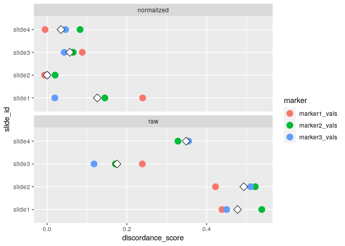
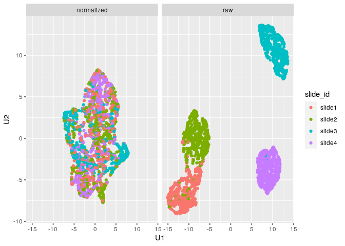

<!-- README.md is generated from README.Rmd. Please edit that file -->

# mxnorm: An R package to normalize multiplexed imaging data.

<!-- badges: start -->

<!-- badges: end -->

A package designed to handle multiplexed imaging data in R, implementing
normalization methods and quality metrics detailed in our paper
[here](https://doi.org/10.1101/2021.07.16.452359).

# Installation

You can install the development version from
[GitHub](https://github.com/) with:

``` r
# install.packages("devtools")
devtools::install_github("ColemanRHarris/mxnorm")
```

# Analysis Example

This is a basic example using the `mx_sample` dataset, which is
simulated data to demonstrate the package’s functionality with slide
effects.

``` r
library(mxnorm)
head(mx_sample)
#>   slide_id image_id marker1_vals marker2_vals marker3_vals metadata1_vals
#> 1   slide1   image1           15           17           28            yes
#> 2   slide1   image1           11           22           31             no
#> 3   slide1   image1           12           16           22            yes
#> 4   slide1   image1           11           19           33            yes
#> 5   slide1   image1           12           21           24            yes
#> 6   slide1   image1           11           17           19            yes
```

## `mx_dataset` objects

How to build the `mx_dataset` object with `mx_sample` data in the
`mxnorm` package:

``` r
mx_dataset = mx_dataset(data=mx_sample,
                        slide_id="slide_id",
                        image_id="image_id",
                        marker_cols=c("marker1_vals","marker2_vals","marker3_vals"),
                        metadata_cols=c("metadata1_vals"))
```

WE can use the built-in `summary()` function to observe `mx_dataset`
object:

``` r
summary(mx_dataset)
#> Call:
#> `mx_dataset` object with 4 slide(s), 3 marker column(s), and 1 metadata column(s)
```

## Normalization with `mx_normalize()`

And now we can normalize this data using the `mx_normalize()` function:

``` r
mx_norm = mx_normalize(mx_data = mx_dataset,
                       transform = "log10_mean_divide",
                       method="None")
```

The `mx_dataset` object has normalized data in the following form:

``` r
head(mx_norm$norm_data)
#>   slide_id image_id marker1_vals marker2_vals marker3_vals metadata1_vals
#> 1   slide1   image1    0.1991146    0.1553918   0.18315112            yes
#> 2   slide1   image1    0.1082691    0.2294791   0.21339780             no
#> 3   slide1   image1    0.1328231    0.1389272   0.11549488            yes
#> 4   slide1   image1    0.1082691    0.1865590   0.23245192            yes
#> 5   slide1   image1    0.1328231    0.2156384   0.13923749            yes
#> 6   slide1   image1    0.1082691    0.1553918   0.07725425            yes
```

And we can use `summary()` to capture the following attributes for the
`mx_dataset` object:

``` r
summary(mx_norm)
#> Call:
#> `mx_dataset` object with 4 slide(s), 3 marker column(s), and 1 metadata column(s)
#> 
#> Normalization:
#> Data normalized with transformation=`log10_mean_divide` and method=`None`
#> 
#> Anderson-Darling tests:
#>       table mean_test_statistic mean_std_test_statistic mean_p_value
#>  normalized              34.565                  24.111            0
#>         raw              32.490                  22.525            0
```

## Otsu agreement scores with `run_otsu_agreement()`

Using the above normalized data, we can run an Otsu agreement score
analysis to determine how well our normalization method performs (here,
we look for lower agreement scores to distinguish better performing
methods):

``` r
mx_otsu = run_otsu_agreement(mx_norm,
                        table="both",
                        threshold_override = NULL,
                        plot_out = FALSE)
```

This adds an Otsu misclassification table to the `mx_dataset` object in
the following form:

``` r
head(mx_otsu$otsu_data)
#>   slide_id       marker table slide_threshold marker_threshold agreement_score
#> 1   slide1 marker1_vals   raw        12.01758         54.89844       0.4506667
#> 2   slide2 marker1_vals   raw        20.01367         54.89844       0.4306667
#> 3   slide3 marker1_vals   raw        87.05664         54.89844       0.2573333
#> 4   slide4 marker1_vals   raw        44.00391         54.89844       0.3386667
#> 5   slide1 marker2_vals   raw        19.00977         52.90039       0.5333333
#> 6   slide2 marker2_vals   raw        19.99219         52.90039       0.5320000
```

And we can use `summary()` to capture the following attributes for the
`mx_dataset` object:

``` r
summary(mx_otsu)
#> Call:
#> `mx_dataset` object with 4 slide(s), 3 marker column(s), and 1 metadata column(s)
#> 
#> Normalization:
#> Data normalized with transformation=`log10_mean_divide` and method=`None`
#> 
#> Anderson-Darling tests:
#>       table mean_test_statistic mean_std_test_statistic mean_p_value
#>  normalized              34.565                  24.111            0
#>         raw              32.490                  22.525            0
#> 
#> Otsu agreement scores:
#>       table mean_agreement sd_agreement
#>  normalized          0.054        0.071
#>         raw          0.373        0.141
```

## UMAP dimension reduction with `run_reduce_umap()`

We can also use the UMAP algorithm to reduce the dimensions of our
markers in the dataset as follows, using the `metadata_col` parameter
for later (e.g., similar to a tissue type in practice with multiplexed
data):

``` r
mx_umap = run_reduce_umap(mx_otsu,
                        table="both",
                        marker_list = c("marker1_vals","marker2_vals","marker3_vals"),
                        downsample_pct = 0.8,
                        metadata_col = "metadata1_vals")
```

This adds UMAP dimensions to our `mx_dataset` object in the following
form (note the inclusion of `slide_id` as an identifier, which we’ll use
later):

``` r
head(mx_umap$umap_data)
#>      marker1_vals marker2_vals marker3_vals metadata1_vals slide_id table
#> 2459           57           93           87             no   slide4   raw
#> 122            15           20           32             no   slide1   raw
#> 1839           88           97           66            yes   slide3   raw
#> 825            21           15           40            yes   slide2   raw
#> 1907           88           98           53            yes   slide3   raw
#> 1733           91           93           62            yes   slide3   raw
#>              U1         U2
#> 2459  -9.967970 -4.5640162
#> 122    6.922789 -4.0093535
#> 1839 -11.611216  7.2588440
#> 825    5.300562 -0.7469739
#> 1907 -11.374983 10.2744428
#> 1733 -11.920742  9.1107894
```

And we can use `summary()` to capture the following attributes for the
`mx_dataset` object:

``` r
summary(mx_umap)
#> Call:
#> `mx_dataset` object with 4 slide(s), 3 marker column(s), and 1 metadata column(s)
#> 
#> Normalization:
#> Data normalized with transformation=`log10_mean_divide` and method=`None`
#> 
#> Anderson-Darling tests:
#>       table mean_test_statistic mean_std_test_statistic mean_p_value
#>  normalized              34.565                  24.111            0
#>         raw              32.490                  22.525            0
#> 
#> Otsu agreement scores:
#>       table mean_agreement sd_agreement
#>  normalized          0.054        0.071
#>         raw          0.373        0.141
#> 
#> Clustering consistency (UMAP):
#>       table adj_rand_index cohens_kappa
#>  normalized          0.050       -0.075
#>         raw          0.894        0.291
```

## Variance components analysis with `run_var_proportions()`

We can also leverage `lmer()` from the `lme4` package to perform random
effect modeling on the data to determine how much variance is present at
the slide level, as follows:

``` r
mx_var = run_var_proportions(mx_umap,
                             table="both",
                             metadata_cols = "metadata1_vals")
```

This adds UMAP dimensions to our `mx_dataset` object in the following
form:

``` r
head(mx_var$var_data)
#>    proportions    level       marker table
#> 1:  0.97044681    slide marker1_vals   raw
#> 2:  0.02955319 residual marker1_vals   raw
#> 3:  0.97344941    slide marker2_vals   raw
#> 4:  0.02655059 residual marker2_vals   raw
#> 5:  0.87733930    slide marker3_vals   raw
#> 6:  0.12266070 residual marker3_vals   raw
```

And we can use `summary()` to capture the following attributes for the
`mx_dataset` object:

``` r
summary(mx_var)
#> Call:
#> `mx_dataset` object with 4 slide(s), 3 marker column(s), and 1 metadata column(s)
#> 
#> Normalization:
#> Data normalized with transformation=`log10_mean_divide` and method=`None`
#> 
#> Anderson-Darling tests:
#>       table mean_test_statistic mean_std_test_statistic mean_p_value
#>  normalized              34.565                  24.111            0
#>         raw              32.490                  22.525            0
#> 
#> Otsu agreement scores:
#>       table mean_agreement sd_agreement
#>  normalized          0.054        0.071
#>         raw          0.373        0.141
#> 
#> Clustering consistency (UMAP):
#>       table adj_rand_index cohens_kappa
#>  normalized          0.050       -0.044
#>         raw          0.623       -0.167
#> 
#> Variance proportions (slide-level):
#>       table  mean    sd
#>  normalized 0.001 0.001
#>         raw 0.940 0.055
```

# Visualizations

We can also begin to visualize these results using some of `mxnorm`’s
plotting features built using `ggplot2`.

First, we can visualize the densities of the marker values as follows:

``` r
plot_mx_density(mx_otsu)
```


We can also visualize the results of the Otsu misclassification analysis
stratified by slide and marker:

``` r
plot_mx_agreement(mx_otsu)
```



We can further visualize the results of the UMAP dimension reduction as
follows:

``` r
plot_mx_umap(mx_umap,metadata_col = "metadata1_vals")
```


Note that since the sample data is simulated, we don’t see separation of
the groups like we would expect with biological samples that have some
underlying correlation. What we can observe, however, is the separation
of slides in the `raw` data and subsequent mixing of these slides in the
`normalized` data:

``` r
plot_mx_umap(mx_umap,metadata_col = "slide_id")
```



And we can also visualize the results of the variance proportions after
normalization:

``` r
plot_mx_proportions(mx_var)
```


